

<h3><b>翻墙必看 视频 http://36.228.33.253 </h3></b>
<h4 align=center><a href="https://git.io/trtptp">请收藏此连结 【 https://git.io/trtptp 】方便日后能取得IP </a></h4> 

<h1><b><a href="https://github.com/awwkk/usdom/blob/master/forfor.md">● 红潮即将倾覆  天之将明 ● </a></b></h1>

<table>
 </td>

</tr>
<tr>
<td width="440"></td>
 
<td width="440"></td>
 </tr>
 
<td>
<a href="https://github.com/mingop/f6f6dw/blob/master/dong/nf4514-4.html?raw=true">每日新闻-大头条集锦.html(点击右键,另存新档)</a>
</td>

<td>
<a href="https://github.com/mingop/f6f6dw/blob/master/dong/nf1147481.html?raw=true">大法徒的故事.html(点击右键,另存新档)</a>
</td>
 </tr>
<tr>
<td width="440"></td>
	
<td width="440"></td>
 </tr>
 
<tr>
  <td>
<a href="https://github.com/mingop/f6f6dw/blob/master/dong/nf1358885-4.html?raw=true">武汉肺炎—新型冠状病毒爆发.html(点击右键,另存新档)</a>
</td>

 <td>
<a href="https://github.com/mingop/f6f6dw/blob/master/video/58885_360P.mp4?raw=true">武汉肺炎真相.mp4(点击右键,另存新档)</a>
</td>

<tr>
<td width="440"></td>
	
<td width="440"></td>
 </tr>
 
<tr>
  <td>
<a href="https://github.com/mingop/f6f6dw/blob/master/dong/nf4673.html?raw=true">法轮功专辑·祛病健身.html(点击右键,另存新档)</a>
</td>

 <td>
<a href="https://github.com/mingop/f6f6dw/blob/master/video/nf5287.html?raw=true">中共活摘器官黑幕.html(点击右键,另存新档)</a>
</td>

</tr>
</table>

<table>
 <tr>
 <td>
  智者先贤们都预言了今天的事，当有行大善者劝您退出来时，一定要退出来，“遭了此劫不上算”，切莫错过神佛对我们的慈悲！在大地震、非典、大洪水等各种天灾人祸面前，许多善良的大陆同胞因做了三退，并诚心默念“法轮大法好、真善忍好”而得平安福报。

	
<h3 align="center">不怕瘟疫的人</h3>
【明慧网二零二零年一月二十五日】〖中国沈阳来稿〗近日，我经历了一场与无名疾病对决的较量，结果我赢了。事情是这样的：二零二零年新年的第二天下午，我去沈阳市某大型超市购物，没想到人山人海的，原来新年这两天商品打五折。但既然来了我还是买一点东西，并安心的排队等着交款。

当天傍晚开始咳嗽，第二天就发烧，不想吃东西。我没在乎。不曾想症状越来越严重：发烧让我躺在床上起不来，好象内脏都肿了，呼吸困难，咳得很厉害好象要吐血了，全身的骨头都痛，头也痛，还有麻木的感觉，盖着厚厚的棉被还感觉冷！

尽管这样，我一点没有害怕，因为我心里装了救命的法宝：念“法轮大法好，真善忍好！”坚持念，烧了四天，不烧了，只是咳嗽。尽管没力气，象心衰的感觉，我还是出门了，也没告诉亲人们，怕他们担心啊。历时两星期，我彻底好了。

当亲人们知道我是诚心敬念“法轮大法好，真善忍好”而平安无事时，胃不舒服的老人相信了，也开始认真念“法轮大法好，真善忍好”了。

是呀，自从我明白法轮功真相，并退出中共的团、队组织后，再也不怕什么疾病、瘟疫、灾难了，因为我知道了无数的人因敬念“法轮大法好，真善忍好”而绝处逢生，知道了法轮功来到世间是来救人的。

其实不只是我，所有把“法轮大法好，真善忍好”记在心里的百姓们，都会不害怕瘟疫，也不会害怕灾难，因为与神佛站在一起的人，都会得到神佛的保护，都会拥有美好的未来。

	
 <h3 align="center">➤ 退党、退团、退队（三退）方法 ( 可使用真名、化名、小名退 )</h3></td></tr>
 
<tr>
 <td>
 <a href="https://git.io/pamja">如何 “ 三退保命 ”</a>，<b>连上面→免翻视频 IP http://36.228.33.253 </b> →点 【三退大潮】--为什么要退党？ 可留言三退或用翻墙软件自己办理三退</td>
 </tr> 

<tr>
 <td>
 <a href="https://git.io/pamja"> 如何 “ 三退保命 ”</a>，请点击翻牆网站  https://git.io/opopop  下载 { 翻牆软件 }→找 { 大紀元網站 }  ( http://www.dajiyuan.com ) 三退</td>
</tr>
  </table> 

 

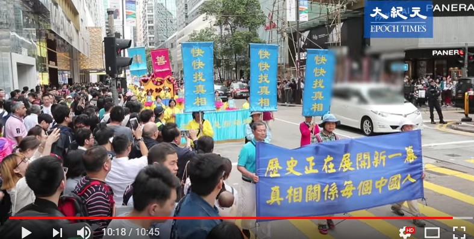

<table>
  <tr>
<td>
	<h2 align="center"><a href="https://">明白真相 分清善恶 选择美好未来 </h2> </a> 
法轮功也叫法轮大法，是上乘的佛家修炼大法。于一九九二年由李洪志师父传出，他以宇宙最高特性真、善、忍为原则指导人修炼，辅以简单优美的五套功法，可以使修炼人在极短的时间内达到身心净化，道德回升。谁想学就来学，不想学就走，不收费，完全是自愿的。了解法轮功 <a href=https://git.io/bb99bbss> https://git.io/bb99bbss</a>

	
一九九九年中共迫害法轮功之前，在中国大陆据官方统计有上亿人修炼法轮功。而在中共全面迫害后的近二十年中，法轮功不仅没有被中共打倒，相反，传遍了世界一百多个国家和地区，法轮大法的主要书籍《转法轮》被翻译成三十九种语言文字在全世界公开发行。

今天，在世界所有的主要国家和地区，都有法轮功的炼功点，也都可以看到法轮功学员集体炼功、弘扬法轮功的美好画面。

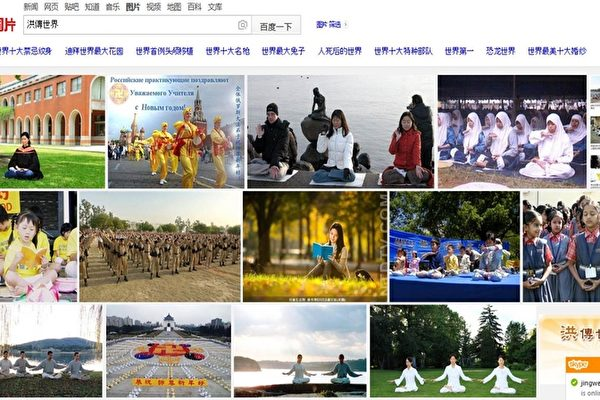

	▲ 百度惊现"法轮大法" 洪传世界震撼画面

法轮大法的传出，从根本上唤醒人沉睡的善念，同时这些修炼者们在践行「真、善、忍」的实践中，实实在在地在带动了整个社会道德的全面回升。然而中共邪党是一个十恶不赦的邪教组织，对任何正面的、善意的行为都以最邪恶之心揣度。一九九九年七月，当权小人江泽民不顾国家、社会和人民的利益，一意孤行地发动对法轮大法的迫害，使无数善良的人蒙冤受难，其邪恶行径至今仍未停止。

近二十年来，中共江泽民政治流氓集团对法轮功的迫害真是罪恶深重。多行不义必自毙，在不久的将来，他们必将受到神佛及人间正义的惩罚！

在中国大陆，亿万名普通的百姓，只求拥有平淡如水的日子，踏实地工作和生活。然而，在暴政强权下，这种最基本的愿望竟成了一种奢求。十九年来，狂风和暴雨，卷走了多少鲜艳的花朵，压碎了数不清的幸福和梦想。暗夜里，浸著漫漫泪水，传来声声呼喊。

法轮功是修炼，对政权没有任何兴趣，也无意改变人类社会，但是这个按照“真、善、忍”修心做好人的巨大人群，是中国社会道德的基石，是社会道德回升的希望，是中国未来的希望。

大法修炼者顶着迫害和压力，向世人讲清真相，法轮大法是佛法。法轮功是被迫害的，大法修炼者在揭露迫害、制止迫害。

中共江泽民集团发动的对法轮功修炼者的迫害，将全中国拖入无边的黑暗。正直善良的公民被剥夺了说话的权利，成为被严厉镇压的对象。他们的基本人权被肆意侵犯，被虐杀凌辱，冤屈无处申诉。他们的家庭成员也受到无情的冲击和株连，个体与家庭的悲剧在大陆发生、蔓延，汇成整个社会的人权灾难。

每一个听闻此事的人，都会扪心自问：善恶是非面前，我该站在哪一边？

多名大法弟子因信仰被活活残酷折磨致死的案例，上面有名有姓，还有具体事件的全部过程，都是执法人员干的。对法轮功这个信仰群体的迫害天理难容！

自1999年7月开始，中共江泽民集团倾举国之力镇压精神信仰团体——法轮功。广播、电视、报纸，铺天盖地地充满了诽谤法轮功的宣传。在诽谤的后面，是难以掩盖的疯狂和血腥。罪恶就在那片历经沧桑的土地上发生著。

<table>
  <tr>
<td>
	

</tr>
</td>

<tr>
<td>
	▲ 上图为法轮功学员所遭受的部分酷刑。中共迫害法轮功学员不择手段，使用的酷刑达40种以上。每一天，都记载了正邪交战的惊心动魄；每一天，都见证了高贵心灵的坚忍不屈。
	
</table>

当年江泽民出于妒嫉，不顾六个常委的反对，独断专横，发动了迫害法轮功的政治运动，往法轮功身上泼脏水，制造「天安门自焚」伪案，煽动仇恨，欺骗民众，绑架全国人民参与迫害犯罪，用心险恶。告诉你真相，让你分清善恶，有个美好的未来。
</td></tr>
</table>

 

 

<h3 align="center"><a href="https://">【 以下是中国大陆"大法弟子"因信仰被活活残酷折磨，甚至被迫害致死的故事 】</h3> </a> 
 

<table>
 <tr>
<td> 手机版ePub电子书，推荐使用 Reasily - EPUB 阅读器，可以观看视频、音频、图文。<a href="https://github.com/mingop/f6f6dw/blob/master/book/open-epub.txt?raw=true">请在此下载( 如何开启epub说明 ). txt</a>
 
<a href="https://github.com/mingop/f6f6dw/blob/master/book/Reasily-epub-1802h.apk?raw=true"> 请在此点击直接下载电子书（ePub版）</a>

 </td>
</tr>
</table>

<table>
<tr>
	<td>
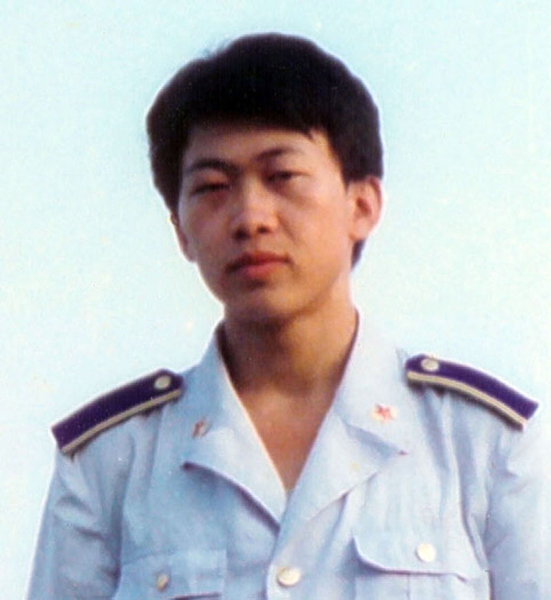

中共党魁江泽民发动对法轮功的镇压，本来就是“欲加之罪何患无辞”。明慧网一直是个教人向善的地方，迫害开始后增加了国内学员受迫害的冤屈案例。最后，上海浦东新区法院竟以“教人上明慧网”这样荒唐的“罪名”判了胡志明四年徒刑，把他塞进了监狱。
 <a href="https://github.com/mingop/f6f6dw/blob/master/book/Dafa story1.epub?raw=true">下载epub电子书 :【一位空軍少校穿越生死之旅】</a></td></tr>
</table>

<table>
<tr>
<td>
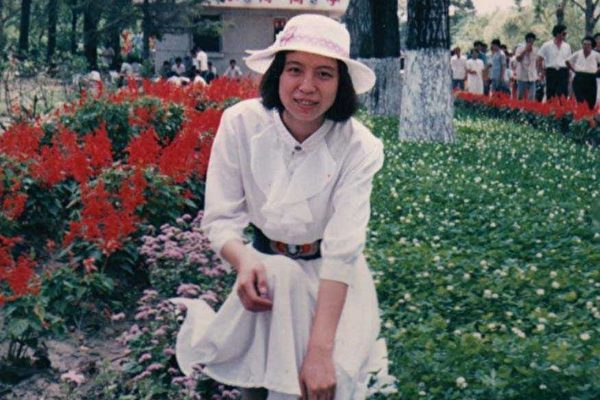

2000年6月19日晚，赵昕在北京紫竹院公园牡丹亭炼功时，被非法抓到公园派出所，后被海淀分局带走，非法关押在海淀分局清河看守所。在关押期间，赵昕绝食抗议，被强制灌食。6月22日，赵昕遭到殴打，造成颈椎第4、5、6节粉碎性骨折，头部轻度外伤，左眼肿大有外伤，肺不能呼吸。当天晚上，生命垂危。<a href="https://github.com/mingop/f6f6dw/blob/master/book/Dafa story2.epub?raw=true">下载epub电子书 :【一位青年教师的生命之歌】</a></td></tr>
</table>

<table>
<tr>
<td>
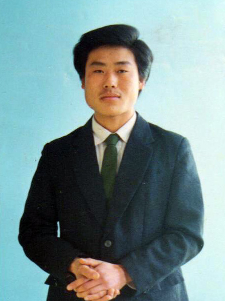

电视上的真相如一道闪电，撕破了中共红色恐怖下的层层铁幕，将中共陷害法轮功的阴谋一下子曝光在世人面前。阴暗的东西最怕曝光。“长春插播”事件像捅向邪恶心脏的利剑。<a href="https://github.com/mingop/f6f6dw/blob/master/book/Dafa story3.epub?raw=true"> 下载epub电子书 :【 忆刘成军 】</a></td></tr>
</table>

<table>
<tr>
<td>
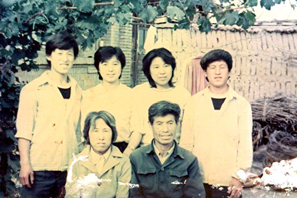

陈运川一家所受到的惨烈迫害是最严重的案例之一，他们的遭遇是全中国数千万因为信仰被迫害的个体与家庭悲剧的缩影。一个普通的农民家庭，实践“真、善、忍”的百姓，惨遭邪恶蹂躏。三个儿女先后被酷刑虐杀，两位老人被迫流离失所，相继离世，唯一幸存的长女仍被非法关押，饱受凌辱。今天，迫害仍未停止，罪恶还在侵袭中华大地。<a href="https://github.com/mingop/f6f6dw/blob/master/book/Dafa story4.epub?raw=true"> 下载epub电子书 :【 河北农民陈运川一家的故事 】</a></td></tr>
</table>

<table>
<tr>
<td>

从1999年9月到2001年，宋彦群和宋冰经历了许多次非法拘禁，辗转于北京的拘留所、舒兰市南山看守所和长春黑嘴子女子劳教所。被劳教期间，她们整天听着电棍辟里啪啦的电人声和法轮功学员的惨叫声，空气中飘散著皮肉被电糊的味道。<a href="https://github.com/mingop/f6f6dw/blob/master/book/Dafa story5.epub?raw=true">下载epub电子书 :【 流泪的并蒂莲 】</a></td></tr>
</table>

<table>
<tr>
<td>
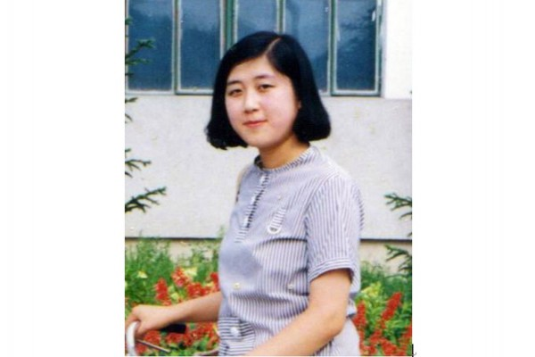

在太平间，王可非的家属见到了这样的情景：王可非的脖子上缠了一卷卫生纸，大臂上勒著止血胶带，左手肿得像馒头一样。她的上身穿了一件破毛衣，袖子撸到腋下，下身裸露。尽管太平间满是冰霜，王可非的脸和身体摸上去还是温的，和活人体温相近，这说明人还没有死就被送来了。王可非的母亲瘫倒在地上，放声痛哭。家人质问在场的劳改医院院长：“王可非是怎么死的？为什么不通知家属？”院长吓得赶紧逃走。<a href="https://github.com/mingop/f6f6dw/blob/master/book/Dafa story6.epub?raw=true">下载epub电子书 :【 长春农行最美女职员的悲惨遭遇 】</a></td></tr>
</table>

<table>
<tr>
<td>

王志君打开门，吓了一跳。门口站着一个人，蓬头垢面，口鼻流血，衣裤破烂不堪。撕破了的上衣兜里，露著几绺萝卜缨子。裤子像是被剪刀绞过的，整条腿就像干瘪的枯枝，膝盖以下都是黑紫色，小腿和脚上有一块地方没了皮肉，露著骨头。“你是谁？”“我是袁江。”王志君惊呆了，怔怔地再多看对方几眼，瞬间泪如泉涌。<a href="https://github.com/mingop/f6f6dw/blob/master/book/Dafa story8.epub?raw=true">下载epub电子书 :【 酷刑下的勇者——袁江 】</a></td></tr>
</table>

<table>
<tr>
<td>
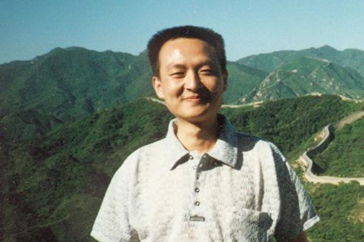

一个信仰“真、善、忍”的好人，家中的孝子、单位的敬业员工、快乐的未婚夫，一夜之间被害死。如此杀人命案，居然不能进入司法程序，杀人凶手逍遥法外，继续作恶。上访信、控告状寄了无数份均无回音。最合情合理合法的重新鉴定申请无人受理，因为左志刚是法轮功学员，河北省政法委秘密下令，不让立案。据说检察院曾经想介入调查，却不了了之。这是什么世道！<a href="https://github.com/mingop/f6f6dw/blob/master/book/Dafa story9.epub?raw=true">下载epub电子书 :【 五月飞雪——石家庄奇冤 】</a></td></tr>
</table>

<table>
<tr>
<td>
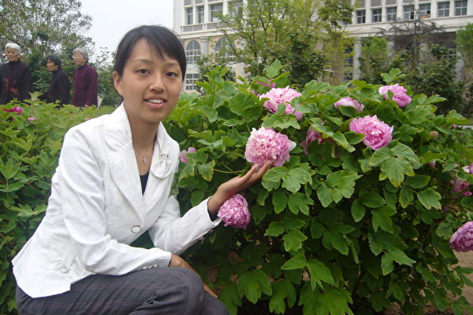

她们被迫连续十几个小时，以标准坐姿坐在儿童椅上，以至于腿脚肿胀，背部和臀部瘀青、甚至溃烂。无论冬夏，远鹰还必须从事高强度的体力劳动。夏天30多度的高温下，她被安排在闷热的大棚里翻地、拉粪、推很重的农车。很多人因中暑昏过去了，她靠着对大法的正信正念才挺过来。她还负责喷农药，喷洒设备灌满农药后，瘦小的远鹰根本背不起来。好不容易同修帮她掂著背起来，她也是摇摇晃晃，差点向后仰过去。<a href="https://github.com/mingop/f6f6dw/blob/master/book/Dafa story10.epub?raw=true">下载epub电子书 :【 姚遠鷹的故事 】</a></td></tr>
</table>

<table>
 <tr>
<td width=880>
 
■ 以上只是冰山一角，明慧网: http://www.minghui.org 了解更多真相 

■ 翻墙方法见<a href="https://git.io/opopop"> https://git.io/opopop </a>推荐使用'火狐'等非国产浏览器访问  

■ 了解真相是你的权利，认识"法轮大法"下载epub电子书<a href="https://github.com/mingop/f6f6dw/blob/master/book/dfhao.epub?raw=true">: dfhao.epub </a>  
</tr></td>
</table>

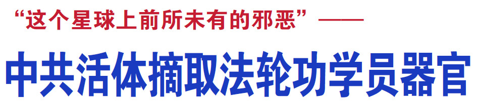

 
<table>
  <tr>
<td>
	<h2 align=center><a href="https://"> 难以置信！但铁证如山！</a> </h2>

<a href="https://">难以置信！</a> 
十多年前，一个闻所未闻的词语突然闯到了我们面前——活摘！人们先是震惊得目瞪口呆，然后是摇头——完全不相信：不相信会有这样的事情发生，因为它不只是挑战了人类心理承受的极限，更是超出了人类想象力的底线！我们也多么希望这样的事情没有发生。

<a href="https://">但铁证如山！</a> 
我们不得不确认：确实有这样的事情在发生——证人指证，国际人权律师的独立调查，中国大陆器官移植数量疯狂攀升，大量的法轮功学员被莫名失踪，尸体加工厂……种种证据让我们无可回避：活摘的事情发生了，而且是十多年来一直在继续，从未停止…… 
一位移植器官者讲述：自己在中国很快得到供体，而后却为先前完全不知中共按需杀人的真相而痛苦万分。 
中共强摘器官指控曝光十多年来，受到举世谴责。各国各界纷纷呼吁整个社会一起来制止在中国大陆发生的活体摘取器官这一罪行。 
今天，我们怀着万分庄重而谨慎的态度，将这个惊天黑幕揭开。因为这不只是对无辜而逝者的尊重，更重要的是，作为生者，我们有必要知晓：这个人类生存的空间中，存在着怎样的反人类的势力，它不仅毁灭着人的肉体，更在毁灭着人的良知——让人无视活摘——“这个星球上从未有过的邪恶”！ 

<a href="https://">正邪不两立！</a> 
我们希望读者能够以一个非常平和的心态，耐心地完整地看完这些文字，对当中呈现的证人证言证据，自己做一个判断。正邪之间没有中间道路可循。您，也面临着选择。

</td> 
</tr>
 </table>

 <h2 align=center><a href="https://">海外独立调查：中共强摘器官，数量惊人</a></h2>

  <table>
<tr>
	<td>

	▲ 加拿大人权律师大卫‧麦塔斯和前亚太司司长戴维‧ 乔高将调查报告集结成《血腥的活摘器官》一书，包含不可辩驳的52种证据。</td>
</tr>
</table>

<table>
<tr>
<td>

	▲ 前美国智库研究员、独立记者伊森‧葛特曼从2006年开始调查中共活摘良心犯的器官，他的书《大屠杀》中估计从2 0 0 0 - 2 0 0 8年间，至少有6.5万名法轮功学员被强摘器官。</td>
</tr>
</table>

  
  <h2 align=center><a href="https://">活摘器官的惊天黑幕震惊国际</a></h2>
 <table>
  <tr>
<td>
 <h4 align=center><a href="https://">中共活体摘取法轮功学员器官br群体灭绝性大屠杀</a></h4>
 2006年3月有证人出面指证中共活摘法轮功学员的器官贩卖牟利，活摘器官的惊天黑幕震惊国际。加拿大人权律师戴维‧麦塔斯和前亚太国务卿戴维‧乔高于2006年共同发布调查报告，证实中共活摘法轮功学员器官的罪恶不仅大规模存在，且至今仍在持续。麦塔斯形容活摘器官是“这个星球上从未有过的邪恶”。被誉为全球科技界最有影响力的人物，宾夕法尼亚大学生物伦理学中心主任阿瑟•卡普兰表示：“为需求而杀人”的活摘器官现象在中国大陆普遍存在，且年复一年持续，是器官移植界最令人发指的罪行、全人类的耻辱。

据明慧网披露，中共总后勤部是活摘器官的核心机构，利用军队系统和国家资源，将各地被非法拘捕的法轮功学员验血编号，输入计算机系统，利用军车、军航、专用警备部队和各地军事设施和战备工程作为集中营，统一关押管理，成为国家级的活体器官库。追查迫害法轮功国际组织也公布多个录音证据，指证江泽民直接下令用法轮功学员器官做移植。
</td> 
</tr>
 </table>

<table>
<tr>
<td>

	▲ 中国器官移植数量从1999年开始上升，和从1999年中共迫害法轮功同步，在2003年～2006年期间暴涨，达到高峰。中国在短时间内成为器官移植大国，但是中共声称的器官来自死刑犯根本解释不了这些数量庞大的器官移植。</td>
</tr>
 </table>

<table>
<tr>
<td>

	▲《大纪元》获知情人提供的录音证实，2006年9月13日时任商务部长的薄熙来跟随时任中共总理温家宝访问德国汉堡时，曾亲口承认“江泽民下达了活摘法轮功学员器官的命令”。</td>
</tr>
 </table>
 

<table>
<tr>
<td>

	
▲ 欧议会议案制止中共活摘器官
 2013年12月12日欧洲议会通过紧急议案，要求中共立即停止活体摘取良心犯、以及宗教信仰和少数族裔团体器官的行为，并立即释放包括法轮功学员在内的所有良心犯。数十名欧洲议会议员发言强烈谴责中共活摘器官的罪行。</td>
	</tr>
 </table>

<table>
<tr>
<td>

▲ 美国议会谴责中共迫害法轮功
 美国国会在2002年、2004年及2010年陆续通过188号、304号及605号决议案，要求中共停止迫害法轮功。2016年2月25日美国两党国会议员在众议院发起343号决议案，要求中共立即停止针对法轮功学员和其他良心犯的强摘器官行为。</td>
</tr>
 </table>

<table>
<tr>
<td>

	
▲ 加拿大历届总理持续关注法轮功人权 (左起:马田、哈珀、特鲁多)
  加拿大新任总理特鲁多在2015年11月APEC会议期间会面中国国家主席习近平时，关注法轮功在中国遭受的迫害。加拿大是第一个站出来呼吁中共停止迫害的国家，历届总理马田和哈珀在会见中共领导时都曾提出法轮功和人权问题。 
</td>
</tr>
</table>

<table>
<tr>
<td>

	
▲ 全球逾百万民众签名要求制止中共迫害法轮功
 随着中共活摘器官的罪行在全世界大量曝光，全球各地民众纷纷签名要求中共停止迫害法轮功。2013年12月10日“医生反对强摘器官”国际组织将全球一百五十万人反对中共活摘法轮功学员器官的签名递交给联合国。中国大陆民众也开始参与反活摘签名，包括唐山、天津、秦皇岛、张家口、石家庄、衡水、保定、秦皇岛、湖南等地，已逾五万人签名反对中共活摘法轮功学员器官。</td>

</tr>
</table>

 <h2 align=center><a href="https://"> 无声的证人</a></h2>

<table>
  <tr>
<td>
《孝经•开宗明义章》中写道：“身体发肤，受之父母，不敢毁伤。”也就是说，人的身体来自于父母，不能损伤，否则是对父母的不孝。即使是人到寿终，也要全尸进行土葬，让死者的身体在大地中得以安息。 

《周礼》中说：“众生必死，死必归土。”“入土为安”的土葬方式和说法也颇多，这种传统的丧葬观念至今对中国人仍有很深的影响。

受中国传统观念的影响，极少有人会将身体捐赠给医院或者其它机构，绝大多数中国人也根本不愿意在死后捐献器官。中国的器官捐献率居世界之末，按照中国官方的统计，2010年中国的器官捐献率为0.03，也就是说1亿人中仅有3人愿意在死后捐献器官。“北京红十字会”在2011年指称，过去20年，中国仅有37人注册为器官捐献者。
</td>
</tr>
</table>

<table>
<tr>
<td>

	▲ 法轮功学员王斌，原大庆油田勘探开发研究院计算器软件工程师，曾获国家科技二等奖。被大庆男子劳教所打到重伤不治，遇害后王斌的心脏、大脑被剖出，内脏被野蛮摘取。王斌的妻子到太平间认尸时，暗中拍下这张骇人的照片。</td>	
	</tr>	
	</table>	
	

<table>
<tr>
<td>

	
▲ 这是国外的尸体展中一个标本：年轻的中国孕妇和其腹中八个月大的胎儿。
 
	这个尸体展招致社会普遍的强烈抗议、愤怒：在传统观念深厚的中国，谁会将尸体制成标本展览？这具尸体的来源更是受到质疑：按照中国法律，孕妇不能处极刑，而且即使是车祸死亡，哪个家属会捐赠自己的妻子和未出生孩子的尸体呢？尸体展中的人体标本来自中国大连尸体加工厂，这样的尸体加工厂在大连有两家：哈根斯大连生物塑化公司和大连鸿峰生物有限公司。</td>
	</tr>
</table>

 

	
<h2 align=center><a href="https://">新疆流亡医生揭活摘器官：中共如恶魔</a></h2>

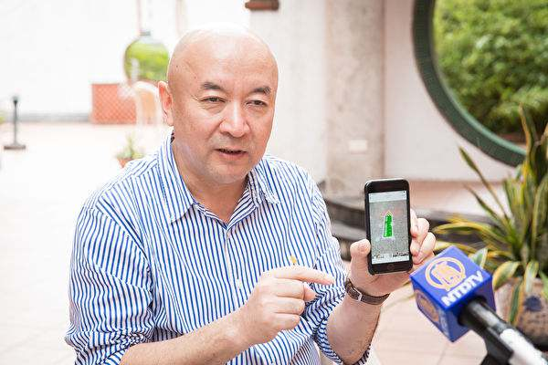

▲ 英国维吾尔协会负责人、肿瘤外科医师安华托帝‧博格达亮出手机内的照片，指出新疆某机场出现为特殊旅客、人体器官运输专门开辟的快速通道。（陈柏州／大纪元）

【大纪元2017年11月15日讯】（大纪元记者李怡欣台湾高雄报导）流亡海外的新疆医师安华托帝·博格达，日前应邀在台权会高雄办公室演讲，针对中共器官活摘及新疆人权议题指出，中共活摘人体器官至今还在发生，“我想告诉台湾同胞，去中国不要单独活动，一定随时让家人知道行踪，‘要是生病了，只要一口气在，就算爬也要爬回台湾’”。

<h3 align=center><a href="https://">安华：任何人都可能遭中共活摘</a></h3>
很多人以为中共国家暴力只针对特定族群，如法轮功、维吾尔族人。安华托帝表示，这是对共产党缺乏清楚认识，“中共在混乱中滋生、在独裁中壮大，在和平中死亡”，为了不死，中共会不惜一切维持混乱，即使是和平、非战争时期。中共无一时刻不在制造“国家敌人”。

“在中国所有人、你只要把自己排除在共产主义分子之外的人，就是潜在被摘器官的目标”，因此，不只法轮功，被摘取器官的有维族、家庭教会等，如果能在中国追踪失踪人口，会发现涉及器官摘取是很普遍现象。

又为何是法轮功？安华表示，“因为这群人不抽烟、不喝酒、器官品质好，因此，成为主要受难群体”。这也说明了，为何自从1999年中共前党魁江泽民发动对法轮功信仰团体迫害、非法关押开始，中国器官移植出现惊人的爆炸性成长。

<h3 align=center><a href="https://">利益蒙蔽 医师变杀人犯？</a></h3>

安华引述一份中国医疗杂志“两例心肺移植术”论文其中一段话：“供体入室后，按常规予以麻醉及插管”。摘死人器官何需插管？身为外科医生的经验告诉他：“供体肯定是个活人！”这种耸人听闻的医学案例张狂地写在权威期刊上“实在太恐怖了！”说明活摘医师操刀无数，早已麻痹到忘记把“杀人证据”掩盖。

活摘器官已超越纳粹罪刑，驱动万恶的唯一答案是“利益”。安华说，医生为竞争病源，在网站招揽“生意”，宣传：“买一送一、保证质量、换坏重换”，一家医院网站标榜一年进行4千例器官移殖，中国有1百多家移植院所，“哪来这么多器官？”这已超出人类思维极限。

中共以体检、DNA测试等名义，对维吾尔族人大量采血，而过去，有被关押的法轮功学员也证实，在被监禁时自己曾被抽血。无法合理解释该行径，唯一可能就是为了建立“活体器官数据库”。

一张新疆某机场照片上，标示一条“特殊旅客、人体器官运输通道”，这令他感到不寒而栗，“那得需要多大的交通量，才会让一个机场，专门给你设一个特殊通道、快速通道？”这照片如果是真的，“特殊旅客就是器官的主人，通道就是他的黄泉路”。

<h3 align=center><a href="https://">"如果我不说，我也是罪犯帮凶”</a></h3>

令人难以置信的是「涉入的医疗人员知情，但认为理所当然、就像例行公事。」安华解释，民主社会的人无法理解中共，「中国人从小浸泡在共产党洗脑世界中，这些人甚至觉得消灭国家敌人是光荣的，没有丝毫罪恶感，除非，他离开中国，或接触外界文明、自由、民主价值，就会醒悟并感到罪恶」。

22年前，安华托帝任新疆地区外科医师，奉命前往刑场，等死囚伏法而未断气瞬间，动刀将热呼呼的器官割下带走，至此，他受大很大冲击，无法接受「医师从救人天职变成杀人刽子手」，他放弃在中国的美好前程，选择流亡海外，成为一名公交车司机，并在海外致力传达真实的中国人权现况。

有人问他，「如果时间倒流，你后悔吗？」安华说，放弃医职当然后悔，不过，如再一次，他仍会义无反顾选择站在正义的一方，因为揭开这件事，是每一个人的道德责任。

「中共就是恶魔、甚至比魔鬼还坏，我们不应该让恶魔存在，这是人类的悲剧，也是人类最大的失误」，安华托帝提醒所有人，不要对中共抱有任何幻想，活摘器官将是引爆中共垮台的关键事件。#

<h2 align=center><a href="https://">新疆大抽血 中共密建器官库</a></h2>

【大纪元2017年10月27日讯】（大纪元记者郭曜荣台湾台北报导）英国维吾尔协会负责人、肿瘤外科医师安华托帝·博格达近日来台举办讲座，会中他揭露中共活摘人体器官牟利的新证据，指中共在新疆以“全民健康体检”之名，对维族人进行大规模抽血工程，目的是建立器官匹配资料库。

安华托帝在中研院民族所接受大纪元采访时表示，该计划从2016年6月开始，汉人与哈萨克人被排除，只针对维族人抽血，维族人口约一千五百万～二千万，据去年9月份媒体报导，在新疆和田地区已完成该任务，而今年根据美国调查记者、作家伊森·葛特曼（Ethan Gutmann）的调查，至今有99.7%的维族人已完成抽血。

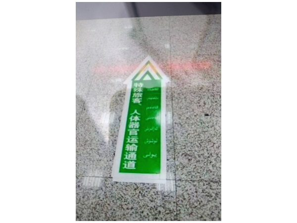

▲ 英国维吾尔协会负责人、肿瘤外科医师安华托帝表示，新疆某机场出现为特殊旅客、人体器官运输专门开辟的快速通道。（安华托帝‧博格达提供） 

 
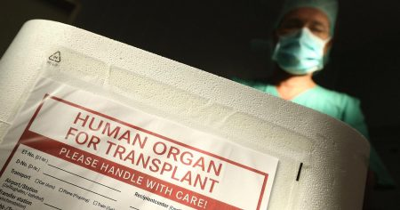

▲ 医师指出，活摘器官在中国大陆已形成产业。(AFP)

<h3 align=center><a href="https://">机场为运输器官 设快速通道</a></h3>

据安华托帝了解，最近中共以管束极端主义分子的名义，将25%的维族人口送到所谓的“学习班”，但被送去的人，“很多都没回来”；另外在新疆某机场，出现为特殊旅客、人体器官运输专门开辟的快速通道，他亮出手机内的照片，机场地板上赫然可见通道标示，以简体字与维吾尔字母书写。

他谈到，要让机场设立特殊通道，说明交通量庞大。而这些证据在今年4月，经由他在日本曝光后，中共把抽血计划改名为DNA检测，但做检测只要用棉棒擦过口腔即可，抽血化验却持续进行。他认为，中共就是在做器官移植的血液匹配。

他表示，活摘器官在中国大陆已形成产业，500家医院申请，约有一百六十家会被批准，而一家医院做四千例，医生们为了争取手术，竟推出“促销方案”，有的网站上写免费赠送20个器官，4小时内就能找到匹配的器官、包换包退，可见后备器官的来源基数多么庞大，且该产业能继续存在，说明利润巨大。

“国外都是黑道或个人在偷器官这么做，是很零星的事件，而在中国那是国家企业、国家允许的一个产业，而且它们还公开放在网络上，简直是不可想像的。”

<h3 align=center><a href="https://">最便宜的东西 在中国是人命</a></h3>
安华托帝说，中共活摘器官约从1990年开始，初期在新疆拿少数民族试验，到1999年转向迫害法轮功学员。他自己1995年亲身参与手术，当时他在乌鲁木齐铁路局中心医院担任外科医生，某天被上级主任医师要求准备一套野外手术器械，并带上护士与麻醉师，跟着主任医师们前往乌鲁木齐西山刑场，之后就从一名执行死刑的囚犯身上摘取了肝和肾脏。

他回忆说，当时该囚犯被子弹打在右胸以下，并不会立即死亡，手术时身体还在挣扎，“虽然不是很有力，但手术时还在出血，代表心脏还在跳动。他死亡是因为我摘了他的内脏，而不是因为挨了那一枪，所以我一直有罪恶感”。

这次经历让他走向揭露中共活摘器官黑幕的旅途，他谈到，在中国大陆，“最便宜的东西就是人命”，中共是没有道德底线的，从来就没有把人当人看，出生在共产党统治以外的地方，不了解共产党是有多么邪恶的。

他呼吁，若有人要去中国大陆换器官，应再三考虑，否则可能成为间接凶手，“毁灭生命来延长生命是不能接受的，作为人类必须要遵守伦理底线！”◇#

 

 
 
 
 

 
<table>
  <tr>
<td>
 <h3 align=center><a href="https://">追查国际取证调查：活摘器官的罪恶真实存在</a></h3>
2006年3月9日以来，追查迫害法轮功国际组织（简称“追查国际”）针对中国大陆30个省、直辖市、自治区的中共司法系统和军队、武警、地方等医院器官移植部门进行了持续的调查，获取了大量的证据。这些证据证实了中共活体摘取法轮功学员器官的罪恶是真实存在的。
</td> 
</tr>
 </table>

<table>
  <tr>
<td>
<h3 align=center><a href="https://">薄熙来承认江泽民下令活摘法轮功学员器官</a></h3>
2006年9月13日，时任商务部长的薄熙来随同时任中共总理温家宝访问德国汉堡时，在电话中向中共驻德国使馆一秘亲口承认是江泽民下达的活摘法轮功学员器官的命令。

一秘：有点紧急事呀，今天德国外交部下午跟我们说了一下，有一个事情得澄清一下。

薄熙来：嗯。

一秘：就是，就是说呀，当初您在辽宁这个当省长时，因为这涉及到明天的会见嘛，他们想澄清一下。就是说，当初您在辽宁当省长时候，就是，是江泽民、江主席下的命令，还是您参与的，就是说这个，关于把这个法轮功这个活体摘除器官这个事情，是您的命令还是江泽民的命令？

薄熙来：江主席！

请翻墙搜寻，<a href="http://www.minghui.org/mh/articles/2013/8/31/278889.html">《薄熙来录音曝光揭中共掩盖的黑幕》</a> ，<a href="https://git.io/opopop"> 翻墙方法见 https://git.io/opopop 。</a> 

<a href="https://github.com/mingop/f6f6dw/blob/master/audio/mh-audio-ai-s.mp3?raw=true">下载完整的录音文件.mp3</a>

</td> 
</tr>

 </table>
 

 
<table>
  <tr>
<td>
<h3 align=center><a href="https://">610官员承认：谷开来盗卖法轮功学员器官和尸体</a></h3>
	2012年追查国际调查员对天津蓟县“610办公室”（中共专门迫害法轮功的非法机构）主任电话调查记录：

调查员：这场迫害一旦结束的话，你们怎么办，想过吗？看没看到谷开来今天的下场啊，她表面上……

赵：谷开来卖那个法轮功的人体器官的，

调查员：你说什么？

赵：我说，你说谷开来呀，卖法轮功人体器官的，

调查员：对呀，她在大连搞了两个尸体加工厂，她一具完整的尸体在国际上卖一百万美金，一个脏器被摘除的尸体她卖八十万美金。

<a href="https://github.com/mingop/f6f6dw/blob/master/audio/18-tianjin-610-16k.mp3?raw=true">下载完整的录音文件.mp3</a>

</td> 
</tr>
 </table>

<table>
  <tr>
<td>
<h3 align=center><a href="https://">军医院承认:他们是一条龙运作法轮功学员器官交易</a></h2>
	解放军307医院移植科肾源联系人陈强承认他们是官方、警方、监狱一条龙地运作法轮功学员器官的交易，还可提供证明法轮功学员供体身份的材料。下面是2007年追查国际的调查录音。

调查员：哎，你好，上次跟你说的那个联系那个肾源的事情，现在怎么样？

陈强：啊，你不是说那个联系那个监狱的，或者是那个什么的吗？

调查员：对，或者是法轮功学员的嘛，对。

陈强：搞得，听说现在搞得特严，知道吗？

调查员：你怎么确定他是法轮功学员？这一点你了解过吗？

陈强：怎么确定法轮功学员，到时候……到时候我们这边头儿上边有人给你会给你出现资料，知道嘛，他会出资料给你。这您放心，……

陈强：像我们那边上头，像那个派出所里面那些关系，我这不能跟你说，你说这种情况那我不能说随随便便，随随便便那哪行啊，咱们这边都通着关系呢，既然我干这东西，那他一套一套部门那我全部都有人，那没有人那哪能够办到啊。

调查员：对呀，我就是……

陈强：这东西它都一条龙的，你知道嘛。

<a href="https://github.com/mingop/f6f6dw/blob/master/audio/2-chenqiang-307-new-edited-8k.mp3?raw=true">下载完整的录音文件.mp3</a>

</td> 
</tr>
 </table>

<table>
  <tr>
<td>
<h3 align=center><a href="https://">上海复旦大学中山医院医生说：我们这儿的都是这种</a></h3>
下面是2006年追查国际的调查员对中山医院肝脏移植中心调查的部分录音。

调查员：你是医生吗？能不能做移植手术吗？

医生：可以做的。

调查员：要等多久呀？

医生：来了一个礼拜左右就可以做了。	

调查员：有没有这种炼法轮功的这种提供的，这种提供的说是很好……

医生：我们这儿的都是这种。

（上述三个录音请翻墙搜寻，<a href="http://www.minghui.org/mh/articles/2013/9/26/280291.html">《追查国际关于中共活体摘取法轮功学员器官证据专辑》</a>，( 翻墙方法见<a href="https://git.io/opopop"> https://git.io/opopop </a>)。 

▊ 复旦大学器官移植中心成立于 2001年10月30日，已累计完成肾脏移植近千例，年移植100余例，并以每年50% 的速度递增。

<a href="https://github.com/mingop/f6f6dw/blob/master/audio/12-wuhan-tongji-s.mp3?raw=true">下载完整的录音文件.mp3</a>

</td> 
</tr>
 </table>

<table>
  <tr>
<td>
<h3 align=center><a href="https://">更多调查录音节录</a></h3>
多方证据显示，大量法轮功学员被以活体摘取器官的方式屠杀。这种为盗取器官而“按需杀人”的行为，完全冲破了人的道德底线，这种反人类罪，让全世界为之震惊！
详情更多调查录音请翻墙访问：<a href="http://www.zhuichaguoji.org/node/65694"> 《追查国际对中共大量活摘法轮功学员器官国家犯罪的调查报告》</a> ， 翻墙方法见<a href="https://git.io/opopop"> https://git.io/opopop 。</a>
	

	

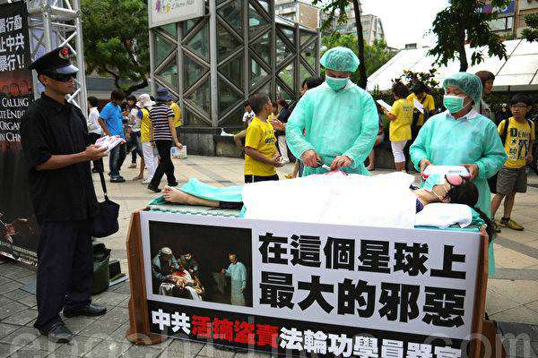

<h4 align=center>▲ 台北揭露与制止中共活摘器官集会现场的反活摘器官行动剧。</h4>
</td> 
</tr>
 </table>
 

 

<table>
  <tr>
<td>
<h3 align=center><a href="https://">现场持枪警卫：目击了活体摘取的全过程</a></h3>
	

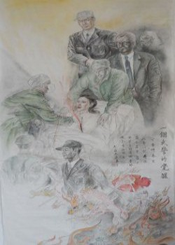

	
2009年12月12日，“追查迫害法轮功国际组织”公布了一名证人现场目击活摘法轮功学员器官的证词。

2002年，该证人为辽宁省公安系统工作，参与了绑架、拷打法轮功学员的行动。其中一位30多岁的中学女教师，经过一个星期的严刑拷打、强暴、被强迫灌食，已经是伤痕累累。2002年4月9日，辽宁省公安厅某办公室派来两名军医，将该名法轮功学员转移到另一场所（注一），在这名女法轮功学员完全清醒的情况下，没有使用任何麻药，摘取了她的心脏、肾脏等器官。证人当时持枪担任警卫，目击了活体摘取的全过程。

证人：手术刀在胸脯，一刀下去，血是喷溅出来的，血是喷溅出来的。

问：你看到的是男的还是女的？

证人：女的，女的。

问：年轻的么？

证人：30多岁吧。

问：你说一下她当时是怎么说的。

证人：当时，我们经历了就是，得有一个星期对她的审问，严刑拷打，身上已经有无数次伤疤，并且电棍、电，她已经神智不清……

	
可能是辽宁省公安厅某办公室，派了两个，一个是解放军沈阳陆军总医院的一个军医，还有一个是第二军医大学毕业的，具体反正一个是岁数大的，一个年轻的，在某、某，就是给她送精神病院的一个手术室，然后进行一套东西。不打任何麻药，刀在胸脯上，他们这个手啊一点抖都不抖，要是我下手我一定抖了。……我真的佩服他们这些军
医，手一点也不抖，直接戴着口罩拉出来。当时我们一人拿一把手枪在旁边站岗，那个女人就嗷……大叫一声，说法轮大法好。

证人：说你杀了我一个人，大概意思就是你杀了我一个人，你还能杀了我们好几亿人么，为了自己真正的信仰被你们迫害的人么？这个时候，那个医生、军医犹豫了一下，然后看了我一眼，又看了我们的领导一眼，然后领导点了一个头，他还继续把血管……先摘的是心脏，还是再摘的肾。当心脏的血管剪动一下，她就进行抽搐，非常可怕的，我给你学下声音，反正我也学不好，撕裂的撕裂的那样式的，然后就啊啊……就一直张着大嘴，睁着两个眼睛，张着大嘴。哎呀……我不想再讲下去了。……

证人还说：当时王立军，现在的重庆公安局长，下死命令“必须斩尽杀绝”。

注一：在最初交谈中，证人为了不暴露自己，没有明确说出活摘器官的场所。在第二次交谈中，证人明确说出活摘器官是在沈阳军区总医院15楼的一间手术室内进行。经核实，沈阳军区总医院15至17楼均为外科。

<a href="https://github.com/mingop/f6f6dw/blob/master/video/aj1-1.wmv?raw=true">下载完整的录音文件.mp4</a>
</td> 
</tr>
 </table>

<table>
  <tr>
<td>	
<h3 align=center><a href="https://">证人指证：法轮功学员徐真遭活摘器官死亡</a></h3>
	

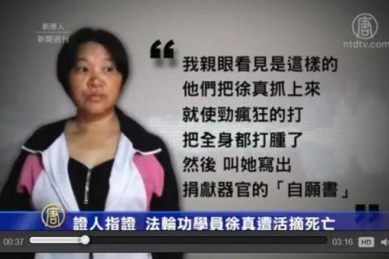

来自重庆的访民邓光英，2016年向海外媒体曝光：2011年她因卖水果与城管发生冲突被劳教，关押在重庆女子劳教所四大队期间，曾见证法轮功学员徐真被强制摘取器官而死亡。

时年46岁的徐真，曾是重庆合川电力公司职工。2011年9月底，她因发放法轮功真相传单，而被非法关入重庆女子劳教所四大队，连续十几天遭受酷刑。

邓光英当时也被关在四大队，说：“是我亲眼看见是这样的，他们把徐真抓上来就使劲疯狂地打，把全身都打肿了！然后叫她写出捐献器官的自愿书，她不写；不写就把她全身扒光，用一个小小的机器把嘴巴摁起，摁起之后用矿泉水瓶子，灌了十瓶水。”

2011年10月20日，邓光英被狱警体罚直到凌晨，突然清醒地听到劳教所四楼，传来徐真的惨叫声。

邓光英说：“她在被挖眼睛的时候是2011年10月20日凌晨2点过7分，我看了钟的！她的惨叫声，轰动了整个四大队，‘他们活挖我的眼睛啊！’她的叫声惊天动地。

”法轮功学员胡英说：“就是2、3点吧，听到很凄惨、恐怖的一声惨叫，当时吓得都睡不着觉了，都吓醒了，我们是在2楼，（徐真）她是在4楼，就听到惨叫声，听不到她喊的是什么，那个邓光英也关在4楼，可能就看到听到一些东西。”

直到2016年邓光英出面作证，外界才得知，徐真之死不寻常。

徐真死后，劳教所没有通知家属。而徐真死后一个星期，该所警察喻晓华就告诉其他犯人:“事情已经摆平，不会追究”。

<a href="https://github.com/mingop/f6f6dw/blob/master/video/flu-d.mp4?raw=true">下载完整的录音文件.mp4</a>

</td> 
</tr>
 </table>
 

<table>
  <tr>
<td>

■ 今天的中国大陆，器官买卖盛行，疑似活摘器官的案例时有听闻。这套原本用于法轮功学员和死囚身上的罪恶行径，已经渐渐扩展到了大陆民间……

■ 在中国大陆器官被盗取、丢失的现象在近十多年来屡见不鲜。共产党的罪恶 ,即将被审判。

</td> 
</tr>
 </table>
 

 

<table>
<tr>
<td width=500 ><a href="https://git.io/toto" target="_blank">【 中共活体摘取法轮功学员器官br群体灭绝性大屠杀 】</a></td>
<td width=380 ><a href="https://github.com/mingop/f6f6dw/blob/master/book/flg23.epub?raw=true">(图文、视频、音频).下载(epub) </a></td></tr>

<tr>
<td width=500><a href="https://git.io/toto" target="_blank">【 渝妇被活摘器官时逃生 】</a></td>
<td width=380><a href="https://github.com/mingop/f6f6dw/blob/master/book/cji59.epub?raw=true"> (图文、视频、音频) .下载(epub)</a></td></tr>

<tr>
<td width=500><a href="https://git.io/toto" target="_blank">【 见证中国活摘器官是真实 】</a></td>
<td width=380><a href="https://github.com/mingop/f6f6dw/blob/master/book/fdfd23.epub?raw=true"> (图文) .下载(epub)</a></td></tr>

<tr>
<td width=500><a href="https://git.io/toto" target="_blank">【 武汉数十名大学生神秘「蒸发」 】</a></td>
<td width=380><a href="https://github.com/mingop/f6f6dw/blob/master/book/jco12.epub?raw=true"> (图文) .下载(epub)</a></td></tr>

<tr>
<td width=500><a href="https://git.io/toto" target="_blank">【 江绵恒换肾与中共权贵 活摘器官续命内幕 】</a></td>
<td width=380><a href="https://github.com/mingop/f6f6dw/blob/master/book/ytuu89.epub?raw=true"> (图文) .下载(epub)</a></td></tr>

<tr>
<td width=500><a href="https://git.io/toto" target="_blank">【 大陆器官乱象背后 挑战人类道德底线 】</a></td>
<td width=380><a href="https://github.com/mingop/f6f6dw/blob/master/book/ass56.epub?raw=true"> (图文) .下载(epub)</a></td></tr>

<tr>
<td width=500><a href="https://git.io/toto" target="_blank">【 让法官傻眼的办证词 】</a></td>
<td width=380><a href="https://github.com/mingop/f6f6dw/blob/master/book/hgty48.epub?raw=true">  (图文、视频) .下载(epub)</a></td></tr>

<tr>
<td width=500><a href="https://git.io/toto" target="_blank">【 顺天意得平安 】</a></td>
<td width=380><a href="https://github.com/mingop/f6f6dw/blob/master/book/3wjo1.epub?raw=true">(图文).下载(epub)</a></td></tr>

<tr>
<td width=500><a href="https://git.io/toto" target="_blank">【 传奇人生 】</a></td>
<td width=380><a href="https://github.com/mingop/f6f6dw/blob/master/book/kks-ed.epub?raw=true">(图文、音频).下载(epub)</a></td></tr>

<tr>
<td width=500><a href="https://git.io/toto" target="_blank">【 “四‧二五”中南海万人上访真相 】</a></td>
<td width=380><a href="https://github.com/mingop/f6f6dw/blob/master/book/425-20.epub?raw=true">(图文).下载(epub)</a></td></tr>

<table>
<tr>
<td> 手机版ePub电子书，推荐使用 Reasily - EPUB 阅读器，可以观看视频、音频、图文。<a href="https://github.com/mingop/f6f6dw/blob/master/book/open-epub.txt?raw=true">请在此下载( 如何开启epub说明 ). txt</a>

 
<a href="https://github.com/mingop/f6f6dw/blob/master/book/Reasily-epub-1802h.apk?raw=true"> 请在此点击直接下载电子书（ePub版）</a>

 
		
</td></tr>
</table>

</table>

<table>
<tr>
<td>

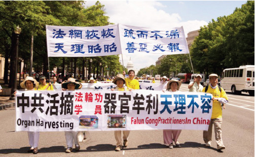

</tr>
</td>

<tr>
<td>
	
■ 人的尊严，可以买卖吗？面对种族灭绝的暴行，我们可以闭上眼睛吗？发生在21世纪、对法轮功的迫害，事关生死和良知。迫害惨烈，史无前例；活摘器官，惨绝人寰。这不只是中国人的噩梦，而是邪恶在挑战人类的底线。

■ 在过去十余年里，数以万计的善良的中国人，因为信仰和良心而被中共江泽民集团系统化地宰割、屠杀。制止虐杀，维护生命的尊严，维护信仰的权利，向反人类罪行说“不”，不分国界。
</tr>
</td>
</table>

<h2 align=center><a href="https://">中共罪恶滔天  遭天谴在即</a></h2>

中共是一个做恶没有底线的犯罪集团。它当年在发生大饥荒、饿殍遍野的时候，不但不予救济，反而派出军队封锁道路，禁止百姓逃荒要饭，致使3000多万人活活饿死；在天安门发生民主运动的时候可以用坦克的履带、毒气弹、开花弹来屠杀手无寸铁的学生；在迫害法轮功的时候，制造天安门自焚骗局；活体摘取法轮功学员的器官牟利。对于这个党来说，残忍嗜血、天良丧尽。从隐瞒萨斯病（SARS，大陆称为“非典”）到隐瞒四川大地震的预测不报，民众的死活从来就不是中共考虑的问题，任何苦难都无法唤醒这个本来就没有良知的邪党。

 <h2 align=center><a href="https://">天降奇石  预言“中国共产党亡”</a></h2>

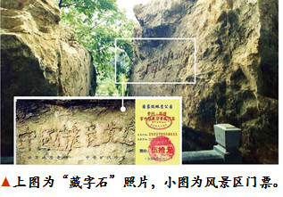

2002年6月，贵州省平塘县掌布乡的一位村民，在掌布风景区发现一块巨石，石面上有排列整齐的六个大字：“中国共产党亡”。经三路专家前往考察，这块巨石距今已有2亿7千万年，500年前从高崖上落下来，断成两块，字在右边那块巨石上，清晰可辨。又经鉴定，这些字都是天然形成的，没有任何人为加工的痕迹。当时国内一百多家媒体，包括新华社、中央台都有过报道，网上也能搜索到相关照片，当然，这些媒体都不敢提最后那个“亡”字，但从照片上可以看出来。

千百年来的中国，在要出大事之前就一定有奇事发生，老天或以瑞兆示吉，或以凶相警世。今天，贵州平塘的“藏字石”是否也在向人们预示着天机呢？突现标语“中国共产党亡”，非同小可，绝非偶然。

天然形成这六个字，还按照顺序排列，如此奇妙的巧合，只能说是天意。历代王朝的败象，都没有腐败到象中共政权这样猖狂；历代王朝的灭亡，都要带走它的追随者殉葬。当天灭中共的劫难降临之时，不要怨上天没有预警：奇石就是明证！

<h2 align=center><a href="https://">天灭中共  与每个人息息相关</a></h2>

有人说：“我是个平民百姓，也没干中共那些坏事，所以中共灭亡和我没关系。”

中国共产党不是一个空壳，它是由加入该组织的党员、团员、少先队员组成的。中国大陆绝大部分人都加入过共产党、共青团或少先队等组织，自然就是邪党的一分子，而且中国人在加入中共党、团、队时，都对它发誓要把一生都交给它。中共一方面向人们强制灌输“无神论”，另一方面却让人们发誓效忠它，这说明了什么？由于共产党的统治是谎言政治，人们无从看到真相，所以很多人并不了解共产党的本质，并不知道这种在党旗下的宣誓意味着什么，也有很多人认为入党宣誓只是个形式，是无所谓的事。但是，宣誓的性质并不会因为人认为“无所谓”就变得“无所谓”了。

除了共产党，世界上没有第二个政党要求人在加入时发誓要把生命献给它。

马克思在《共产党宣言》中说：1848年，“一个幽灵，共产主义的幽灵，在欧洲游荡”。幽灵就是魔鬼，这表明共产党从一开始就承认自己是魔鬼党。因为共产党是魔鬼幽灵，那么在加入中共党、团、队组织时对共产党宣誓效忠、献身、牺牲，就是向魔鬼幽灵宣誓效忠、献身、牺牲。把生命献给共产党，就是把生命交给魔鬼幽灵的过程，是一个人放弃人性、放弃自由的过程，这个生命就从此成为共产党（魔鬼）的奴隶和工具。这样的宣誓内容是一个卖身的契约，是一个毒誓。

随着毒誓的发出，在人的右手和额头上就会被印上一个魔鬼的印记，也称为兽的印记（“兽印”体现在另外空间的身体上）。

在古代预言中，像西方的《圣经•启示录》、《诸世纪》、中国三国时期诸葛亮的《马前课》、唐朝李淳风和袁天罡的《推背图》、宋朝邵雍的《梅花诗》、明朝刘伯温的《烧饼歌》、朝鲜南师古的《格庵遗录》等，都不约而同地谈到了中共的灭亡以及天灭中共时其追随者被一同诛灭的可怕惨景。《圣经•启示录》中称，能否抹去“兽印”，将是人人都必须面临的生死之间的选择。而当你声明退出中共“党、团、队”时，你的“兽印”就会被抹去，就不会在“天灭中共”时随它一块遭殃。

中共邪党在迫害法轮功的时候让每个人表态，我们每个人都不妨扪心自问，在善良和邪恶之间，在文明和野蛮之间，你是如何摆放自己的？救人的法轮大法被诋毁、信仰真、善、忍的人惨遭迫害，而许多人被中共邪党的谎言蒙蔽，甚至站到邪党的一边，直接或间接地参与对法轮功的迫害。这样的人会是怎样的结局？

这就是法轮功学员向世人讲真相、劝“三退”（退出中共党、团、少先队组织）的原因。

在真相面前，人是选择“相信”还是“不相信”；选择维护中共邪党、还是抛弃中共邪党，那不就是人在选择自己的未来吗。当预言中的大灾难真的降临的时候，这也许就是我们每个人能否平安度过劫难的真正原因所在。◇

 

<h2 align=center><a href="https://">洪灾中的奇迹</a></h2>

2010年夏天，一场特大洪水淹没了吉林市的许多村庄、县城，受灾最严重的要属永吉、汪起两地，无数人瞬间失去了生命。

永吉县城附近有一家工厂，7月27日晚，老板全家及哥兄弟几人在厂里团聚。第二天天刚亮，家人发现厂院里已经进水了，便大声呼喊：不好啦，长大水啦。老板正帮助家人尽快向高处转移，突然想起账本还在屋里，就告诉家人快跑，自己回去拿账本，当他拿了账本反身出屋时，水已经没腰深，而且还在迅速上涨，他一看自己出不去了，就急忙爬上吊车，这时水已没过了房顶，他被困在吊车上半个多小时，由于惊吓、疲劳，再加上没吃东西，他感觉快要支持不住了。

这时他突然想起以前有法轮功学员劝他“三退”保平安的事（他已“三退”），并且告诉他，在危难时刻喊“法轮大法好、真善忍好”就能逢凶化吉、遇难呈祥，于是他立刻高喊：“法轮大法好！真善忍好！”说来真是神奇，这时他就看见水中有三个香瓜向他漂来，他捞起三个香瓜赶紧吃了两个，觉得有精神了，也不饿了。

他想总在这里也不行啊，得出去呀，不一会就看见水中漂来一些成捆的玉米秆，他用手按了按看是否能撑得住自己，一按觉得没事，于是就趴上去，一直漂到地势高的一座二楼跟前，楼顶没有上水，他就上去了，在楼顶呆了几个小时，后被家人接走。他告诉家人说：“法轮功太神奇了。”◇

<h2 align=center><a href="https://">山崩灭村  遇难呈祥</a></h2>

“那是2008年‘5.12’大地震前的中午，我午睡得正沉，突然，有声音在耳边急切地叫醒了我：‘要地震了，快往村头跑！’”重庆市璧山县某镇的一个鞋匠向朋友讲述他所经历的惊心动魄的大地震逃生经历。 

为了养家糊口，鞋匠远走他乡，到北川一个村子做皮鞋。村子坐落在两座大山之间的山脚下，进出村子都只有一条路。 

鞋匠回忆道：“这个声音叫醒了我，我睁眼一看，没人，心想，一定是神仙点化，我没有丝毫犹豫，翻身爬起来就往村头跑去。” 

“当我上气不接下气地跑到村头，就听身后传来震耳欲聋的巨响，我停下来回头一望，天啊！那村子两边的大山突然向中间一撞，好好的两座山居然撞成了三座山！中间那座山把整个村子压在了山底下，再没看见其他一个人跑出来。” 

“我吓得瘫坐在地上，庆幸自己大难逃生。这时回忆起法轮功学员在我回老家过新年时劝我退出中共的少先队组织，他对我说：‘你长期出门在外，退出遭天谴的中共组织，大难来时命能保！’我当时也没多想，就同意了，不想在关键时刻神佛真的救了我，使我逢凶化吉，遇难呈祥。” ◇

<h2 align=center><a href="https://">长了眼睛的大火</a></h2>

【明慧网】几年前的一天下午，一位干部专程来找法轮功学员给他的妻子做“三退”（退出中共党、团、队组织），之前这位法轮功学员已经给他做了“三退”。他向法轮功学员讲述了近期发生在他家的一件神奇事。

他说：“在我‘三退’以后不久，我住的那栋楼房失火了，火从第一单元北边烧起，烧到尽头，拐了个弯，再从我妻子住的后间睡房经过，然后大火再席卷了第三单元，大火所到之处，连房顶都烧塌了，一片狼藉。然而，让人惊叹的是：大火从我的住房（二单元前面一间房）周围转了一个圈，而我住的睡房丝毫无损。”

“围观的群众一片哗然：‘这场大火才烧得怪嘞，四周的房子烧得精光。夹在中间的连门都不进。这场火怕是长了眼睛，会认路吧。喂，某某，你是不是会施法呀？……’”

“别人是不知道其中的奥妙的，可我心里明白：我的睡房可供着法轮功‘护身符’呢！这也是我‘三退’给我带来的福报。”

“看着烧毁的其它房间，我老婆后悔没听法轮功学员的劝告早做‘三退’。她让我赶快来找你，帮她做‘三退’，还说早退早远离晦气。”◇

<h2 align=center><a href="https://">当货车冲向了山崖……</a></h2>

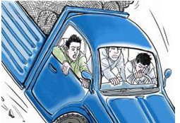

2009年9月23日晚7点左右，辽宁省凌源市佛爷洞乡的一位妇女风风火火地来到法轮功学员家，刚进屋她就扑通一声给法轮功师父的画像跪下了，连连磕头，泣不成声地说：“是李洪志师父救了我男人的命，没有大法师父，今儿我男人就摔死了。谢谢救命之恩！”法轮功学员一时摸不着头脑，赶快把她扶起，问清缘由。 

原来这妇女的丈夫叫王福（化名），53岁，常年与人合伙跑运输做买卖。9月23日这天一大清早，王福和另外两人开车去河北拉货。途经河北磨盘岭盘山道时，货车突然刹车失灵，车体急速地向下滑，前面几百米处就是大深沟，眼看一场车毁人亡的惨祸就要发生，车上三个人都傻眼了，只有抱着脑袋紧闭双眼等死。

这时王福突然想起平时法轮功学员告诉他在危难时刻喊：“法轮大法好，真善忍好”，就能救命。于是在这千钧一发之际，他使出全身力气大喊：“法轮大法好，法轮功师父快救命！” 

话音刚落，急速下滑的车体就像被人推了一把，掉头就往旁边一棵大树撞去，瞬间被大树卡住了。坐在车里的王福刚好是在大树一侧，是最危险的位置，可他浑身上下没受一点伤。另两个人从车里爬了出来，一人撞断了一只胳膊，一人被挡风玻璃碎片划伤了脸，但都没有生命危险。 

单说这个王福，平时法轮功学员向他讲真相他都接受，知道炼法轮功的都是好人，也早就退出了中共党团队组织（三退）了，所以在这次车祸当中他平安无事，两个同事也跟着受益了。 

事后这三个人宴请亲戚朋友，庆贺大难不死。在酒桌上，三个人抢着述说全过程，都说是法轮功师父救了他们的命。席间，王福还给亲戚朋友做了“三退”。◇（文/凌源市法轮功学员）

为什么只要诚念“法轮大法好”、“真善忍好”就会得到大的福报呢？就是因为“人心生一念，天地尽皆知”，在法轮大法遭到诬蔑迫害时，您还能明白是非、支持善良，这就是最珍贵的一念，就会得到上天的保佑。全国各地因为相信“法轮大法好”，危难时刻化险为夷的例子比比皆是。

<h2 align=center><a href="https://">渤海湾遇险记</a></h2>

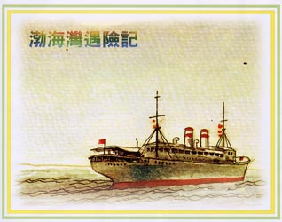

陈林（化名）是一名海员，妻子因为生孩子落下了一身病，绝望中炼起了法轮功，谁知一炼竟将病炼没了！从此夫妻俩对法轮功由衷地敬重。

2003年7月，陈林休假期满又要上船了。临行前，妻子象往常一样叮嘱他：“千万记着法轮大法好，关键时刻喊李老师帮助。”

日子过得飞快，转眼三个月过去了。10月11日，他们的船在渤海湾遭遇了台风袭击。12日凌晨，风力增强到11─12级。全体船员同心协力，全力以赴，与台风作战，用舵控制船体偏荡。黑夜里，船体遭受着台风猛烈地袭击，同时巨浪强烈地拍打着船体。就在这时，意外发生了：舵机突然失灵！船体随即在狂风巨浪中剧烈摇晃起来，灾难随时会发生！恐怖笼罩着每一个人。

船长让大家做好弃船准备。在这巨浪滔天的茫茫大海上，即使弃船也是难以逃生。求生的欲望紧紧揪着每个人的心。眼前的海况令人毛骨悚然，船员们已失去了冷静。

在这生死关头，陈林猛然想起妻子的嘱咐，双膝跪下，鼓足劲高喊 “法轮大法好！”“法轮大法是正法！”“李老师救救我们！”吼声过后似乎一片沉寂。大家被陈林的举动震懵了。瞬息间，似乎一切都静止了。突然有人惊喜地喊了一声：“风小了！”是的，风浪真的小了！大家开始活跃起来。一小时后，舵机修好。就这样，一场灾难化险为夷。

两天后，他们得知另一艘兄弟船“华源顺18”轮在沧州海域遇难，经沧州市海上搜救中心全力组织营救，全船17人，2人获救，15人失踪……

晚饭时，大家为遇难的兄弟船员感到悲痛，同时庆幸和感叹自身的脱险。这时，船长让电报员取来一张打印纸，用记事笔恭敬地写上：“感谢李老师的救命之恩，我们相信法轮大法好！”并签上了自己的名字。随后，全体船员都郑重地签上了自己的名字。他们把纸折叠好，密封在一个空瓶子里，放入大海。让蓝天作证，大海作证，这是二十二名船员的心声：法轮大法好！◇

<h2 align=center><a href="https://">救命的一句话</a></h2>

我的丈夫是森林防火护林员，面对的是较艰险的工作，疏通砍伐护林带。

几年前的五月初一上午十时，丈夫所在的护林队在组长的带领下正用电动锯砍伐护林防火带，突然天地黑暗下来，骤然刮起一阵旋风，飞沙走石中，大树把高压电线砸断了落在地上，这可是要出人命的大事啊。当时组长拔腿便跑，跑出几步，便大叫一声扑倒在地，组员小刘跟着跑几步也倒在地上。丈夫看到此情景呆住了，急呼：“师父救我！”刚试着跨出半步，脚还未落地，就觉得有一股逆流随脚上下强烈感应，他收回脚，原地站着，却没事。丈夫和另外两名组员小王、老赵吓得一动不敢动。这时丈夫听到一个亲切的声音在耳边说：“不要跑，跳出来！” 

丈夫定了定神，按照声音说的，试着独脚跳出来，跳累了，双脚并着跳出来。这下真神了，越来越感到轻松，没事了，得救了！小王和老赵一看，也一步一步跟着跳了出来，都得救了！丈夫热泪滚滚，哭喊着：“是师父救了我的命！师父救了我的命！法轮大法好！” 
“法轮大法好！”“得救了！”三个人抱在一起号啕大哭！

后来他们叫来救护车，切断了高压电源，可是组长和小刘浑身乌黑，再也醒不过来了。 

丈夫回家和我说了他经历的生死劫，我也是感慨万千。我修炼法轮功快二十年了，从原来的病痛缠身、脾气暴躁，变成身体健康、性情温和，丈夫看在眼里，喜在心里，很支持我炼功。1999年7月，中共开始迫害法轮功后，丈夫也曾迷惘、怀疑过。我经常给他讲法轮功的真相，又有我这个真实的例证在身边，他终于明白了法轮功是好的。后来，他还退出了中共党、团、队组织。

去年春天，丈夫所在五人一组护林队中，组员小王和老赵在丈夫的劝说下明白了真相，退出了中共党、团、队组织，但是组长和组员小刘不相信，也没退出中共组织。一个月后，生死劫难就发生了。◇（文/秀华）

<h2 align=center><a href="https://">我幸运逃脱天津大爆炸</a></h2>

我叫萧桐（化名），家住河北省唐山市丰润区。以前，由于我听信了电视、报刊的造假宣传，使我对法轮功抱有偏见。

2015年3月6日，在我儿子大满月的宴席上，我父亲的朋友杨大伯给我讲述了法轮大法（法轮功）的真相。他说：“法轮功是佛家修炼的高德大法，祛病健身有奇效。教人向善，提升道德。比如你们做生意的人，遇事要能站在客户的角度想一想，就会把生意做好，生意就会越来越兴旺。”他又给我讲了共产党的邪恶，从假、恶、斗到“六∙四”杀人，再到迫害法轮功以及现在的贪污、腐败等社会乱象。他告诉我，“天灭中共”这是天意，谁也挡不住。只有真心退出党、团、队组织，才能保平安。在真有大灾大难到来的时候，神、佛有的是办法保护你，佛法无边。大伯讲的实实在在，我想想都是真事儿，于是就用真名退出了曾经加入过的团、队组织。没想到这真是上了一份不花钱的保险，在天津大爆炸事件中救了我的命。

8月12日，我和两位朋友一起到天津市滨海新区某公司催讨债务。因为只有一百多公里，才一个多小时的车程，也没怎么联系，我们就直接驱车到了瑞海物流公司附近的某公司。不巧的是公司经理外出，要晚上才能到家，我们只好在附近找个旅店住下，等待第二天结账。

晚上九点多钟，电话铃声忽然响起，原来是家里打来的，是我那个不满一周岁的儿子突然肚子疼，闹得很厉害，需要看医生。我妻子一个人同时照顾两个孩子确实困难。如果抱儿子去看医生，家里留下个五岁的女儿实在不放心，要我马上回家。我想钱再好也没有我儿子重要，于是我们马上退房往回赶。回到家，发现儿子的肚子疼已经好了。当时觉得事情没有办成就赶回家来了，还有些惋惜。

第二天才知道，我们才离开宾馆一个多小时，附近的天津市瑞海物流公司的化学品仓库就发生了大爆炸。我们住宿的旅店是重灾区，因此我们几人都逃过了一劫。过后想想，如果是其它别的事情，我也许就不会回来了，偏偏是我的宝贝儿子生病，我是一定要立即赶回来的，如果再迟疑一个多小时，灾难也就会降临到我的头上。

再深一层想想，到底是谁让我逃离此劫？只有神佛！那么杨大伯说的“三退保平安”（“三退”指退党、退团、退队），是真真实实地兑现在我身上了：是我退出了中共的团、队组织，神佛使我逃过了天津大爆炸这一劫难。

今天我写出此事，目的是告诉那些至今还不相信“三退”的人，赶快退出中共的党、团、队组织，才能在此“天灭中共”之际，在大灾大难来临的时候，得到法轮大法的佑护。“三退”真能保平安，我就是个真实的见证。◇

<h2 align=center><a href="https://">道人之语蕴天机  七十年后终解谜</a></h2>

我已八十多岁，这里讲的是我亲身经历的一桩往事。

我娘家住在济南市南部山区。七十年前我很小的时候，就记着家里住着一位修行的道人。此人四十开外，与我父亲年岁相仿。人很善良谦和，他称我父母为小爷爷、小奶奶，称我为小姑姑。 

农忙时，他就帮我家中干些活，闲时就外出行医、化斋，晚上回来也不点灯，在屋内不知做些什么事情。经常说一些古怪离奇的话，我们都听不懂是什么意思。 

在我十二岁那年，记得最深的几件事情：有一天是晴空万里，他却不让我家人外出，但不说为啥。快到中午的时候天气大变，即刻狂风四起，飞沙走石，昏天黑地，大树拔起折断，房子揭盖。大约一个小时左右，天才慢慢放亮，出来太阳。道人说，如果正面碰上这风头，人就会生场大病和扒几层皮，严重的甚至连命也难保。 

这一年大旱，入伏的头三天才下雨，村里人都赶快抢种，道人却不让我们家种，他说：“咱家播种用的东西先借别人使用，他们用完后，咱们再用也不迟。”原来是三天后，又下了一场更大的雨，种上的也白种了，全让雨给冲坏了。大雨过后，地里很湿，他却催着赶快种，再不能耽误，否则种的庄稼就不好出苗了。

过了几年，道人对我父母说：“我要走了，我不能在这里修行了，家里如果有事需要我帮忙的时候，可点上一根香叫我的名字。”家里人似信非信。 

又过了一年，父亲背后长了个恶疮，花了很多钱也治不好，这才想起了道人，想起了他说的话，虽然将信将疑，但也顾不得这么多了，试试吧。晚上奶奶拿了一把香在院子里点上后，叫着道人的名字快来。

当时是寒冷的冬天，天还没亮的时候听见有人敲门，开门后一看是道人，只见他满头大汗，棉衣都被汗浸透了。第一句话就问家里出了什么大事？母亲把父亲的病情说了。他看了看父亲的恶疮后说没事，好治。然后把恶疮挖掉，上了药。第二天，父亲就能下床了。吃饭的时候他对我父母说：“以后你们再不能给我打信了（就是烧香），我可承担不起一把香这样的礼仪。”

他临走时父亲问他什么时候再回来看我们。道人说：“等山上有了楼、井里水淌到家、灯头朝了下、山剩半边、人死后没人埋的时候，我再回来看你们。那时大变样，恐怕小叔叔和小姑姑能不能见着面还很难说。”父母听完后，脸色都变了，说人死没人埋，这不是场人间大灾难吗？就没有解此难的办法吗？经父母多次追问后，道人才说：“脸上有印看不见，抹去印记度劫难。”全家都深深记下这些话来，就是难解其中的意思。

七十年后的现在，道人说的前四句话都一一实现了，现在山上山下都有楼房，井里的水也淌到了家（因以前都是到水湾里、井里去挑水喝），灯头朝了下是指的电灯，以前都是用的油灯，所以灯头是朝上的。因为我们这里是山区，但过度开采，山没有完整的，多数是半边。只有“人死后没人埋”这句还没应验。可我也始终没有解开“度劫难”那两句话，还是迷。我经常给孩子们说这件事，他们都不信，还不让我说这些话。 

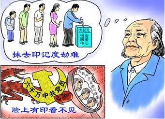

几年前有一天早上开门时，门缝里夹着一张单子，我就让孩子们念给我听听上面写的是什么。当我听到“大纪元”三个字时，我忽然想起了道人原先常说大纪元是研究天象变化的。当念到上面写着：“老天要灭共产党，凡是举手入过党、团、少先队及作恶多端的人，脸上都带有印记，眼前面临一场大灾大难，要想度过这一场大劫难，可用小名、别名、化名，向大纪元声明退出即可，就能抹去脸上的印记，保平安。”我又想起了道人说“脸上有印看不见，抹去印记度劫难”的话来。这一张法轮功真相的单子一下子给我解开了七十多年解不开的“谜”，怪不得法轮功的传单让大家退党、团、队，原来是在救人，让大家保平安啊！ 

我们全家明白后，都一一照办退出了党、团、队。我今天也为了救人，才叫孩子们写出这桩事来。别错过时机，当灾难真的到来，后悔晚矣！不要拿自己的生命开玩笑啊！ 

七十年前的道士预见了现在的人和事。我已经是八十多岁的老人了，如今也是子孙满堂。也希望各位父老乡亲们都能平安无事，明白“宁可信其有，不可信其无”的老话。◇

<h2 align=center><a href="https://">《九评》掀起“三退”大潮</a></h2>

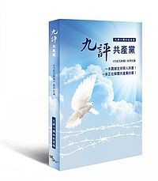

2004年，大纪元发表《九评共产党》（简称《九评》）系列社论，从历史、政治、经济、思想、文化、信仰等层面深刻揭示了中共的欺骗、暴力、邪教和流氓本性，在民间引发了一场波澜壮阔的精神觉醒运动。

到2018年3月，已有三亿中国民众明白真相后选择了退出中共党、团、队组织。

据全球退党服务中心信息，有很多中国大陆人士通过境外旅游方式退党，其中有相当一部份是中共各级官员。各大军区的现役和退伍军人也纷纷来函、来电要求退党。

近几年来，中国国内局势风云变幻，薄熙来、周永康等人的倒台引发的一系列事件，令国际社会瞩目。这一过程让人们清楚看到了中共迫害法轮功的黑幕。大批中国民众渴求真相，并越来越深切地感受到历史的巨变就在眼前，中共将很快崩溃，已成了人们的共识。

茫茫天意不可违，天灭中共在即，这必将祸及仍然追随中共的人，愿您顺应天意，快快“三退”（退党、退团、退队）保平安！

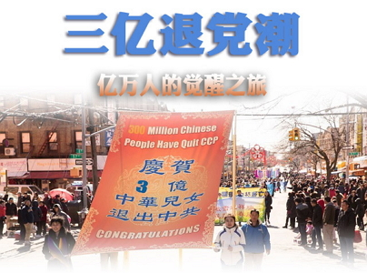

<h2 align=center><a href="https://">大纪元郑重声明</a></h2>

广大的中国民众：共产党的末日就要到了。但是这个邪恶的党（魔教）在历史上却对众生、对神佛犯下了滔天大罪，神一定要清算这个恶魔。 

如果有一天，神指使人类的谁对共产党清算时，也一定不会放过那些所谓坚定的邪恶党徒。我们郑重声明：所有参加过共产党与共产党其它组织的 (被邪恶打上兽的印记的)人，赶快退出，抹去邪恶的印记。一旦谁对这个魔教清算时，大纪元储存的记录可以为声明退出共产党和共产党其它组织的人作证。 

天网恢恢，善恶分明；苦海有边，生死一念。曾被历史上最邪恶的魔教所欺骗的人，曾被邪恶打上兽的印记的人，请抓住这稍纵即逝的良机！ 

大纪元
2005年1月12日

<h2 align=center><a href="https://">人生只有一次  选择正义  抛弃邪恶三退</a></h2>

中国人在加入中共的党、团、队组织的时候，都曾经发过誓：要为中共（中共不等于中国）奋斗终身，随时准备为党牺牲一切，包括生命。谁能对这话负责呢？谁真的想对这句话言而有信呢？看看中共几十年的暴政给中华民族带来的灾难，谁也不愿意再给共产党当炮灰、当陪葬、做牺牲品。可是我们发了那样的毒誓，就成了不讲道德、言而无信的人了。

现在，很多人都发表声明，收回了自己加入中共党团队时的誓言，即声明“三退”（退党、退团、退队）。“三退”无关政治，是道德问题，是良心的选择。

古今中外，迫害正信的从来没有好下场。反腐中的落马高官，包括周永康、 薄熙来，李东生等，个个都是积极追随江泽民迫害法轮功的残暴凶手，这能是偶然的吗？

俗话说“君子不立于危墙之下”，现在已有超过三亿中国人声明退出了共产党、共青 团、少先队组织，也叫三退。
不是让您在组织内退，是在海外的退党网 站上退， 用小名、化名都算数。
神看人心，真心退出去，当初咱们举起右手说为共产主义奋 斗终身的毒誓就算作废了，将来上天灭共产党的时候，也就不会 受到牵连了。

人生只有一次，选择正义、抛弃邪恶的三退，一定会给您带来福报和平安，也绝对是您生命中最值得、最安全、也最有意义的选择！

<h2 align=center><a href="https://">退党、退团、退队（三退）方法</a></h2>

三退（指退出中共党、团、队）声明，是发表在全球最大的华人媒体大纪元的退党网站上。　  
截至2018年3月为止，已有超过3亿中国同胞声明三退，为自己选择了平安。您可选以下任一种方法声明三退：

◆  可使用真名、化名、小名（三退）  
◆  用海外邮箱发表声明tuidang@epochtimes.com  
◆  用翻墙软件登录http://tuidang.epochtimes.com  
◆  退党电话：001-416-361-9895或001-888-892-8757   
◆  退党传真：001-510-372-0176或001-201-625-6301  
◆  可利用出国的机会，在国外将三退声明通过上述方式发表或交给退党服务中心义工。   

█ 提示：由于恐惧，中共对退党热线做了手脚，如从中国拨打接通后听到：“这是空号。”请别上当，不挂电话很快就能接通。

<h2 align=center><a href="https://">盲目跟党走、与善良为敌 遭厄运</a></h2>
明白真相的人正以每天十万人的速度在退出中共党、团、队，镇压法轮功的恶人以贪腐的名义一个个被抓被关,迫害法轮功遭恶运的事件,不断的在发生。＃

崔素红（音），41岁，河北省泊头市富镇镇政府工作人员，近日在骑电动车上班的路上，遭遇车祸，被大货车撞死。

崔素红死状奇惨：头、脸被碾掉半个，肠子被轧出来，大腿被车轮胎豁开，肉往外翻。因为赔偿问题没有解决，现在尸体在镇政府，后事还未处理。崔素红身后留下两个孩子。

崔素红是所谓包村干部，长期监视法轮功学员和共产党认为的异议者，并传达迫害任务给村干部。2018年中共两会期间，崔素红蹲村布控监视，并要求村干部撕掉法轮功学员王小东家门上带有“法轮大法好”的福字。事隔一个多月，崔素红就惨遭车祸。法轮功学员坚持向人们讲真相，就是不愿看到这种悲剧发生。

更多真相, 请翻墙访问明慧网 http://www.minghui.org/  
翻墙方法见<a href="https://git.io/opopop"> https://git.io/opopop </a> 这个链接请妥为收藏 

 

