

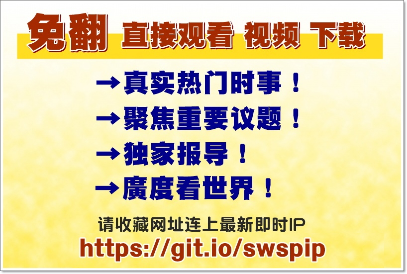

	
<h2><b>翻墙必看 视频 http://61.228.179.169/300</h2></b>
	

<h1><b><a href="https://github.com/awwkk/usdom/blob/master/forfor.md">● 红潮即将倾覆  天之将明 ●</a></b></h1>

<table>
 </td>

</tr>
<tr>
<td width="440"></td>
 
<td width="440"></td>
 </tr>
 
<td>
<a href="https://github.com/mingop/f6f6dw/blob/master/dong/nf4514-4.html?raw=true">每日新闻-大头条集锦.html(点击右键,另存新档)</a>
</td>

<td>
<a href="https://github.com/mingop/f6f6dw/blob/master/dong/nf1147481.html?raw=true">大法徒的故事.html(点击右键,另存新档)</a>
</td>
 </tr>
<tr>
<td width="440"></td>
	
<td width="440"></td>
 </tr>
 
<tr>
  <td>
<a href="https://github.com/mingop/f6f6dw/blob/master/dong/nf1358885-4.html?raw=true">武汉肺炎—新型冠状病毒爆发.html(点击右键,另存新档)</a>
</td>

 <td>
<a href="https://github.com/mingop/f6f6dw/blob/master/video/58885_360P.mp4?raw=true">武汉肺炎真相.mp4(点击右键,另存新档)</a>
</td>

<tr>
<td width="440"></td>
	
<td width="440"></td>
 </tr>
 
<tr>
  <td>
<a href="https://github.com/mingop/f6f6dw/blob/master/dong/nf4673.html?raw=true">法轮功专辑·祛病健身.html(点击右键,另存新档)</a>
</td>

 <td>
<a href="https://github.com/mingop/f6f6dw/blob/master/video/nf5287.html?raw=true">中共活摘器官黑幕.html(点击右键,另存新档)</a>
</td>

</tr>
</table>

<table>
 <tr>
 <td>
  智者先贤们都预言了今天的事，当有行大善者劝您退出来时，一定要退出来，“遭了此劫不上算”，切莫错过神佛对我们的慈悲！在大地震、非典、大洪水等各种天灾人祸面前，许多善良的大陆同胞因做了三退，并诚心默念“法轮大法好、真善忍好”而得平安福报。

	
<h3 align="center">不怕瘟疫的人</h3>
【明慧网二零二零年一月二十五日】〖中国沈阳来稿〗近日，我经历了一场与无名疾病对决的较量，结果我赢了。事情是这样的：二零二零年新年的第二天下午，我去沈阳市某大型超市购物，没想到人山人海的，原来新年这两天商品打五折。但既然来了我还是买一点东西，并安心的排队等着交款。

当天傍晚开始咳嗽，第二天就发烧，不想吃东西。我没在乎。不曾想症状越来越严重：发烧让我躺在床上起不来，好象内脏都肿了，呼吸困难，咳得很厉害好象要吐血了，全身的骨头都痛，头也痛，还有麻木的感觉，盖着厚厚的棉被还感觉冷！

尽管这样，我一点没有害怕，因为我心里装了救命的法宝：念“法轮大法好，真善忍好！”坚持念，烧了四天，不烧了，只是咳嗽。尽管没力气，象心衰的感觉，我还是出门了，也没告诉亲人们，怕他们担心啊。历时两星期，我彻底好了。

当亲人们知道我是诚心敬念“法轮大法好，真善忍好”而平安无事时，胃不舒服的老人相信了，也开始认真念“法轮大法好，真善忍好”了。

是呀，自从我明白法轮功真相，并退出中共的团、队组织后，再也不怕什么疾病、瘟疫、灾难了，因为我知道了无数的人因敬念“法轮大法好，真善忍好”而绝处逢生，知道了法轮功来到世间是来救人的。

其实不只是我，所有把“法轮大法好，真善忍好”记在心里的百姓们，都会不害怕瘟疫，也不会害怕灾难，因为与神佛站在一起的人，都会得到神佛的保护，都会拥有美好的未来。

 <h3 align="center">➤ 退党、退团、退队（三退）方法 ( 可使用真名、化名、小名退 )</h3></td></tr>
 
<tr>
 <td>
 <a href="https://git.io/pamja">如何 “ 三退保命 ”</a>，<b>连上面→免翻视频 IP http://61.228.179.169/300  </b> →点 【三退大潮】--为什么要退党？ 可留言三退或用翻墙软件自己办理三退</td>
 </tr> 

<tr>
 <td>
 <a href="https://git.io/pamja"> 如何 “ 三退保命 ”</a>，请点击翻牆网站  https://git.io/opopop  下载 { 翻牆软件 }→找 { 大紀元網站 }  ( http://www.dajiyuan.com ) 三退</td>
</tr>
  </table> 

  

<a href="https://github.com/mingop/f6f6dw/blob/master/video/video_720ps.mp4?raw=true">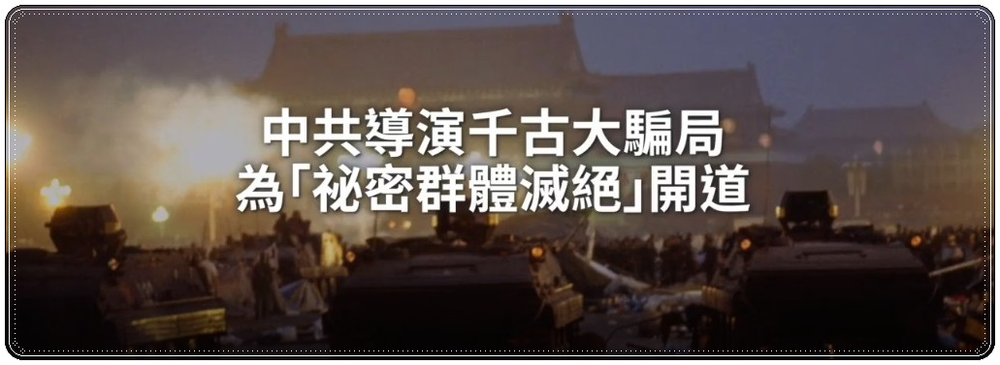</a>

   

<h3 align=center><a href="https://github.com/mingop/f6f6dw/blob/master/video/video_720ps.mp4?raw=true">► 点击下载视频» 18年前天安门那场大戏 为“秘密群体灭绝”开道 .mp4 </a></h3>

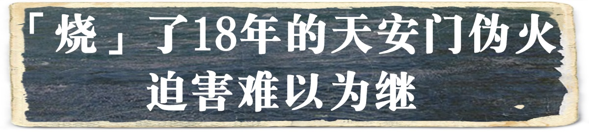

  

<table>
  <tr>
   <td>
【大纪元2019年01月24日讯】（大纪元记者罗琼综合报导）来自河南许昌的退休老干部孙先生一家五口到海外旅游，来到了多伦多皇后公园，遇上了法轮功学员张女士。当张女士向他揭露中共的罪恶时，他一听就愤怒了，气冲冲地握着拳头要打张女士。
  

张女士平静地跟他讲了许多中共迫害法轮功的真相。老先生认真听着，沉思了一下问：“你们不是在天安门都把自己烧了吗？”

张女士告诉他，那是中共炮制的伪案，是为了抹黑法轮功，让人误以为修炼法轮功会使人作出极端的举动⋯⋯ 最后在一席真诚的长谈后，那位退休干部流着泪说：“怎么能做出这么伤天害理的事啊？！”
最后一家五口都做了三退（退出中共党、团、队组织），老先生流泪抱拳，鞠躬90度说：“谢谢！非常感谢！”

18年前，2001年1月23日，在北京天安门广场上发生了举世震惊的“天安门自焚案”，中共谎称五个自焚者是法轮功学员，继而动用全国媒体轮番轰炸，诋毁法轮功，给全中国人洗脑。

当年的伪火至今已18年，仍在烧毁一些中国人的理智和善良，点燃他们心中对法轮功的仇恨。像那位孙姓老干部表现出的愤怒，在来海外的中国游客中并不少见。

法轮功自1992年在中国传出后，很快在全中国学炼法轮功蔚然成风，在七年里修炼者达上亿人。大陆媒体大量报导法轮功祛病健身的神奇故事，以及法轮功深受欢迎、洪传的盛况。当时在民众心目中法轮功有口皆碑。

随着法轮佛法越来越根植于人们心中，“真、善、忍”福祉越来越广及于社会，与其理念背道而驰的中共的“假、恶、斗”，越来越被人们认清、抛弃。中共感到自身的统治和命运岌岌可危，因而在1999年中共江泽民集团对法轮功发动了灭绝人性的迫害。

然而由于法轮功的口碑太好，要维持这场迫害实在太难，中共于是使出浑身解数来抹黑法轮功，挑起人们对他的仇恨。这种手段在中共历次的整人运动中屡见不鲜，在对付法轮功上达到了登峰造极的地步。

<b>抛出1400例 做铺垫</b>  
中共迫害法轮功后，立即开足马力在舆论上大肆造势，炮制了诸多谎言诋毁法轮功，到处收集和罗织自杀、杀人（包括精神病者杀人或自杀）以及住院濒死者等案例，再通过媒体的炒作和司法系统的伪造，编造出所谓练法轮功致死1,400例的谎言。
   

1999年10月25日，时任中共党魁江泽民访问法国前夕，接受了法国《费加罗报》社论委员会主席佩雷菲特的书面采访。江说：“据不完全统计，因炼‘法轮功’致死的达一千四百多人。”
   

中共拥有2,000多种报纸、杂志、广播和电视等宣传机构，仅中央电视台就有十多个电视频道，覆盖全国，它们全都为江泽民摇旗呐喊。

尽管如此，以伪证、假证抹黑法轮功，并不能“征服”人们，之前媒体报导的法轮功的好人好事，给人们仍留下深刻的印象。江泽民集团看到在发动迫害后的一年多里1,400例并没有达到让广大民众对法轮功刻骨仇恨的目的，于是谋划了更邪恶的一招。

<b>“自焚伪案”登场</b>  
2001年1月23日，天安门广场上五人自焚，其中一人丧生。事发后，广场上的巡逻警察就能“神速”地在90秒内赶来灭火。仅两个小时后，中共新华社就向全世界发布英语消息，称自焚者是法轮功学员。
   

一周后中共央视“焦点访谈”播放了“自焚”录像，恐怖的场景、形象，栽赃嫁祸之辞煽动人们仇恨法轮功。
   

这场闹剧的目的就是要升级抹黑法轮功，煽动仇恨。下面来看看“伪案”所选角色的用意和目的。

<b>1. 所谓“自焚圆满”一说</b>    
刘云芳是自焚者中的一个主角，他当年第一次在央视“焦点访谈”节目中说，他的自焚是为了“圆满升天”。
   

这个角色的安排是要把法轮功妖魔化，让人们根本否定法轮功的信仰，把法轮功和恐怖主义和邪教挂钩。
   

这也在当年误导了一些不明真相的西方媒体。

然而，在法轮功中明确规定他杀和自杀是禁止的。“自焚圆满”在法轮功中找不到任何出处。
“自焚圆满”一说被揭穿后，刘云芳之后在电视上把自焚动机改编为“说明真相”等，可见央视的新闻不是在报导事实真相，而是为中共做造假宣传。

<b>2. 自焚身亡者的“安排”</b>  
在自焚事件中刘春玲当场倒地而死。死亡会引起人们的同情、悲悯，激起对法轮功的仇恨。
   

事实上，刘春玲是被一个条状的重物猛击倒地而死。央视的“自焚”录像中可见，一名穿军大衣的男人挥动手臂，对她出手凶器。那个“条状物”是重物击打后反弹回来的，蹦得很高。
   

显然，刘春玲是被“安排”打死的。然而，刘春玲本人根本就不是法轮功学员。

2001年2月4日，《华盛顿邮报》头版发表《自焚火焰照亮了 中国的黑幕——当众自焚的动机乃为加强对法轮功的斗争》。

记者菲 力普·潘（Phillip Pan）到刘春玲的家乡开封实地调查发现：她生前在夜总会靠陪吃陪舞谋生，时常打老母和幼女，没人见过她炼法轮功。

<b>3. 借小女孩洗脑</b>  
自焚中还有一名12岁的小女孩刘思影，是刘春玲的女儿。她的出现，更让人们产生同情心，起到相当负面的作用。
   

“自焚”发生后，在中国连小学生都难以幸免地遭到洗脑。2002年“自焚”被写进了小学的思想品德课本里，上面印有小女孩刘思影接受央视记者的采访图片，还标有诬蔑法轮功的注解。
   

有媒体称，1,200万名儿童交了所谓反对法轮功的文章。

然而，“自焚”中的刘思影躺在无菌病房里，记者李玉强可以不穿隔离衣，不戴口罩、帽子近距离采访她。刘思影在气管被切开后不久，说话的声音却相当清晰，在受访中还唱了歌。这些无不遭到外媒的抨击，因为它们违反常理。

央视的工作人员称：“她（李玉强）是上头派来的”。

不幸的是，“自焚”中的刘思影却于2001年3月17日出院的当天，也就是自焚后不到两个月，突然死去。

<b>4. 作为活标本</b>   
自焚中还有一位19岁的女子陈果，是中央音乐学院的大学生，相貌娇好，多才多艺。一个如花似玉的姑娘，被烧得惨不忍睹，这当然最能挑起人们对法轮功的仇恨。
   

石家庄法轮功学员王博是陈果的同学。陈果自焚时，王博正在被非法关押，当她看到央视播放的自焚中的陈果时，随即指出：陈果以前炼过法轮功，可是她早就不炼了。就因为王博知道实情，随后王及家人遭到中共严厉的迫害。
   

自焚事件以后，陈果和母亲隐身消失十几年。

据知情者于2005年1月24日在明慧网上披露：陈果母女一起被软禁在开封市北郊福利院中，有一名叫展金贵的开封市公安局退休警察负责对陈果母女的禁卫。公安人员常年24小时值班，她俩不得与任何外人接触。

用公安人员私下讲的话说，不让她们死，“其实是政府打击法轮功用的活标本。”

果然，2014年1月初，“中国首善”陈光标在美国记者会上，让13年前天安门自焚伪案中的陈果母女出场，说要为她们整容。母女俩僵硬地背台词，继续栽赃法轮功。

记者当场追问：“法轮功认为自杀、杀人都是不对的，没有鼓励自焚，为什么你们自焚要归结于法轮功?”

陈果回答：是听信了刘云芳的话，刘云芳是整个事件的策划人。

可见，陈果的自焚根本和法轮功没关系，她是受人指使的。

<b>5. 中共教育出来的仇恨</b>  
据明慧网不完全统计，在1999年7月后的半年内，中共的海内外媒体对法轮功的诬蔑报导和批判文章就高达三十余万篇次，其中，报导“自焚”伪案是重中之重，它不但一度激起了很多中国人对法轮功的仇恨，也通过输出海外愚弄了全球几十亿人。
   

2004年7月，一位大陆知识分子在向海外媒体投书《过去我为什么仇视法轮功》中写道，他本人没看过任何法轮功的书，只是被中共谎言宣传蒙骗、洗脑，产生了对法轮功的仇恨。
   

这位人士写道：“而我的仇恨是共产党教育出来的，是在帮江泽民仇恨法轮功，说贴切点，我成了帮凶！”

不难理解，为什么那位老干部一听张女士讲法轮功真相时，就愤怒地挥拳要打她。

自焚案发生后的七个月后，2001年8月14日，“国际教育发展组织”（IED）在联合国会议上发表声明：“中共当局企图以天安门广场上的自焚事件为证据诬陷法轮功，而我们得到的录像分析却表明，整个事件是中共当局一手导演的。”呼吁整个国际社会“紧急干预中共当局的国家恐怖主义行为。”该声明已被联合国备案。

海外新唐人电视台制作了纪录片《伪火》（False Fire），详细剖析了“自焚”骗局中几十处造假漏洞，以“抓住时事，讲出事实”为特点获得2003年第51届哥伦布国际电影电视节荣誉奖。

<b>“自焚”伪案的见证人</b>  
18年来，见证中共“自焚伪案”的证人不在少数，以下仅举数例。
   

2001年9月22日，辽宁省东港市政法委科长赵云龙，在非法关押法轮功学员并强制洗脑的 “洗脑班”上说：“‘自焚’这件事我们事先就知道。发生在 2001年1月23日，也就是正常过年的除夕下午发生的事，我们在 1月21 日就接到公安部紧急通知，说 1月23日法轮功在天安门广场有重大事件发生……”
   

2012年海外媒体爆料，一个重庆渝中区小十字片区的“610”（专门迫害法轮功的非法组织）人员，自焚事件发生时，正在现场。他看到一个硕壮的军警抡起一个手提灭火器，猛击一被烟雾包裹的女子的后脑，女子应声倒地。由于击打者用力过猛，灭火器的把手脱落，飞向空中。

2015年12月29日，海外明慧网报导，一位见证人说“那事（自焚）之前广场就戒严了，我是高干子弟，在北京当兵， 那是我们部队干的，别说群众，连一个炼法轮功的也没有。”

2018年6月2日，明慧网刊登的大陆来稿透露，2001年天安门“自焚”案的前几天，大陆县以上的公安局长都被召集进京开会，并在“自焚”案发生的当天收到紧急通知前往天安门，现场看到自焚的场景。

以下的短篇揭示了中共漏洞百出的“自焚伪案”。

<b>迫害终将失败</b>    
尽管中共动用一切国家机器、疯狂迫害法轮功，但并未能摧毁修炼者的毅力和信念，“真、善、忍”的理念受到世界人民的欢迎和赞赏。法轮功至今洪传至世界一百多个国家，在国际社会获褒奖3,500多项。
 

在中共长达近20年对迫害功的迫害中，全球法轮功学员，尤其是时刻面临危险的大陆法轮功学员，坚持不懈地向广大民众讲清中共迫害法轮功的事实真相，越来越多的人在抛弃中共，选择光明的未来。
 

法轮功学员揭露中共邪恶，特别是揭露其活摘法轮功学员器官的罪行，以及呼吁停止迫害所做的种种努力，赢得了国际社会的肯定和支持。

欧洲议会、美国、澳洲、加拿大、以色列、意大利、爱尔兰等多国政府部门、机构相继通过决议案，制止中共强摘器官的罪行。

2012年12月12日，欧洲议会通过了制止中共活摘法轮功学员及良心犯器官罪行的决议。

2016年6月13日，美国国会众议院一致通过343号决议案，要求中共立即停止针对法轮功学员等良心犯的“强摘器官”行为。该决议案获得185位国会议员的联署。

2018年6月8日，美国联邦众议员达纳‧罗拉巴克发起《第932号决议案》。决议案指出，中共在中国至少造成八千万人非正常死亡，中共继续暴力镇压和平运动，包括长达19年、仍在持续的对法轮功的迫害。

决议案还指出，中共对强摘法轮功学员器官负有责任，并表示声援法轮功学员及其家人，要求中共立即停止迫害法轮功，声援中国退党潮。

自大纪元2004年发表系列社论《九评共产党》以来，中国人退出中共党、团、队组织的“三退”大潮波澜壮阔。截至2018年1月底，在大纪元退党网站上声明“三退”的人数已突破3.2亿。

罗拉巴克众议员于2018年5月在美国国会举办的“声援三亿中国人三退”研讨会上，向法轮功和法轮功修炼者致敬，他相信法轮功学员所信守的“真、善、忍”的原则。

他说：“我知道他们（法轮功学员）的付出──在似乎没有任何机会压倒控制中国的中共流氓政权的情况下，他们坚定、顽强地站出来，鼓舞着其他中国人，也鼓舞了整个世界。”

2018年6月20日至22日，近万名来自世界各地的部分法轮功学员在美国首都华盛顿DC举行集会，要求解体中共、停止迫害、法办迫害法轮功的元凶江泽民。

当天美国国会31位参、众议员致信声援法轮功学员。他们对法轮功学员坚守的理念和所做的一切努力表示赞赏和敬意，并强烈谴责中共对法轮功的迫害，呼吁结束迫害。#

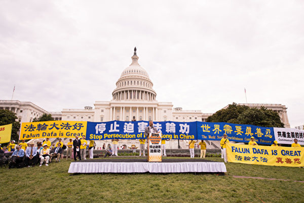

 2018年6月20日至22日，近万名来自世界各地的部分法轮功学员在美国首都华盛顿DC举行集会，政要到场支持。（大纪元） 

	
责任编辑：高静
  
 </td>
  </tr>
  </table>

<table>
  <tr>
   <td>
     

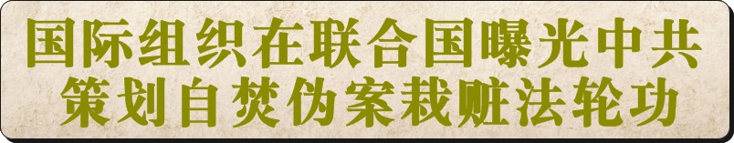

	
   
 <h4> ■ 2001年，在中国大地上，中共对法轮功的迫害正腥风血雨般地展开着。当年的1月23日，在这个家家团圆的除夕夜，天安门广场发生了震惊世界的“自焚”案。中共官方在第一时间宣称事件是法轮功学员所为。虽然各项证据都表明，事件是中共的“自编自演”，但中央电视台等官媒铺天盖地的报导，挑起了民众对法轮功的仇恨情绪。
   </h4> 

 <h4>  ■ 据人权团体自由之家统计，事件发生后，法轮功学员受到更为严厉的监禁和酷刑，被拘押的法轮功学员在拘押期间死亡人数明显上升，法轮功学员在中国陷入极其艰难的境地。迫害残忍至极 <a href="https://git.io/trtptp">https://git.io/trtptp </a> 了解更多。</h4>

   <h4> ■ 十几年来，随着越来越多民间质疑的涌现和相关调查结果的曝光，所谓的〝自焚〞真相渐渐被揭开，成为公认的〝21世纪最大伪案〞。</h4>
    

  <h4> ■《追查国际》发言人汪志远指出，多项调查证据表明，〝天安门自焚伪案〞，是中共江泽民当局策划的构陷法轮功的阴谋。</h4>
        
      
   </td>
  </tr>
  </table>
 
 <h2 align=center><a href="https://git.io/">下面请看来自各方对事件疑点的分析汇总。</a></h2>
 
 <table> 
<tr><td> ◆ 为什么自焚者王进东面容烧毁，头发和装满汽油的塑料瓶却完好无损？ </tr></td>
 <tr><td>◆ 大量警察和急救车是如何在短短几分钟内赶到现场的？ </tr></td>
<tr><td>◆ 警察手中的十多个大型灭火器和〝灭火毯〞从哪里来？ </tr></td>
<tr><td>◆ 为什么要等自焚者喊完口号再盖上〝灭火毯〞？ </tr></td>
 <tr><td>◆ 令摄影专业人士关心的是，如此突发、短暂的焚烧镜头，是怎样被及时而又清晰拍下的？不但近景、远景和特写具全，自焚画面还能跟随事件发展。 </tr></td>
<tr><td>◆ 刘思影的母亲刘春玲的死亡，也被舆论质疑是遭重击打死而不是烧死。 </tr></td>
<tr><td>◆ 12岁小女孩刘思影，做了气管切开，居然还能发出这么清脆的声音，还唱歌。不符合医学常识。(做气管切开发声是非常困难的) </tr></td>
<tr><td>◆刘思影，大面积烧伤，身体裹得紧紧的，不符合医学常识。
(大面积烧伤病人，她的创面，要尽量的暴露，因为裹得太严实了，护士换药、清创非常的麻烦而且很容易造成创面的化脓感染。) </tr></td>
 <tr><td>◆ 摄影机跟踪拍摄整个过程,从画面上看,拍摄自焚现场的镜头是从高处拍摄的,镜头是移动,跟踪拍摄整个事件。这说明整个过程是事先安排好的。 </tr></td>

  </table>
 

 
 

 

  

 

         

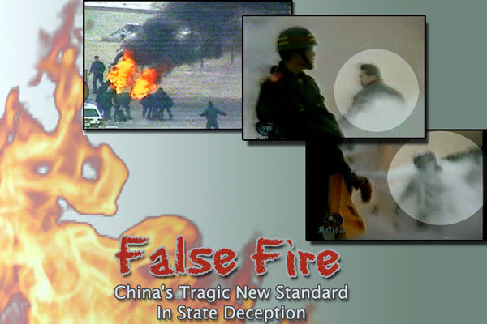

▲ 2002年1月，北美中文电视台“新唐人”制作了揭露“天安门自焚”真相的影片《伪火》（False Fire），该片从各国参赛的600多部影片中脱颖而出，于2003年11月8日获得第51届哥伦布国际电影电视节荣誉奖，该纪录片揭开了“自焚案”部分漏洞。（大纪元资料室）

 

 
 

 

 

<h2 align=center> <a href="https://git.io/ykkk"> ■ 气管切开还能唱歌 明显违反医学常识</a></h2>

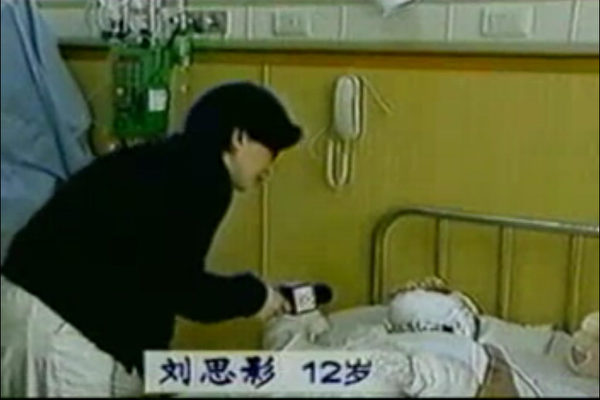

▲ 刘思影全身烧伤面积达40%，头、面部四度烧伤，双眼睑外翻，呼吸困难，颜面、双手基本毁损。根据医学常识，大面积烧伤病人要住隔离病房，而且做了气管切开手术的病人根本无法正常说话。探视者需穿戴隔离衣帽、手套、鞋套。在央视播放的自焚画面中，医生称“自焚”女孩刘思影做了气管切开手术，可是术后仅四天，却声音清脆地接受采访，还能唱歌，被海外医学界人士戏称中央电视台“创造了医学奇迹”。央视记者不穿隔离衣，不戴口罩帽子，直接近距离采访，这完全违反了医学常识。大面积烧伤病人，她的创面，要尽量的暴露，因为裹得太严实了，护士换药、清创非常的麻烦而且很容易造成创面的化脓感染。中央电视台“天安门自焚案”中的“烧伤病人”全身包裹，完全违反了医学常识。（视频截图）

	
 

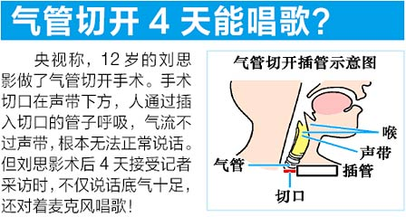

 

 

 <h2 align=center> <a href="https://git.io/ykkk"> ■ 衣服烧烂，头发却耐火？人被严重烧伤了 雪碧瓶却完好无损</a></h2>

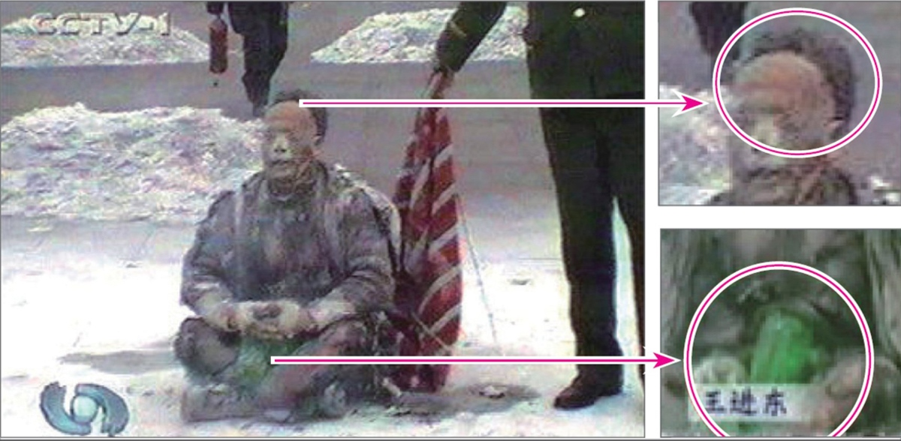

 
▲ 警察晃着灭火毯等镜头，“自焚者”王进东两腿间盛着汽油的雪碧瓶，在火焰中竟然完好翠绿无损；头发最容易被火燎，但是画面中王进东棉衣裤子烧烂，头发还完好。（视频截图）

		

 
 

▲ 上图为中共“天安门自焚”伪案现场图片。汽油燃烧，火温可达500 度以上，这样的高温中，王进东却能稳坐不动，头发也没烧坏。警察拎着灭火毯，在他身后等着，直到他在镜头前喊完口号才把灭火毯盖他身上。这不是演戏又是啥？（视频截图）

	

 

  <h2 align=center> <a href="https://git.io/ykkk">■ 天安门警察背着灭火器巡逻？</a></h2>
 

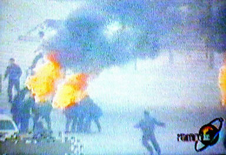

 
▲ 澳洲《时代报》（The Age）2004年10月16日的报道对央视的自焚录像做出强烈质疑：“警方事先不知情，却在90秒内，携带大量消防设备出现在画面中。”

  

 

  <h2 align=center> <a href="https://git.io/ykkk">■ 谁是画面外的摄影师？</a></h2>
 

 
▲ 图中的男子在军警间从容拍摄。国际社会质疑：央视自焚录像有远景、移动拍摄的近景，还有多个自焚者在不同位置的特写，并且录下了声音，显然摄影师做好了准备才能做到的专业拍摄。

  

  

 <h2 align=center> <a href="https://git.io/ykkk"> ■ 女主角被当场灭口？</a></h2>

 
▲ 让录像说话：假冒法轮功学员自焚的刘春铃被不明人士当场灭口

从中央电视台《焦点访谈》节目中关于自焚的现场录像可以看到，有一名身穿大衣的男子手持一重物，用力向死者刘春玲的头部击打，导致刘春玲急速倒地，并用手护卫被打的左侧头部。追查国际有理由认为刘春玲极有可能是在现场被打死，而非被烧死。现场这一名身穿军大衣的男子很明显不是在参与救人，而是要置刘春玲于死地！

 
 

 <h2 align=center> <a href="https://git.io/ykkk"> ■ 自焚的王进东是法轮功学员吗？</a></h2>

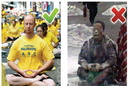

 
▲ 自称“老学员”的王进东竟然不会双盘腿。

 

				       

 
▲ 王进东的大拇指不是法轮功的正确动作——指尖轻轻接触，而是错误的上下重叠。

 

 <table>
  <tr>
 <td width=880> 

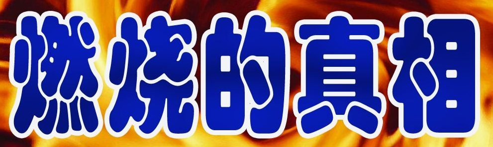

  <h3 align=center><a href="https://github.com/mingop/f6f6dw/blob/master/video/OwQA4tZUShUeb.mp4?raw=true">► 请观看录像：追查国际“天安门自焚疑案”调查纪实 .mp4 下載</a></h3>
</td>

</tr>
</table>

 <h2 align="center">
<a href="https://git.io/waaa">法轮功明确指出：炼功人不能杀生，自杀有罪</a>
</h2>         
■ 法轮修炼大法是由李洪志先生创编的佛家上乘修炼大法。在李洪志大师的著作《转法轮》中明确指出：“炼功人不能杀生”，李洪志先生还在 《悉尼法会讲法》中指出：“自杀是有罪的。” 真正的法轮功学员不会去自焚。

【明慧网二零一四年一月七日】（明慧评论员文章）法轮功是上乘佛家修炼大法，明文禁止杀生和自杀。任何以自杀、杀生行为诬陷、诋毁法轮功的人，都不敢让人系统地、不带任何观念地、静心地阅读法轮功原著，特别是《转法轮》一书，也不敢让人亲身体验法轮功的功法，因为坏人也知道：很多人都是有良知的，看见真相就不愿再相信谎言。
为了各位的前程，希望大家都来看《是自焚还是骗局》这个十三分钟的录像短片，即便是在百忙之中，很值得看，不看以后可能会非常遗憾！如果能静心通读《转法轮》一书，就更好。

中共就是中共，本性绝不会改变，就如同狼绝不会变成狗或者羊。十三年前的“天安门自焚”骗局虽然早已被揭穿，但命令烧书、禁书的那些中共罪人，总是在寻找欺骗更多人的机会，想多拉一些人陪绑，其中包括海外出于各种目的想和中共走近的人，并借此延缓中共被治罪的那一天的到来。

历史上对正信的迫害从来就没有成功过，现在中共对法轮功“真善忍”真理的迫害更是从一开始就注定了失败。从1999年7月至2014年1月，这场对法轮功的政治迫害已持续十五年了，法轮功学员在中国大陆和平、理性的反迫害言行，通过海外明慧网对迫害黑幕的揭露，也持续十五年了，迫害行为赖以藏身的主要场所——劳教所已经解体，迫害走入末路之末。在这种情况下，又有人到海外拿自焚骗局作招牌，象开假面舞会似的演戏，这一次，目的是骗谁呢？

自焚真相是本世纪重大信息。知道才能心明眼亮，明白才有未来、有光明、有希望。

相关历史概要：

1）法轮功是佛家上乘修炼大法，以《转法轮》一书教人按“真善忍”做好人、提高道德境界，并辅以五套动作优美缓慢的功法。从1992年5月公开传出，至1999年7月，短短七年间，学炼法轮功的人数已高达一亿；因祛病健身、回升社会道德的显著功效，法轮功在中国的声誉家喻户晓。

2）1999年6月，中共专门为迫害法轮功而成立了权力凌驾于公检法之上的“610办公室”。

3）1999年7月，中共首恶江泽民、罗干出于妒嫉和个人利益，发动了对法轮功的全面迫害。但当时，中国大陆有太多的人都经历过“文化大革命”，也都知道法轮功的功效，所以对这场政治迫害不以为然，对政府发动的“百万签名声讨法轮功”等活动消极对待。同时，大批法轮功学员自发地走向北京信访办、天安门广场，为法轮功说公道话。

4）江泽民发布的密令中，最臭名昭著的是对法轮功“名誉上搞臭，经济上截断，肉体上消灭”、“往死里打，打死算自杀”、“打死不查身源，直接火化”。

5）为维持和广泛推动这场迫害法轮功运动，2001年1月23日，江泽民、罗干之流，在天安门广场推出了一场自导自演的自焚事件，并动用全中国的媒体，用这场伤天害理、残害生命的黑戏，嫁祸法轮功。

6）“天安门自焚”骗局推出一周后，人们疑问重重。于是中共操控中央电视台，推出了一个以自焚为题的“焦点访谈”节目，攻击法轮功。然而通过对“焦点访谈”的录像进行慢镜头播放和分析，人们却发现了更多的漏洞。比如，在这场事件中当场失去性命的刘春玲，不象被焚烧致死，而是被突然来自脑后的重物击打致死，而神秘的击打者是军警模样。中央电视台的自焚画面中还有王进东的现场大特写，一名警察站在他的身边，拿着灭火毯，悠闲地等着王进东喊口号，然后机械地把灭火毯盖在王的头上。“王进东”浑身衣服被烧得七零八落，可是他两腿中间装汽油的绿色塑料雪碧瓶却完好无损。

7）法轮功是佛法修炼，禁止杀生和自杀。1995年出版的法轮功主要著作《转法轮》〈第七讲〉中专门有“杀生问题”一节，其中写道：“杀生这个问题很敏感，对炼功人来说，我们要求也比较严格，炼功人不能杀生。”1996年法轮功创始人李洪志先生在《悉尼法会讲法》时，当有弟子问，“杀生是一种很大的罪业，一个人他自杀算不算罪呢？”李先生回答：“算罪。……所以自杀是有罪的。”

8）尽管江罗监制的自焚事件漏洞百出，但想在政治上捞票的人，常年将此伪案和骗人用的“标准答案”塞入中国大陆中小学校的教科书、考试题、招工表格，从儿童、青少年学生做起，制造对法轮功的恐惧和仇恨。

<h2 align="center"><a href="https://git.io/ykkk">自焚伪案：原来不止是演戏，真的在杀人放火</a></h2>    

【明慧网二零一二年三月二十八日】因为要保护这位讲真话的世人，所以称之为贾姐，贾姐当时是某市团委的负责人，二零零一年罗干导演天安门自焚，栽赃构陷法轮功时，在摆道具的时候，正式拍摄前，她在天安门现场。

她说：当时看到一伙人忙忙活活的，还以为是拍电视。她没有在意就离开了，离京前并不知道发生了什么事。直到正月初八，全国铺天盖地的播放自焚伪案，挑动仇恨时，她才明白过来：原来不止是演戏，真的在杀人放火。

几年后遇到修炼法轮功的同学向其讲述真相时，她说出来的，而且说：她不会相信造谣的谎言，因为她亲眼看到了。

<h2 align="center"><a href="https://git.io/ykkk">刘春玲邻居揭露自焚伪案</a></h2>  
【明慧网2006年5月16日】我是一个女大法弟子，2006年5月12日，我去开封谈生意，对方也是位女士，自然说话随便多了。一会儿，我将话题转到了讲真相上，当说到“天安门自焚伪案”时，没想到对方竟然和那个被打死的刘春玲是近门邻居，她滔滔不绝的向我讲了刘春玲的一些情况和生活中的行为。

她说：“刘春玲是外地人，和丈夫离婚后带着母亲（继母）和女儿思影到开封生活，平常打工或者干些零活挣钱维持，生活很拮据。由于感情和生活上的压力，她脾气时好时坏，发作时常常打骂思影发泄。邻居们既可怜她一家，更可怜那受苦的孩子。有一次，是夏天，春玲又发脾气打孩子，毒辣辣的太阳她竟然罚思影到院里暴晒，我当时看不过，就拉着思影说，回屋里去吧，你妈妈不打你了。可是没有春玲允许，思影还是傻傻的在太阳下不敢回屋。”

“后来，几天不见她母女，电视里却说她们去天安门自焚了，而且还是个炼法轮功的，真是可笑，我和春玲住那么近，一天不知要见多少次面，从来没有见过、也没有听说过她炼法轮功，那时候法轮功在我们开封几乎是家喻户晓，我们苹果园区就有，那些老太太大清早的听着录音机炼功，路旁都有，却从没有见春玲去炼。再说了，春玲当时生活都顾不着了，哪有闲心去炼功啊。所以这个什么自焚在我们那个居住区都知道是假的，春玲是被人骗了，被人害了，真可怜。”

“还有一件事更让人怀疑，大概是自焚后的几天（记不清了），警察去春玲家搜查，我和那几家邻居都在场，大家都很惊奇的是，警察从春玲屋里搜出了十多万现金（估计），都是壹佰元成捆的。在场的邻居都议论纷纷，春玲这么穷，哪来那么多钱，平常吃穿都俭省的很，居然在家里放了这么一大堆现金。现在想想，那可能就是春玲母女的卖命钱啊。人被骗了，被不明不白的整死了，脏钱又被党拿走了，这才是吃人不吐骨头啊。”

<h2 align="center"><a href="https://git.io/3f">“天安门自焚伪案”是610恐怖组织策划</a></h2>  

【明慧网2005年1月29日】因我曾被非法关押在马三家教养院，2001年才回来的，有一天我的一个比较要好的工友对我说，他有一朋友在本市“610”工作，还是一个负责人，他个人想见见我，了解在马三家的一些情况。我当时就答应他。

一天这“610”负责人就到我家来，因为是工友介绍来的，他又不代表组织，所以我们谈话很随便。当谈到自焚时，他无意中说出：“通知我们前两天自焚，后来又往后拖了两天才自焚。”我当时也没有反应出来是什么意思。现在想起来，自焚原来是“610”办公室一手炮制的。从上到下贯彻下来的，是他们早就布置好的，有计划、有目地的栽赃陷害法轮功。所以说现场有灭火器一点也不奇怪。假如说自焚事件是真实的突发事件，他们不会主动去告诉“610办公室”的人：什么时间自焚。这就是为什么“天安门自焚”是漏洞百出，疑点重重，假象处处暴露。

因为我看到的一些有关“自焚”的材料没提到这个事，这件事是我自己亲自听到的，所以就补充这一点，让世人能从谎言中猛醒。

<h2 align="center"><a href="https://git.io/ykkk">一场世纪伪火“烧”出中共原形</a></h2> 

【大纪元2014年01月15日讯】（正见网报导）2001年1月23日（除夕），天安门广场上来了7个人，有5人身上突然燃起火来——这就是震惊国际社会的世纪伪案“天安门自焚事件”，其中有一名女子当场死亡。数日后，她的女儿也在医院离奇猝死。在中共喉舌媒体的报导中，称这些人是“法轮功学员”。该事件发生后，中共对法轮功学员的打压不断升级。

事后，新唐人电视台根据此案的现场录像制作出一部影片《伪火》，还原天安门伪“自焚”事件的真相，该片曾在国际社会获奖。

2001 年8 月14 日，国际教育发展组织在联合国会议上明确指出，“天安门自焚”是中共一手导演的，是对法轮功的构陷。当时在场的中共代表面对确凿的证据哑口无言。

假的就是假的。这场伪火案从哪个角度看都有破绽：从摄像角度看，远镜头、近镜头、特写镜头等，而且还非常清晰，除非都是准备好的，否则，突发事件怎么可能准备的这么完美？！从医学角度看，烧伤病人要裸露，不能包扎，而电视上显现出是包扎的一层又一层；切开的喉咙会唱歌；严重烧伤的人还会喊出清晰的“妈妈”声。从生活常识看，警察还背着灭火器去巡逻，要不，怎么瞬间就出现那么多的灭火器？！从新闻角度、央视新闻审查制度角度等等都能看出破绽。

为什么要造假诬陷？就是因为法轮功太正了，找不到一点不好的地方。法轮功，又称法轮大法，是由李洪志先生于1992 年5月传出的佛家上乘修炼大法，以“真善忍”为根本指导，包含五套舒缓优美的功法动作。法轮功教人向善，要求修炼者从做好人做起，努力按照“真善忍”的要求提 升道德标准。修炼法轮功不但能祛病健身，还能使人变得诚实、善良、宽容、平和。

1998 年，国家体育总局对3万多名法轮功学员做了5 次医学调查，表明法轮功祛病健身有效率高于98% 。同时，前人大的老干部也做了详尽的调查，得出“法轮功于国于民有百利而无一害”的结论，并向中央做了书面汇报。如果允许大法弟子公开讲述修炼法轮功的感受，每个人的修炼经历足以打动世人。

正因为法轮功太正了，照出了社会中的一切不足，包括依靠谎言与暴力欺骗与压榨人民的中共。法轮功讲“真、善、忍”，把中共的“假、恶、斗”暴露了出来，就是这样，法轮功讲修炼，不讲政治，你中共的好与坏与修炼没有任何关系。但是，中共毕竟是一个十恶俱全的邪灵，明知法轮功没有过错，法轮功的传出“于国于民有百利而无一害”，但是，当时的总书记江xx变态狂妄的心理与中共邪灵相合，就不断的制造事端，大法弟子就抱着大善大忍的胸怀向各级政府讲述法轮功真相，争取一个学法炼功的自由环境。

在江氏流氓集团的有计划的预谋下，于1999年7月20日，失去理智的倾一国之力，开足了马力针对善良无辜的法轮功群众实行群体灭绝式的残酷迫害。 江xx狂妄的叫嚣“三个月内消灭法轮功”，然而法轮功在打压中不断的讲真相，使世人越来越明白真相，眼看这场镇压快持续不下去了，江氏流氓集团就炮制出天安门自焚伪案，蛊惑民众，挑起群众仇恨法轮功，使迫害进一步升级。

这场漏洞百出的世纪伪火毒害了无数的众生，同时也“烧”出了中共原形，把中共的邪教本质、流氓本性彻底的暴露出来。

中共是一个外来的邪灵，是西来幽灵。《共产党宣言》开宗明义明确提出：“一个幽灵，共产主义的幽灵，在欧洲游荡。”幽灵，就是俗话说的魔鬼，这个魔鬼“游荡”到中国大陆，给中国带来了无穷的灾难。

中共利用伪装的谎言与暴力窃取政权后，就迫不及待的大搞杀戮，杀地主富农，杀民族资本家，杀知识份子，杀学生，直到今天酷刑迫害法轮功群众；意识形态领域里推行无神论，破坏有着五千年底蕴的传统文化，隔断人与神的联系，同时大力宣扬斗争哲学，“与天斗，与地斗，与人斗，其乐无穷”，强力破坏了人与人之间建立在传统文化基础上的和谐关系，人与人之间变成了斗争关系。中共还用宣誓加入队、团、党的办法，叫人在血旗面前发毒誓，把生命献给邪党，把人紧紧的和邪党捆绑在一起，真的到了清算恶党的时候，这些人就是殉葬品。

人有千算不如天有一算。中共邪党自认为自己的所作所为足以达到毁灭人类的目的，但是法轮功学员的讲真相使更多的民众觉醒了，截至2018年5月，已有三亿中国民众在海外大纪元网站声明退出中共的党、团、队组织，相信“法轮大法好”、“真善忍好”，为自己选择了美好的未来。

特别是从去年到现在，迫害法轮功的帮凶薄熙来、王立军入狱，周永康被抓，李东生落马，善恶报应的天理已经指向了迫害的始作俑者，揭开了大清算的序幕。有句话叫“不拿住奸贼不散戏”，正义终将战胜邪恶，历史上迫害佛法修炼的都是在可耻中收场。

（责任编辑：李文慧）

<table>
  <tr>
   <td>
<a href="https://git.io/waaa">■ 中国大陆法轮功学员不畏艰险、冒着被抓捕关押的危险，把“自焚真相”影像、文字资料传播给民众，人们在见到炼法轮功的亲戚朋友时，更要问个究竟，多少人自叹：“又被共产党骗了！几十年来它哪次说过真话？！”
 

■ 央视等官媒反复播出的自焚现场、自焚者惨不忍睹的颜容和他们凄惨的声音，强烈地冲击了人们的视觉，一时间让很多人对法轮功心怀恐惧。随着真相的慢慢揭开，并在法轮功学员长期广泛的传播真相活动中，人们从中共自编自演的这一场惨案看清了中共的残暴本质，也有很多人在明白真相后声明退出中共的党、团、队组织，抛弃中共。</a>
</td>
</tr>
</table>

 

 
“1400例”，是指1999年7月中共江泽民集团为诬陷法轮功而抛出的1400个弥天大谎的案例。

一九九九年七月二十日，中共江泽民集团发动了对法轮功的迫害。如同中共历次政治运动一样，这场迫害也是以铺天盖地的谎言宣传开道，所谓的“1400例”就是谎言宣传的一部份。

中共罗织的“1400例”杀人、自杀、死亡的案例中，有的案例是把精神病患者病发时的意外事故栽赃为法轮功学员所为，有的案例是以减刑为条件唆使杀人者冒充法轮功学员，有的案例是以报销医药费为诱饵让危重病人冒充法轮功学员，还有的案例是把普通人的正常病逝说成是炼法轮功造成的。所有这些案例都是中共对法轮功的栽赃嫁祸。

这些谎言宣传，不仅成为中共煽动仇恨迫害法轮功学员的借口，而且使很多大陆民众失去了受益于法轮功的机缘。

因害怕谎言被揭穿，中共江泽民集团烧毁法轮功的书籍，关押讲真相的大陆法轮功学员，封锁海外明慧网等报道真相的网站。但是中共的谎言无法阻挡真相的传播。

<h2 align="center"><a href="https://git.io/waaa">法轮功祛病健身效果</a></h2> 

法轮功是李洪志先生于一九九二年五月传出的一种佛家上乘修炼大法，因为其教人修心向善和神奇的祛病健身功效迅速传遍中国，并传播到海外，修炼人数迅速增长。一九九八年国家体育总局组织北京、武汉、大连及广东省的医学专家，对近三万五千名法轮功学员做了五次医学调查，证明了法轮功祛病健身有效率高于百分之九十八。

<h3 align=center><a href="https://git.io/waaa">那么，这“1400例”到底是怎么回事呢？ 以下列举一些典型案例，看看中共是如何编造假新闻，栽赃诬陷法轮功的。</a></h3>
<a name=top1><h3 align="center"><b><a href=#1>“1400例”栽赃术之一：利用精神病人栽赃</a></b></h3>
李洪志先生从一九九二年传法开始就明确指出，精神病人不能修炼法轮功。在一九九六年的《悉尼法会讲法》中又指出：“精神病人，他自己意识是不清的，我们是不能度的。”而且法轮功教人向善，明确禁止杀生和自杀。“1400例”中有许多是精神病患者而决非法轮功学员。中共江泽民集团搜罗了许多精神病患者病发时杀人或自杀的意外事故，栽赃嫁祸于法轮功。

<h6 align="right"> <a href=#1>阅读全文</h6></a>

<a name=top2><h3 align="center"><b><a href=#2>“1400例”栽赃术之二：唆使杀人犯栽赃</a></b></h3>
中共江氏集团迫害法轮功，是作为政治任务下达到全国各级官员的。许多地方不法官员为了邀功请赏，编造假新闻栽赃法轮功，公安人员以减免刑罚为条件，唆使杀人犯谎称自己是炼法轮功的，栽赃法轮功。

<h6 align="right"> <a href=#2>阅读全文</h6></a>

<a name=top3><h3 align="center"><b><a href=#3>“1400例”栽赃术之三：收买危重病人栽赃</a></b></h3>
中共为了诋毁法轮功，还利用医院收买危重、绝症病人，承诺减免医药费，让他们谎称自己是炼法轮功的，配合电视台、报社记者演戏。

<h6 align="right"> <a href=#3>阅读全文</h6></a>

<a name=top4><h3 align="center"><b><a href=#4>“1400例”栽赃术之四：假借病逝案例栽赃</a></b></h3>
中共把一些人的正常死亡说是因炼法轮功致死。其中有的人根本没有接触过法轮功，当然也不排除有些人为治病接触过法轮功，有些人在亲属的劝说下炼过功，但是他们真正的死因却是疾病。

<h6 align="right"> <a href=#4>阅读全文</h6></a>

<a name=top5><h3 align="center"><b><a href=#5>案例五：“剖腹找法轮”骗局</a></b></h3>
河北省任丘市华北油田马建民，本人及家族都有精神病史。有一天，马建民一个人在家，他的家人回来时，看到地板上有很多血，马建民肚子剖开。当时公安局的人明明知道：马建民死的时候是一个人在家，究竟为什么会剖腹，谁也不清楚。但央视不顾事实，仍然一手编导了“剖腹找法轮”的骗局。

<h6 align="right"> <a href=#5>阅读全文</h6></a>

<a name=top6><h3 align="center"><b><a href=#6>案例六：法院判决书认定杀父者实为精神病人</a></b></h3>
山东新泰市泰山机械厂工人王安收因精神病复发，将其父用铁锨打死。一九九九年七月，这一事件却被诬蔑成王安收因“练法轮功”杀害父亲，并且收入江氏诬蔑法轮功的“1400”例中。但从下面提供的新泰市人民法院的官方文件中，我们可以事实确凿的清楚看到“王安收因练法轮功杀害父亲”是严重违背事实的谎言。

<h6 align="right"> <a href=#6>阅读全文</h6></a>

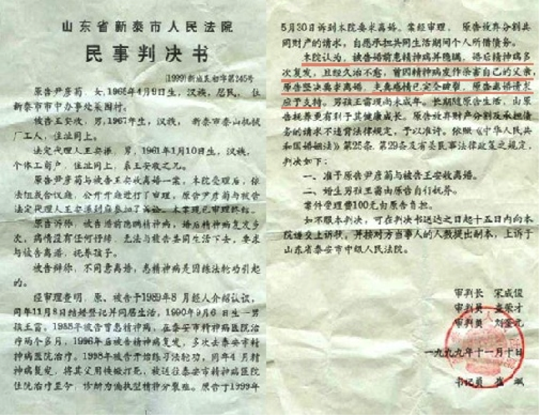

<a name=top7><h3 align="center"><b><a href=#7>案例七：哈尔滨市第四医院诱骗李淑贤栽赃</a></b></h3>
一九九九年七月，黑龙江阿城市大岭乡农妇李淑贤因患胃溃疡住进了哈尔滨市第四医院。病重期间，正是中共江泽民集团在全国迫害、诽谤法轮功之时。当时李淑贤家庭生活非常贫困，很难交上住院费。在这关键时刻，医院院长出现了，主动为李淑贤及其家属出主意，告诉家属：你们就说李淑贤是炼“法轮功”的，就能获得医院免费治疗。

<h6 align="right"> <a href=#7>阅读全文</h6></a>

<a name=top8><h3 align="center"><b><a href=#8>案例八：公安部门许诺栽赃法轮功可免死罪</a></b></h3>
二零零零年辽宁盘锦市电视台曾报导“魏家杀母案”。事后了解到这位被杀的老年人是以拣破烂为生，其女在海城游手好闲，打麻将，没钱了就到盘锦母亲处要钱，其母没钱给她，她在晚上将其母杀死。后来，公安部门的人给其女出主意：“你就说你炼法轮功，往法轮功上一推没死罪。”魏家老百姓都知道她不是炼法轮功的，但老百姓面对强权的压力，只能背地议论。

<h6 align="right"> <a href=#8>阅读全文</h6></a>

<a name=top9><h3 align="center"><b><a href=#9>案例九：和1400例一脉相承的傅怡彬杀亲案</a></b></h3>
1400例之后，中共喉舌媒体又有几次利用精神病人杀人的恶性事件栽赃陷害法轮功。发生在二零零一年底的傅怡彬杀亲案就是其中影响最坏的一例。

<h6 align="right"> <a href=#9>阅读全文</h6></a>

<h3 align=center><a href="https://git.io/waaa">诬陷法轮功不让人吃药看医生</a></h3>
【明慧网2000年6月27日】
炼法轮功到底和吃药有什么关系呢？

其实法轮功根本就没有要求不吃药，而只是讲出了修炼与吃药的关系。法轮功也不是用来治病的。法轮功创始人李洪志先生在其著作《转法轮》中说“我这里不讲治病，我们也不治病。但是真正修炼的人，你带着有病的身体，你是修炼不了的。我要给你净化身体。净化身体只局限在真正来学功的人，真正来学法的人。我们强调一点：你放不下那个心，你放不下那个病，我们什么都做不了，对你无能为力。”李洪志先生又说“天天光炼这几套动作，就算是法轮大法的弟子了吗？那可不一定。因为真正修炼得按照我们所说的那个心性标准去要求的，得真正地去提高自己的心性，那才是真正的修炼。”李洪志先生在《在悉尼讲法》中说“过去我们一直不让精神病人和危重病人进场，也就是说，这个危重病人你叫他怎样放下那颗心，他也放不下。”

由此，我们可以看出，李洪志先生根本没有要求学员不吃药，而只是学员们炼功后根本就不需要吃药就能达到强身健体，也就不用吃药了。而有些人没有真正理解法轮功的功理，而强行不吃药结果出了问题。

任何药物都有禁忌，病人没有服从药物禁忌而出了问题能说是医院、药厂的事吗？《转法轮》以及李老师的其他著作中多次强调危重病人、精神病人不让进班，而这些人就是不听。就象病人有病乱投医，不管是什么药就吃，出了问题不能算是医生和制药厂的事。据多维新闻网报导“中国内地卫生当局表示，在各级医院留医的病人之中，每年约有十九万二千人是死于药品不良反应。当局指出九零年在中国聋哑儿童一百八十二万多人，当中超过半数是因滥用抗生素，引起药物中毒性失聪。”

那么法轮功到底能不能治病呢？

让我们先来听一听中华人民共和国公安部所属中华见义勇为基金会1993年8月31日致中国气功科学研究会的感谢信，信的部份内容如下：

“中国气功科学研究会张震环理事长：

由中宣部和公安部联合召开的第三次全国见义勇为先进分子表彰大会，于日前胜利结束。参加会议的一些代表，因同犯罪分子英勇斗争而致伤残，在常规的医务治疗后依然带着不同的病状。为帮助见义勇为有功人员解除疾苦，中华见义勇为基金会曾正式向贵会提出请求，邀请中国法轮功主持人李洪志先生，在会议期间为见义勇为先进分子提供气功康复治疗。

8月30日李洪志先生带领一批法轮功气功师，来到会议上为近百名会议代表治病，治病效果之显著得到了普遍的称赞。接受治疗者有的因刀伤、枪伤留下的后遗症，经治疗后立刻解除了疼痛或麻木、乏力的症状；有的是脑外伤造成的后遗症，经治疗后立刻感到头脑清醒，解除了头痛、眩晕等症状：还有的是当场就消除了身体上的肿瘤；有的是在24小时内就排除了胆结石；也有一些是胃病、心脏病、关节病等病状患者，经治疗后都在当场感受到了消除病状的效果。在近百人的治疗中，除一位轻病患者没有明显感受外，其余全部获得了不同程度的明显疗效。经法轮功治疗的代表们对中华见义勇为基金会作出这一安排非常感激，说这是为见义勇为先进分子作的又一件实事。而直接为代表们做了这一实事的是中国气功科学研究会各位领导和李洪志先生。这也是支持全国人民群众发扬见义勇为精神的实际行动。为此，我会特向您及中国气功科学研究会各位领导和李洪志先生表示诚挚的感谢！”

<table>
  <tr>
 <td>   
<a href="https://git.io/waaa">■ 中共的谎言无论怎样粉饰也掩盖不了真实，如上列举的事实在“1400例”中比比皆是，由此可见炮制这“1400例”的手段之卑劣实属古今罕见。

■ 迄今，中共迫害法轮功十九年了，中国也成为全世界唯一一个不允许修炼法轮功的国家；与此形成鲜明对比的是，法轮功已经传遍世界一百多个国家和地区，跨越国界和种族的界线，获得各阶层民众的广泛好评，得到各界的褒奖和支持，法轮功的主要书籍《转法轮》被译成近40种文字在全世界发行。

■ 了解真相，拒绝谎言，诚盼可贵的中国人都能选择正义、选择美好。#</a>

<table>
  <tr>
 <td> 

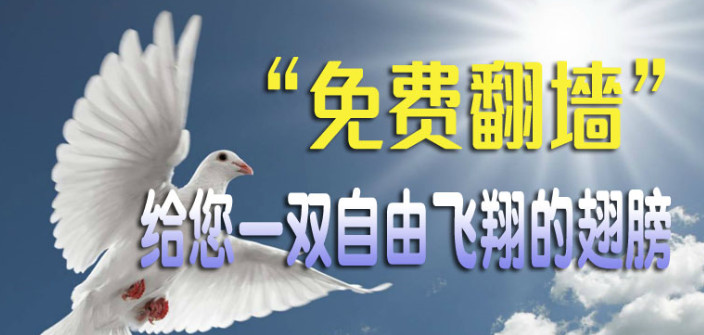

<h4>■ “翻墙”访问( 明慧网 http://www.minghui.org/ ),明慧网及时报道中共江泽民集团迫害法轮功的事实。联合国人权报告多次引用明慧网案例并要求停止迫害。突破网络封锁了解真相,<a href="https://git.io/op"> https://git.io/op </a>免费翻墙下载,请收藏此网址。</h4></td>  
</tr>
</table>

</td>
</tr>
</table>

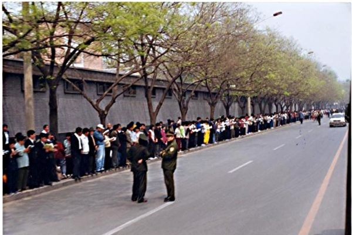
     

<h3 align=center><a href="https://git.io/tr"> 四•二五上访现场：和平理性的典范</a></h3>

<table>
  <tr>
 <td>  
  ► 上访群众都在街道一边，静静站立。</tr></td> 
   <tr>
 <td>  
► 和平、理性的上访人群，上访学员秩序井然 </tr></td> 
   <tr>
 <td> 
► 警察放松地闲聊，无任何压力</tr></td>
    <tr>
 <td> 
► 上访学员把盲道让出来，不影响行人，不阻碍交通</tr></td>
 <tr>
 <td>    
► 上访学员没有口号、标语，静静地站着</tr></td>
 <tr>
 <td>    
► 上访学员离开时，把垃圾都打扫干净</tr></td>
   
  </tr></td> 
   
  <tr>
 <td> 
 一九九九年四月二十五日，上万法轮功民众汇集到国家信访局所在的府右街附近。尽管人数众多，人群却出奇的安静，没有口号，没有标语，秩序井然，对当地居民的生活没有造成任何影响。而维持治安的警察这时候也觉得没什么事可做而开始闲聊。

从当时的中央电视台新闻画面和现场照片都可以看到，上访群众的身后，并不是中南海特有的红色围墙（见图）；而和上访群众隔街相望的才是中南海的红色围墙，以及中南海西门。众所周知，中南海的正门是面向长安街上的新华门。事实上，四月二十五日在长安街上并没有上访群众聚集。人群主要分布于府右街和西安门大街，并且无人聚集在中南海红色围墙的一侧。也就是说，民众没有「围」住中南海，更没有发生所谓「冲击」事件。事实上，如果发生了“冲击中南海”这样的政治大事，警察绝不会如此悠闲的在一边闲聊

</table>

 

 

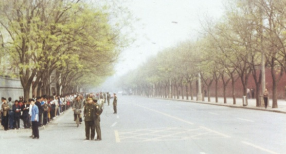

▲ 上访群众都在街道一边，中南海一边是一个人都没有，根本不存在什么‘围攻’

<table>
  <tr>
 <td> 
   <h3 align=center><a href="https://git.io/tr">四•二五上访的直接原因：天津警察抓人打人，拒不放人</a></h3>
   

   
   一九九九年四月十一日，当时的中共政法委书记罗干的连襟何祚庥在天津教育学院办的《青少年科技博览》杂志上发表文章，无中生有诋毁法轮功。四月十八日至二十四日，部分天津法轮功学员前往天津教育学院及相关机构反映实情。四月二十三日、二十四日，中共政法委书记罗干命令天津市当局出动防暴警察三百多名，驱散并殴打澄清事实的法轮功学员，并逮捕了四十五名法轮功学员。法轮功学员到天津市政府要求放人，被告知：公安部介入了这个事件，你们去北京才能解决问题。
 
 
   <h3 align=center><a href="https://git.io/tr">中共迫害在先，法轮功学员依法上访在后</a></h3>
  法轮功学员的上访极其和平理性，既没有大声喧哗，更没有阻塞交通。对中南海，他们既没有“围困”，更没有“攻击”，他们只是依法集体到信访办公室上访，而该办公室在中南海附近。中共江泽民集团为迫害法轮功，把法轮功学员的依法上访诬陷为“闹事”、“围攻中南海”，这是栽赃陷害。闹事的恰恰是中共。是因为中共迫害在先，才有法轮功学员依法上访在后。
  
 
  <h3 align=center><a href="https://git.io/tr">天津事件之前中共的打压迫害</a></h3>
  中共对法轮功的打压在一九九六年就已经开始。一九九六年六月十七日《光明日报》发表文章诋毁法轮功。一九九六年七月二十四日，中共中央宣传部下属新闻出版署向全国各省市新闻出版局下发内部文件，禁止出版发行《转法轮》、《中国法轮功》等书籍。一九九七年初中共政法委书记罗干指使公安部以先定罪、后调查的方式，在全国搜罗罪证欲构陷法轮功。一九九八年五月北京电视台《北京特快》栏目播放何祚庥对法轮功的诽谤。
  
 
 
  <h3 align=center><a href="https://git.io/tr">四•二五上访法轮功学员的三点诉求</a></h3>
  二十五日早八点十五分左右，当时的总理朱镕基一行人从国务院正门（西门）出来走过马路来到上访法轮功学员的面前。学员中响起了掌声。朱总理问：“你们干什么来了？谁叫你们来的？”

有许多学员说：“我们来反映法轮功的问题，没有人组织。”朱总理又问：“为什么不写信上访？怎么这么多人都在这儿？”

很多法轮功学员都在回答，有的学员说：“信都写的成麻袋了，还没得到回应。”朱总理说：“我对你们的问题有批复。”学员说：“我们没有收到。”（中共内部的政治打手阻挠所致）。总理让选几个代表进去进一步说明情况。

  <table>
  <tr>
 <td> 
  四月二十五日中午时分，法轮大法研究会的两位法轮功学员和其他三位北京学员作为代表进入国务院同政府官员会谈，申诉了法轮功学员的三点要求：</tr></td>
  <tr>
 <td> 
 ► 一. 释放被非法抓捕的天津法轮功学员</tr></td>
 
  <tr>
 <td>
► 二. 允许法轮功书籍合法出版</tr></td>
 <tr>
 <td>
► 三. 合法的炼功环境</tr></td>
  </table>
   
</td>
</tr>
</table>

 <h3 align=center><a href="https://git.io/tr">中共江泽民集团发动迫害是其邪恶本质所致</a></h3>

四•二五展示了法轮功修炼者的和平善良，广大法轮功修炼者对“真善忍”的坚信展示了法轮功创始人的巨大的道德感召力。而当时的总理朱镕基对此事的开明处理获得海内外的赞誉。这些都让汉奸出身、通过镇压六四学生起家的中共独裁者江泽民感到恐惧、嫉妒，强烈的妒嫉和恐惧使他失去了理智。

四月二十五日当晚，江泽民在没有征求任何人意见的情况下，模仿毛泽东发动文化大革命“炮打司令部”的做法，给政治局全体人员写了一封信。江在信中假装忧心忡忡地说：“难道我们共产党人所具有的马克思主义理论，所信奉的唯物论、无神论，还战胜不了法轮功所宣扬的那一套东西吗？”可见江泽民发动迫害的原因，绝不是法轮功做错了什么，而是因为法轮功教导“真善忍”的道德感召力。这封信随后被中央办公厅作为通知内部印发，并特别注明：请注意中央办公厅的通知要求的是：学习贯彻落实，不是征求意见、或讨论研究。

为了确保在政治局中推动这场计划中的大规模政治迫害，江泽民于六月七日又在中央政治局会议上就此讲话，该讲话于六月十三日在中共内部秘密传达。丧失理智的江泽民不顾其他六个政治局常委的反对，执意要迫害法轮功。

一九九九年六月十日，江泽民成立了所谓的“处理法轮功问题领导小组”，由李岚清任组长，罗干、丁关根任副组长，从中共中央到各级党委，都设立了所谓的“处理法轮功问题领导小组”，因其设立时间又叫“六一零办公室”。这是个类似文革时的革委会或纳粹时的盖世太保的恐怖组织，遍布各地各级政府，耗费纳税人的血汗钱，凌驾于法律之上，在各地操纵公检法、劳教所、监狱，并设立洗脑班，残害善良的法轮功学员，在过去十五年来臭名昭著、罪恶累累。

一九九九年六月十四日，中央信访办和国务院信访办公告在中国大陆的报纸、电台和电视台同时播出，表示从来都没有禁止任何功派。江泽民一伙一方面密谋迫害，一方面却以释放烟幕掩盖其犯罪企图。当时中共山东省官员在六月下旬就称两办公告是「缓兵之计」。

一九九九年七月二十日，中共江泽民集团开始全面迫害法轮功，实施“名誉上搞臭、经济上截断、肉体上消灭”、“打死算自杀”等灭绝政策；全国媒体铺天盖地的编造和散布各种谎言，如同文革再现。一时间，神州大地血雨腥风。

四•二五事件只是中共江泽民集团迫害法轮功的一个借口。在四•二五上访之前，中共内部的恶势力就一直在寻衅迫害法轮功，直接导致四•二五发生的天津抓人打人事件就是这样的一个事例。以中共及其独裁者江泽民的邪恶本性，即使没有四•二五，中共江泽民一伙也会找其它借口发动迫害，中共的“假恶斗”必然会与“真善忍”为敌，中共和江泽民集团也必然在迫害“真善忍”中丧尽民心，走向灭亡，历史正在见证着这一切。

法轮功修炼者不参与政治，对政权没有任何兴趣，也不会玩弄任何权谋。他们四•二五上访，是堂堂正正的维护道义良知。四•二五上访所展现的和平理性和无私无畏，一直贯穿于法轮功学员十五年反迫害、讲真相的历程中。四•二五上访所展示的道德勇气是中国社会道德回升的希望，是中国未来的希望。

 <table>
  <tr>
 <td width=880> 

<h3 align=center> <a href='https://github.com/mingop/f6f6dw/blob/master/video/zxcs_425_1_20090424_24343.mp3?raw=true'>► 请收听 1999年4月25日万名法轮功学员上访 .mp3 </a></h3></td>

</tr>
</table>

 

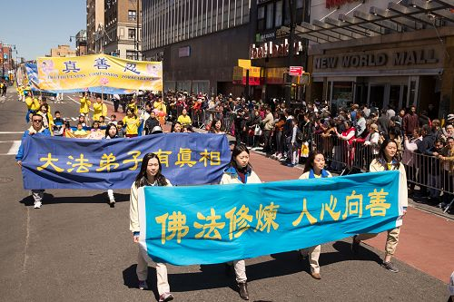

 <table>
  <tr>
 <td>
法轮大法的传出，从根本上唤醒人沉睡的善念，同时这些修炼者们在践行「真、善、忍」的实践中，实实在在地在带动了整个社会道德的全面回升。然而中共邪党是一个十恶不赦的邪教组织，对任何正面的、善意的行为都以最邪恶之心揣度。一九九九年七月，当权小人江泽民不顾国家、社会和人民的利益，一意孤行地发动对法轮大法的迫害，使无数善良的人蒙冤受难，其邪恶行径至今仍未停止。

近二十年来，中共江泽民政治流氓集团对法轮功的迫害真是罪恶深重。多行不义必自毙，在不久的将来，他们必将受到神佛及人间正义的惩罚！

在中国大陆，亿万名普通的百姓，只求拥有平淡如水的日子，踏实地工作和生活。然而，在暴政强权下，这种最基本的愿望竟成了一种奢求。十九年来，狂风和暴雨，卷走了多少鲜艳的花朵，压碎了数不清的幸福和梦想。暗夜里，浸著漫漫泪水，传来声声呼喊。

法轮功是修炼，对政权没有任何兴趣，也无意改变人类社会，但是这个按照“真、善、忍”修心做好人的巨大人群，是中国社会道德的基石，是社会道德回升的希望，是中国未来的希望。

大法修炼者顶着迫害和压力，向世人讲清真相，法轮大法是佛法。法轮功是被迫害的，大法修炼者在揭露迫害、制止迫害。

中共江泽民集团发动的对法轮功修炼者的迫害，将全中国拖入无边的黑暗。正直善良的公民被剥夺了说话的权利，成为被严厉镇压的对象。他们的基本人权被肆意侵犯，被虐杀凌辱，冤屈无处申诉。他们的家庭成员也受到无情的冲击和株连，个体与家庭的悲剧在大陆发生、蔓延，汇成整个社会的人权灾难。

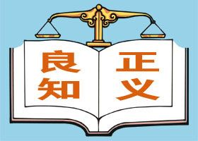

每一个听闻此事的人，都会扪心自问：善恶是非面前，我该站在哪一边？

多名大法弟子因信仰被活活残酷折磨致死的案例，上面有名有姓，还有具体事件的全部过程，都是执法人员干的。对法轮功这个信仰群体的迫害天理难容！

自1999年7月开始，中共江泽民集团倾举国之力镇压精神信仰团体——法轮功。广播、电视、报纸，铺天盖地地充满了诽谤法轮功的宣传。在诽谤的后面，是难以掩盖的疯狂和血腥。罪恶就在那片历经沧桑的土地上发生著。

<table>
  <tr>
<td>
	

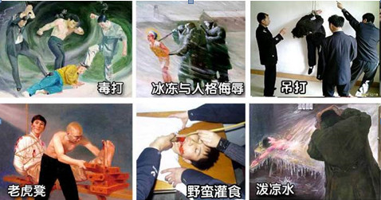

</tr>
</td>

<tr>
<td>
	▲ 上图为法轮功学员所遭受的部分酷刑。中共迫害法轮功学员不择手段，使用的酷刑达40种以上。每一天，都记载了正邪交战的惊心动魄；每一天，都见证了高贵心灵的坚忍不屈。
	
</table>

 ▬ 当年江泽民出于妒嫉，不顾六个常委的反对，独断专横，发动了迫害法轮功的政治运动，往法轮功身上泼脏水，制造「天安门自焚」伪案，煽动仇恨，欺骗民众，绑架全国人民参与迫害犯罪，用心险恶。告诉你真相，让你分清善恶，有个美好的未来。

▬ 中共喉舌媒体加工的自焚录像欺骗了众多世人，获奖影片《伪火》却在海内外广泛传播,无数民众正是通过了解“自焚真相”从而明了中共迫害法轮功的真实情况。

 
</td></tr>
</table>

 

<table>
<tr>
<td width=880 >

 <h3 align=center><a href='https://github.com/mingop/f6f6dw/blob/master/video/goodr2-s.mp4?raw=true'>► 一个曾经恶毒毁谤过大法的人含泪写下,一个佛教徒深深的忏悔 .mp4 下载 </a></h3>
	
 <h3 align=center> <a href="https://git.io/tr">一个佛教徒深深的忏悔</a></h3>

【明慧网二零一八年六月十日】〖大陆来稿〗我家住西南某城市，一九九三年上大学后对佛教产生了兴趣，经常看一些佛经，感到佛教就是真理，是自己的精神寄托所在。大学毕业工作后，又看了密宗等书籍，也曾经在书店里看见过李洪志师父的《转法轮》，当时随手翻了翻，并没有看明白。

一九九九年的时候，听说北京发生了法轮功修行人“围攻”中南海的事件，当时也不知道太多详情，只听别人说“组织严密”，那么多人上访，竟然地上一个烟头一张纸都没有，各行各业都“渗透”進去了，不得了不得了……当时也没太在意。后来就发生了江泽民发动的震惊世界的镇压法轮功的运动，铺天盖地的滚动播放着各种各样的谎言，很多佛教界的人士也纷纷紧跟形势，说话表态，全是攻击法轮功。

我也受电视里种种的谎言不断的影响。二零零一年，电视里突然又报导了震惊世人的“天安门自焚案”，看着电视里“自焚者”的惨状，我没有仔细的去想就盲目的接受了，忍不住恨的咬牙切齿，邪见越发加深。之后只是听说某某炼法轮功又被抓了，某某被单位开除了等等。

记不起来什么时候，QQ总是收到陌生人发来的信息，叫作《九评共产党》，当时根本看不進去，直接就对发信人破口大骂，恶语相向。虽然对“文革”、“大跃進”知道一些，对毛很反感，但对中共还是怀有一定的感情。后来上网多了，知道了一些强拆、下岗，更多的关于文革、土改、大饥荒的背后详情，了解到了邪共曾经砸寺院佛像，屠杀西藏僧人，甚至用重型轰炸机将寺院和喇嘛一起炸毁。因为我相信佛教的缘故，对邪共开始憎恶。

也记不起来是什么时候，谁给我的自由门和无界浏览软件，翻墙出去后，首先看到的就是动态网，慢慢开始了解到了更多的邪共黑恶历史和殴打、酷刑折磨迫害大法修炼者的事情，看到活摘器官的时候，完全不敢相信，连文章都没有勇气看完，看了个大概就赶紧关了，认为这肯定是“编造”的，只不过是“抹黑共产党”而已，是人怎么可能这么残忍？

但随着不断的翻墙，不断的了解到更多的信息，慢慢觉的这多半是真的，但在对邪共日益反感厌恶的同时，还是在中共谎言的影响下对大法师父和法轮大法产生了很多恶念。翻墙出去，从“大纪元”、“看中国”等新闻站点看到许多关于法轮功的正面消息，却总是以抵触的心理去衡量、去揣度，反而使自己的恶念越来越增长。

正所谓一念邪念念邪，因不相信法轮大法是佛法，所有看到眼里的听到耳里的都变成了“恶”的，心里的看法、嘴里讲的话全都对李大师、对大法、对大法修行人带着不敬的恶意。很多人听到邪共和江氏的罪恶，看到神韵带来的感动，听到大法修行人讲真相，看到大法修行人和平游行反迫害，听到看到对待大法不同选择造成的因果，甚至一些曾经迫害大法和大法弟子暂时受到恶报的人，很快都能厌离邪共，认同大法，从而走上光明之路，反而是我这样看过一些佛经，自认为懂得“佛理”的人，心就像铁石一般顽固。

恶念增长的同时，嗔恨、贪欲、执着，和由此引发的恶行也在不断的增长，有时候偶尔突然警觉一下：这样下去恐怕不行，但是念头很快就消失了，又恢复冷硬麻木。

从去年开始，我的口舌常常生疮溃疡，这里好了很快另一个地方又起，多吃蔬菜水果和维生素也不管用，虽然烦人但也不严重。今年二月份开始发作了一次严重的咽喉炎，喉咙仿佛挂着块玻璃，疼得晚上都睡不着，持续了一个星期才好，左脚也突然开始疼痛，虽然不严重但是缠绵不去。嘴上长了个疮虽然不重，但是一个多月都不愈合。而我的身体一向很好，一年都难得感冒一次，也让我一直自以为“信佛敬佛”，所以“福报好”。这些情况引起了我一点警觉，但也没有想到大法上面去。

今年五月份，邪共开始鼓吹马克思主义。这时候我总算生起了一丝正念，看到大纪元登载的关于共产主义的系列文章，难得的说了一句：好，支持你们。从这一念开始，事情发生了变化，我先是在微信空间里写下：我信神明，绝不接受马列唯物主义。

第二天，我无意中点开一个关于大法师父往事的回忆，几年前的文章，我看了有点小感动，随手发了个评论：当年被江泽民和共产党骗了。第三天，我不知怎的就点進了平时基本不去的明慧网，随手点开一篇文章，讲的是一个大法弟子以前是个坏人，学了真善忍大法以后，怎样做好人，被警察抓了。看后我心里为这位大法弟子的遭遇愤愤不平，随后打开的文章，越看越惊心，似乎把我冷硬的心打开了一个缺口，看到“大法弟子在监狱遭受迫害，仍坚持讲真相救度众生，让吸毒的犯人改过自新”的故事，我的眼泪不知不觉流了出来。这么多年终于对大法生了一个正念：这大法可以让人变好。

接下来几天，我饭也不想吃，觉也不想睡，就是不停的点开看明慧网的文章，看一个个大法弟子走过的历程，心已经不知不觉变的柔和，看到被病痛折磨多年的老人修炼大法恢复健康，看到一个大法弟子秉持李洪志大师教的无我无私、先他后我，把好的机器让给别人、自己用不好的，我心里突然一道闪电划过：这不就是佛法里的菩提心吗？经里所说吃亏的事情留给自己，好处让给别人，这样修行才能成佛。我自己看看就抛到一边，而大法弟子却在身体力行，到底谁才是邪的那个？

当看到大法弟子冯淑荣在狱中受到怎样的迫害而坚持修炼时，我终于忍不住泣不成声：五浊十恶的末世竟然能有这么正这么纯的修行人，换了是我，能做到百分之一吗？大法的弟子如此正如此纯，大法怎么可能不正？大法师父又怎么可能不正？

接下来，我一篇篇的看到不同的大法弟子，每一个都是那么坚韧、质直、柔和、善良、慈悲，在这毒恶的世间，受到了惨无人道的迫害，仍然坚持着自己的信仰，坚持着自己的慈悲，坚持着救度众生……我意识到自己以前犯下大错了，错得离谱，一错再错了好多年，不知不觉中已经造下了大的罪业。

法轮大法是正法！这样一个念头生起的瞬间，很多被自己有意无意置之脑后的东西突然涌了出来……一正一切正，心里认定法轮大法是正法，那么《九评》、三退、办网站等等其实都是师父降魔正法的大事业，只有降服魔鬼，才能够洪扬正法，救度众生。

佛教中说：看到别人做善事或者恶事，一念接受，心中就已种下了同样的善业或者恶业。一群人参与杀生，将共同感受杀生的罪业果报。那么邪党以党集体名义对法轮功造下的巨大恶业，入党前宣誓生死追随的人怎么可能不感受这个共业的果报？认为自己做好人，不用退党也可以，一群被绳子拴在一起的人掉進了水里，不割断绳索，水性再好又怎能不一起沉入水底？被共同业力的链绑缚的人，不选择退出邪党，怎么可能避免堕入恶道的命运？

古代一个城市迫害阿罗汉，用土将他埋住，巨大的恶业催发了全城人善业提前成熟，天空降下了金银财宝，就在人们得意忘形自以为是的时候，迫害阿罗汉的恶业开始显现，天空降下无边的灰土，将整个城市活活埋葬，而这些善根已被提前耗尽的人们，只能在恶道中承受漫长的痛苦煎熬，全城每一个人，只要对迫害罗汉圣者一事选择认同（包括袖手旁观），就已经被此恶业吞没。共产恶党这么多年造下无边巨大的罪业，江泽民发动的残酷迫害法轮大法和大法弟子的行动，更是捆绑全国人，即使选择冷漠旁观，也必定被此巨大无边的恶业所吞没。

而中国这几年经济的发展，生活水平的提高更加大了国人被邪党恶业吞没的危险，只要有一念觉的“共产党其实还不错”就已经产生了认同其所作所为的缘起。从佛理上说，就难逃罪业来临时的可怕果报。再一细想，那些对此滔天罪业选择默认的中国人、外国人，那些为从邪共捞取好处任其恣意妄为的人，那些表示支持邪共的人，都已经在不知不觉中选择了认同，从而被此共产巨魔的恶业所吞没。

当经济发展人们纵情享乐的时候，可曾想过那被毁灭之城曾经降下过的珍宝雨，当众生在纵情作恶、财富却似乎在增长的时候，有智慧的人知道这其实已经到了极其危险的时刻。天理巍巍，迫害法轮大法和大法弟子的如山罪业，过去造下的一切罪业，可能逃得过去吗？

在这个意义上说，共产主义巨魔就是来毁灭人类的——这一道理完全解释得过去，而且毁灭的不仅仅是身体，还有更加宝贵的灵魂也将一同被带入黑暗的无底深渊。因此世人已经别无选择，要么选择认同恶党，要么选择同化大法，两种选择，一念之间，一条通向毁灭，另一条走向光明。

在认同法轮大法为正法的当天晚上，想到自己已经造下了巨大恶业，我心中被巨大的压抑和恐惧充满，似睡非睡中半夜猛的醒来，突然产生了一个奇异的念头，大法师父就在我的房里，虽然我看不到他，但他一定在那里。这个念头生起的瞬间，我感觉身体被一股能量猛的涌入，难以形容的舒适和轻松，我知道我被大法师父加持了。这时我在心里生起一念，因为对大法一些问题还感到困惑难解，我想在心中表达一下我的一些看法，如果师父认同，就请用同样的方式加持我。

在后半夜里，我就这样向师父提出一个一个的问题，而师父就用一次又一次能量穿过我身体的加持来回答我，天亮的时候，我落泪了，心中的压抑和恐惧都已消失，全身感到轻松和安乐，我已经明白：大法师父就是最高的普贤王佛显现在人间，法轮大法是绝对纯正的佛法。

幸之又幸，我还有一丝善根，总算让大法师父在万丈悬崖的边上把我拉住了，不知什么时候，那缠绵不断的口疮已经悄然消失。

所以佛门的同修们啊，再不要做助魔毁佛的事情了，如果对大法实在不能理解，请小心守护自己的口业和意业，多做忏悔，你不经意说出的一句话，就可能毁掉你自己，毁掉很多众生，一念之差也可能决定着你今后漫长岁月中在茫茫苍穹里的位置，当你自以为自己有供养僧众、读诵经书、放生塑像的功德护佑的时候，你或许并不知道你已经对正法师父、正法本身和正法弟子群体造下了无边无际的毁谤罪业，而这绝不是一点小小功德可以抵偿得了的。

下载了大法师父的全部书籍后，我迫不及待的打开《洪吟》，以前我曾经时不时的念一下佛教咒语，念上一阵子会感觉一股清凉的气场环绕在周围，冷硬刚强的心也会稍微变的柔和一些，由于懈怠和懒惰，很快又放弃念诵，心很快又恢复原状。而一开始看《洪吟》，无需任何作意和观想，那种熟悉的清凉气场就立刻包围着我，打开大法师父的任何一本书都是同样的事情发生。

而当我写下这些文字作为对过去罪业的忏悔、以及希望能够帮助到还在执迷不悟中的其他人的时候，这气场也始终包围着我，让我的心灵柔和，让我的身体轻适。佛法中说，当一个人得到正法加持的时候，显现的验象是：这个人的烦恼执着在减轻，心变的柔和慈悲，身体也随之变的轻松和安宁。

有缘修炼法轮大法的修行人啊，你们是多么的幸运，多少生多少世的功德累积就为了这一时刻。大法师父所做的每一件事情，说出的每一句话，都包含着不可思议的天机和密意，你们在从事和進行着的是不可思议的宏大的救度苍穹全体众生的大事，你们承载着所有生命的希望，请努力、努力再努力。

顶礼大法师父、顶礼法轮大法、顶礼全体大法修行者。

一个曾经恶毒毁谤过大法的人含泪写下这篇文字。
	
	
	
</td>
 </tr>
</table>

 <table>
  <tr>
 <td>

 <h3 align=center> <a href="https://git.io/tr">幸得大法，重塑人生 </a></h3>

辱骂大法弟子，拒绝了解真相。深深地忏悔之前的所作所为。

	
【明慧网二零一八年八月五日】我曾经是一个深受党文化洗脑，对中共编写的历史深信不疑的人。甚至在学会翻墙上网，浏览墙外信息后，仍然辱骂大法弟子，拒绝了解真相。

有一天，我象往常一样，在网上谩骂法轮功学员，一个王姓大法弟子引起了我的注意，面对五毛的人身攻击，他并没有以牙还牙，针锋相对，而是耐心地向那些受中共毒害的年轻人讲真相、讲道理。他的包容、忍耐深深地让我折服。从此，我立场大变，坚信大法弟子都是好人。我从一个污蔑大法的人，变成了一个主动了解真相、了解大法的人。

我是一个医学生，但深信神佛的存在，读过东西方宗教的书，但这些法理都不是一般人能理解的，都不能使我真正了解这个宇宙，也无法回答我们从哪里来、到哪里去的问题。

后来，我翻墙找到了《转法轮》这本书，第一讲的一句“真正往高层次上带人”[1]就把我深深吸引了，修炼的目地不就是为了追求更高层次吗？于是我如饥似渴地读完了整本书，全书语言虽不华丽，但法理高深。得知李大师最初是用气功这一最简单的功法传法时，我又找出了师父亲自教功视频，学炼五套功法。

自从接触了法轮功，我没那么好斗了，也没那么焦躁了，心理更成熟了。

我深深地忏悔之前的所作所为，也感谢同修曾经对我的指点。我将会用真、善、忍这一宇宙最高标准严格要求自己，重塑人生。

注：
[1] 李洪志师父著作：《转法轮》
	
</td>
  </tr>
</table>

<h3 align=center><a href="https://git.io/tr">大批民众按手印　挺身声援反迫害</a></h3>

在长达十九年的迫害中，法轮功学员不畏强权，无惧暴力，以真实对谎言、以和平对暴力、以善良对残酷，锲而不舍的向世人澄清事实，讲明真相，揭露中共编造的谎言，启发人们的善念良知，真相已大白于天下。更有无数的世人被法轮功学员们真诚、慈悲与坚定的信仰所感动，甚至加入反迫害的行列。

近年中国民众制止迫害之声也持续不绝，与迫害初期的不敢吱声迥然不同。二零一二年二月二十五日，因修炼法轮功的王晓东被非法抄家、绑架、抢劫及抓捕，河北省沧州地区泊头市富镇周官屯村全村三百户各派一名代表在呼吁书上签名，要求市检察院释放王晓东，此联合签名按手印的请愿书引起中共中央政治局的震动。

 

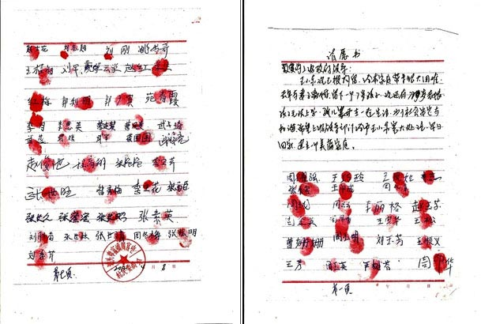

 
▲ 河北省泊头市富镇周官屯村三百多户村民联名按手印、加盖公章要求释放法轮功学员王晓东，撼动中共中央政治局。

<h3 align=center><a href="https://git.io/tr">七百多位民众自发联名声援营救法轮功学员李兰奎</a></h3>
二零一二年六月七日，河北省正定县法轮功学员李兰奎被“六一零”人员绑架到正定县看守所，再被转到石家庄市洗脑班关押迫害。中共警察肆意迫害好人的恶行，引发了正定县很多百姓的强烈不满，七百多位民众集体自发联名声援营救被绑架的李兰奎。

 

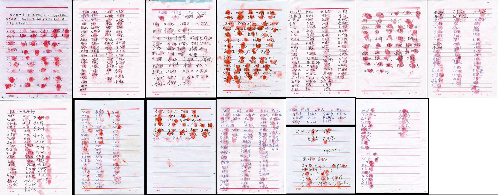

<h3 align=center><a href="https://git.io/tr">大规模民众联名上书，声援营救法轮功学员</a></h3>
大规模民众联名上书这样的事件在中国越来越多，河北唐海县五百六十二位村民按手印，支持释放法轮功学员郑祥星；黑龙江则有一万五千民众为素不相识的法轮功学员挺身而出，站出来支持当地替父鸣冤的秦荣倩，在她的《喊冤昭雪书》上签名并按上大红手印。秦荣倩的父亲秦月明，因坚持信仰法轮功而被当局关在监狱中酷刑折磨致死。

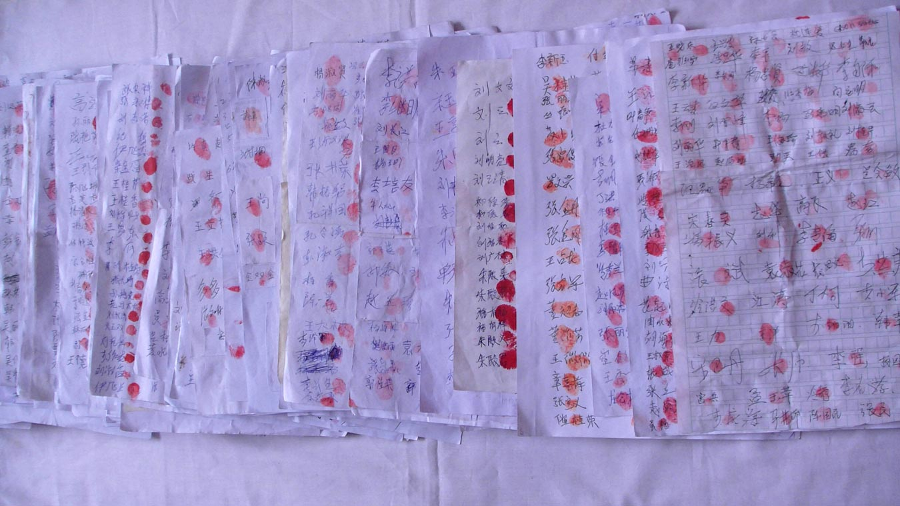

▲ 黑龙江省有超过一万五千民众为素不相识的法轮功学员挺身而出，在替父鸣冤的秦荣倩的《喊冤昭雪书》上签名并按上大红手印

 

▲ 全球逾百万民众签名要求制止中共迫害法轮功

 <table>
  <tr>
 <td>
<a href="https://git.io/tr">
■ 前年法轮功学员周向阳的家乡河北省秦皇岛昌黎县，约两千三百位善良民众联名支持其申诉，在当局把周向阳的妻子李珊珊抓走后，又有五百多民众联名救助。大批村民选择支持无辜受迫害的法轮功学员，是中国民众面对中共暴政，挺身选择正义的壮举，也是人心觉醒及全民反迫害的发轫。

■ 中共炮制自焚伪案，只突显了自身的愚蠢无知。随着真相广传，人心日渐觉醒，自二零零四年十二月开始，迄今已有三亿多万有识之士退出了中共的党团队组织，现在正以平均每天有数万多人退党的速度逐步解体中共。曾经为虎作伥、助纣为虐的人们应该慎思明辨，早日分清正邪与善恶，为自己选择光明美好的未来。</a>
 </td>
 
  <table>
  <tr>
 <td> 

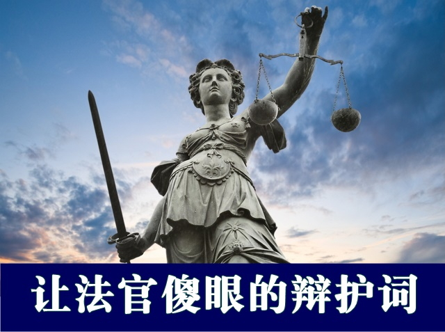

 
<h4>■ 正义律师的辩护，震慑了在场的所有中共司法人员和旁听席上的中共政法委及国保系统人员，他们全都静静的听着，没有一个人出声打断。

<a href='https://github.com/mingop/f6f6dw/blob/master/epub/55k.epub?raw=true'>► 1.请下载【禁闻】周向阳案 律师庭辩震慑办案人员 .epub
</a>
<a href='https://github.com/mingop/f6f6dw/blob/master/epub/hgty48.epub?raw=true'>► 2.请下载【 让法官傻眼的办证词 】.epub </a></h4>

</td>
 
</tr>
</table>

<table>
<tr>
<td> 手机版ePub电子书，推荐使用 Reasily-EPUB 阅读器，可以观看视频、音频、图文。<a href="https://github.com/mingop/f6f6dw/blob/master/book/open-epub.txt?raw=true">请在此下载( 如何开启epub说明 ). txt</a>

 
<a href="https://github.com/mingop/f6f6dw/blob/master/book/Reasily-epub-1802h.apk?raw=true"> 请在此点击直接下载Reasily-EPUB 阅读器</a>

 		
</td></tr>
</table>

<h2 align=center><a href="https://git.io/waaa">北加州教功班 学功者挤满大会议室</a></h2>

【明慧网二零一八年七月十二日】（明慧记者王英美国加州佛利蒙采访报道）七月十日星期二晚，北加州佛利蒙图书馆（Fremont Library）的大会议室依然灯火通明，人们在聚精会神的学习提高身心健康的性命双修功法──法轮功。

 学员在图书馆入口处派发传单 

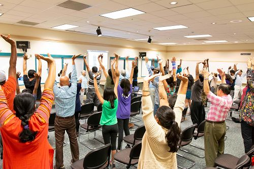

  新学员在学炼第一套功法

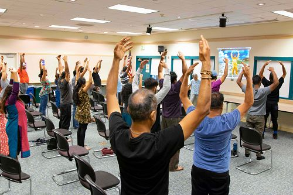

 新学员在学炼第三套功法 

这是首次晚上在佛利蒙图书馆举办法轮功教功班。开班前，学员们对有多少人会来学功没有多少把握。毕竟这不是在周末，人们会不会在紧张的工作后赶来参加教功班？

学员先摆放了十把椅子。离教功班七点还差十分钟，就有学功的人走进来坐在椅子上。之后进入会议室来学功的人潮不断。学员忙着不停地加椅子，最后加到了近五十把椅子，已经到了这个会议室的人数限制。

法轮功学员梅（May）介绍说，前几天我们就在图书馆派发教功班的传单，今天带来的传单很快就发光了。

法轮功教功班在佛利蒙图书馆已经连续举办了几个星期。人们对能帮助减缓压力，提高身心健康的法轮功非常有兴趣。

<b>初学者：感到心旷神怡，非常美妙</b>

“我的思想中没有了杂念，感到心旷神怡，非常美妙。”格娅丝芮（Gayathri）参加学功班后说，“今天的教功班非常好，非常宁静平和，我学到了如何让我的身神合而为一。”

格娅丝芮表示，工作了一天，非常紧张。学了一个半小时的功，她感到非常放松、宁静。

“我还感到能量，身体发热，尤其是当我做伸展的动作时，我感到能量通过身体。在做叠扣小腹时，我感到发热，我想这是能量在我的体内在做功，非常好。我马上就感到有明显的效果，这就让我想要继续炼下去。”

她表示，回去后准备在网上下载《转法轮》，“我绝对想继续学法轮功。”

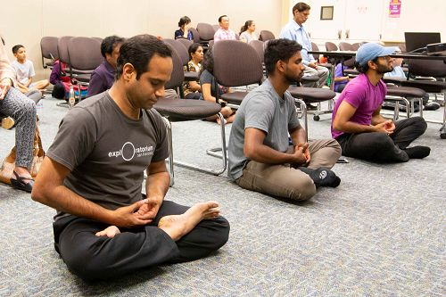

 新学员在学炼第五套功法 

<b>计划回去阅读法轮功的书籍</b>

“真是美妙无比，非常强大”，另一位新学员尼尔（Neel）说，“当我的手上下移动时，我感到能量。我计划回去阅读法轮功的书籍《转法轮》。”

刚下班就来参加教功班的祖斌（Zubin）炼得非常认真。他说，这个功法会让人放松，他现在就感到非常放松。他说：“我感到这是一个非常好的功法，每天炼下去，会增加人的神性，也会增加智慧。我会找时间在早上炼。总之我非常喜欢，我会试着炼下去。”

“我现在感到比原来好多了。”学炼法轮功后，苏德希（Sudse）说，“我已经感到不一样了，我感到身心放松。这种缓慢的动作，让我松弛下来，非常好。”

苏瑞什（Suresh）说，他非常喜欢这个功法，非常好。这是他第一次尝试炼法轮功，他表示，要常炼法轮功。他尤其喜欢法轮功的原则真、善、忍。

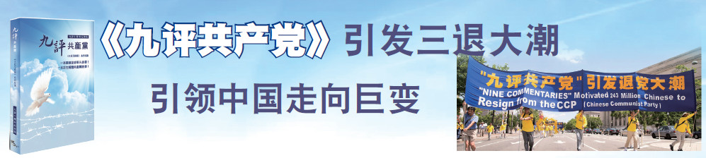

<table>
<tr>
<td>
2004 年11 月，海外中文媒体“大纪元时报”发表《九评共产党》，从历史、政治、经济、文化、信仰等层面深刻揭示了中共的欺骗、暴力、邪教和流氓本性，由此引发了波澜壮阔的退出中共党、团、队组织（三退）的精神觉醒运动。<a href="https://git.io/9p9p">下载《九评共产党》https://git.io/9p9p </a></td>
</tr>
</table>

<h2 align=center><a href="https://">省公安厅人员“三退”</a></h2>

【明慧网】越来越多的中国民众看清了中共（中共不等于中国）的邪恶本性，选择“三退”（在海外退党网站发表退党、退团、退队的声明）。

<b>省公安厅人员“三退”</b>

〖辽宁来稿〗我曾是一家私企公司的企业法人，在我讲“三退”（退党、退团、退队）保平安的过程中，已经同意“三退”的有省纪委领导、有市政府领导、有法院的、有部队军官、有回家探亲的海军军官、还有海航部队的军官等等。

一次我在讲真相时，对面走来一对五十多岁的中年夫妻，我微笑着和他们打招呼后就开始全面讲法轮功真相。最后我问男士，看你气质很好，象个有身份的人，一定入过党团队吧？他说都入过，边说边从兜里掏出工作证件翻开给我看，并说你看我是干啥的？我看证件上写着，省公安厅。我说你在省公安厅工作呀！我知道中央党校，有二三十党员集体在国外大纪元网站的全球华人退党中心声明退党。你不用去哪个部门退，也不用你花一分钱，你只要对上天说：我声明退出党团队，我就能帮你在全球华人退党中心用化名安全退出（中共的党、团、队组织），你照样做你的领导，当你的官。灾难来时就能平安度过。何乐而不为呢？

他听明白了说：好！我退（出党、团、队）。然后他妻子也欣然同意退出共青团、少先队组织。

<b>男士说：“现在共产党一锅黑，实质已经垮了！”</b>

〖山东来稿〗我给一位男士讲法轮功真相，并问他：“‘三退’保平安你知道吗？”男士说：“知道。”我说：“共产党迫害法轮功将近二十年了，使无数好端端的家庭妻离子散、家破人亡，现在仍然在迫害。”

男士说：“共产党已经失去民心了，它就象一棵枯树一样，从树根到树枝都烂透了。”

我说：“共产党迫害修真、善、忍的法轮功群众，失去了民心。就连习近平及其家人都被共产党迫害过，习近平的父亲习仲勋在文革期间，被共产党挂着‘反党分子习仲
勋！’的大牌子，被红卫兵揪斗！习近平九岁被打成狗崽子，十三岁带着大铁帽子游街，十六岁去农村了……”

男士说：“习近平想把共产党这破玩意儿挽救回来是不可能的！人心都烂了。他不是说两句好听的，共产党就变好了，就什么都搞上去了；权力能握到手里，可腐烂的人
心是握不住的。现在共产党一锅黑，实质已经垮了！”

<h2 align=center><a href="https://">退休军官“三退”后 癌症没了</a></h2>

【明慧网】“三退”保平安、“三退”有福报的故事在大陆广为流传，看看下面的几个例子：

<b>近九十度罗锅直起了腰</b>

〖大陆来稿〗我是医生。一次，我接诊了一位腰弯曲近九十度的七十八岁老年患者。他患腰椎间盘突出几十年了，随着年龄增加，腰痛得越来越厉害，实在痛苦难忍。

那日，家属带老人来就诊，患者痛苦不堪，不停流泪。我看了相关检查后，医学上，除了手术，无其它办法。外科大夫会诊后，考虑患者内科疾病严重，无法手术，建议保守治疗。

老者住院期间，我看他痛苦不堪很可怜，就告知他法轮功（法轮大法）是佛法，是救人的，他是六十年党龄的老党员，由于受中共宣传的影响，他开始不想退出共产邪党的党、团、队组织，我有时间就慈悲地继续给他讲法轮大法好的真相，最后他听明白了，高兴地同意“三退”，并诚心默念“法轮大法好，真善忍好”。

几天后，老者的腰渐渐直起来了，一家人特别感激，高兴地办了出院手续。从那以后，每次进城，老人都要来看看我，特别感谢我。我告诉他，你感谢我师父吧，是师父帮你拿掉了你身上的顽疾。

<b>退休军官“三退”后 癌症没了</b>

〖大陆来稿〗我的一位亲戚是部队转业干部，在当地医院诊断是肺癌，并被建议到权威医院进一步诊断。经权威医院确诊是肺癌，建议立即手术治疗。

消息传开，来病房探视安慰的人实在不少，问候的、安慰的、献策的、出主意的都很多。我前去探望，向他讲述法轮功的真相及“三退”保平安的意义，终于打动了这位军人出身的老干部，当即同意“三退”。送我走时，在走廊里他举起双手大声喊出了：“法轮大法好！”周围的人都吃惊地看着他……

亲戚全家商量决定去省城医院治疗，那里有老战友可以提供方便。当家属子女陪其住进省城医院，进行手术前检查时，却被告之没患癌症。全家人又惊又喜，为了慎重起见，又回到当地医院去复查，结果同样是“癌症没了”。

 <h2 align=center><a href="https://">烧伤面积90%以上两个多月痊愈，你活着就是一个奇迹</a></h2>

【明慧网】二零零五年八月十日，丈夫的同学黄树成被汽油全身烧伤，烧伤面积达到百分之九十以上，只有私处没有烧到。

他被送到鸡西市人民医院就医时，全身颤抖痛苦难忍。入院被安排到单独的房间，只留一个陪护人员，即他的妻子。当天我和他的家属到医生办公室咨询治疗，我问医生：“他要治疗好这个病得需要多少钱？”医生看着我回答说：“不是多少钱的问题，而是能不能保住性命的问题，根据以往经验，这种情况患者七天后将出现肾衰、脱水、全身器官衰竭将导致死亡，你们家属要有这个准备。”

我回到病房，看到痛苦呻吟的病人正在烤电，我直接问：“如果你能听我的话保证你会好，因为我有一个偏方。”他在抱有一线的希望下说：“如果能让我好起来，让我干什么我都能扛得住。”

我说：“因为老天要灭中共，退出党、团、队组织就平安了，三尺头上有神灵，以后就有神保护你了。下一步你开始念：‘法轮大法好，真、善、忍好’。心诚敬念才好使”。他痛快地答应了。

我帮他上网退了“共青团、少先队”，并给他买了一个录放机，播放法轮功音乐《普度》、《济世》，每次去看他都见他嘴里嘟囔着（在念“法轮大法好”）。

他告诉我，他念“法轮大法好”身体特别舒服，身体感到疼痛时他就听法轮功音乐《普度》、《济世》，就这样病情逐渐好转。

有一次医生查房看到他恢复的这样快很是吃惊，说：“你活着是一个奇迹，你死了在我们医院是很正常的事。因为我们从建院到现在从没有抢救过来百分之九十以上烧伤的病人，没有活过来的。”

两个多月后，他痊愈出院了，面部及全身没有大的疤痕，与正常人差别不大。他的妻子、儿子、父母看到在他身上出现的神奇，也都相信法轮功，并且都“三退”了。◇

 <h2 align=center><a href="https://">明真相者亲历之事</a></h2>

【明慧网二零一八年七月二十五日】我今年六十岁，看过许多法轮功学员发的真相资料，了解了中共对法轮功的迫害真相后，深感中共太邪恶了，退出了中共的党团队组织。

以前我身体小病不断，还有三高。自从念了“法轮大法好，真善忍好”以后，各种小病不见了，三高也没有了。尤其最近还发生了一件神奇的事情，令我终生难忘。

今年五月初七，我骑摩托车去看望九十岁的岳母，回来时骑摩托车到一村庄拐弯上公路的地方，由于视线不太好，我心里就一直默念“法轮大法好，真善忍好”，忽然看到前面有一辆半挂大货车突然朝我飞快驶来，当时我就惊呆了。就在货车行驶到与我相差不到两米的距离时，我眼前突然出现一位金光闪闪的小佛。只见他用双手向大货车一推，货车一下就改变了行驶方向，往旁边驶去。事后司机说，当时他都吓得说不出话来，他说车子象是撞到了大树一样，那个力量太大了，所以车子一下就斜向路边去了，你可真是福大命大啊！要不然这么短的时间内这货车根本就刹不住，你也就没命了啊！我说这是我平时念“法轮大法好，真善忍好”得到的福报，是法轮功师父救了我的命。感谢法轮功师父！

这是我的真实经历，我深深体会到了法轮大法的神奇，法轮功师父的慈悲伟大！共产党一贯宣传的“无神论”是骗人的，世上真有神佛，法轮大法是救度世人的佛法，希望同胞们不要迷信中共的谎言宣传，善恶有报是天理。多了解一下法轮功真相，退出中共邪恶的党团队组织，才会获得神佛的护佑！

<h2 align=center><a href="https://">一个派出所警察的退党声明</a></h2>

【明慧网二零一八年七月二十五日】二零一八年七月二十二日，大纪元退党网站刊登了一个黑龙江省警察的退党声明，该警察曾多次参与迫害法轮功学员，然而学员并没有记恨他，而是为他着想，再相遇时，善意地劝他退出邪党保平安。该警察被学员无私的境界所感动，同时看清了共产党已腐败到没有希望，决定退出曾经加入过的党、团、队。

以下是该警察的退党声明：

“我是派出所的刑警，多次参与迫害法轮功学员。近日遇见我们曾经迫害过的法轮功学员，他说我不记恨你，我知道你是个有良心的警察。咱们都是炎黄子孙，我真心希望你幸福平安。中共恶党迫害佛法、迫害信仰‘真善忍’善良的好人，会有恶报的，况且中共恶党贪污腐败、祸国殃民，你也是有目共睹，别随恶党陪葬，快三退保平安吧。我知道中共恶党的腐败，没有希望了，我们所最近提拔一个所长，听说花了一百万买的官。我曾经迫害过的法轮功学员，还善良的为我着想，让我感动。我退出中共党、团、队组织，再也不迫害好人了。”

法轮功学员是一群善良、和平的好人，共产党不只腐败，还污蔑、迫害好人，越来越多的人看清了它的邪恶本质，做出了自己良心的选择。

<table>
<tr>
<td><h2 align=center><a href="https://">抓紧时间 了解真相 脱离中共 神保平安</a></h2>

【明慧网】有句话说：危险并不可怕，可怕的是，当巨大的险情来临时却不知道，这才是最让人痛惜的。

当今的中国，正面临着巨大的险情。

古今中外的众多预言，虽然出自不同的文化和地区，跨越不同的时代，却都预言了中国的朝代更迭、中共的产生与灭亡，及人类此时将有大劫之忧，预言了即将在中国发生的一件惊天动地的大事：天要灭中共，以及天灭中共时其追随者将被一同诛灭的可怕惨景！

2002 年6 月贵州省发现的“藏字石”上写着“中国共产党亡”，这是天意。为什么天要灭中共？中共建政以来，周期性的政治运动迫害了中国一半以上的家庭，造成了8000 万中国同胞丧生，这个罪大不大？从1999 年开始，对几千万法轮功学员进行血腥迫害，甚至活摘法轮功学员器官贩卖牟利，这个罪大不大？中共祸国殃民已经是人神共愤，上天还能容它吗？！

那么，法轮功教导人们按照“真、善、忍”做好人，在祛病健身方面有神奇的效果，目前已弘传世界100 多个国家和地区，主要著作《转法轮》被翻译成30 多种语言全球发行。

佛法能度人。法轮功修炼者告诉人们法轮大法好，退出中共的组织，是在救人。不求回报，不为权力，不为政治，只为您平安，能躲过天灭中共的大灾难。

截至2018 年8 月，3 亿 1 千多万中国人明白真相后退出了共产党、共青团和少先队组织（简称“三退”），其中包括许多中共高级官员用化名“三退”。“三退”不是在组织内退，是在全球最大的华人媒体“大纪元”的退党网站上声明，对您没有任何风险。现在每天“三退”人数平均在10 万人，您可以用翻墙软件到大纪元的退党网站追踪查看。
可能有人说：“我思想中早退了，我也不交党费了。” 也有人说：“早就超龄自动退队退团了，不必走形式了。”但那是不算数的，不是神认可的。因为您加入党团队时，在血（红）旗前发了把生命献给恶党的毒誓，就是把生命交给它了，就被打上了“兽记”，所以凡是曾经入过党、团、队的人都要主动声明退出来，有行为的表示才能除掉这么大的毒誓，才能在天灭中共的时候保平安！

俗话说，宁可信其有，不可信其无。说一声“退”你毫发无损，也不费一分钱，却得到了个生命大保险，何乐而不为呢？！爱自己的亲朋好友，那么就劝他们也都退出中共组织。在世上，没有比生命更可贵的了。
当您与亲友们在天灭中共的大灾难中平安脱险的时候，一定会为接受今天的建议和提醒而感到万分幸运。◇

</td>
</tr>
</table>

2002年6月，贵州省平塘县掌布乡的一位村民，在掌布风景区发现一块巨石，石面上有排列整齐的六个大字：“中国共产党亡”。经三路专家前往考察，这块巨石距今已有2亿7千万年，500年前从高崖上落下来，断成两块，字在右边那块巨石上，清晰可辨。又经鉴定，这些字都是天然形成的，没有任何人为加工的痕迹。当时国内一百多家媒体，包括新华社、中央台都有过报道，网上也能搜索到相关照片，当然，这些媒体都不敢提最后那个“亡”字，但从照片上可以看出来。

千百年来的中国，在要出大事之前就一定有奇事发生，老天或以瑞兆示吉，或以凶相警世。今天，贵州平塘的“藏字石”是否也在向人们预示着天机呢？突现标语“中国共产党亡”，非同小可，绝非偶然。“藏字石”是天机,预示”天要灭中共”,入过党、团、队员的 都要赶快退出来,免得跟他陪葬了。

天然形成这六个字，还按照顺序排列，如此奇妙的巧合，只能说是天意。历代王朝的败象，都没有腐败到象中共政权这样猖狂；历代王朝的灭亡，都要带走它的追随者殉葬。当天灭中共的劫难降临之时，不要怨上天没有预警：奇石就是明证！

<h2 align=center><a href="https://">【人心觉醒】</a></h2>

<h2 align=center><a href="https://">公安局领导：“送回原处，还叫他去救人”</a></h2>

〖河北来稿〗2018 年5 月22 日我去学校给学生讲“三退”（退党、退团、退队）保平安的真相，当天，很多学生在门前玩，经过我讲解后有十几个人同意“三退”，我还没讲完警车就来了，我被绑架了，有不明真相的人举报了我。

到了派出所，一民警说：你坐那儿，你是哪里人，叫什么名字？我先声明说：我没有违法，我若回答你这些问题就是叫你犯罪；你不要按犯人来对待我，我没有犯法，我来是你们请来的，你们想得救，唯有明白法轮功真相、做了“三退”，才会得到上天的护佑。然后我心平气和的讲了江泽民迫害上亿法轮功修炼者，迫害致死很多大法弟子，这种滔天大罪震怒了上天所有的神，它如何担起这个大罪……

我大约讲了两个小时，那个民警一直在听。这时来电话了，原来，他们已经上报公安局，我听到电话里说：把他还送回原处，还叫他去救人。那个警察一下傻了，让我走。我说：我是你们请来的，你的领导不是让你把我送回原处去吗？

我又被送回原处继续讲 “三退”保平安的真相救人，又劝说几个人“三退”后，平安地回家了。

5 月24 日，我去了另一所小学，在门前讲“三退”保平安的真相救人，当时劝退了十几个学生，这时学校的校长出来了，他上前推我说：“你不走我就报警。”他真打了110，电话打通了还问了他地址。我继续向那位校长劝善说：周永康、薄熙来、李东升这些迫害法轮功的不都抓起来了么，法轮功在中国其实是完全合法的，下边的谁参与迫害法轮功也照样违法，共产党完了，不要抱着它的大腿去陪葬。他一看报了警警车也不来，他傻了。

这时候来了一群围观的人，一圈人都看着他。这时有个妇女四十来岁，指着校长说：“你得向他学习（指向我学习）。”校长笑了。有的人当时要法轮功护身符，大家
都笑了，都散开了。

通过这两次事情我体会到警察、公安系统也有很多的人明白真相后根本就不参与迫害法轮功了，是中共邪党一言堂的谎言毒害了世人，随着法轮功真相越传越广，迫
害已经走入穷途末路。

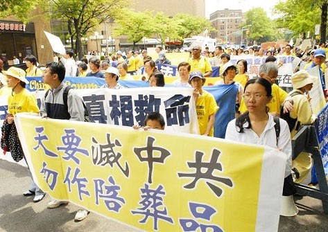

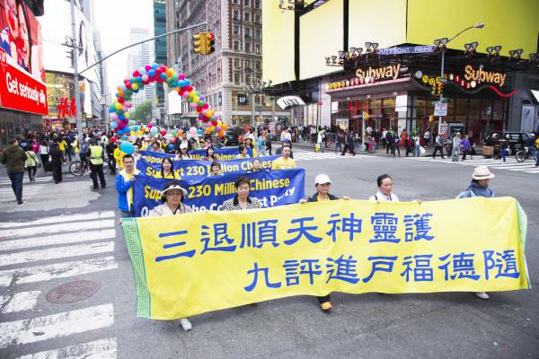

<h2 align=center><a href="https://">退党、退团、退队（三退）方法</a></h2>
<table>
<tr>
<td>
三退（指退出中共党、团、队）声明，是发表在全球最大的华人媒体大纪元的退党网站上。　

截至2018年3月为止，已有超过3亿中国同胞声明三退，为自己选择了平安。您可选以下任一种方法声明三退：　　

 
◆  可使用真名、化名、小名（三退）  
◆  用海外邮箱发表声明tuidang@epochtimes.com  
◆  用翻墙软件登录http://tuidang.epochtimes.com  
◆  免费翻墙软件下载: https://git.io/ysys 请妥为收藏。 
◆  退党电话：001-416-361-9895或001-888-892-8757   
◆  退党传真：001-510-372-0176或001-201-625-6301  
◆  可利用出国的机会，在国外将三退声明通过上述方式发表或交给退党服务中心义工。   
◆  如何“三退”，请点击退党网站 https://git.io/tv123  
█ 提示：由于恐惧，中共对退党热线做了手脚，如从中国拨打接通后听到：“这是空号。”请别上当，不挂电话很快就能接通。

</td></tr>
</table>

<table>
<tr>
<td width=500 ><a href="https://github.com/mingop/f6f6dw/blob/master/book/flg23.epub?raw=true" target="_blank">【 中共活体摘取法轮功学员器官br群体灭绝性大屠杀 】</a></td>
<td width=380 ><a href="https://github.com/mingop/f6f6dw/blob/master/book/flg23.epub?raw=true">(图文、视频、音频).下载(epub) </a></td></tr>

<tr>
<td width=500><a href="https://github.com/mingop/f6f6dw/blob/master/book/cji59.epub?raw=true" target="_blank">【 渝妇被活摘器官时逃生 】</a></td>
<td width=380><a href="https://github.com/mingop/f6f6dw/blob/master/book/cji59.epub?raw=true"> (图文、视频、音频) .下载(epub)</a></td></tr>

<tr>
<td width=500><a href="https://github.com/mingop/f6f6dw/blob/master/book/fdfd23.epub?raw=true" target="_blank">【 见证中国活摘器官是真实 】</a></td>
<td width=380><a href="https://github.com/mingop/f6f6dw/blob/master/book/fdfd23.epub?raw=true"> (图文) .下载(epub)</a></td></tr>

<tr>
<td width=500><a href="https://github.com/mingop/f6f6dw/blob/master/book/jco12.epub?raw=true" target="_blank">【 武汉数十名大学生神秘「蒸发」 】</a></td>
<td width=380><a href="https://github.com/mingop/f6f6dw/blob/master/book/jco12.epub?raw=true"> (图文) .下载(epub)</a></td></tr>

<tr>
<td width=500><a href="https://github.com/mingop/f6f6dw/blob/master/book/ytuu89.epub?raw=true" target="_blank">【 江绵恒换肾与中共权贵 活摘器官续命内幕 】</a></td>
<td width=380><a href="https://github.com/mingop/f6f6dw/blob/master/book/ytuu89.epub?raw=true"> (图文) .下载(epub)</a></td></tr>

<tr>
<td width=500><a href="https://github.com/mingop/f6f6dw/blob/master/book/ass56.epub?raw=true" target="_blank">【 大陆器官乱象背后 挑战人类道德底线 】</a></td>
<td width=380><a href="https://github.com/mingop/f6f6dw/blob/master/book/ass56.epub?raw=true"> (图文) .下载(epub)</a></td></tr>

<tr>
<td width=500><a href="https://github.com/mingop/f6f6dw/blob/master/epub/qu6.epub?raw=true" target="_blank">【 我被马三家秘密投入男牢的遭遇 】</a></td>
<td width=380><a href="https://github.com/mingop/f6f6dw/blob/master/epub/qu6.epub?raw=true">  (图文、视频) .下载(epub)</a></td></tr>

<tr>
<td width=500><a href="https://github.com/mingop/f6f6dw/blob/master/book/hgty48.epub?raw=true" target="_blank">【 让法官傻眼的办证词 】</a></td>
<td width=380><a href="https://github.com/mingop/f6f6dw/blob/master/book/hgty48.epub?raw=true">  (图文、视频) .下载(epub)</a></td></tr>

<tr>
<td width=500><a href="https://github.com/mingop/f6f6dw/blob/master/book/3wjo1.epub?raw=true" target="_blank">【 顺天意得平安 】</a></td>
<td width=380><a href="https://github.com/mingop/f6f6dw/blob/master/book/3wjo1.epub?raw=true">(图文).下载(epub)</a></td></tr>

<tr>
<td width=500><a href="https://github.com/mingop/f6f6dw/blob/master/epub/like-s.epub?raw=true" target="_blank">【 喜得大法 绝处逢生 】</a></td>
<td width=380><a href="https://github.com/mingop/f6f6dw/blob/master/epub/like-s.epub?raw=true">(图文).下载(epub)</a></td></tr>

<tr>
<td width=500><a href="https://github.com/mingop/f6f6dw/blob/master/book/kks-ed.epub?raw=true" target="_blank">【 传奇人生 】</a></td>
<td width=380><a href="https://github.com/mingop/f6f6dw/blob/master/book/kks-ed.epub?raw=true">(图文、音频).下载(epub)</a></td></tr>

<tr>
<td width=500><a href="https://github.com/mingop/f6f6dw/blob/master/book/425-20.epub?raw=true" target="_blank">【 “四‧二五”中南海万人上访真相 】</a></td>
<td width=380><a href="https://github.com/mingop/f6f6dw/blob/master/book/425-20.epub?raw=true">(图文).下载(epub)</a></td></tr>

<table>
<tr>
<td> 手机版ePub电子书，推荐使用 Reasily - EPUB 阅读器，可以观看视频、音频、图文。<a href="https://github.com/mingop/f6f6dw/blob/master/book/open-epub.txt?raw=true">请在此下载( 如何开启epub说明 ). txt</a>

 
<a href="https://github.com/mingop/f6f6dw/blob/master/book/Reasily-epub-1802h.apk?raw=true"> 请在此点击直接下载Reasily-EPUB 阅读器</a>

 		
<a href="https://git.io/trtptp"> 更多epub真相,请在此 https://git.io/trtptp 下载</a>

</td></tr>
</table>
</table>

<table>
<tr>
 <td>
  <h3 align=center><a href="https://git.io/tr">◆ 所有的中国人都是受害者 ◆</h3>
 
 
■ 为维持这场迫害，中共江氏集团采取了系统的、全方位的掩盖真相来剥夺老百姓的知情权：一边倒的媒体宣传，互联网上的消息封锁。几乎每一个中国人都受到了谎言宣传的灌输。
 
■ 有消息披露，胡锦涛接班后，曾下令成立中央特别调查组对江当政时在迫害法轮功上的财政资源投入情况进行了秘密摸底，发现迫害高峰时期（1999 ～ 2002 年）的财政资源消耗高达约中国国民生产总值的一半，一般时期也使用了三分之一到四分之一的国家财力。另有消息透露，比例最高时，相当于国民生产总值四分之三的资源被用
于维持迫害法轮功。一名国务院财政部官员明确说到：“镇压政策是钱堆出来的，没钱，镇压就维持不下去。”
 
■ 在迫害刚开始不久，中共官员就毫不讳言地说：镇压的费用超过了一场战争。可这场迫害善良民众的战争已经到了第 19 个年头，耗费了多少万亿的资金？都是民脂民膏啊。
 
■ 中共靠着炮制“天安门自焚伪案”来挑起民众对法轮功的仇恨，并借以维持它对法轮功的迫害。然而，参与炮制与宣扬这场世纪伪案的那些投机者也许只想到了借此“往上爬”，却忘记了古训早已明言：恶有恶报，多行不义必自毙。</a>
 
  

  
  <a href="https://git.io/3f">■ 十多年来，江泽民已在全球30 个地区被控以“反人类罪”、“群体灭绝罪”和“酷刑罪” ，敦促将其绳之以法。2015 年8 月，瑞士十位政要联名致信习近平，表示江泽民所犯下的反人类罪、酷刑罪等罪大恶极，要求推动“控江”这一重大诉讼。

 
■ 在诉江大潮中，各地民众纷纷以签名举报的方式声援。他们表示：“控告江泽民大快人心，人越多越好”“啥时抓了他，咱们一块放鞭炮。”法律界人士对江氏集团迫害法轮功学员的反人类罪行有更深的了解。

■ 张赞宁表示：江泽民发起迫害法轮功，这本身是违宪违法的。同时在50 多个刑事和民事诉讼案中被控告。江泽民欺世害民，其罪恶罄竹难书！如今，海内外再次聚焦发生在中国大陆的这场“诉江”大潮，可以预见，不久的将来，这个邪恶之首必将受到法律和正义的制裁。天理昭昭，这是历史的规律，没有一个暴政能够永生永世地去宰割他人。</a>

</td></tr>
</table>

<h2 align=center><a href="https://">香港研讨会揭露中共强摘器官 促制止迫害</a></h2>

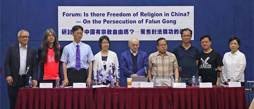

【明慧网】2018 年6 月10 日，来自香港、台湾及海外的政要名人、专家学者聚首一堂，针对中共对法轮功等宗教信仰群体的残酷迫害包括强摘器官的罪行，呼吁制止迫害、追究罪责，以全球去共化的视野消除共产主义对全人类的祸害。

加拿大著名人权律师大卫•麦塔斯首先发言，他表示，中国有很多受打压的人群，但唯独信仰团体遭受到以摘取器官为形式的屠杀，包括西藏人、维吾尔人、地下教会基督徒，而当中最严重的是法轮功修炼者，成为中共“肉体上消灭”政策的受害者。“法轮功人群被关押的人数尤其巨大，成为了几乎耗之不尽的器官供应。他们占国内遭任意关押的人口数字大约一半。”

<b>贩卖器官成中共医疗体系毒瘾</b>

在2016 年，麦塔斯、加拿大前亚太司司长大卫•乔高和美国调查记者、作家伊森• 葛特曼发表最新调查结果，显示中共每年进行超过十万宗移植手术，“如此大量的器官供应，除了来自法轮功为主的良心犯，别无其它解释。”麦塔斯说，目前中共医疗系统的资金主要来自贩卖人体器官，“贩卖人体器官已成为了（中共）医疗体系染上的毒瘾。”

<b>香港多位政界人士强调必须法办迫害元凶</b>

香港民主党前主席、支联会主席何俊仁表示，国际人权组织公认法轮功是目前在中国大陆被迫害最严重的信仰团体，强调应将迫害法轮功的元凶绳之以法。

香港立法会议员、民主党主席胡志伟也透过录音发言。中共迫害法轮功最残暴的罪行，以强摘法轮功学员的器官最为邪恶，远超人类可以接受的水平。“这是一个邪恶的极权，它泯灭良知之下会做的邪恶行为。”他强调必须将这些元凶绳之以法：“包括江泽民，一定要对事件负上责任。要令这种完全不文明的活摘器官行为，不可能出现在中华民族人民的身上……这一点中共领导必须要负上全部责任。”

<h2 align=center><a href="https://">誓言保护信仰自由 美国创办宗教自由会议</a></h2>

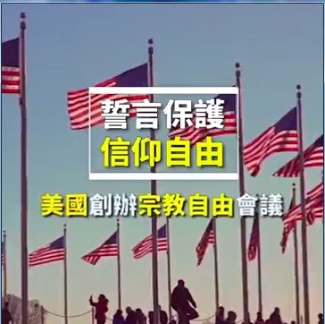

 <h3 align=center><a href='https://github.com/mingop/f6f6dw/blob/master/video/20180728.mp4?raw=true'>► 美国创办宗教自由会议  誓言保护信仰自由 .mp4 下载 </a></h3>

【新唐人2018年07月29日讯】新闻周刊（638）7月24号到26号，美国国务院召开了首届〝促进宗教自由〞部长级会议。副总统彭斯和国务卿蓬佩奥亲自出席，总统川普也发推支持。川普政府誓言，将把维护宗教自由作为首要任务处理。

美国副总统彭斯：〝在这个国家悠久的历史中，宗教自由是我们的第一自由。在美国，我们每天都证明，宗教自由是所有其他权利的基础。正如川普总统多次表示的那样，美利坚合众国是一个建立在信仰上的国家，宗教自由是本届政府的首要任务。〞

共有40多位外长、80多位民间代表和宗教领袖，出席了此次宗教自由会议。彭斯周四发表演説，誓言川普政府将担任领导角色，在全球保护信仰自由这一天赋权利。

美国副总统彭斯：〝历史已多次证明，那些剥夺自己人民宗教自由的人，毫不犹豫地践踏其他人的权利，破坏整个世界的安全与和平。〞

川普政府对这次会议表现出高度的重视。除了彭斯以外，美国国务卿蓬佩奥周四当天代表国务院主持会议并发表演説。

美国总统川普，也以推文表达了对大会的支持。川普说，〝美国将继续在全球推动宗教自由，那些支持宗教自由的国家，远比其他国家更自由、繁荣和和平。〞

本次大会，通过了纲领性的《波托马克宣言》，以及包括具体措施的《波托马克行动计划》。

《波托马克宣言》中说，〝信仰自由的权利正在全球受到攻击，报导中全球有接近80%人口的信仰权力严重受限。对许多人来説，因为宗教、信仰或不信仰受到迫害、压迫和歧视是每天都要面对的现实，现在是时候直接应对这些挑战了。〞

川普政府也提出了几项具体的行动计划。包括，创建〝应对群体灭绝及援助受害者计划〞；与其他国家共同成立〝国际宗教自由基金〞，协助遭受迫害的信仰人士；举办其他短期研讨会，并把宗教自由大会变为年度会议，每年在不同地区举办等等。

大会上，中共对人权的迫害议题，也多次被单独提起。

美国副总统彭斯：〝自1999年以来，国务院的年度‘国际宗教自由’报告每年都将中国列为宗教自由侵犯者。〞

作为遭受中共迫害最严重的信仰团体之一，法轮功学员也受邀参加了这次会议。辽宁法轮功学员迟丽华和女儿徐鑫洋，在中共信仰迫害研讨会上，讲述了丈夫徐大为坚持信仰被中共残酷迫害致死的遭遇。

法轮功学员 迟丽华：〝就是希望美国政府能更加关注我们法轮功这些受迫害的群体，因为在中国像我这样被迫害得家破人亡、妻离子散的家庭很多。我不想看到更多的孩子失去父母，成为孤儿。〞

法轮功信息中心发言人 张而平：〝我们希望能看到国际社会，所有的民主社会国家，或者关注宗教自由的这些团体和政府，他们能够在公开场合谴责中共对法轮功的迫害。〞

为有效制止发生在中国的宗教与信仰迫害，国会议员和人权领袖共同呼吁美国政府，扩大使用全球马格尼斯茨基人权问责法。

美国会众议员 Chris Smith：〝需要对《全球马格尼斯茨基人权问责法》更加积极的使用。我们拥有这样一个工具，可让如中共专制集团中的迫害者，个人为其行为负责。你迫害我们、压制我们，你们就不能来美国，不能在这里经商。〞

美国国际宗教自由大使布朗巴克表示，川普政府将会采取具体行动，在宗教自由问题上施压中共。

美国国际宗教自由大使布朗巴克：〝我们将努力施压(中共)，在对待维吾尔的问题上，在对待藏族佛教徒、基督徒和法轮功问题上。在中国有很多团体无法享受宗教信仰自由。〞

布朗巴克大使也表示，他看到了法轮功学员上周，在华府举行的集会活动。布朗巴克大使说，希望法轮功学员都能自由修炼，继续勇敢地实践自己的信仰。

撰稿：林宇 剪辑：明玉

<a name=1><h2 align="center"><b>
1.中共“1400例”骗局：利用精神病患者栽赃陷害法轮功</b></h2>

根据中国卫生部一九九八年的统计数字表明，中国有百分之五的人（约六千五百万人）患有不同程度的精神病和精神障碍，其中七成是重症精神病，约四十万人致残，生活不能自理。

一九九九年中共江泽民集团搜罗了许多精神病患者病发时的意外事故，栽赃嫁祸于法轮功。这些精神病人根本就不是法轮功学员。事实上李洪志老师从一九九二年传法开始就明确指出，精神病人不能修炼法轮功。在一九九六年的《悉尼法会讲法》中又指出：“精神病人，他自己意识是不清的，我们是不能度的。”李老师在《法轮大法义解》〈北京法轮大法辅导员会议建议〉中指出：“为什么我们强调精神病人不让参加班呢？就是他自己都把握不了自己，掌握不了自己。”

<b>中共炮制的“剖腹找法轮”骗局</b>

河北省任丘市华北油田马建民，本人及家族都有精神病史。他是一个气功爱好者，前后练了十几种气功，当时社会上流行什么他就练什么，也跟风接触过法轮功。有一天，马建民一个人在家，他的家人回来时，看到地板上有很多血，马建民肚子剖开，肠子外流，死在了厕所里。家人赶紧报案，尸体被送到华北油田总医院急诊科缝合。当时公安局的人明明知道：马建民死的时候是一个人在家，究竟为什么会剖腹，谁也不清楚。可是为了迎合江泽民迫害法轮功的政策，讨好公安部，为捞取政治资本，硬把马建民的死说成是“剖腹找法轮”。当时央视去马建民家编排节目时，马建民的儿子一再声明其父的死与法轮功无关，并且拒绝在电视上表演。但央视不顾事实，仍然一手编导了“剖腹找法轮”的骗局。

<b>山东“铁锨打死父母”案真相</b>

山东新泰市泰山机械厂工人王安收，因精神病发作将其父母用铁锨打死。王安收是一个精神病患者，这一点，在当地法院判决王与妻子尹彦菊离婚的判决书上写得非常明白，山东省新泰市人民法院（1999）新城民初字第245号民事判决书的部份内容：“本院认为，被告（王安收）婚前患精神病并隐瞒，婚后精神病多次复发，且经久治不愈，曾因精神病发作杀害自己的父亲，原告（尹彦菊）坚决要求离婚，夫妻感情已完全破裂，原告离婚请求予以支持。”可是这个案例却被中共江泽民集团收入“1400例”中栽赃到法轮功头上。

<b>黑龙江省双城市吴洪辉跳楼真相</b>

吴洪辉，黑龙江省双城市卫生防疫站职员。早在二、三十年前，因与女友恋爱多年被双方父母拆散，精神上受到严重打击而引发精神病，之后多次出现精神分裂现象，严重时不能上班。他的精神病史，他的亲友都可以作证。吴洪辉接触过法轮功，但李洪志先生从传法开始就明确提出：危重病人、精神病人或有精神病史的人不得炼功，所以吴洪辉不是法轮功修炼者。一九九六年吴洪辉精神病发作跳楼后，他的妻子曾在双城法轮大法心得交流大会上指出过他有过精神病史，而且多次复发过，并写信给双城市政府澄清吴洪辉跳楼真正原因，明确指出是精神病复发所致。

<b>黑龙江双城市王成祥九九年跳楼内情</b>

王成祥，男，六十多岁，黑龙江省双城市韩甸镇粮库一名退休工人，家族有精神病史，他的母亲是跳井死的，舅舅是上吊死的，家族中跳井、跳河、跳房、上吊等非正常死亡的就有十三人。引发王成祥发病的原因是一九九八年他儿子买了一套粮库的家属楼，就动员父母也搬到楼上住。但王成祥上下六楼很费劲，再加上二、三年前他刚盖了三间新砖房，很遂心，舍不得卖掉，有一次对儿子说：你买了楼我也不去住，就是去了，我早晚也得从楼上跳下去。后来勉强搬到楼上住，却整天郁郁寡欢，精神恍惚，要寻短见。

家人对此很担心，王成祥的老伴就劝他炼法轮功，让他减轻点精神负担。王成祥不看《转法轮》，象征性的比划比划动作，根本算不上法轮功学员。九九年正月初二夜里，由于家人没看住，王成祥从他家六楼跳下自杀了。中央电视台就这样把他的死嫁祸于法轮功，粮库的职工都说“他跳楼可不是炼法轮功炼的，他不炼法轮功也得自杀，他们家两辈就出三个。”

<b>华南理工大学家属余素昭自杀案真相</b>

余素昭在文革期间曾因精神病到广州芳村精神病院治疗几个月。九五年她隐瞒病史学起了法轮功（法轮功规定有精神病史者、家族有精神病史者不准修炼法轮功）。九八年初余素昭精神病复发，被家人送精神病院治疗。期间，法轮功学员劝其不要炼，她也表示不炼了，并将全部法轮功书籍、炼功带退还，从此以后不再炼法轮功了。半年后，她精神病再次发作，坠楼身亡。显然她的死和法轮功没有丝毫关系。

<b>重庆永川双石镇龙刚跳河自杀真相</b>

重庆永川双石镇龙刚，家住双桥街七十号，精神病复发跳河死亡。龙刚死后，一个姓杜的记者采访他的妻子，把一些诬蔑法轮功的话写在纸上，叫她照着念，并给了她二百元钱。龙刚父母投书明慧网说：“儿子有没有精神病作为父母是最清楚的，天下哪有不心疼子女的父母。儿子确实有精神病，当时是精神病复发跳河死亡，与法轮功没有任何关系。这是谁也抹煞不了的事实，作为他的父母，我们必须说真话，不能昧着良心。”

<b>跳井自杀的刘品清不是法轮功学员</b>

辽宁省东港市孤山镇农机台的站长刘品清，因生活压力出现精神问题自杀。据当地的知情人士透露，刘品清做生意赔了十多万元，而且跟妻子关系不和，长期分居，在这种压力下，精神上出现了问题。这时有人跟他介绍法轮功，他就看了看书，但根本没有修炼。当地了解他的人都说，他根本不是一个法轮功学员，他是在家庭遭受不幸的情况下自寻短见的。而一九九九年七月二十二日下午，中央电视台播放关于江泽民迫害法轮功的决定，播放的“1400例”中谎称刘品清是“练”了功以后跳井自杀。

<b>河北任丘朱长久残杀父母事件真相</b>

朱长久，河北省任丘市青塔乡张各庄村人，一九九七年患精神病，他的妻子边立新经常发现他精神恍惚及胡言乱语，言行异常，但九九年初病情有所好转。九九年七月，中共迫害法轮功后，他父亲朱振虎把他保存的法轮功书籍烧掉，村干部及乡派出所天天找他谈话，使他受到巨大精神压力，精神病复发。十一月二十五日，他两眼发直，不穿衣服赤条条的傻笑，第二天凌晨，突然用铁锤将父母杀死。

这本是一宗精神病患者发病错杀父母的案件，中共媒体发布的新闻稿完全不提他患病事实，却以《法轮功分子残杀父母》为题，将责任推到法轮功身上，并收入“1400例”。

<a href=#top1><h4 align="right">回上方第1篇</a></h4>

<a name=2><h2 align="center"><b>
2.中共“1400例”骗局：唆使杀人犯和自杀者家属栽赃法轮功</b></h2>

中共江泽民集团迫害法轮功的指令，是作为政治任务下达到全国各级官员的。许多地方官员为了邀功请赏、捞取向上爬的资本，不择一切手段编造假新闻栽赃法轮功。公安人员以承诺减免刑罚为手段，唆使杀人犯冒充法轮功学员栽赃陷害法轮功。

<b>辽宁盘锦市“魏家杀母案”内幕：公安部门许诺栽赃法轮功可免死罪</b>

二零零零年辽宁盘锦市电视台曾报导“魏家杀母案”。事后了解到这位被杀的老年人是以拣破烂为生的，其女在海城游手好闲，打麻将，没钱了就找母亲要，母亲没钱给她，她在晚上将其母杀死。后来，公安部门的人给其女出主意：“你就说你炼法轮功，往法轮功上一推没死罪。”魏家老百姓都知道她不是炼法轮功的，但迫于中共强权的压力，只能背地议论。

<b>张清贺杀伤亲人，公安局告知栽赃法轮功可以不判刑</b>

黑龙江省牡丹江市一个叫张清贺的工人，因患贫血、神经衰弱及其它慢性疾病，曾服过八个月中药。后因支付不起药费，经医生开方自己配药吃。但由于不懂药理，他自己往里加了两味中药，服药后，他就处于意识不清，不能自制的状态。一天他吃完药后准备自杀，被他母亲和妹妹发现了，前去劝阻，他在药力作用下出现杀伤自己亲人的事件。张清贺被牡丹江市公安局爱民分局收审后，多次被逼迫承认炼过法轮功，并被逼迫承认是因为炼了法轮功才出现恶性事件的，而且公安局告诉他承认了就可以不被判刑。

<b>“井架上吊”实为城管逼死</b>

除了杀人者之外，中共也把自杀者说成是法轮功学员。吉林市郊一农民以修车为生，由于没办理营业手续，修车工具被城管没收，他不堪巨大的生活压力而上吊自杀。当家属要告城管部门时，当地民政部门为政府部门开脱责任，给予抚恤，把死者说成是练法轮功的。公安部门特意在死者周围摆上李洪志老师的相片和两瓶白酒，对死者重新录像。其实周围老百姓都知道，死者从未炼过法轮功。人们也都知道修炼法轮功是不喝酒的，但当时当地公安部门还不知道这一点，所以在录像中露出破绽，使拙劣的谎言不攻自破。

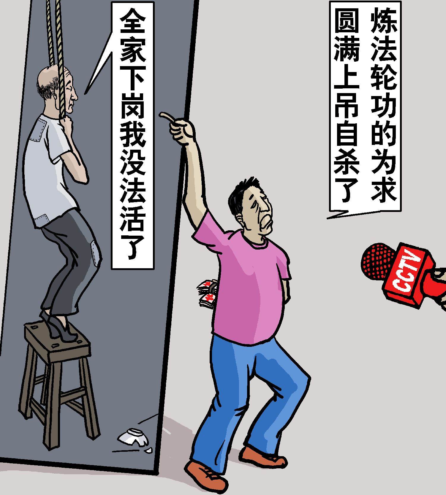

<a href=#top2><h4 align="right">回上方第2篇</a></h4>

<a name=3><h2 align="center"><b>
3.中共“1400例”骗局：收买危重病人栽赃法轮功</b></h2>
为栽赃法轮功，中共在医院收买危重、绝症病人作伪证，承诺减免医药费。有些人就在这种利诱下谎称自己是炼法轮功的，配合电视台、报社记者演戏。

<b>张海青“罗锅事件”出笼内幕：中央电视台记者许诺药费减半</b>

一九九九年七月二十日以后中央电视台连续播放诬陷法轮功的节目时，播出了一个所谓“罗锅事件”。此人叫张海青，在盘锦市开了一家刻字社，家庭很困难，住在农村，因患脊椎炎到北京协和医院看病，他妻子说当时在北京医院排队挂号人很多，他们排很远的队。这时来了一个记者说是中央电视台的，和当时排队的人说谁想上电视说法轮功不好，就给谁先挂号，并且药费减半。因为当时他们看病着急，张海青就胡说自己是炼法轮功炼成了罗锅，并且按记者写好的台词说了些不好的话。结果是先挂了号，但药费没有减半。后来张海青的妻子说中央电视台竟骗人，药费都是自己花的，至于张海青从没炼过法轮功，认识他的人都知道。

<b>黑龙江农妇李淑贤病重：医院院长承诺免费治疗</b>

李淑贤，黑龙江省哈尔滨市阿城区新华乡崔家屯农妇，婚后在阿城区大岭乡居住。一九九九年七月李淑贤患胃溃疡住进哈尔滨第四医院，病重期间因生活贫困交不上住院费，医院院长主动给他们出主意：你们就说李淑贤是炼法轮功炼的，就能获得免费治疗，并在生活上还能给予照顾。李淑贤及家属为了利益同意了。于是，哈尔滨市《新晚报》记者迅速赶到医院采访，用编好的台词让李淑贤的丈夫照着说，还告诉他：你得带着表情，说得象真的一样，人们才会相信。事后李淑贤病情不断加重，被医院强制出院，回家后时隔不久就死亡了。

李淑贤被列入栽赃法轮功的1400例中，被中央台多次播放。有人问当地官员：为什么中央电视台向全国人民撒谎呢？官员说：“这么大的媒体哪能不出现一点纰漏呢！”话一出口，闻者寒心。阿城区强行办洗脑班迫害法轮功学员时，还播放此录像，法轮功学员说：“发生在我们身边的事，包括你们和大家都知道是谎言和欺骗，还拿出来给我们看？”当时，他们就不放了。

<a href=#top3><h4 align="right">回上方第3篇</a></h4>

<a name=4><h2 align="center"><b>
4."中共“1400例”骗局：利用普通人的病逝栽赃法轮功</b></h2>
生、老、病、死是人类的自然现象，疾病是造成死亡的首要原因，据中国统计年鉴一九九八年所记载的全国平均死亡率，一千万人中每年约有六万五千人死亡。在医学比较发达的美国，每年仅急性心肌梗塞致死就有二十万人。法轮功是一种古老的佛家修炼方法，他的祛病健身效果显著，但并不是说接触了法轮功、炼了法轮功就上了保险，包治百病长生不死。中共则毫无边际的把一些人的正常死亡说成是因炼法轮功致死。其中有的人根本没有接触过法轮功，当然也不排除有些人为治病接触过法轮功，有些人在亲属的劝说下练过功，但是他们真正的死因却是疾病。

举个简单例子，著名演员陈晓旭（八七版《红楼梦》林黛玉的扮演者）病逝后，毫无任何科学建树的所谓“院士”何祚庥称“陈晓旭就是被中医害死的”，引发强烈的争论。卫生部副部长、国家中医药管理局局长王国强对此言论进行了批驳，他指出：“如果因为去世的人吃过中药，就认为是中医药有问题的话，那么，去世的人吃过西药，是不是也要认为西医药不科学？”与此同理，去世的人为治病也练过法轮功，就能说是法轮功致死的吗？我们看看下面几个被收入“1400例”的事实真相，听听他们的家属怎么说。

<b>马锦秀被中共算在“1400例”内的事实真相</b>

据北京市宣武区居民马锦秀的女儿金有明披露：马锦秀于一九八一年左右患了糖尿病，每次都是四个“+”号，每天每顿吃三十多片药，饱受疾病折磨，特别是九四年和九五年两次中风致使面部偏瘫，十多年一直在死亡的边缘上挣扎，甚至早早就做了身后事料理，嘱托亲属：万一自己有什么不测，帮忙照看三个孩子。一九九六年马锦秀学习了法轮功后，病情奇迹般好转，面部的偏瘫迅速康复，糖尿病的症状全都消失。直到九七年又出现身体不适，住院治疗，几个月后病故。马锦秀好几次跟女儿说：你看你某某阿姨，某某叔叔，比我后得的糖尿病，都比我先走了，还就算我活的长了，我还能得大法，真是幸运。

九九年七·二零以后，中共为了栽赃法轮功，把马锦秀也列入“1400例”，其女儿金有明听说后心情异常沉重，“妈妈明明是因脑梗塞病故的呀，怎么成了炼功造成的呢？妈妈在医院治疗了几个月去世，在医院，接受了大量的治疗，药也吃了，药液也大量注射了，可还是去世了，我们能说是医院造成的吗？因为医院也是‘治得了病、治不了命’的。为什么妈妈炼过功，就说炼功造成的呢？”马锦秀的丈夫也说：说你妈妈是炼功致死的，那倒不是，她是近二十年的糖尿病，又是脑梗塞。

<b>黑龙江省五常市兽药厂职工李凤香的真实情况</b>

一九九八年春，家住黑龙江五常市的李凤香患乳腺癌晚期，肿块已经开始大面积化脓。她的妹妹是九六年开始修炼法轮功的，仅修炼一个星期，原来患有静脉炎、气管炎、甲状腺、心脏病、腰间盘突出等症状都不翼而飞，她亲身体验到大法的神奇，就专程去劝病重的姐姐也炼法轮功。李凤香炼功后，病情就有了明显的好转，但她毕竟是属于危重病人，于九九年六月病逝。中共把她的死归结到1400例中，她的丈夫迫于压力作了伪证。她的妹妹投书明慧网说：“如果不炼法轮功，说不定九八年都过不去。开始炼功不长时间，病情得到控制，精神焕发，脾气也变好了，天天乐呵呵的到炼功点学法、炼功，不知道的人根本看不出是一个癌症晚期的病人。这用任何一种医疗手段都达不到的。”

<b>陈宇平之死的真相</b>

湖北省黄冈市黄州区东门学校教师陈宇平，一九九八年三月三次被确诊为肝癌晚期，死时三十四岁。九九年当地“六一零”（江泽民专为迫害法轮功而成立凌驾于法律之上的非法组织）为栽赃法轮功，谎称其是炼功致死，并收入1400例。他的妻子刘志红是一名法轮功学员，投书明慧网提到：陈宇平被确诊为肝癌晚期之前从未炼过法轮功，之后她自己不顾李洪志师父对危重病人不能修炼的规定，要丈夫炼功祛病。可是他不能做到真正的修炼，所以没有出现祛病健身的超常现象，照常病逝。

<b>“我丈夫从未炼过法轮功，却被列为1400例之一”</b>

王喾是机关公务员，一九八四年得过乙型肝炎，一九九八年五十岁时死于肝硬化，却无故被收入1400例。他的妻子二零零一年投书明慧网说“一九九八年八月，不知记者采访的谁，在报上登出来了说白发人送黑发人，栽赃陷害法轮功。我丈夫纯属正常死亡，根本不是炼法轮功炼的，他本人从未炼过法轮功。”并提到“五十岁的他去世的原因是：1、在工作中说真话受排挤；2、工作中叫人骗了一把，自己拿钱给补上；3、因为他哥哥在一九九五年八月二十五日去世，死于肝癌，时年五十岁，弟弟在一九九七年五月九日死于肝病，时年四十六岁，因为他们兄弟都有肝病，所以对他压力很大。”

<b>山东蒙阴县宣传部捏造“练功致死”，死者家属不同意遭毒打</b>

山东蒙阴桃墟镇居民石增山的女儿患有先天性心脏病，医院治不好，附近的居民都知道她死于先天性心脏病。然而蒙阴县宣传部为了搜罗诬陷法轮功的材料向上级邀功，组织专人编写了一份材料，说石的女儿炼法轮功，不让吃药、不让打针，最后死了，要求石增山配合电视台，念这份稿子录像。开始石增山不同意，不想出卖良心说假话。但是镇政府组织了一批打手用了三个晚上对石增山进行非人的折磨、毒打，致使石增山被迫妥协，配合电视台说了假话，做了录像“揭批”，造成了终生遗憾。

<b>辽宁杜维平之死的事实真相：电视台记者承诺付报酬</b>

杜维平，女，辽宁省铁岭市大甸子镇人，身患怪病于一九九九年八月在家中死亡，时年二十二岁左右。据了解，杜维平生前到处求医，找巫医、去基督教会祷告均未见起色。万般无奈的情况下，抱着试试看的心理学了一、两个月法轮功，炼功动作还没学会就不学了。死亡前几天还请巫医到家中治疗，当时巫医告诉她及家人在三天之内不允许见任何人，她都照办，过了不几天就死了。

当时正值中共开始诬蔑法轮功，当地官员到处找诬陷材料找不到的情况下，铁岭电视台记者崔大新，与报社记者多次到杜维平家里，要她父母作假证陷害法轮功并承诺给一笔钱作报酬。杜维平父母在金钱的诱惑下违心作了假证。这件事在当地引起很大反响，有的老百姓说：通过杜维平这件事，我知道了电视台所报导的这些都是假的，我们不会相信的。

<a href=#top4><h4 align="right">回上方第4篇</a></h4>

<a name=5><h2 align="center"><b>
5.“剖腹找法轮”骗局</b></h2>
中共炮制的“1400例”中，有一个案例是华北油田职工马建民把肚子剖开找法轮的谎言。对当年中共媒体报导还有印象的人，或许还记得马建民血淋淋躺在血泊中的情景。那么这一血案的真相到底是什么？

马建民原来得过精神病，同时他又是一个气功爱好者，当时社会上流行什么气功他就练什么气功，前前后后已经练了十几种。后来法轮功传到了华北油田，马建民也接触了法轮功。法轮功明确禁止精神病人或者家族有精神病史的人修炼。

有一天，马建民一个人在家，他的家人回到家里的时候，看到地板上有很多血，马建民已经死在了厕所里，肚子剖开，肠子外流。家人赶紧报案，之后把遗体送到华北油田总医院急诊科，缝合了肚子。

当时公安局的人明明知道：马建民死的时候是一个人在家，究竟为什么会剖腹，谁也不清楚。可是后来为了迎合江泽民迫害法轮功的指令，为了讨好公安部，硬是把马建民的死说成是“剖腹找法轮”。当时央视去马建民家编排节目时，马建民的儿子一再声明其父的死与法轮功无关，并且拒绝在电视上表演。但央视不顾事实，仍然一手编导了“剖腹找法轮”的骗局。
<a href=#top5><h4 align="right">回上方第5篇</a></h4>

<a name=6><h2 align="center"><b>
6.法院判决书认定杀父母者实为精神病</b></h2>

在中共炮制的“1400例”中，有一则“王安收铁锹杀父亲”的事例。据中共官媒一致口径说：王安收原本有一个和睦的家庭，1998年元月开始练法轮功，同年4月8日，王早上练功时，被其父亲阻止，他因而生气，拿扁担和铁锹把父亲砸死。这起事件和许多其他精神病人杀人的事件被合列在一起，共同出现在中共控制的多家媒体、网络上诬蔑法轮功。

那么事实真相到底如何？让我们来看一份来自王安收家乡山东省新泰市法院的判决书，这是1999年5月，王安收的妻子尹彦菊向法院起诉与王安收离婚的民诉判决书。

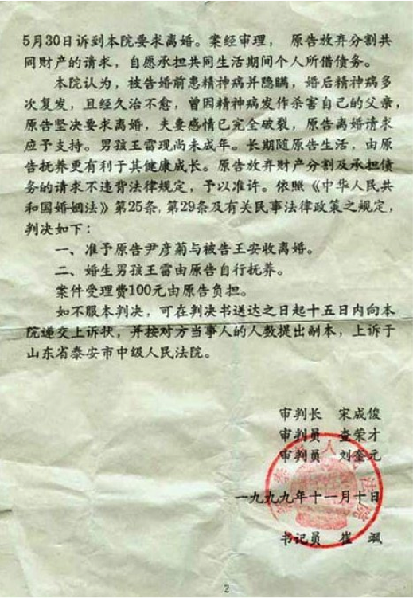

在这份判决书中，我们看到原告尹彦菊提出的与被告王安收离婚的理由是：“被告婚前隐瞒精神病，婚后精神病复发多次，病情没有任何好转，无法与被告共同生活下去，要求与被告离婚。”

新泰市法院对此案的审理结果是：“1988年被告（王安收）曾患精神病，在泰安市精神病医院治疗两个多月，1996年后被告精神病复发，多次去泰安市精神病医院治疗。1998年被告开始练习法轮功，同年四月精神病复发，将其父用铁锹打死，被送往泰安市精神病医院住院治疗至今，诊断为偏执型精神分裂症。”最后法院以“被告婚前患精神病并隐瞒，婚后精神病多次复发，且经久治不愈，曾因精神病发作杀害自己的父亲，原告坚决要求离婚，夫妻感情已完全破裂”为由，判决王安收夫妇离婚。

从法院判决书中，我们很清楚的看到：一、王的精神病并不是因练法轮功所致，他早在一九八八年就患精神病了，换言之，在练法轮功前，他已经有十年的精神病史了。二、王安收从一九九六年开始精神病反复发作，多次被送精神病院治疗。三、王的妻子指证他“婚后精神病复发多次，病情没有任何好转”。从这些我们能明白的得出结论：王安收在一九九八年接触法轮功时，根本就是个精神病人，并且正处在精神病反复发作，久治不愈中。法轮功明确禁止精神病人修炼。他杀死父亲和法轮功没有任何关系，这一点法院的判决结果也已经定论：“因精神病发作杀害自己的父亲。”

我们再把中共官媒对此事件的报导和新泰市法院的判决书对比，不难看出，两者的最大区别是：中共官媒的报导中，完全没有提到王安收本是精神病人的事实。为什么中共要刻意掩盖这一点呢？道理很简单，因为谁都知道精神病人随时都可能做出过激的事情（包括杀人），如果说出真相，那谁还会相信王安收杀死父亲与法轮功有关系呢？那不就达不到陷害法轮功的目的了吗？所以为了抹黑法轮功，就必须隐瞒他曾是精神病患者的事实，同时还要把他现在的精神病推到法轮功身上，这样才能顺理成章的嫁祸法轮功。

<a href=#top6><h4 align="right">回上方第6篇</a></h4>

<a name=7><h2 align="center"><b>
7.哈尔滨市第四医院诱骗李淑贤栽赃法轮功</b></h2>

李淑贤，女，1999年时30岁，婚后在黑龙江省阿城市大岭乡居住。1999年7月，李淑贤因患胃溃疡住进了哈尔滨市第四医院。病重期间，正是在1999年7月20日，中共江氏集团在全国迫害诽谤法轮功之时。当时李淑贤家庭生活非常贫困，很难交上住院费。

在这关键时刻，医院院长出现了，主动为李淑贤及其家属出主意，告诉家属：你们就说李淑贤是炼法轮功的，就能获得医院免费治疗，并在生活上还能给予照顾。老实的农民为了这点利益，在这无中生有中达成了协议。

于是，哈尔滨市新晚报记者迅速赶到医院进行采访，用编好的台词教李淑贤丈夫说：妻子李淑贤是练法轮功的，把身体练出了病，因为她练“辟谷”，身体才这么瘦，现在得了胃溃疡，害得我们住院都住不起。李淑贤的丈夫就反复练习记者写好的台词，直到记者满意，才进行录像采访。就这样，一桩栽赃法轮功的假戏上演了。

哈尔滨市新晚报在1999年7月30日前为此事发表文章，并配有照片（李淑贤的母亲抱着她），题目为“练法轮功练出个活骷髅”。文章中主角李淑贤说：“法轮功把我坑苦了，是共产党挽救了我，是电视台记者救了我。”结果李淑贤受到“优待”之后，病情不断加重，多次全身抽搐，最后被该医院强制出院，回家了。

新华乡政府及阿城市政府看到新晚报的文章后，对此事进行调查，将李淑贤的亲属抓到新华乡派出所由派出所民警（侯某某）进行审讯，问：“是不是你教李淑贤练的法轮功？”亲属说：“我没教过她练法轮功。”并为此事签写证明。经调查核实后，结果证实：李淑贤不是练法轮功的。事隔不久，李淑贤死亡。新华乡政府干部对李淑贤的家属说：“你去告他们，你为他们做假证，他们不守信用，病没看好就给撵出院了，我帮你们撑腰，你要是告赢了能得好几万元钱呢。”当时家属考虑，当权者正在疯狂打压法轮功，我去告谁呀！不告还抓呢！就这样，此事在当地不了了之。

可是此事却被新闻媒体炒作得沸沸扬扬。在哈尔滨电视台上播出；又在黑龙江电视台播出；然后又在中央电视台“走进千万家”栏目播出，最后被列入诽谤法轮功的所谓1400例中，又在中央电视台多次向全国人民播放，想以此挑起人民对法轮功的仇恨。身为国家级媒体，如此造谣，真是令闻者心寒啊。

阿城市强行办洗脑班的时候，又拿出此录像作为“转化”材料给法轮功学员看，法轮功学员说：发生在我们身边的事，包括你们和大家都知道是谎言和欺骗，还拿出来给我们看什么！当时他们不放了。

<a href=#top7><h4 align="right">回上方第7篇</a></h4>

<a name=8><h2 align="center"><b>
8.辽宁盘锦市“魏家杀母案”内幕：公安部门许诺栽赃法轮功可免死罪</b></h2>

【明慧网2002年11月26日】

辽宁盘锦市“魏家杀母案”内幕：公安部门许诺栽赃法轮功可免死罪

2000年辽宁盘锦市电视台曾报导“魏家杀母案”。事后了解到这位被杀的老年人是以拣破烂为生，其女在海城游手好闲，打麻将，没钱了就到盘锦母亲处要钱，其母没钱给她，她在晚上将其母杀死。后来，公安部门的人给其女出主意：“你就说你炼法轮功，往法轮功上一推没死罪。”魏家老百姓都知道她不是炼法轮功的，但老百姓面对强权的压力，只能背地议论。

<b>张海青“罗锅事件”出笼内幕：中央电视台记者许诺药费减半</b>

就在一九九九年七月二十日以后中央电视台以每天90分钟时间连续播放攻击法轮功的节目之时，中央电视台播出了一个所谓“罗锅事件”。此人张海青，在盘锦市开了一家刻字社，家庭很困难，住在农村，因患脊椎炎到北京协和医院看病，他妻子说当时在北京医院排队挂号人很多，他们排很远的队。这时来了一个记者说是中央电视台的，和当时排队的人说谁想上电视说法轮功不好，就给谁先挂号，并且药费减半。因为当时他们看病着急，张海青就胡说自己是炼法轮功炼成了罗锅，并且按记者写好的台词说了些不好的话。结果是先挂了号，但药费没有减半。现在张海青的妻子也说中央电视台竟骗人，药费都是自己花的，至于张海青从没炼过法轮功，认识他的人都知道。

<b>不法官员为逃脱罪责栽赃陷害法轮功</b>

今年五月份魏家大队有400户居民动迁，有一个名号大华的包工头负责这块动迁（他自己亲口说给市里某领导的妻子100万元），他给老百姓很低的动迁费，老百姓买不起房子没地方住，就连哭带嚎不搬。今年4月31日，大华采取强行断电、断水、断气的手段，老百姓找有关领导，正赶上五月一日放长假找不到领导，老百姓就趴火车道，使铁路停车10分钟，上边来调查，市里不法官员为推脱责任就栽赃法轮功。在这种打压的大气候下，没人敢给法轮功说公道话，当事人就这样蒙混过关了，而这些老百姓也有冤无处诉。

<a href=#top8><h4 align="right">回上方第8篇</a></h4>

<a name=9><h2 align="center"><b>
9.和1400例一脉相承的傅怡彬杀亲案</b></h2>

1400例之后，中共喉舌媒体又有几次利用精神病人杀人的恶性事件栽赃陷害法轮功。发生在2001年底的傅怡彬杀亲案就是其中影响最坏的一例。

中央电视台在2001年12月16日晚的《新闻联播》和接下来的《焦点访谈》节目中报导了北京傅怡彬弑父母、杀妻子的消息，中央电视台在报导中，把傅怡彬弑杀亲人归罪于法轮功，然而，稍加思考分析，不难看出中央电视台的节目，是对法轮功的又一轮诬陷，其内容漏洞百出。

马瑞金女士了解一些关于傅怡彬的个人情况，她说：傅怡彬这个人其实在几年前就已经精神不正常了，他有一个亲戚在黄寺大街附近住，和我曾经是同事，大概是在93年的事后，他的这个亲戚就跟我们说过，说他经常就是不穿衣服，一丝不挂的就到处乱跑，家里人怎么管都管不住，也就是说，在杀人的8年前，他已经是精神不正常了。

中共利用这一精神病案例制造诬陷法轮功的宣传。把这一杀人案诬陷到法轮功头上是很荒唐的。傅怡彬根本没有修炼过法轮功。即便假设傅怡彬曾练习过法轮功，也不能推理说，他的异常行为是因练习法轮功造成的，因为在此之前他就是一名精神病患者，并有多次发作。正如，一个曾经学过天文学和物理学的人犯了罪，不能说他所学的天文和物理知识是他犯罪的原因。这样的结论是不合逻辑的。

<a href=#top9><h4 align="right">回上方第9篇</a></h4>
