

 

<a name=list>
<table>
<tr><td width=880> 

<b><a href=#a1>感恩节 纽约腰鼓队法轮功学员谢师尊（上）（2019）</a></b> 
<b><a href=#a2>感恩节 纽约腰鼓队法轮功学员谢师尊（下）（2019）</a></b> 
<b><a href=#a3>大陆民众得福报 敬祝李洪志大师新年好（2020）</a></b> 
 <b><a href=#a4>诚信法轮大法好　大法福泽有缘人（2020）</a></b> 
 <b><a href=#a5>【庆祝513】飞上蓝天（2020）</a></b> 

 

</td></tr>
</table>

 

<h3 align=center>中秋节16000条问候 经明慧寄李洪志大师</h3>

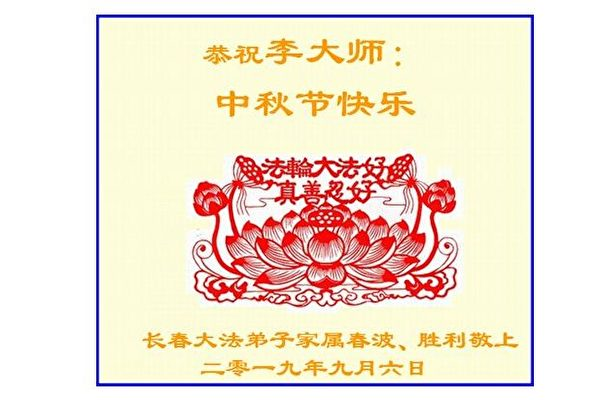

2019年中秋节，明慧网收到超过16,000宗寄给李洪志师父的贺卡贺词。（明慧网）

【大纪元2019年09月17日讯】今年9月13日是中国传统的中秋佳节，明慧网收到超过16,000宗寄给李洪志师父的贺卡贺词，经分拣整理后，有13,391件得以及时发表。在发表的贺卡贺词中，98%来自中国大陆，2%来自海外各国。

在遭受中共严重迫害20年后的今天，中国大陆的法轮功学员不但没有被压倒，反而愈加体会到法轮大法的珍贵，更有新人不断走入修炼者的行列。中国法轮功学员突破网络封锁寄到海外明慧网的贺卡贺词，记载了历史，见证了法轮大法的威德。

农历八月十五是花好月圆日，正处每年秋季的中期，自古以来是家人团聚、游子思乡的日子。中秋节不但在中国大陆，也在亚洲各国广受重视。作为中国传统中仅次于新年的节日，中秋节近年在喜爱东方文化的西方人士中也日益广为人知。自从法轮功在中国大陆遭受中共迫害以来，设立于北美的明慧网自然而然地成为了法轮功学员转交对李洪志师父问候的地方。

据了解，明慧网今年集中在连续3天的时间内（也就是节前两天到中秋节这天），共发表了整理出的1万3千多宗贺卡贺词。其中中国大陆的贺卡有7千5百61宗，占大陆问候的58%；贺词5千5百零9宗，占大陆问候的42%。海外40个多个国家的贺卡2百65宗，占海外问候的82%，贺词56宗。

<b>来自大陆法轮功学员的问候</b>

来自法轮功学员的贺卡与贺词各自代表着自己所在地区、学法小组、家庭、同行、同单位同事群组，或者海外的国家、地区学员群体，不一而足。值得一提的是，几乎所有贺卡均为大法弟子们亲手设计并制作，满载着学员、弟子对师父的思念与感恩。

中国河南省周口市一家四代同修法轮大法。他们在敬致李洪志师父的贺信中说：“大法让我们身体健康，家庭幸福和睦，在做‘三件事’（学法、讲法轮功真相、发正念）中人人得到提高，体悟到向内找的愉悦、修炼的美妙与超常。家中未修炼的家人也都敬重大法，从大法中深深受益。”

山东招远一家四代修炼人寄来贺卡贺词，恭祝李洪志师父中秋节快乐。他们说，“我们一家六口四代人都学大法。两个女儿一个四岁、一个二岁，她俩都知大法好、师父好。大女儿会背《论语》和多首师父诗词；丈夫心脏病多方医治无效，在走投无路的情况下，走进大法，现已神奇痊愈；母亲严重的风湿关节炎，修炼大法后奇迹般康复；92岁外婆身体健康，能干家务活。我们全家感恩师尊。”

某空军大院大法弟子在贺词中说：“我们是1999年7月20日之前得法的大法弟子。20多年来，我们紧紧跟随您穿越邪党的腥风血雨，您的真修弟子一个都没有少！”“又是一年月圆时，大院的全体大法弟子想念您。我们衷心祝您中秋快乐！”

湖北咸宁市温泉，一位2013年走入法轮功修炼的学员说，大法很短时间就完全改变了他的人生观，“我受益很多。”“一是，大法法理对我的震撼，知道自己是谁，我来干什么；二是，身体健康；三是，家人受益，家人出车祸却平安……”“我和全家人感谢师父的慈悲救度。”

四川广安一位法轮功学员说：“我是个新学员，在今后的修炼路上，弟子一定会听师尊的话，精进实修（按“真、善、忍”修炼原则做人）做师尊的真修弟子，弟子盼师尊早日回国。”

<b>非修炼人士对“李大师”的问候</b>

湖南省靖州县的一位七旬老人说，偶遇法轮功学员在公共场所劝民众退党，当时感觉既惊喜又震撼。他曾亲历共产邪灵的迫害，现惟愿中共早日解体，善良民众都能了解真相走向美好的未来。

四川省凉山彝族自治州的一位市民说：我虽未修炼法轮功，却深受大师保护，心存无比感恩，日日颂念“法轮大法好，真善忍好”。恭祝李大师中秋快乐！

辽宁省朝阳县的一家29口人“恭祝师父中秋快乐”，他们说，“我们家里的人都在师尊的看护下，得到了神的福祉。我们盼着师尊早日回中国大陆。”

湖南省靖州县一位七旬老人在来信中这样写道：“在我六岁的时候，父母被手脚捆绑吊铐被当成地主恶霸批斗，为了躲避这场莫名的灾难，善良而又纯朴的父亲将我独自一人躲藏到一个无人知晓的地方，使我在冰天雪地的深山里三天三夜无吃无喝，我们整个家族对中共既恨又怕了几十年。”

“直到有一天，偶遇法轮功学员在公共场所劝民众退党，当时感觉既惊喜又震撼。后来法轮功真相各类资料我都静心阅读，多年以来我都密切关注被中共封锁的真相信息。……物极必反，邪不胜正。”

“世界需要真善忍。我已是70多岁的老人，亲历共产邪灵的迫害，现惟愿中共早日解体，善良民众都能了解真相走向美好的未来。时值2019中秋佳节来临之际，再一次恭祝大法师父中秋节快乐！”

<b>传统难弃 新年更胜中秋</b>

中共的“文革”旨在砸烂和破除一切文化传统，然而在中共自己即将走入坟墓之际，文化传统在人们的心中依然是难以舍弃的生活珍宝。作为中国传统第一节日的新年，明慧网收到的贺卡贺词量通常是中秋节的近两倍。例如，今年二月五日的中国新年，明慧网发表的贺词贺卡在两万三千宗以上。

文章来源：明慧网  #

责任编辑：高静

 

<h3 align=center>中秋月圆 逾40国法轮功学员问候李洪志师父</h3>

 

2019年9月1日上午，韩国首尔地区法轮功学员在光化门地铁口集体炼功及为民众讲述法轮功真相，参加的法轮功学员合影恭祝法轮功创始人李洪志大师中秋节快乐。（全景林／大纪元）

【大纪元2019年09月13日讯】在中秋月圆、举家团圆之时，海外法轮功学员思念、感恩他们的师父李洪志先生，敬祝他中秋快乐。

自1992年起法轮功洪传于世27年，恩泽神州大地，福祉五湖四海，“真善忍”的光辉照耀寰宇。

20载惊涛骇浪、穷凶极恶的镇压，摧毁不了修炼者的意志，“幸遇师尊慈悲苦度，穷尽言语难以表述。中秋佳节遥寄祝福，合十叩拜感恩师父。”——这表达了他们共同的心声。

明慧网收到来自中国、美国、加拿大、新西兰、日本、芬兰、韩国、西班牙、英国、德国、土耳其、法国、马来西亚、巴西、香港、泰国、俄罗斯、丹麦、印度尼西亚、澳洲、台湾、澳门、瑞典、挪威、捷克、斯洛伐克、波兰、意大利、乌克兰、罗马尼亚、荷兰、奥地利、爱尔兰、比利时、瑞士、越南、新加坡、伊朗、菲律宾等四十多个国家和地区的法轮功学员发来的敬祝李洪志大师的中秋贺词、贺卡。

以下为其中的部分内容。

<b>纽约地区</b>

9月7日上午，纽约上州橙县周边的中西法轮功学员汇聚橙县（Orange County）草坪，以集体大炼功的形式恭祝李洪志师父中秋节快乐。

 

法轮功学员恭祝李洪志师父中秋节快乐。（明慧网）

纽约大纪元新唐人媒体集团全体大法弟子恭祝慈悲伟大的李洪志师父中秋快乐！

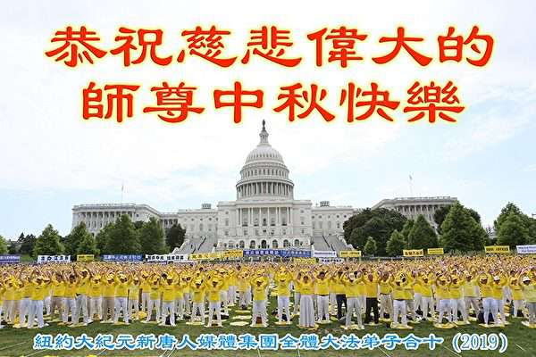 

弟子们不辱使命，惟愿师尊笑！ 
<b>《普天颂赞师尊恩》</b> 

朗朗明月敬佛香，茫茫苍穹涕泪行。 
幕幕千秋万古去，声声慈悲唤十方。 

众生俯拜默无语，叩谢师尊洪恩长。 
天清宇澈败物灭，乾坤永驻吟绝唱。

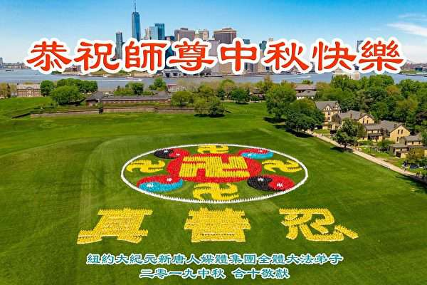 

纽约天国乐团全体大法弟子恭祝慈悲伟大的李洪志师父中秋快乐！

《大纪元时报》纽约版全体大法弟子恭祝李洪志师父中秋好！

中秋贺词 
又迎来中秋皓月朗朗， 
又遥望天地风雨苍苍。 
又送走多少工作之夜， 
又唤起多少灿烂朝阳。 

不能忘师尊慈悲苦度， 
不能忘众生殷切期望。 
只有靠正念修好自己， 
才能使媒体走向远方……

纽约中城工地炼功点全体大法弟子恭祝李洪志师父中秋快乐！

 

美国纽约大法弟子恭祝李洪志师父中秋快乐！

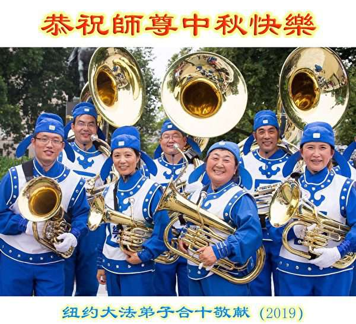

塞班岛大法弟子恭祝慈悲伟大的李洪志师父中秋节快乐！

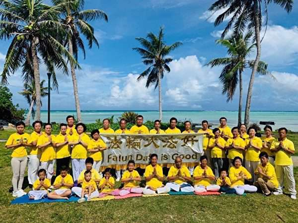 

中秋月又圆， 
正法速催前。 
修炼知精进， 
法徒志更坚。 
助师使命在， 
救众誓言签。 
必兑来时愿， 
圆满重回天。

旅居美国的吉林长春家乡全体大法弟子恭祝李洪志师父中秋好！

 

美国亚利桑那州大法弟子恭祝李洪志师父中秋节快乐！

 

美国凤凰城地区大法弟子恭祝李洪志师父中秋节快乐！

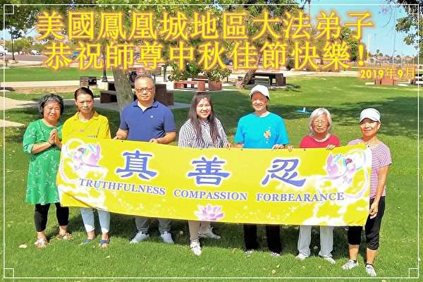

美国新英格兰区大法弟子恭祝李洪志师父中秋快乐！

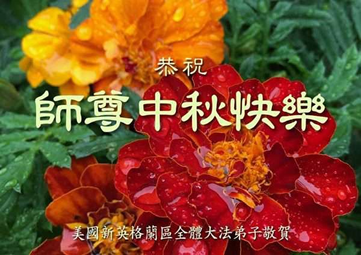

美国德州达拉斯大法弟子恭祝李洪志师父中秋快乐！

跟随师父法正人间志向不移 
完成使命勇猛精进修好自己 
师恩浩荡万古机缘时刻珍惜 
以苦为乐去掉执著圆满正果

全球营救平台904美国组全体大法弟子恭祝李洪志师父中秋快乐！

 

九月桂花正飘香 
中秋佳节月儿亮 
法徒平台讲真相 
助师救人日夜忙 
揭穿谎言除烂鬼 
随师携众返天乡

美国海外短信彩信组全体大法弟子恭祝李洪志师父中秋节快乐！

 

贺中秋 谢师恩 

一轮明月挂中天， 岁岁盼团圆。 
浩渺繁星新宇显， 清辉照尘寰。 
洪微净化普天贺， 众生翘首盼。 
师恩浩荡佛光现， 法正人世间。

美国北卡州全体大法弟子恭祝李洪志师父中秋快乐！

美国波特兰大法弟子恭祝李洪志师父中秋快乐！

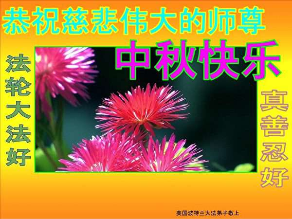

美国圣地亚哥景点讲真相全体大法弟子恭祝李洪志师父中秋快乐！

旧金山全体大法弟子恭贺李洪志师父中秋节快乐！

美国旧金山湾区全体大法弟子恭祝李洪志师父中秋节快乐！

圣地亚哥全体大法弟子敬贺李洪志师父中秋快乐！

夏威夷全体大法弟子恭祝李洪志师父2019年中秋节快乐！

美国犹他州全体大法弟子恭祝李洪志师父中秋快乐！

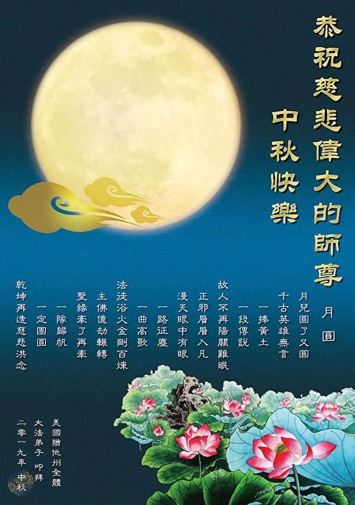

美国爱达荷州（Idaho）全体大法弟子恭祝李洪志师父中秋快乐！

美国拉斯维加斯全体大法弟子恭祝李洪志师父中秋快乐！

好莱坞真相点大法弟子恭祝李洪志师父中秋节快乐！

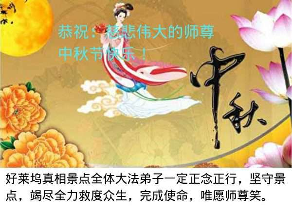

新泽西全体大法弟子恭祝李洪志师父中秋快乐！

 

美国大费城全体大法弟子恭祝李洪志师父中秋节快乐！

中秋天悬月一轮， 
弟子叩首拜师尊。 
救度众生随师还， 
众王回归大圆满。

美国宾州哈里斯堡大法弟子恭祝李洪志师父中秋快乐！

美国密苏里州全体大法弟子恭祝师父中秋快乐！

 

美国休士顿全体大法弟子恭祝李洪志师父中秋节快乐！

美国明尼苏达州全体大法弟子恭祝李洪志师父中秋快乐！

 

加拿大多伦多大法弟子恭祝李洪志师父中秋快乐！

加拿大多伦多青年大法弟子恭祝李洪志师父中秋快乐！

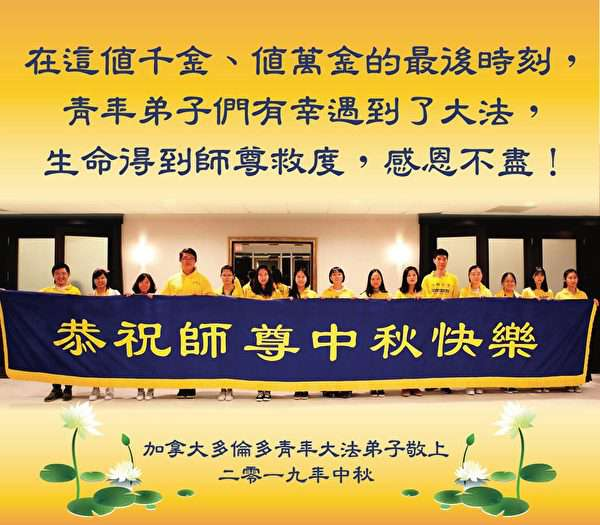

温哥华全体大法弟子恭祝李洪志师父中秋节快乐！

加拿大埃德蒙顿大法弟子恭祝李洪志师父中秋快乐！

加拿大卡尔加里全体大法弟子恭祝李洪志师父中秋快乐！

加拿大渥太华大法弟子恭祝李洪志师父中秋节快乐！

加拿大汉密尔顿全体大法弟子恭祝李洪志师父中秋快乐！

加拿大维多利亚全体大法弟子恭祝李洪志师父中秋节快乐！

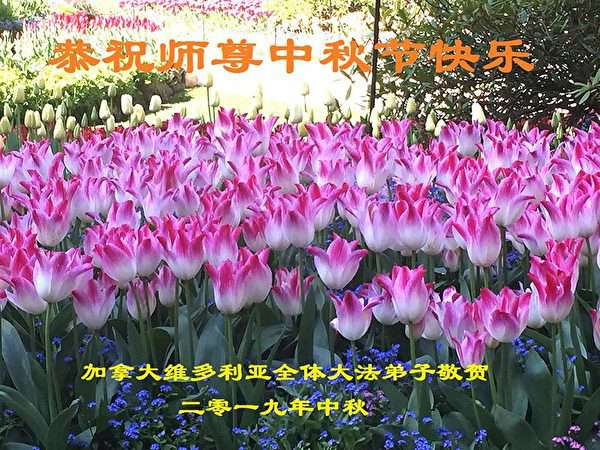

澳大利亚悉尼明慧学校全体师生恭祝李洪志师父中秋节快乐！

悉尼景点大法弟子恭祝李洪志师父中秋快乐！

悉尼大纪元全体大法弟子恭祝李洪志师父中秋节快乐！

墨尔本全体法轮大法弟子恭祝李洪志师父中秋节快乐！

昆士兰大法弟子恭祝李洪志师父中秋节快乐！

中秋佳节盼团圆 
助师正法任在肩 
人间辗转千百秋 
天乡亲人泪涟涟 
师传大法度众生 
万年梦醒法船蹬 
法轮圣王救大穷 
圆容不破显奇盛 
弟子精进师尊笑 
择日随师乘长风

澳洲悉尼大法弟子恭祝李洪志师父中秋快乐！

澳洲阿德莱德大法弟子恭祝李洪志师父中秋快乐！

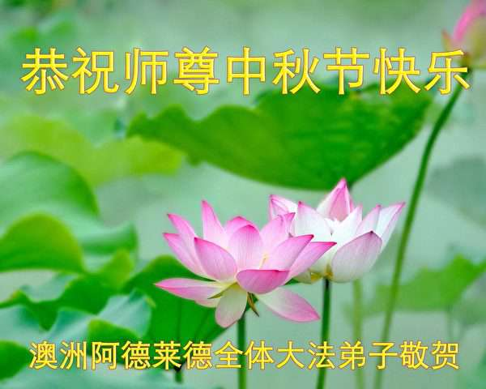

澳洲讲真相网门项目组大法弟子恭祝李洪志师父中秋快乐！

新西兰全体大法弟子恭祝伟大的李洪志师父中秋快乐！

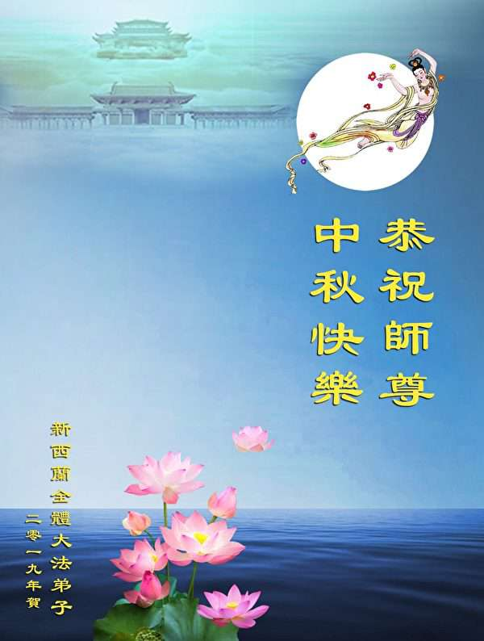

纽西兰基督城大法弟子恭祝李洪志师父中秋快乐！

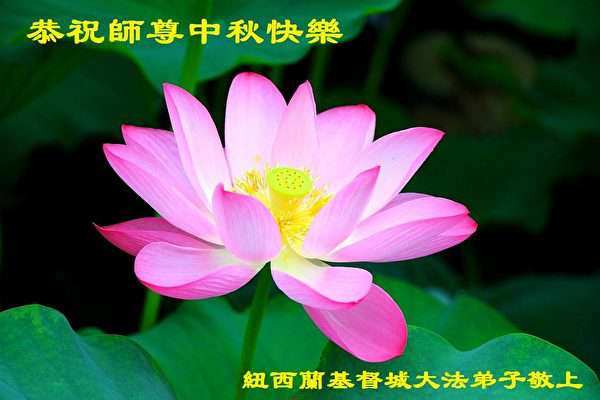

新西兰惠灵顿大法弟子恭贺李洪志师父中秋快乐！

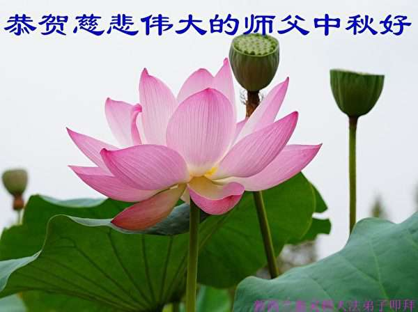

香港大法弟子恭祝李洪志师父中秋快乐！

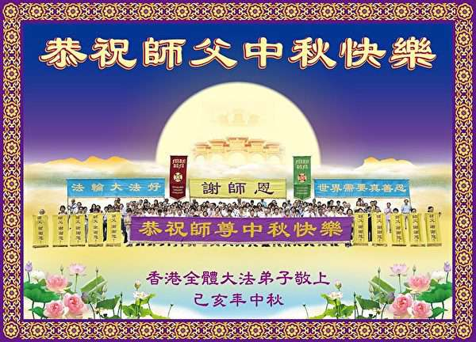

香港理工大学大法弟子恭祝李洪志师父中秋好！

全体澳门大法弟子恭祝李洪志师父己亥年中秋节快乐！

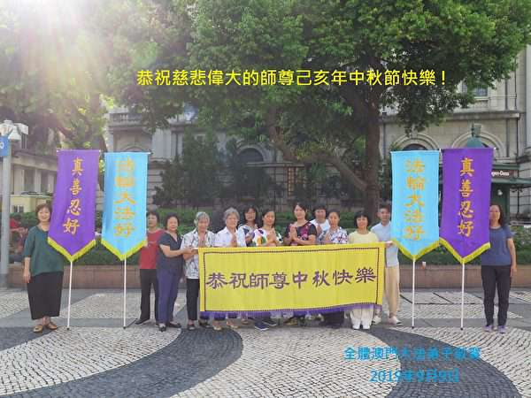

韩国首尔大法弟子恭祝李洪志师父中秋快乐！

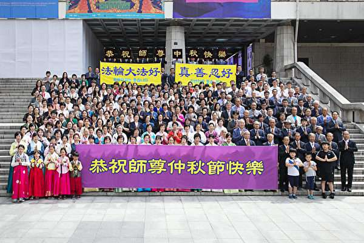

9月1日上午，韩国首尔地区法轮功学员在光化门地铁口集体炼功及为民众讲述法轮功真相，参加的法轮功学员合影恭祝法轮功创始人李洪志大师中秋节快乐。（全景林／大纪元）

韩国大邱大法弟子恭祝李洪志师父中秋快乐！

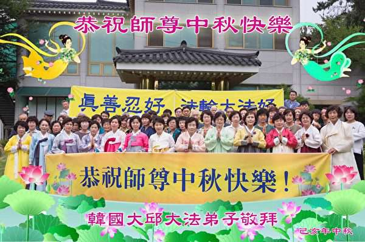

韩国光州全南大法弟子恭祝李洪志师父中秋快乐！

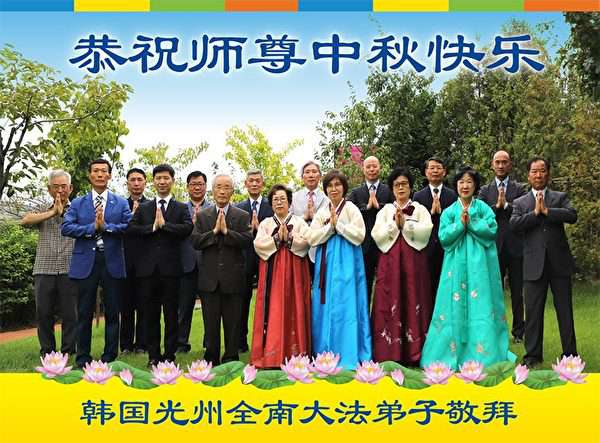

韩国水原大法弟子恭祝李洪志师父中秋快乐！

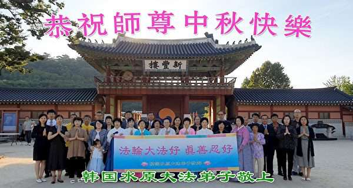

韩国釜山地区大法弟子恭祝李洪志师父中秋快乐！

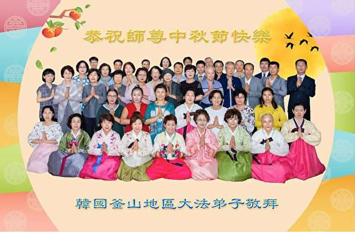

韩国忠清南道天安市大法弟子恭祝李洪志师父中秋快乐！

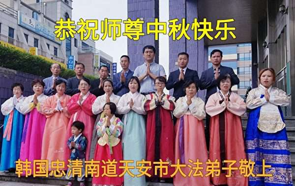

韩国安山市全体大法弟子恭祝李洪志师父中秋节快乐！

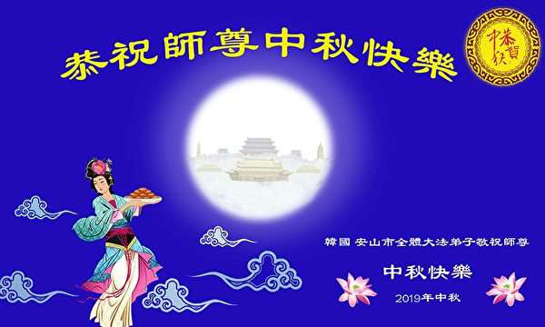

驻韩国北朝鲜大法弟子恭祝李洪志师父中秋愉快！

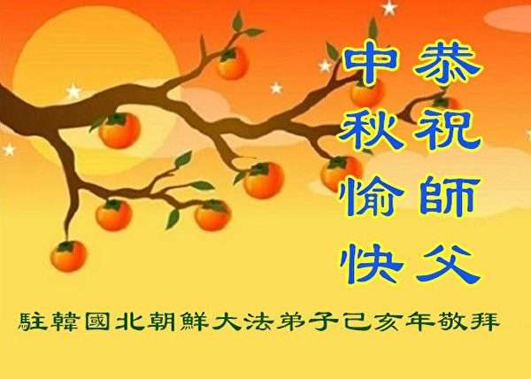

旅居韩国全体大陆大法弟子恭祝李洪志师父中秋节快乐！

韩国政府机关大法弟子恭祝李洪志师父中秋节快乐！

韩国驻中国大法弟子恭祝李洪志师父中秋快乐！

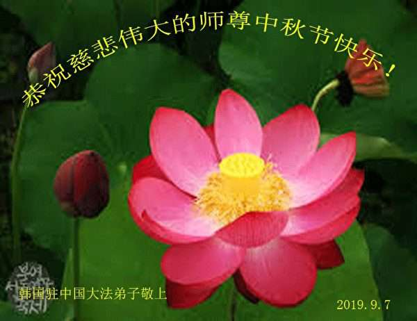

韩国腰鼓队大法弟子恭祝李洪志师父中秋快乐！

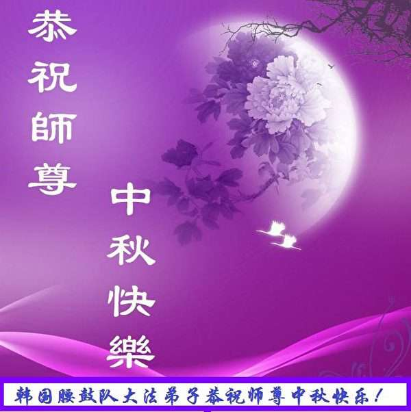

台湾全体大法弟子恭祝李洪志师父中秋节快乐！

台湾花莲大法弟子恭祝李洪志师父中秋快乐！

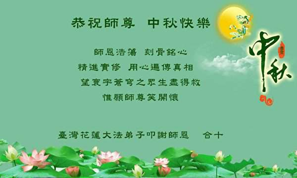

日本岛根大法弟子恭祝李洪志师父中秋节快乐！

日本神奈川县法轮大法弟子恭祝李洪志师父中秋节快乐！

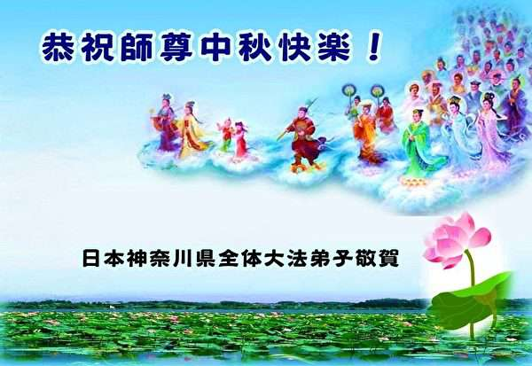

日本天国乐团全体大法弟子恭祝李洪志师父中秋快乐！

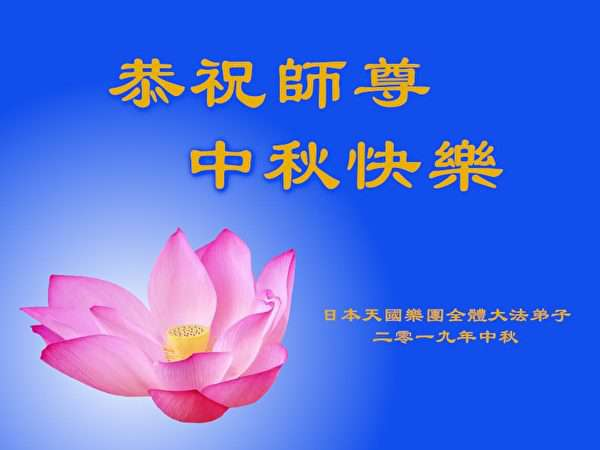

马来西亚大法弟子恭祝李洪志师父中秋快乐！

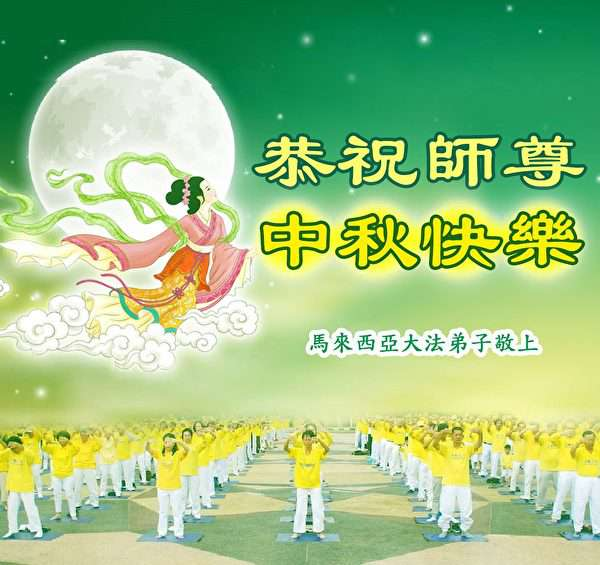

马来西亚吉隆坡独立广场景点大法弟子恭祝李洪志师父中秋快乐！

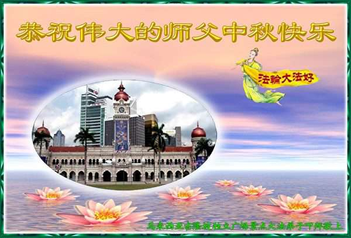

暂居马来西亚的大陆大法弟子恭祝慈悲伟大的师父中秋节快乐！

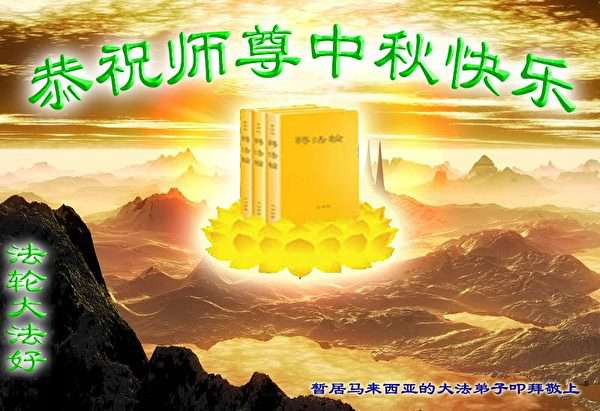

幸遇师尊慈悲苦度 
廿载师尊多少辛苦 
倾尽所有保护付出 
千难万险师尊挡住 

幸遇师尊慈悲苦度 
一路师尊不断点悟 
荆棘坎坷重重迷雾 
破除观念美妙难诉 

幸遇师尊慈悲苦度 
穷尽言语难以表述 
中秋佳节遥寄祝福 
合十叩拜感恩师父

马来西亚吉隆坡亚罗街景点大法弟子恭祝李洪志师父中秋快乐！

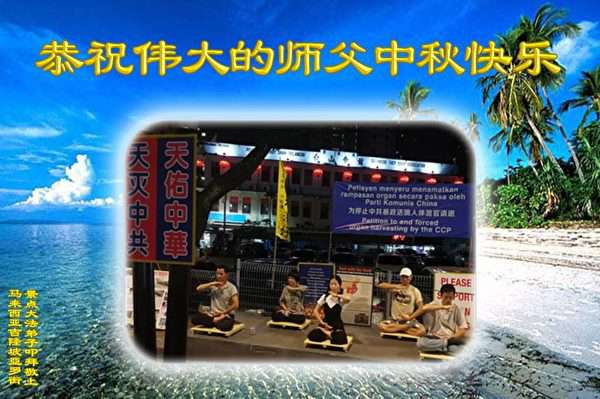

乾坤震撼法轮转 
皎皎皓月神如电 
师尊垂怜度苍生 
法徒救人不怠倦 
“真、善、忍”光芒照寰宇 
灭尽红魔阴霾散 
大法救度天地颂 
众生醒悟上渡船

印度尼西亚全体大法弟子恭祝李洪志师父中秋节快乐！

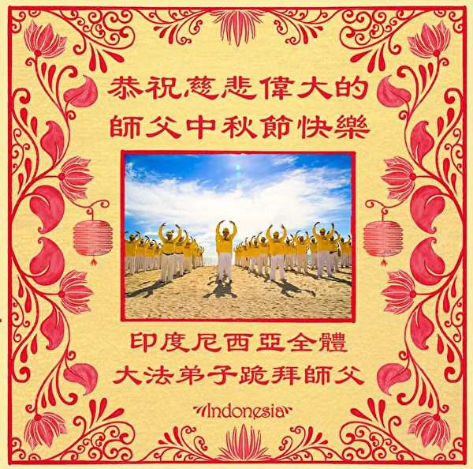

泰国青年大法弟子恭祝李洪志师父中秋快乐！

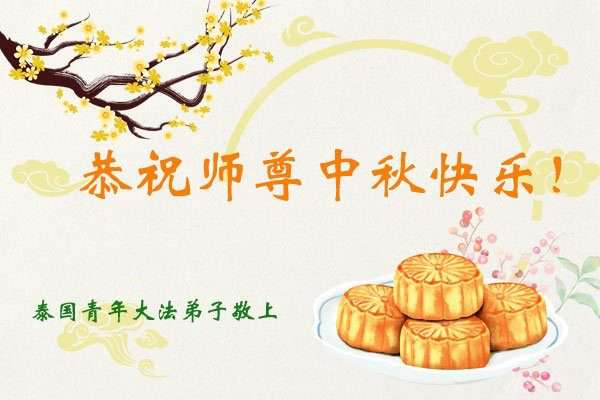

泰国大法弟子恭祝李洪志师父中秋快乐！

暂居泰国的中国大陆大法弟子恭祝李洪志师父中秋快乐！

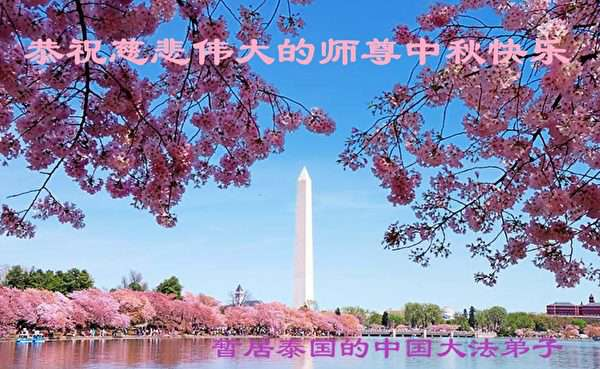

越南大法弟子恭祝李洪志师父中秋快乐！

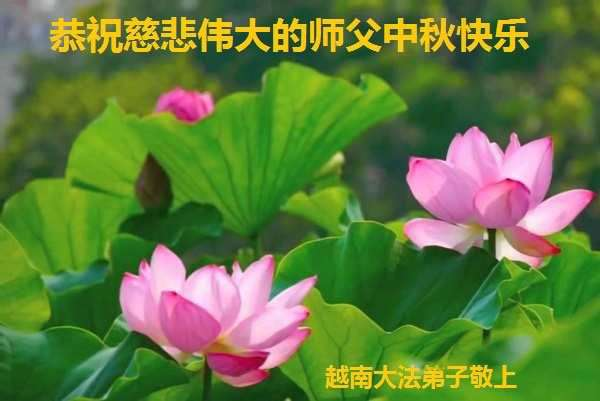

越南河内市全体大法弟子恭祝李洪志师父中秋节快乐！

“中秋节来临，我们越南河内市全体大法弟子恭祝慈悲伟大的师尊中秋佳节快乐！ 
  诚心感谢师尊修炼路上的一路看护！弟子用千言万语也表达不尽师父对我们的救度之恩。”

越南河内市全体大法弟子敬上！

菲律宾大法弟子恭祝李洪志师父中秋快乐！

新加坡全体大法弟子恭祝李洪志师父中秋节快乐！

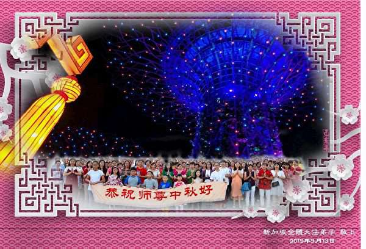

欧洲希望之声全体大法弟子恭祝李洪志师父中秋节快乐！

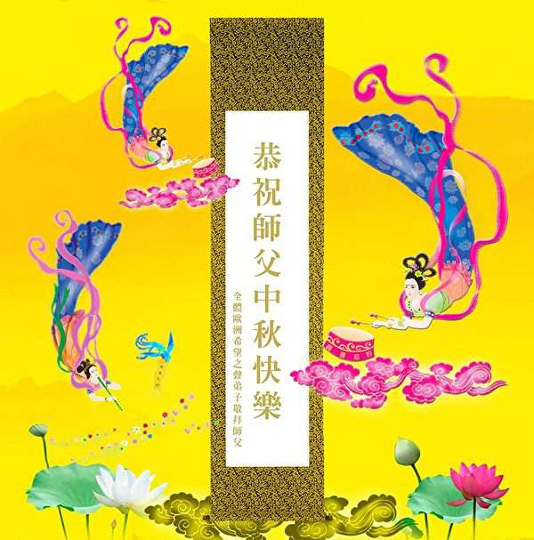

德国大法弟子恭祝李洪志师父中秋快乐！

德国巴伐利亚全体大法弟子恭祝李洪志师父中秋快乐！

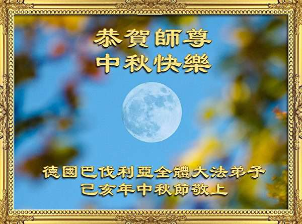

德国斯图加特大法弟子恭祝李洪志师父中秋快乐！

德国杜塞尔多夫全体大法弟子恭祝李洪志师父中秋节快乐！

英国全体大法弟子恭祝李洪志师父中秋快乐！

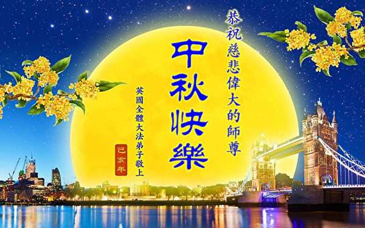

英国腰鼓队全体大法弟子恭祝李洪志师父中秋节快乐！

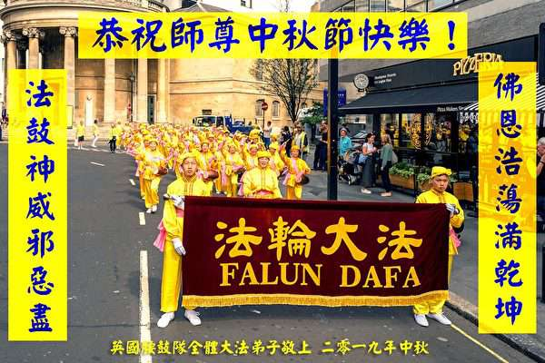

法鼓神威邪恶尽 
佛恩浩荡满乾坤

法国全体大法弟子恭祝李洪志师父中秋快乐！

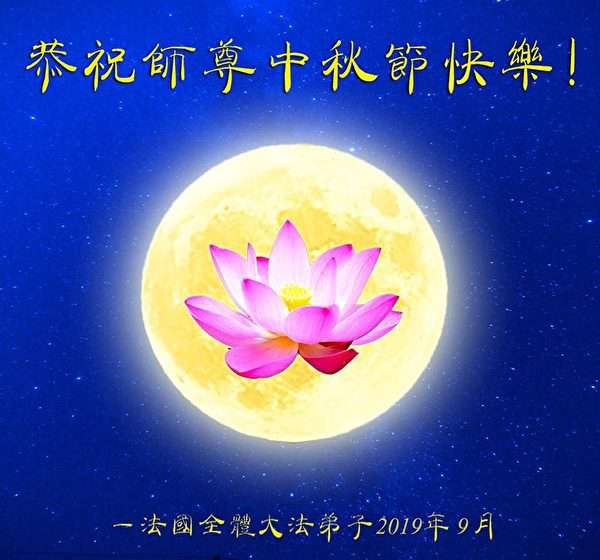

秋月感恩

秋高月满韵清澄 
法正寰瀛显大能 
万众欢欣得救度 
洪穹处处感恩声

芬兰全体大法弟子恭祝李洪志师父中秋快乐！

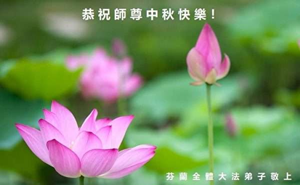

丹麦全体大法弟子恭祝李洪志师父2019己亥年中秋快乐！

西班牙全体大法弟子恭祝李洪志师父中秋快乐！

西班牙大法弟子永远感激师父！衷心恭祝师父中秋节一切顺利！

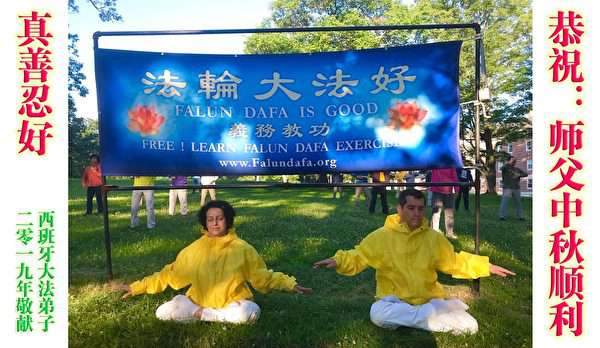

全体意大利大法弟子恭祝李洪志师父中秋快乐！

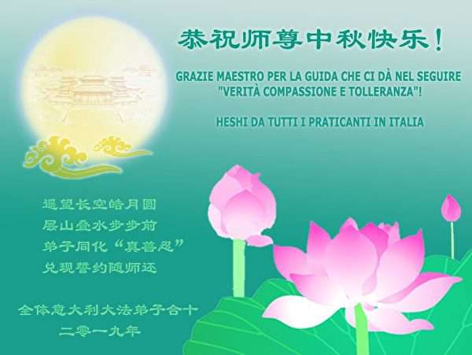

遥望长空皓月圆 
层山叠水步步前 
弟子同化“真善忍” 
兑现誓约随师还

意大利罗马大法弟子恭祝李洪志师父中秋快乐！

罗马尼亚大法弟子恭祝李洪志师父中秋快乐！

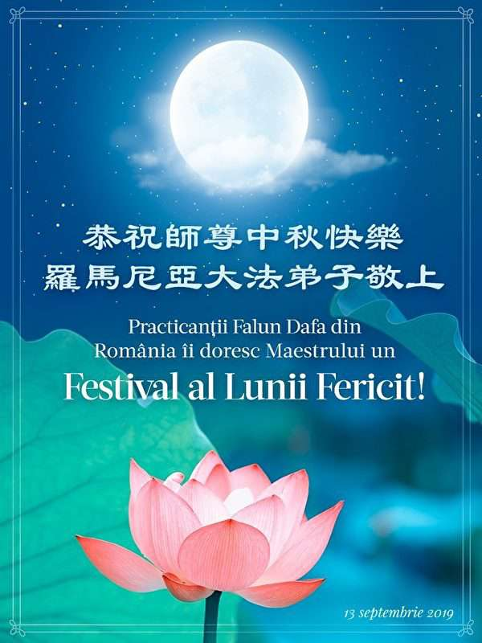

俄罗斯大法弟子恭祝李洪志师父中秋节快乐！

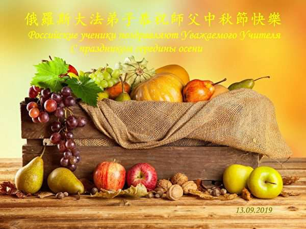

莫斯科大法弟子恭祝李洪志师父中秋快乐！

爱尔兰全体大法弟子恭祝李洪志师父中秋快乐！

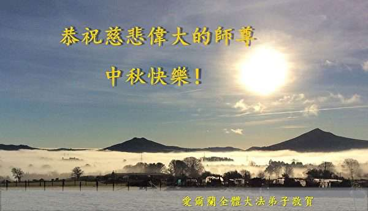

比利时全体大法弟子恭祝李洪志师父中秋快乐！

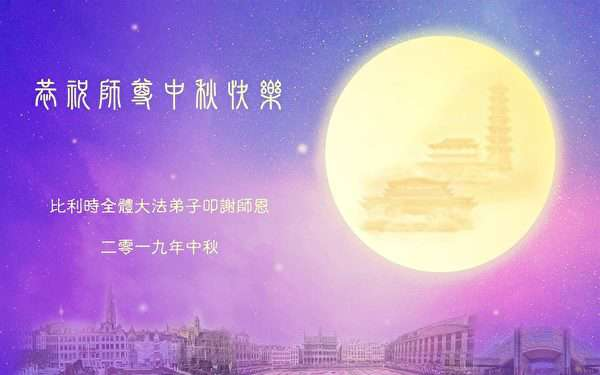

瑞士大法弟子恭祝李洪志师父中秋快乐！

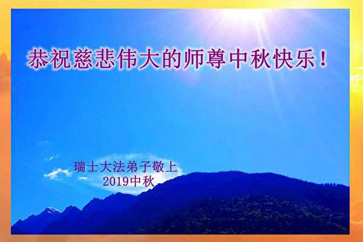

荷兰大法弟子恭祝李洪志师父中秋快乐！

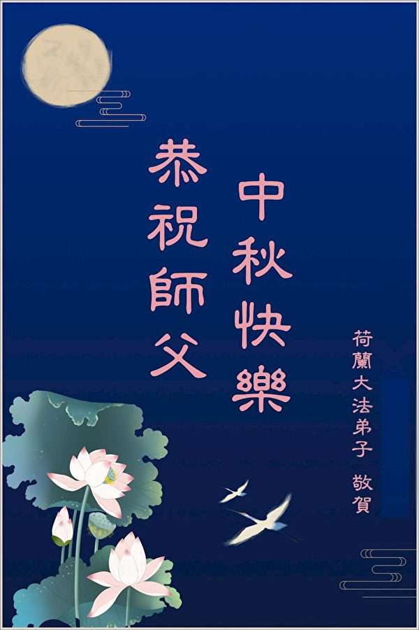

瑞典全体大法弟子恭祝李洪志师父中秋快乐！

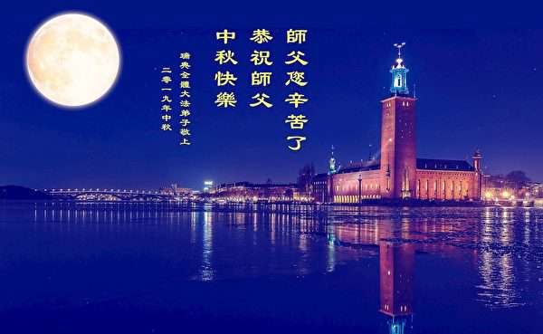

挪威全体大法弟子祝李洪志师父中秋节快乐！

捷克和斯洛伐克全体大法弟子恭祝李洪志师父中秋快乐！

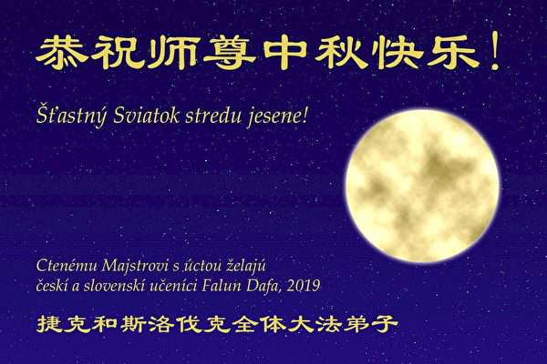

波兰全体大法弟子恭祝李洪志师父中秋快乐！

克罗地亚大法弟子恭祝李洪志师父中秋快乐！

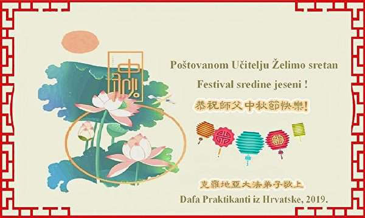

土耳其全体大法弟子恭祝李洪志师父中秋快乐！

巴西利亚大法弟子祝李洪志师父中秋节快乐！

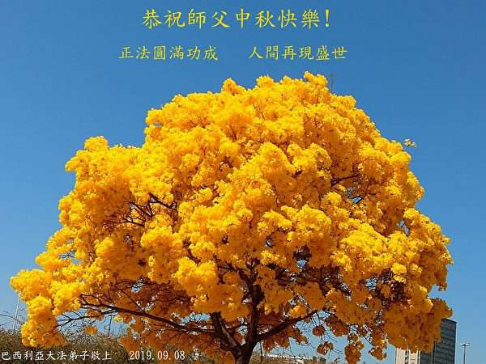

伊朗全体大法弟子恭祝李洪志师父中秋快乐！

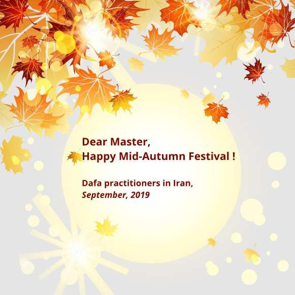

阿联酋迪拜大法弟子恭祝李洪志师父中秋节快乐！

文字整理：李洁思，责任编辑：高静

<a href=#list><h4 align="right">回上方</h4></a>
<a name=a1><h3 align="center"><b>感恩节 纽约腰鼓队法轮功学员谢师尊（上）</b></h3>
 

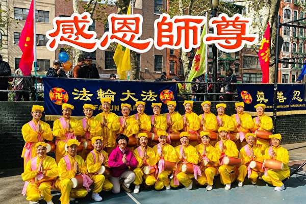

【大纪元2019年11月29日讯】（大纪元记者李桂秀纽约报导）“师尊您好：我们是纽约法轮大法腰鼓队的全体大法弟子，在感恩节来临之际，向您敬上最谦恭、虔诚的问候：‘师尊好！恭祝师尊节日快乐！您为救度我们，辛苦了！’”纽约法轮大法腰鼓队的全体大法弟子在感恩节之际，向法轮功创始人李洪志先生表达敬意和感恩。

腰鼓是用于表达欢乐、丰收、喜庆的中国传统器乐，有1,000多年的历史。她们表示，腰鼓队承继中国传统，遵循“真、善、忍”的教导，传播着法轮大法的美好，所到之处受到各地民众的欢迎并多次获得嘉奖。有观众不停地竖起大拇指，口中喊着“Fa-Lun-Da-Fa”（法轮大法）；有的观众看到法轮大法腰鼓队来了，行90度的鞠躬大礼；天气炎热时，观众从自己家中搬出一个大电风扇，送来凉爽的风；军校学生看到腰鼓队的表演时，向她们行军礼。

纽约腰鼓队成立于2003年4月，在16年中，足迹遍及了华盛顿DC、洛杉矶、芝加哥、费城、宾州、特拉华州、南弗吉尼亚州、新泽西、康州、纽约市五大区：长岛各个小镇、史泰顿岛、纽约上州、罗德岛，以及加拿大多伦多等城市。

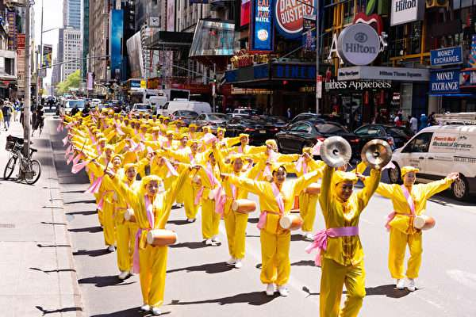

纽约腰鼓队在游行活动中受到民众的欢迎。（纽约腰鼓队提供）

以下是纽约腰鼓队成员介绍自己修炼后身心受益的经历，并向李洪志师父表达感恩之意。

<b>修炼大法，我是世界上最幸福的人</b>

我叫阎富兰，今年75岁，从15岁到退休，一直是专业京剧演员。我1996年初得法轮大法，得法之前得知1994年7月底李洪志大师要到哈尔滨讲法办班，那时觉得气功是练武术人的事情，与我没啥关系，与大法擦肩而过。

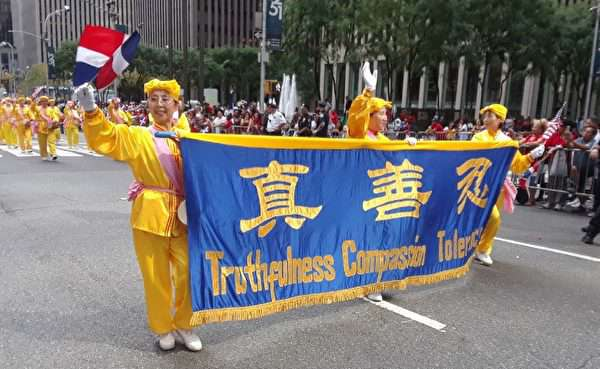

阎富兰（左一）在腰鼓队游行队伍中。（纽约腰鼓队提供）

直到1996年初，我身体突然出现了脑血栓症状，手脚不会动，也不能说话了，女儿回来一看立即把我送到了医院。正在打点滴的时候，修炼法轮功的妹妹来看我，带来了一本书《法轮功》（修订本）。她对我说：“看看这本宝书你就什么都明白了。”

妹妹走后，我用半天的时间一口气看完了这本书，一下子明白了人有病的根本原因是自己业力所致。

在看第二遍时，师父给我净化了身体！我这个即将瘫痪的人在两周内完全恢复了健康！此时我的小弟看到我神奇康复，也开始修炼法轮功。我们兄弟姐妹们一起看了李洪志师父的《广州讲法》录像。在看第七讲时，师父把小弟抽了二十三年烟的身体净化了，小弟找了很多医生都没有看好的多年肺炎不翼而飞。

家里所有人看到我们的身体变化都很吃惊，说：“法轮功太神奇了，感谢李大师救命之恩！”

更神奇的是在师父的保护下，我三次车祸没有出现危险。仅举一例，一次在过马路时，一辆面包车从自已的左脚指头上轧过去竟然没事，司机当时吓的连话都说不出来了，我平静地对他说：“没事，没事。”停一会他突然喊：“遇到活神仙了，谢谢大姐！”我说：“都是大法保护了我，其中包括你，要谢就谢李洪志大师吧！感谢大法！”那司机说：“是是是，我也要去了解了解法轮功。”

法轮功师父救了我们兄弟姐妹们的命，使我们获得了新生。师父啊，用什么语言也表达不了对您的救度之恩的感激。感恩节是感恩的日子，我最想说：“感恩师尊，我今生能修炼法轮大法，我是世上最幸福的人！”

<b>谢谢师父，大法使我成为善良的人</b>

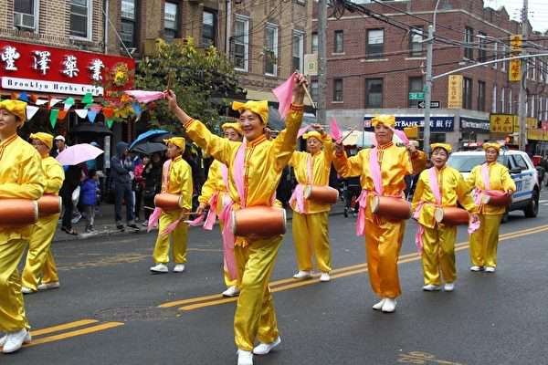

谢建荣（前一）在腰鼓队游行队伍中。（纽约腰鼓队提供）

我叫谢建荣，来自山东青岛，1998年初得法。那时我的腰椎病经常发作，曾尝试过各种治疗，什么针灸、按摩、贴膏药、电兴奋、醋疗、私家偏方等等，都没有起到明显的治疗效果。病情时好时坏，而且犯病越来越频繁越来越严重，1998年发展到更加严重的程度，坐下起来都很困难，躺下后自己翻不了身，不仅疼痛还不能完全自理，影响到工作及生活，那种痛苦天天在折磨着我。

在朋友的介绍下，我去了军区疗养院专家门诊再次检查治疗。在那里拍X光片后，确诊为腰椎间盘严重的突出膨出及椎管狭窄，治疗方案是按疗程按摩加针灸，还加了注射封闭针。在我治疗期间，有一次医生给我下好针后，就和他们几位同事说起炼功的事，他们还说到一本书，里面说的是怎么修炼的事。当时我就联想到自己的身体，赶紧问医生：你们说的是什么功？我炼行吗？医生说需要先看《转法轮》这本书，看完之后觉得能接受，就可以教炼功。

于是我向他借了这本听起来很宝贵的书，回家后正赶上开始过年放假，我如饥似渴用了几天时间把书看完。越看越喜欢看，有些地方看不明白就会返回来再看，所以看的比较慢。看完之后，就感觉我找到了自己的归宿，感觉到这才是我的精神支柱。当然更深的感受是在日后的修炼过程中逐渐体会到的。

记得当时最让我释怀的事情是对“吃亏”的认识，过去不是怕吃亏，而是怕吃了亏被别人看成窝囊废、无能，被人瞧不起。看书后明白吃了亏得到的是德，德是白色物质，是和宇宙特性相融洽的，是可以转化成功的，是最珍贵的东西。第一次真正明白了为什么说“吃亏是福”。

更重要的是读了《转法轮》之后，我的世界观开始发生了变化，从无神论进化论的悖论中走出来了，从那种与天斗、与地斗、与人斗其乐无穷的人生观中醒悟过来。明白了“真、善、忍”才是衡量好坏人的唯一标准。我迫不及待地等到7天年假结束，就去找到医生，把五套功法一次性学会了，从此开始了每天炼功、学法、提高心性的修炼之路。

通过学法，在提高心性过程的开始，我就解决了一个生活中最纠结的问题，即我和继母的关系。继母是带着五个孩子的寡妇，文革后我高中毕业那年，她与父亲结婚的，比父亲小十几岁。那时父亲已被平反，工资全部补发享受所谓的老红军待遇。继母这时与父亲结婚，人人都说她是为了钱为了名利而来的，可想而知，我们之间的矛盾是水火不相容的。

直到父亲去世，我家的房子、积蓄、抚恤金等所有的一切都在她的掌控之中，我们孩子没获得任何继承权。

就是在这样的前提下，修炼大法的我只想到按师父讲的“真、善、忍”做人，我想到了与继母善解，也就是要放下人心的怨恨，一切为他人着想，用慈悲的心去对待身边的人和事。

我调整好自己的心态迈出了第一步，到父亲过世的房子去看望继母。当我站在她的门口时心里感到空前的踏实、坦然，听到敲门声她开了门，看到我，她愣了一下，以为是来讨说法的，板着脸说：“你来干什么？”我笑着说：“阿姨，我是来看望你的。”她不情愿地让我进屋了，还没坐稳，我赶紧解释：“阿姨今天是想来向你道歉，过去年龄小不懂事，说话做事很不尽人意。其实我们都是女人，你一个人带五个孩子多不容易，我真是应该理解你。现在我修炼了才知道自己做的不对，今后有什么事可以告诉我，我会好好对待你的，想出去走走就打电话，我开车带你去海边看看。”

她好像一下子还没有返过神来，似信非信地说：“自己也有不对的地方……”临走时我给她留了一千块钱，告诉她是我的一点心意，想吃什么可以自己去买点吃。可能是她感受到了我的真诚，当时她的态度突然变了，脱口说：“哎呀！我这不是折寿吗！”她不要，但我还是留给她了。

送我走的时候，她的态度完全不同了。过后我回想一下，真是像《转法轮》书里讲的法理，任何时候遇到问题向内找自己哪里做的不对，去掉了那个执著不好的东西，事情自然会发生变化。我初次感到慈悲的力量太强大了，我想起师父在书中说：“因为修炼的人是最珍贵的，他想修炼，所以，发出的这一念是最珍贵的。佛教中讲佛性，佛性一出，觉者们就可以帮他。”（《转法轮》第一讲第六段）我更坚定了修炼的信念。心里默默地再次感恩师父慈悲救度。

在日后的修炼道路上，还出现了很多这种事情，无论是身体上，还是思想上及心性方面都有过意想不到的经历，我首先想到的就是师父讲的“真、善、忍”。“真、善、忍”使我返本归真，是我终生的归属。感恩节对我最想感恩的人由衷地说：“谢谢师父，大法让我成为善良的人。”

<b>每当想到“师父”这两个字，就会感到非常幸福</b>

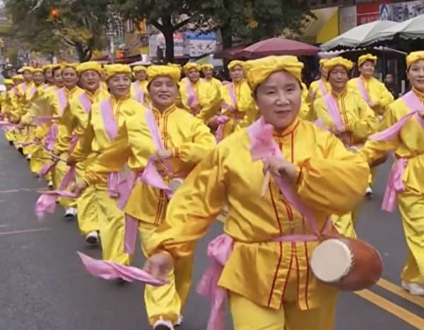

田忠霞（前一）在腰鼓队游行队伍中。（纽约腰鼓队提供）

我叫田忠霞，来自中国的安徽省合肥市。今年63岁。修炼法轮大法已有25年了，而这25年对我来说，却是新生命的开始。如果不是遇到大法，我应该已经死了。

我出生在一个不幸的家庭。我一岁时父亲就去世了，由于哥哥姐姐与我年龄差距较大，他们对自己的家庭和工作已经自顾不暇，根本没有谁能真正顾及到我。我是和单亲妈妈相依为命，而母亲每天工作都是早出晚归，小小的我就形同孤儿一般。没有家庭的温暖呵护，不懂世事的我，曾经险些被水淹死，差点被火烧死。

我生长在不幸的年代。在中共的统治下，在我六七岁时，经历了毛泽东时代“大跃进”、“三年大饥荒”，那时，我险些被饿死；在我少年时代，经历所谓的“文化大革命”运动，在我们应该学习文化的年龄，学业被荒废，文化教育被彻底打翻；我在青春时期，又经历所谓的“上山下乡”运动，我一个弱小的女孩子只能任由安排，被下放到农村接受漫长岁月的苦难煎熬……等等。

正所谓内忧外患，令我的人生充满了悲剧的色彩。我的健康状况一直很差，特别是在我9岁那年，因为跑着横穿马路，我被一辆轿车迎面撞向头部，后脑被重重地摔在地上，我当场就昏死过去。

然而，由于家里没有能够管事的人，只是见我手脚没有残缺，并且人还活着，就不了了之了。没想到，这带给我日后无尽的病痛折磨，我常常在呕吐和天旋地转的状态中备受煎熬。这就是“脑震荡后遗症”。

除此以外，我还患有贫血症、血压低、心律不齐、心动过缓、肾虚肾炎、胃病、习惯性便秘等等疾病。再加上我结婚后有习惯性流产和剖腹产，我的身体健康状况就变得更加糟糕。那时，我还不到40岁，就已经是个被疾病缠身的药罐子了。中药西药我都吃了太多太多，药物也在产生着副作用。最后，我竟然变成一个“药物过敏症”患者。这些状况就等于是在告诉我：你已经到了无药可治的程度，只有死路一条了。

拖到1995年，由于受不了对家庭情感方面的失望和身体上疾病的痛苦折磨，我真是感到生无可恋。因此，我产生了想要“安乐死”的念头。

然而，就在此时，我有缘遇到了法轮大法。那是1995年11月6日，早晨我路过合肥市银河公园，看到有些人在炼功，我顺便看看，知道了这是法轮功。当时就有人建议我去书店找书看看。我没有犹豫，立即就去书店找到了《转法轮》和《中国法轮功（修订本）》。好像有一种莫名的动力，我一拿到书就放不下了。因此，我不分昼夜一口气读完了《转法轮》。之后我感到眼前豁然开朗，如获至宝，我立即就去炼功了。

过去，我总是抱怨命运对我不公。修炼之后我终于在《转法轮》书中明白：自己之前吃苦并不是坏事，因为吃苦会消去业力，从而转化为德。这一念之差，反映出自己的世界观发生了根本的变化。

那时候，我一想到“师父”这两个字，就会感到非常的幸福，因为自己这几十年就像是个迷路的孩子，如今我有师父了，师父在领我们回家。

在那些日子里，我每天都像个孩子一样心里充满快乐，生命也充满了活力。我每天在早上3点多钟就去炼功点，首先是把炼功点打扫干净，​​之后就开始炼静功——打坐。然后再和大家一起炼动功。整套功法结束后，我就开始了一天繁忙的工作、学习和生活。

因为炼功，虽然睡眠的时间很少，但是，我不但没有感到疲倦，反而感到前所未有的轻松和自在。不知不觉中，炼功才一个多月，我突然意识到曾经折磨我的病痛都不翼而飞了，真是无求自得。法轮大法的神奇就这样在我身上有了真实的展现了！

这胜于雄辩的事实，令我产生了对法轮大法不可动摇的信念，因此，无论中共的邪恶谎言和疯狂打压到何种程度，都不能改变我坚定的信念。在大法遭受中共的邪恶疯狂迫害和造谣抹黑时，民众被铺天盖地的谎言所蒙蔽。怎么办？为了解救世人，就需要大量的真相资料去唤醒民众。

就在这种紧急需求的时候，大法又一次次在我身上展现了神奇，让我这种对网络和电脑等机器设备一窍不通的人，竟然在很短时间内完全掌握了资料点所需的各种技术。这是令人难以置信的，但是却是实实在在真实存在的。

我们的资料点正常运行4年多，最后还是遭到了中共警察的破坏，我也因此被非法投入劳教所遭受迫害。

如今，我奇迹般来到美国，在纽约和大法弟子融合在一起，做着各种各样证实大法、向民众讲清真相的事情。

每当腰鼓队在行进的时候，我都会感到法鼓声声带有善的力量在向外喷发！光芒所及之处，民众在为我们欢呼跳跃，我为这些明白真相得救的生命由衷地感到高兴！我知道这一切都是大法的威德，是师父的慈悲救度。

我的一生中，师父是我最要感恩的人。

（未完待续）#

责任编辑：李缘

<a href=#list><h4 align="right">回上方</h4></a>
<a name=a2><h3 align="center"><b>感恩节 纽约腰鼓队法轮功学员谢师尊（下）</b></h3>
 

2019年11月25日。纽约腰鼓队向师尊李洪志先生表达感恩之意。（纽约腰鼓队提供）

【大纪元2019年11月29日讯】（大纪元记者李桂秀纽约报导）（接上篇）

<b>感恩师父，我们全家沐浴在大法的福泽之中</b>

我叫魏俊茹，来自中国北京。记得儿时我家住的是平房，院子很宽，一到夏天晚上邻居们就在院内乘凉，每当这时我就会久久地凝视着天空中的月亮与满天的繁星，心里总是在想：我原来会不会在那里呢？随着慢慢地长大，淡忘了儿时的记忆，逐渐地走入了这个污浊的世界，渐渐地随波逐流，迷失了方向。

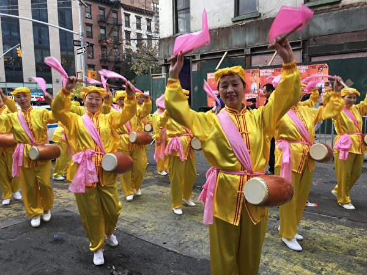

魏俊茹（前一）在腰鼓队游行队伍中。（纽约腰鼓队提供）

1995年，我看到每天不吃饭也要吃药的父亲停止了吃药，每天早晚都去公园炼功，又看他在读一本厚厚的书——《转法轮》。没多久他的脸色红润了，人也越来越精神，而且每次他们单位举行运动会他总是中老年组跑第一名。神了！这人吃了几十年的药身体都没好，怎么就看看书、炼炼功就好了？当时怎么也没想明白。

我从小体弱，发烧、感冒是家常便饭，故父亲多次劝我修炼，我都以工作忙为借口，推说将来退休了再炼。但每次去公园总是要到炼功点看看，只要一到那里就感觉心里特别舒服，很愿意在那里待，虽然没有走入修炼，但我对法轮功的印象是非常正面的。

2010年5月我突感颈椎疼痛并伴有四肢麻木、头晕、恶心吃不下东西，没过两天连走路都感觉困难、坐都坐不住，经北医三院诊断为急性交感神经发炎，输液十五天，一点好转的迹像都没有。

正值此时父亲赶到我家对我说：“既然医院看不好，那你就跟我修炼法轮功吧。”我在无望中想到：北医三院那是北京乃至全国来讲都是最好的医院了，这都治不好我的病，那么只有试试修炼法轮功这条路了。

于是我捧起了《转法轮》认真阅读，强忍着病痛坚持炼功，在第三天炼静功时突然感觉到有人从我颈椎处揪走一个东西，当时疼的我尖叫一声，父亲闻讯询问怎么回事，我叙述了刚才的事，父亲高兴地说：“师父管你了。”我摇了摇脖子，本来僵硬的脖子现在感觉轻松润滑了，我笑了，双手合十：感恩无量慈悲的师父告诉我宇宙的法理“真、善、忍”，教我做好人，修心向善，又给我拿掉这一业力，让我重获新生，走上返本归真之路。由此我也真正感受到师父在《法轮功》中讲的：“初听起来可能觉的玄，但对有志于气功修炼者，只要细心体悟，奥妙尽在其中。”（《法轮功》概论）

儿时的记忆又回来了，我知道那不是梦想，只要我按照这部大法去修就能回到天上的家园。明白了这一切之后我学法炼功绝不怠慢，很快身上所有的病状完全消失了，每天快乐无比，感觉修大法真好！

亲身见证了大法的神奇，因此我每天把学法炼功放在首位，并注重修心性，包括自己的一思一念、一言一行。2015年我家想改善一下居住条件，便卖掉了老人留给我们的房子。

早前因丈夫在家最小，单位规定家中一人不可分房，那时丈夫的哥哥、姐姐均有住房，故家中老人便把他们的住房变更到丈夫的名下，哥哥姐姐也同意。

卖房后我跟丈夫说：房子我们可以住，现在咱们卖了就得给你哥哥姐姐钱，毕竟是老人留下来的房子。于是我们就分别给了他们几十万，这一点哥哥姐姐没想到。我深深知道：在当今的中国，物欲横流，把钱看得比什么都重要，能做到这一点，这都是因为我修炼了大法。

由于邪党文化的灌输，起初我丈夫对法轮功有着不正确的认识，看到我身心的巨变，他明白了真相、转变了观念，内心非常认同大法也非常支持我修炼，经常跟我一起学法，帮助我做了许多大法的事，只是不炼功。为了使他能尽快地走入修炼，2016年10月我们参加了旧金山法会，当丈夫看到了集体大炼功及壮观的游行队伍，他为之震撼，看到法轮功学员在中领馆前举行的烛光守夜，静静地打坐悼念在中国被迫害致死的法轮功学员，使他感受到了强大的慈悲能量场，同时他被法轮功学员的善良深深地折服，从美国回大陆的第二天毅然走入修炼。

2017年4月我与丈夫来到了美国，我们很快适应了这里的环境。6月底父亲也来到美国。

心底深处，我无比感恩师父：是您让我家三个修炼人汇集在一起，每天沐浴在大法的福泽之中，比学比修，精进不怠。

我庆幸自己能成为一名法轮大法的修炼者，更幸运于是腰鼓队这项目中的一员。借感恩节到来之际只想跟师父说：师父，您好！感谢您为弟子所做的一切，弟子将努力按“真、善、忍”修好自己，随同腰鼓队参加游行多讲真相，让法轮大法洪扬天下。弟子叩谢您！再谢！

<b>在法轮大法的照耀下，破迷重见光明</b>

我叫严柠，来自中国大陆天津市。从1994年得法，至今已走过了25年多的风风雨雨，一路磕磕绊绊，在师尊的慈悲呵护下，走到了今天。

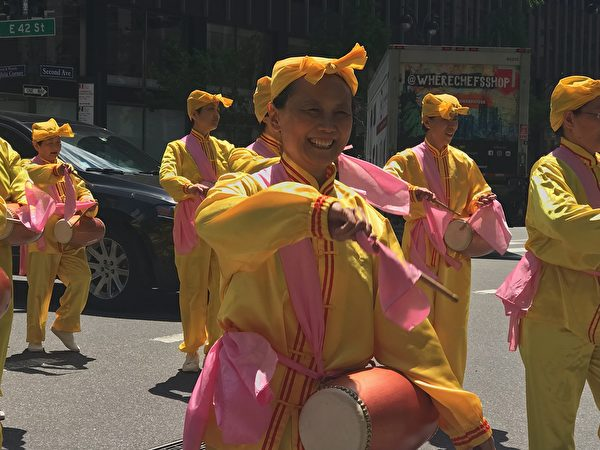

严柠（前一）在腰鼓队游行队伍中。（纽约腰鼓队提供）

我为祛病健身曾练过几种气功，均未奏效。30多岁时患有心肌缺血、充满性胆结石、支气管扩张、妇科病、腰椎增生、全身骨痛、坐骨神经痛、偏头疼、美尼尔综合症、严重的抑郁症。32岁开始，9年中有超过5年下岗，最后工作的中专学校也解散了。丈夫是个好人，但我俩的性格极不相投，感到婚姻不幸福。身体百病缠身、工作事业极不顺利、婚姻也不如意，像一张无情的大网把我困在其中，苦不堪言。我已经走进了人生的死胡同，感觉无路可走！因此曾想出家当尼姑。

随着年龄的增长，工作和家庭生活的压力，身体疾病不断出现，我心中的迷惑在脑海里常常萦绕：人为什么活着？为什么有生老病死？人一死“一了百了”吗？我为什么工作事业极不顺利？身体百病缠身？婚姻感觉不幸福？人生的真义何在？人应该怎样活着？这些问题像一团迷雾遮住了我的双眼，让我看不到人生的光明和希望，悲观厌世的想法常常涌现。

在难熬的人生痛苦中，一次偶然的机会使我走入了大法修炼中。那是1994年年初的一天，我到一个气功师那里去治胆结石病。她拿出两张票，说有一个气功师要来天津传功讲法，让我和她一起去听报告会！我说不去。因为这几年我参加了在天津办班的多名“气功”大师的报告会，并学了气功，也没见效。这时她又给我看一些图片和法轮功的简介并再次说：“你和我一起去吧，这张票就是给你买的。”我不好意思推脱就答应了，心里却想：最后上一次当吧！

1994年1月17日，一个令我终生难忘的日子：我亲耳聆听了李洪志师父在天津科学会堂的传法班，当听到师父讲“真、善、忍”是宇宙的特性时，内心一震，这三个字太好了！如果人类社会的每一个人都按照师父所说的去做，那人间将会是多么的美好啊！师父首先讲到如何去做一个好人，一个更好的人，一个更高境界中的好人的道理。还讲了业力轮报、失与得、精神和物质的关系，以及做人的真正目的、修炼的内涵等等。翻遍古今中外所有的书籍找不到将宇宙、时空、人体之谜揭示得如此透彻的法理了!

1994年3月14日，我有幸再次聆听了师父在天津八一礼堂举办的第二期传功讲法班。由于被中共“无神论”的洗脑，在第一次听师父讲另外空间，以及功能、神通和佛、道、神的法时，我内心深处有些半信半疑。虽然在家也炼功，但只是为了祛病健身并没有实修。不过，“真、善、忍”却在心里扎了根。

1999年1月17日凌晨打坐，我哭了，泪流满面，明白了大法是生命久远的期盼与内心深处的呼唤！心想这么好的高德大法，我要下定决心实修自己。当天下午，碰到邻居同修跟我说：“今天是师父在天津传法五周年纪念日，刚刚开过3,000多人的洪法大会，好几个小弟子开天目看到：师父的法身就在会场的前上方，高大无比、金光闪闪，整个会场都被光笼罩着，非常美妙、神奇、壮观！”

从那天开始，我真正实修了。那时，我已经因病吃劳保在家没工作了，除了做家务、经常探望家里几位老人外，每天3点半起床，听半个小时讲法录音，4点半带着录音机到外面与大约30人一起集体炼功，五套功法一步到位。在半年时间里，我背会了师父的诗词《洪吟》，并如饥似渴地学法，一年里看了30多遍《转法轮》。

我每天对照师父的法找自己的执着心，并努力放淡、放下这些人心。明白了师父在《转法轮》中讲的：“整个人的修炼过程就是不断的去人的执着心的过程。”因此当关、难来时也能向内找，使自己的道德境界不断提升。

我先生是一个淡漠名利、孝敬父母、敬业勤劳的人，但我俩性格反差很大，他性格固执、脾气倔犟、思想简单，家事从不协调。我性格内向、爱生闷气，我俩一有矛盾，就冷战几天。尽管我孝敬公婆、抚养女儿，结婚十多年了也没有和先生沟通与交流过。婚后的前几年，老少三代八口人挤在两间屋里生活，对此我郁闷成疾。曾一度有想离婚的念头。

修炼前，因为我总想改变丈夫却改变不了，我陷入了人生的迷茫。修炼后，大法指导我修心，我开始向内找。师父在《新加坡法会讲法》中开示：“我们往往碰到任何事情的时候都是在向外看，你为什么这样对我？心里头有一种不公的感觉，不去想自己，这就是所有生命的一个最大的、致命的障碍。过去一些人讲修炼不上来，怎么能修炼上来呢？因为这是一个最大的障碍，谁都不愿意去在矛盾中看自己，觉的自己遭受痛苦了、遭受不幸了还要找找自己，看看自己哪里做的不对，真的很难做到的。如果谁能做到，我说在这条路上，在修炼的这条路上，在你生命的永远，都没有什么能挡住你，真是这样。因为我们都有思想的，在道理面前，尽管我们心里有的时候明白还是过不去，可是毕竟我们心里明白，知道哪个是对的，哪个是错的。一次做不好，两次做不好，我们以后会做好，关键是你如何知道自己，如何能够正确的针对自己，找自己的原因。”

师父的法理句句讲到我心坎，再清楚不过了，我得明明白白地按照师父说的去做。

以前自己心胸狭窄又自私、名利心也重。实修后，我努力改变自己，在法中不断归正，彻底打消了离婚的念头，主动和先生沟通，消除了结婚前后产生的误会，心态逐渐从消极厌世转变成积极乐观。由总盯着先生的缺点、弱点不放，转变成多看他的优点，包容他的缺点，遇到矛盾找自己的问题，修正自己。基点变了，婚姻稳定了，家庭和睦了，心胸豁达了，还主动克服困难接婆婆到家中，将婆婆当作自己的母亲，每天快快乐乐的，生活充满了阳光。

仅半年的时间，我的身心发生了翻天覆地的变化：对社会、父母、家庭、先生的很多抱怨化解了，很多烦恼烟消云散了，很多痛苦的执著放淡了，严重的“抑郁症”不翼而飞了，吃得下也睡得香。修炼前患有的心肌缺血、充满性胆结石、支气管扩张、妇科病、腰椎增生、全身骨痛、右手腕经常写字震颤、坐骨神经痛都明显好转，偏头疼、美尼尔综合症等等不治自好。

一本《转法轮》解答了我人生所有的问题。人生就像一团迷雾，在法轮大法的照耀下，破迷重见光明！

二十五年过去了，弹指一挥间，内心的喜悦无法形容，心中不断升起对师父的无限感恩，谢谢师父把我从地狱里捞起，净化了我的思想和身体。人类的语言表达不尽我对师父的感恩之情，弟子谨在感恩节叩谢师尊的慈悲苦度！师父，谢谢您！

（全文完）#

责任编辑：李缘

<a href=#list><h4 align="right">回上方</h4></a>
<a name=a3><h3 align="center"><b>大陆民众得福报 敬祝李洪志大师新年好</b></h3>
 

2020年新年来临之际，大陆民众敬谢李洪志师父的恩泽并恭祝新年快乐。（明慧网）

【大纪元2020年01月03日讯】年前，大陆民众纷纷向海外明慧网寄去他们给李洪志师父的新年贺卡、祝词，真诚表达崇敬和感激之情。
 

他们亲身经历了法轮功（法轮大法）的美好和神奇，感受到“真、善、忍”的无边法力。身体和心灵得以净化，生命重获新生。

他们感佩李大师教导出来的大法弟子的正直和善良，面对残暴和不公，仍坚守信念的意志。

他们相信，历史会见证李大师和大法的伟大，祝愿李大师早日回家，让大法福泽神州大地。

明慧网记载了他们感人的故事和肺腑之言。
 
<b>亲历大法神奇</b> 
 

河南省洛阳市西工唐宫西路一对老年夫妇感谢李洪志师父的救命之恩。老先生曾两次不省人事，出现生命危险，每次都是家人想起了法轮功学员教给的话，虔诚地念：“大法好，大法好，求李大师快救救他……”不一会儿老先生就醒过来了。
 

老人的儿子担心，把老人送医院检查，结果做的各种化验指标都正常。如今，老太太每说起老伴的这些事时总是泪流满面：“大法是救人的，大法师父是救人的”、“我几生几世也感恩不尽师父的救命之恩！”

山东省烟台市招远一退休军转干部在五年前患了胃癌，手术后还做化疗，使他痛苦不堪。他的一位老同学来看望他，教他诚念“法轮大法好、真善忍好”的秘诀。他天天诚心地念。

五年多来，他再也没有做过一次化疗、没吃过一粒药，每年去医院做化验，一切指标都正常，现在他的身体非常健康。

这位退休干部真心感谢大法师父给了他第二次生命。

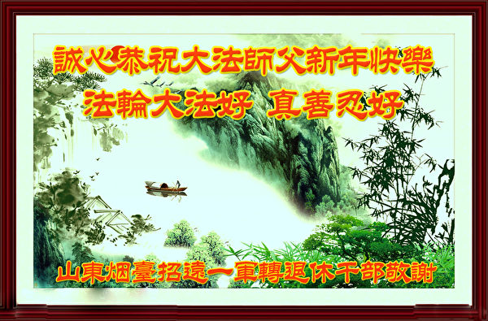

有三位八十几岁的老人都是退休二十几年的老干部，患有严重的疾病，医治无果，只好在家待着等死。后来他们从法轮功学员那得到了的护身符，并看到了不少有关法轮功真相的各种资料，明白了法轮功学员是修“真、善、忍”的好人，全世界都知道法轮功好。

他们抱着希望和信任，每天佩戴护身符，心情愉快，渐渐地他们的疾病都在好转。“我们衷心感谢李大师的佛恩，救了我们。我们也要按照您的要求做一个‘真、善、忍’的好人。”

一位来自山东烟台招远市的学生一生下来就有先天性心脏病。他的奶奶、爷爷都修炼法轮功。奶奶精心护理他整整八个月。后来到医院做彩超检查，发现他的心脏病完全好了，医生说是奇迹。奶奶告诉医生是大法救了他。

他说，他深知大法给了自己新生，“法轮大法好、真善忍好”伴随着自己茁壮成长。2019年，他还顺利地考上了一所理想的大学。“我和全家人永远感谢慈悲伟大的恩师，捍卫大法。”

一位来自山东省诸城市舜王街道王家庄子村里的妇女，今年51岁。2017年春，她患了子宫颈癌，精神一下子到了崩溃的边缘。她在医院治疗期间，有位法轮功学员告诉她：“诚心敬念‘法轮大法好’，病一定会好。”

她抱着一颗虔诚的心天天敬念。一个月后，医生对她说，她的病好了，可以出院了。自那以后，她常告诉别人：“法轮大法好！法轮大法太好了！”

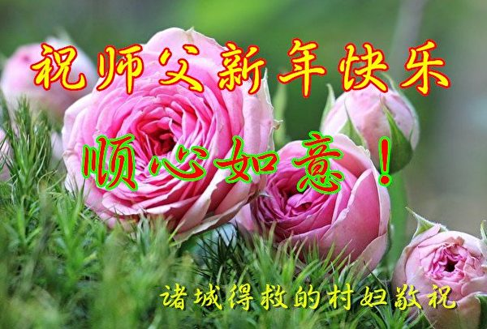

还有一位山东诸城舜王街道的人士说，他在2005年因肠梗阻做了大手术，因病情十分严重，医生对他不抱希望，告诉他活一天算一天，想吃什么就吃。

他万念俱灰，正在那时一位法轮功学员告诉他，诚心敬念‘法轮大法好’，并一再说：“心诚则灵。”他相信了。

十几年过去了，他有一个人令同龄人羡慕的身体。他告诉别人：“相信大法好，敬念‘法轮大法好’，你也能像我一样健康！”

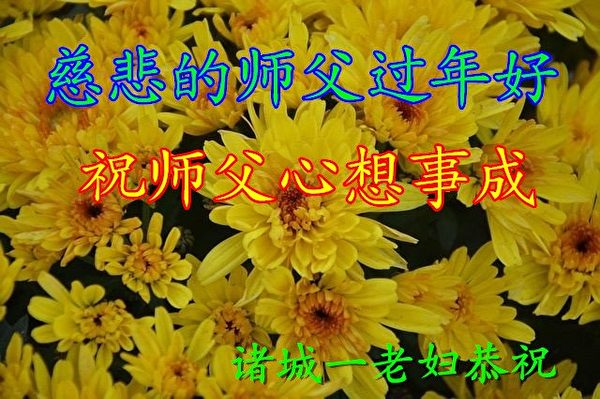

<b>大法恩泽全家</b>

重庆市一位法轮功学员的女儿诚心感谢李大师赐给她一位心地宽厚、乐观健康而又善解他人的好母亲。她母亲是一位有教养的知识分子，曾经身体非常不好，常住院。她在几岁时，就开始往医院给母亲送饭。母亲的病拖累了全家人，夏天时，因为母亲家人都不能开风扇、开空调。

她说，她母亲修炼法轮大法以后完全变了，一身的疾病消失了，整天乐呵呵的，承担一切的家务事。全家人都喜笑颜开。

在中共迫害法轮功20年来，她母亲遭到冤判、被非法关进洗脑班，但她对大法有坚定的信念，仍然乐观、健康。

她母亲帮她带好孩子，用大法的法理教育孩子，让她能安心工作，服务于社会，为此“我非常支持母亲的修炼”，“我也会用‘ 真、善、忍’来要求自己做好人。谢谢师父！”

来自湖北省武汉市黄陂区一位法轮功学员的家属写道，他老伴修炼法轮大法，她修炼前后的变化，让他也相信大法。他几次遇到磨难时诚心敬念“师父好！法轮大法好！真善忍好！”就化解了磨难，连医生都感到不可思议。

他真切地感受到，法轮大法是“救度世人的高德大法”。他说“迫害不停，我支持她（老伴）做正事也不会停”。他表示自己也在慢慢地同化大法的“真、善、忍”原则。

湖北省荆州市公安县的一位老年法轮功学员说，她全家四代29口人都相信大法好，支持她修炼，有的还帮助她给人们讲法轮功真相。

她孙女的北京男友第一次进她家的门，就和孙女一起虔诚地给李大师敬香磕头，又请了《转法轮》（法轮功主要著作）和明慧真相期刊带回北京看。

她儿子开公司，一次和一个职员外出，轿车走了一段路车就没油了，离厂还有三十多公里，附近没有加油站。儿子就开始大声念：“法轮大法好！真善忍好！”车马上就启动了。他一路不停地念：“法轮大法好！”车上的同事们都平安地回到公司。刚进到公司的院子里，车就再也启动不了了。大伙都惊叹不已：“法轮功太神了！”

她的大孙儿在深圳开公司，让她给公司来的新人讲法轮功真相、劝“三退”（退出中共的党、团、队组织），凡是他公司的人都退了各自加入过的中共组织。2019年，她孙子接到外企一笔大订单，这家外企老板很相信他的人品和能力。

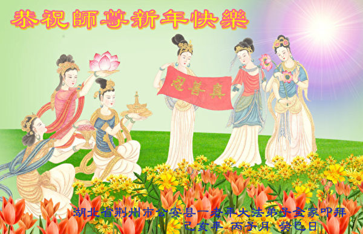

<b>支持大法 得福报</b>

北京西城区杨先生写道：“在此新年来临之际，向慈悲伟大的李洪志大师恭祝新年快乐！盼着您早日回归中土华夏，恩泽百姓，法轮大法好啊！”

杨先生家对门住的是一位法轮功学员。他记的那是20年前的夏天，中共警察撒谎说是查水表的，闯进了对门家，比土匪还疯狂，连偷带拿。看着这帮土匪，邻居都出来主持正义。“全楼都知道中共迫害法轮功，因为对门是全楼公认的好人。”

杨先生说，他就趁机顺门边溜进对门家，把家里的法轮大法经书等装进兜子里，拿回自己的家迅速地藏了起来。

警察没蒐着东西，四个人就把那位法轮功学员头朝下拎着往楼下拖拽，差点把他的衣服全扯下来。邻居拦住后，警察才把人正过来拖。

那位法轮功学员被非法劳教回来后，杨先生把当年转移到他家的大法经书还给了他。他很感动，给他讲了法轮功真相，让他们全家都退出了中共的党团队组织，从此他家里喜事连连。

杨先生的女儿结婚多年一直没有怀孕，他们全家来到对门法轮功学员的家，他女儿跪在李大师的法像前虔诚地求李大师恩赐他们家一个孩子。

数月后她女儿怀孕了，第二年生了一个大孙子，全家给孩子取了小名就叫“天赐”。“每天看着孩子茁壮成长，我们对大法师父的感恩无以言表。”

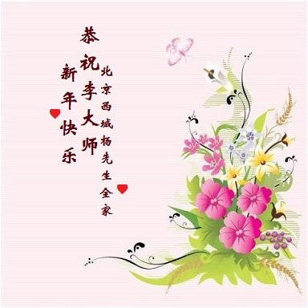

<b>感佩李大师的教导</b>

黑龙江四位明真相世人看到，20年来，大陆坚强的法轮功学员不惧迫害，前赴后继的不屈精神感天动地，“这力量就来自李大师的保护、引导和真诚耐心的教导”。

他们相信，法轮功对人民和国家有百利而无一害，相信“历史会证明李大师是正确的，迫害者将受到历史的审判。”

北京石景山八角北路特钢家属区一位人士说：“感佩李洪志大师教导的身正影直的大法弟子。”

他写道，大家知道法轮大法好、法轮大法是正法，因为他们身边大法弟子像一股清流，清澈见底，在俗世中不带一点灰尘。

“我们渴望走进他们的行列，做一个像他们一样的无私的好人，我们盼望李洪志大师早日回归中土华夏，恩泽百姓，让法轮大法好的佛光普照神州大地，驱除雾霾，还神州一片净土。”

“借此明慧平台，向全世界大法弟子敬祝新年快乐！向慈悲伟大的李洪志大师恭祝新年快乐！”#

文字整理：李洁思，责任编辑：高静

<a href=#list><h4 align="right">回上方</h4></a>
<a name=a4><h3 align="center"><b>诚信法轮大法好　大法福泽有缘人</b></h3>
 

【明慧网二零二零年一月二十四日】李洪志大师在《论语》中说：“人类对大法在世间的表现能够体现出应有的虔诚与尊重，那会给人、给民族或国家带来幸福或荣耀。天体、宇宙、生命、万事万物是宇宙大法开创的，生命背离他就是真正的败坏；世人能够符合他就是真正的好人，同时会带来善报、福寿”。

今天，法轮大法弘传世界，不仅给亿万法轮功修炼者带来身心健康、道德升华，还福益社会，世人只要心怀“法轮大法好”的真念、善念，都会得到大法的保护和善报。

得到大法福益、善报的众生无计其数，在中国传统新年来临之际，他们纷纷寄来贺词，讲述自己真实的故事和神奇体验，真诚的向慈悲的李洪志师父拜年！感谢法轮大法带来的美好！

在这十恶毒世、恶疫肆虐之时，愿您诚念“法轮大法好”，就会远避灾祸、转危为安，这是救命的护身符，是大法师父的慈悲。

<b>河南洛阳八、九十岁的老人念大法好 生命转危为安</b>

河南省洛阳市一老年夫妇恭祝大法师父过年好！

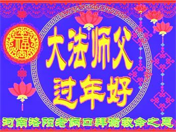

我们老俩口是八、九十岁的老人了，我们因为天天念法轮大法好，身体比以前好的太多了，老伴两次生命出现危险时，都是念大法好、求大法师父救度，才得以转危为安。我们太感谢大法师父了，我们相信您就是来救人的，我们太感谢您了，祝大法师父过年好！

河南洛阳老俩口拜谢救命之恩

<b>退休干部感恩惜福：念“法轮大法好”迅速恢复健康</b>

四川省凉山彝族自治州一明真相退休干部祝福李大师新年快乐！

在这新年到来之际，请允许我虔诚的感谢李洪志大师的大恩大德，祝福李大师新年快乐！万事如意！

我虽未炼法轮功，但却深知法轮大法是正法。几年前，我因腰椎间盘突出、骨质增生、骨折等疾病并发而住進医院，当时除支付医院治疗费外，还得支付昂贵的私人护工费。一段时间过去了，治疗效果一般，我被病痛折磨的很虚弱，我说话声音很弱很小。

一天，我想起了默念“法轮大法好，真善忍好”，结果很神奇，第二天，家人来看我时，才走到住院楼大门外，甚至都还没有進大门，就听到我跟人聊天的声音，听起来声音洪亮极了。怎么回事？他们简直不敢相信，连忙冲到我的病房，想看个究竟，结果真的是我本人在说话。

是的，我自己也感到自从默念“法轮大法好，真善忍好”后，整个人一下精神起来了。不久后就出院回了家。如今我身上虽未完全止疼，但是比起之前已经好太多了。

现在的我感恩惜福，颂念“法轮大法好，真善忍好”是我每天必做的功课。

在这新年到来之际，请允许我虔诚的感谢李洪志大师的大恩大德，祝福李大师新年快乐！万事如意！

凉山彝族自治州一退休干部诚贺

<b>静念“法轮大法好” 八十七岁老人摔伤后三天可走路</b>

八十七岁脊骨摔伤的父亲，恭祝慈悲伟大的师父新年好！师父新年快乐！

我家兄妹五人，昨天晚上我值班侍候父亲，我跟父亲说，全世界的大法弟子和明白真相的人，都给师父发贺信。父亲听后，眼泪刷一下就下来了。我说您是不是也想恭祝师父新年好？父亲说是。因父母家没有宽带，没法上网，所以今晚替我父亲表达心愿。

父亲脊骨摔伤后，经拍片发现骨头裂纹了，疼的父亲脸色都发了黄，我告诉他诚心静念：“法轮大法好，真善忍好”，师父会帮他，好的快，他就诚心静念，三天就能下床走路，见证了大法的神奇和超常。

谢谢师父，恭祝慈悲伟大的师父新年好！

<b>诚念法轮大法好 八十八岁老人晚期胃癌康复</b>

山东烟台莱阳八十八岁的大法弟子的亲人携全家族人恭祝李大师过年好！

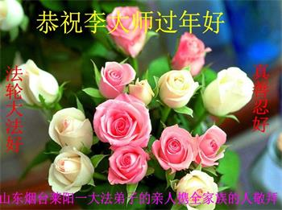

首先在这大年来临之际，我携全家族四世的家人恭祝李大师过年好！感谢您给我们这个四世同堂的大家庭带来的幸福与美好！

我的两个女儿和老太太修炼大法多年了，这么多年，通过她们我真正的明白真相，并且我非常的支持他们，并因此也得到了福报。

我今年已八十八岁，还耳不聋眼不花、背不驼，还能帮他们干点家务活，她们叫我常念“法轮大法好 真善忍好”，我也经常的念，还经常的听一听李大师的讲法录音。

前年有一天突然胃大出血，住進了医院，经医生检查说是胃癌晚期不行了，准备后事吧，在医院住了半个月的院，一直昏迷。我两个女儿就对着我念“法轮大法好 真善忍好”，等我意识清醒的时候，他们叫我也在心里默念，我就一直不停地默念。

奇迹真的出现了，半个月，我们回家后，慢慢的病好了，直到现在，身体还好好的，感谢大法师父的救命之恩！我们家族的其他亲人也因此见证了大法的神奇，再次谢谢大法师父！

<b>支持大法 福报连连</b>

黑龙江省龙江县大法弟子家属恭祝慈悲伟大的师父过年好！

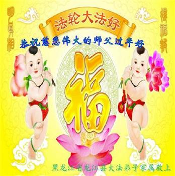

跪拜慈悲伟大的师父过年好！慈悲伟大的师父请您允许我这样称呼您吧！

我非常庆幸我出生在一个大法弟子的家庭里，也很相信法轮大法好，并非常支持大法，有时间也帮助家人救人。因此，而福报连连。

我年记轻轻的，有车、有房，又娶了一个贤惠善良的妻子，二零二零年，我又要添一个小宝宝了。

我深知这一切都是师父给予的。在传统大年来临之际叩谢师父！师父过年好！盼望师父早日回国，到那时我也一定要走入大法修炼！

<b>河北省平山县多位明白法轮功真相的民众敬仰李大师</b>

河北省平山县多位明白法轮功真相的民众恭祝李大师过年好！

尊敬的李大师：过年好！

您教导的弟子们给了我们法轮功真相，我们都做了“三退”，诚念“法轮大法好、真善忍好”，亲身受益多多。法轮功的光芒已经照亮全球，全世界的人们都敬仰李大师。我们看到了中共邪党即将覆灭的下场。衷心期盼您带领神韵早早回归故里。

在此给您拜年！祝您过年快乐！

河北省平山县多位明白法轮功真相的民众叩拜

<b>黑龙江哈尔滨市全家四代老少十多口人感谢佛恩浩荡</b>

黑龙江哈尔滨市明真相的世人恭祝李大师过年好！

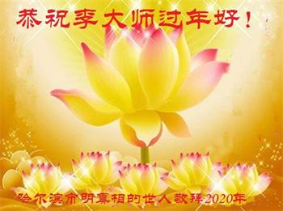

我家十多口老少四代全家人在新春佳节之际，感谢佛恩浩荡，全家人向李洪志大师献上最诚挚的新年祝福和感恩：恭祝李洪志大师过年好！感谢大师将高德大法洪传于世，救度无量众生！

我们很荣幸成为大法弟子的家人，非常支持亲人修炼大法，坚信“法轮大法好，真善忍好”，并受益得福报。我家人有患重病不治而愈的；有考试开智开慧取得超常成绩的；有遇难呈祥的。使全家身心健康快乐！和睦幸福！盼望大师早日回归中国团聚！

哈尔滨市明真相的世人敬拜
二零二零年元月

<b>山东烟台招远市农村近八十岁老人天天念大法好 肠癌消失了</b>

山东烟台招远市农村一明真相得福报世人给李大师拜年！

我年近八十岁了，没想到从天天念“法轮大法好”、“真善忍好”。我的身体会越来越好，肠癌消失了，病疼没有了，身体健壮了，也不用吃药打针了，走路如飞，脸色红润，这是大法的福泽。我们全家人都相信大法能救人，这样的好人上哪儿找，这真是活佛啊！

我们全家人跪拜李大师，谢谢活佛的救度之恩！盼李大师早日回国。

<b>脑中干深处长瘤的山东烟台青年诚念“法轮大法好”身体康复</b>

山东烟台招远一在职青年职工给大法师父拜年！

尊敬的大法师父：您好！

我是李大师从绝望中救回的青年。四年前，我因脑中干深处长瘤压迫头疼，无奈做了手术。手术过程中我们全家人诚心念“法轮大法好，真善忍好”，使手术超常的成功，被医生视为医学奇迹。本来按常规半月才能清醒，结果一出手术室就头脑清醒。现在我身体康复，正常上班两年了，没有任何的后遗症，我无忧无虑了。我们全家人都知道法轮大法好。谢谢李大师救命之恩！祝李大师过年快乐！

<b>黑龙江省大庆市东风新村大法弟子恭祝慈悲伟大的师尊新年快乐！</b>

二零一九年十月二日，小外孙生下来，就被送到重症监护室，医生说可能是脑瘫。在师尊的慈悲保护下，孩子逐渐好转，八天后出院检查，孩子一切正常。

现在孩子非常健康可爱。在此之即：感恩师尊给了我们一个健康的宝宝，感恩师尊救命之恩，弟子跪拜师尊。

<b>山东烟台军转干部相信大法好　胃癌消失</b>

山东烟台招远市一军转干部恭祝李洪志大师过年好！

尊敬的李大师：您好！

我是李大师给了我第二次生命的幸存者。五年前，因胃癌手术折磨的我生不如死，瘦的皮包骨头弱不禁风。经同学介绍我天天诚念“法轮大法好，真善忍好”，身体很快恢复如初。五年来，我再没有化疗，没吃一粒药。没打一针，给我治病的医生都感到很惊奇。

最近我又拜读了大法宝书《转法轮》。感觉书中讲的很有道理。我谢谢李大师给了我新生！我代表我的全家人恭祝李大师过年好！李大师，您的大恩大德我永世不忘！

<b>四川三台县七、八十岁俩姊妹：“李大师真的保佑我们！”</b>

四川三台县八十一岁和七十六岁俩姊妹给李大师拜年！

我俩从小多病，身体一直不好。后来我妹妹修炼了法轮功。二零零三年，妹妹从外地回来给我们讲了法轮功真相，放讲法录音给我们听，还给了我们大法护身符，并教我们念法轮大法好。

我们把护身符用布缝好，随时带在身边至今已十六年了，而且我们天天喊法轮大法好！特别是身体哪儿痛就喊法轮大法好！真灵！李大师真的保佑我们！现在我们姊妹俩身体都很硬朗，我们从心里感谢李大师！这几年每年大年三十我们都焚香跪拜李大师，感谢李大师的护佑！盼望李大师早日回国！

<b>河南省洛阳市老人两次被大法师父救回性命</b>

河南省洛阳市明真相得福报的耄耋老年夫妇祝李大师新年好！

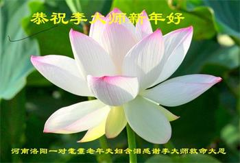

我们无法用语言表达对李大师救命之恩的感激！五年内李大师救了我老伴两次性命，老伴已经死过去了，已经泻劲。就大法弟子一句：师父快救他！马上他就醒过来了。不是亲眼看着有谁会相信呢？这大慈大悲的救命之恩叫我永生永世也报答不尽！

<b>山东烟台明真相的祖孙二人携全家族的人恭祝李大师过年好！</b>

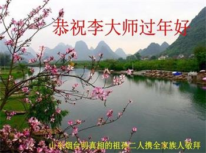

在这合家欢庆的时刻，我和我的爷爷携全家族的人恭祝李大师过年好！在此感谢您给我们带来的幸福与美好！

我的奶奶和我的父母都修炼法轮大法多年了，我奶奶今年八十岁了，身体还挺好的，我奶奶常说她在三、四十岁的时候，简直就是“药罐子”，一年到头的吃药，以至后来把满口的牙齿都吃掉了，医生告诉她说她全身除了头发梢没病外，全身全是病。

算命的告诉奶奶最多能活五十岁，自从九八年学了大法以后，身体逐渐的好了，再也不用吃药了。要不是学了大法她不会有今天的样子的，因此我的爷爷非常的支持我奶奶和我父母修炼大法，他虽然退休在家多年了，身体现在更好，还能种好几亩地，真是一人炼功全家受益，善待大法得福报了。

我现在也非常的支持她们，通过她们我也非常的明白了真相，不象中共无神论给人灌输的谎言那样，把人们拖向危险的边缘。愿可贵的中国人能早日明白法轮大法的真相，得到大法的救度！

山东烟台明真相的祖孙二人携全家族的人敬拜

<b>沈阳市一大法弟子与亲人们在重大车祸中逃生</b>

沈阳市一大法弟子与亲人们恭祝慈悲伟大的师父过年好！

因师父的保护，我和亲人们逃过了重大车祸。二零一九年三月二十六日那天，我跟亲人一行九人开两辆轿车。傍晚回来的路上，我和先生还有侄女、侄女婿乘坐的那辆轿车被一辆拉木头的小货车从右侧拦腰撞上了，小货车翻了。我家的车全撞坏了。在师尊的慈悲保护下，我们都平安的过来了。

我外甥是司机，看到车祸现场后惊呆了，以为人都完了，亲人们也都吓哭了。后来外甥跟我说：“老姨，就你家那车撞的那样，人应该肯定都不行了。可是你们最后都没有事，真是太神奇了。是大法保佑了你们。你要不上那辆车，他们都废了。”是啊，车都报废了，人却都没危险，全家三十多口亲人都感谢大法师父的保护，大家也都是因相信“法轮大法好，真善忍好”而得到了福报。

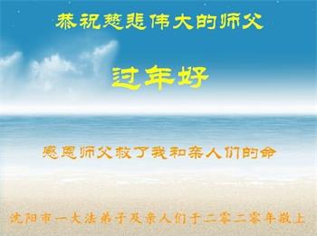

<b>八十七岁老父亲心脑梗死后十一天恢复健康</b>

黑龙江省伊春市父女俩大法弟子恭祝慈悲伟大的师尊过年好！

恭祝慈悲伟大的师父庚子年过年好！

我在二零一九年秋天走在马路上时突然摔倒，送医院确诊为心脑梗死，人事不醒，在住院期间，修大法的女儿求师父救救我，我才活过来。十一天后回家，没有留下任何后遗症，是慈悲伟大的师父救了我，给了我第二次生命。过年，我就八十七岁了，我现在生活完全能够自理，身体硬朗。

在一九九九年“七二零”之前，我也学过大法，由于害怕迫害，不敢炼了。现在我明白了一切真相，大法师父是来拯救人类的，一切迫害理由都是造假，我也说过大法不好的话，我深深的觉的对不起师父，向师父忏悔，认错，慈悲的师父没有怪罪我，还在救我。

现在我又从新开始修炼大法了，每天听师父的讲法录音，炼功，生活充实、幸福。

在此大年到来之际，我和女儿同修一起恭祝慈悲伟大的师父新年快乐！叩拜师父救度之恩！

黑龙江伊春父女俩大法弟子叩拜
二零二零年一月十四日

<b>河北省华北油田一个普通民众敬祝大法恩师新年快乐！</b>

我家亲戚修炼大法，真是一人修炼，全家受益，我非常相信“法轮大法好”，看过法轮功的很多真相，退了少先队。

二零一九年，我有生以来生了一场大病，真是病来如山倒，是大法师父救了我的命，我实实在在体会到了神奇的一步一步挽救我的安排，我发自内心叩拜大师救命之恩！敬祝大法恩师新年快乐！新年万事如意！

河北省华北油田一个普通民众敬祝

<b>明白法轮大法好 大法师父福泽一家人</b>

山东诸城明真相的世人恭祝大法师父过年好！

记得三年前，我去大姐那里，因为我们认识好长时间了，但是，很长一段时间，大姐没见我，刚一见面，大姐问我怎么了，看上去脸色不好看，人也瘦了。我就和大姐谈起来，怀上了二胎，天天呕吐，折磨的我有了一个邪念，就是不想要这个孩子了。大姐说：“你相信大法吗？”我当时不大懂，大姐叮嘱我说，你就在心里诚信念“法轮大法好，真善忍好”。

我开始抱着试试的心态，我回家就念。一天、二天、几天过去了，我真的不吐了，由于头胎是个男孩，心想要是二胎给我个女孩该多好啊！直到宝宝出生，果然如愿以偿生了个健康女儿，全家人都高兴极了，这就是全家明真相，诚念法轮大法好带给我们的福气。

还有我儿子今年十二岁，上五年级，自从我明真相后，就教育孩子按真善忍做好人，他也很听话，神奇的事发生了。一天中午，孩子放学时要通过路口，可能孩子观察不仔细，一辆轿车开的速度也不是很快，来不及躲闪的情况下，从小孩的脚压过去了，这可把司机吓坏了，连忙抱着孩子去了附近的医院。通过检查后什么事也没有，只有点淤清，骨头什么都好好的，司机说真是不敢相信。当时在场 的人都说这孩子麻烦了，得遭个罪了。

回家三、四天后，淤青也没有了。但是只有我们知道这是托大法的福，是大法师父保护了儿子，福泽我们一家人。司机自己也说真是神奇事，这孩子真是有福气。在此我们全家感谢大法、感谢大法师父！祝大法师父新年快乐！

山东诸城明白了真相的世人
二零二零年元月

<b>福建福州一大法弟子与明真相得福报的家人恭祝慈悲伟大的师尊新年快乐！</b>

福建福州一大法弟子与明真相得福报的家人恭祝慈悲伟大的师尊新年快乐！感恩师尊的慈悲救度！师尊您辛苦了！弟子想念您！叩拜师尊！

二零二零年一月十五日

<b>辽宁省昌图县大法弟子恭祝慈悲伟大的师尊新年快乐！</b>

我母亲患肺癌诚念“法轮大法好”身体很快获得健康，我代表全家感谢师尊的慈悲救度！

<a href=#list><h4 align="right">回上方</h4></a>
<a name=a5><h3 align="center"><b>【庆祝513】飞上蓝天</b></h3>
 

【明慧网二零二零年五月九日】

<b>迷失</b>

我今年三十八岁。我曾经是个问题少年，十二岁学会抽烟、喝酒，只会欺负弱小同学，如混混一般，父母很头疼；在中学时代，就开始谈恋爱；走向社会后，更是五毒俱全，吃、喝、玩、乐，追求物质享受，是我那几年的生活写照。

职高毕业后，我不顾家人反对，去学弹吉他，玩音乐，还留起长头发。年轻的我看上去没有精神，整个人生活在颓废中，难以自拔。虽然通过玩音乐也能谋生，但是生活来源很不稳定，经常需要伸手问父母要钱过活。

一九九六年学音乐的时候，跟同学学会了吸食大麻，一吸就是十年。根本没有专心学习音乐，而是在吸食大麻过程中，找那种虚无缥缈的感觉，寻求精神刺激，依靠大麻找所谓的创作灵感，实际上那种创作完全没有内涵。

吸食大麻对我的身心造成了很大的伤害，我出现了幻觉、妄想和类偏执状态，伴有思维紊乱、自我意识障碍，出现双重人格。我每天都要靠大麻提精神，吸食过程中好像变了一个人，现在知道那不是自己，是主意识被其它乱七八糟的低级生命控制了。后期，到每次要吸之前，脑袋特别疼，头疼变成了后遗症。有一天晚上，吸完大麻躺在床上，我有一种莫名的恐惧，身体特别不舒服，好像有个声音告诉我不能再这样下去了！我快哭了，内心非常痛苦。

我一米八的个儿，体重却没有超过一百二十斤，脸蜡黄，二十几岁的人，看起来像三十岁。家人和朋友都好心地劝说我，都快三十岁了，不能再这样混了。但我不理会家人的感受，还是执意地我行我素，后来家人已经放弃我了，觉的我整个人都废掉了，就这样吧，有口饭吃就行了！

除了吸食大麻，我还经常出入夜店，酗酒，甚至带不三不四的人回家过夜，整个生活用“糜烂”一词来形容都不为过。

<b>重生</b>

幸运的是，在迷失中，我遇到了法轮大法！从此，我获得了新生。

记得二零零六年十月的一天，我在清理抽屉里的物品，无意间发现了一张白色的光盘。那是三个月前，去一个朋友家做客，敲门的时候，在他家门缝里发现的，当时出于好奇，我随手把这张光盘放進了包里。

光盘上印着一朵莲花，我心里一动，就打开来看，里面有个视频《风雨天地行》，还有一本电子书——《转法轮》，当时只觉的好奇就一直看了下去。没想到第一次看，就被里面的内容吸引住了，里面讲的是如何做一个好人，如何为别人着想，不与人争斗，孝敬父母……更让我明白了人活着的意义，即当人是为了返本归真，这道理一下子打到了我的灵魂深处。

不到一周的时间，我就把这本书全部看完了，看完后，我说了一句话：“这就是我要找的！”看了《转法轮》这本书，就再也放不下了。就这样，我走上了修炼的道路。三个月后，我的烟酒全部戒掉了。学法之前，我接触过藏传佛教，还给“活佛”磕头、念经、烧香、捐钱，但还是抽烟喝酒吸大麻，没有任何改变。

得法后三个月，所有那些坏习惯全部戒掉了，以前满嘴脏话，也全都消失了。师父给我清理了身体，身体开始排那些不好的物质，也没有了那些不舒服的感觉。我把长发和胡子全部剪掉，人变的精神了，生活里有了阳光。

是师父把我从万丈深渊中解救出来，从内心深处把这些污浊清洗掉，给了我一个新的生命。

<b>坚持</b>

身边朋友都看到了我的改变。父母刚开始反对我学，让家里其他亲戚来劝我放弃修炼大法。有一天晚上，家人冲進我的屋里，打骂我，想让我放弃修炼。当天晚上，我哭了，为家人不知道真相而哭泣，脑子里浮现出一首歌：

“飞飞飞上蓝天，天天天空湛蓝。”

这歌词好像是在鼓励我。我家里是部队的，受邪党迷惑很深，他们接受不了我炼法轮功，不是打就是骂，我给他们讲真相，他们也不听，一味地排斥。这也是我的魔难，这么大的压力，看我能否走过来。现在这个打和骂的阶段过去了，我坚持下来了。

我知道过去自己的所作所为对家人是非常不负责任的，不应该再这样了。当时，父母为了我玩音乐和常有朋友来找我聚会，就让我住大屋，他们和小侄子住在五平米的小屋。修炼大法之后，我把我住的十五平米的大屋让了出来，还经常帮父母干些力所能及的家务。人也变的温良和善了，做事情多为别人着想，不再那么自私了。

<b>吃苦行善</b>

接下来我要找工作，不能再靠家人了。朋友给我介绍了一个酒吧的工作，工资一千元，我想钱再少也要去。就这样，我每天在酒吧里干杂活，卖门票，帮客人存衣服，收拾桌子上的空酒瓶，搬啤酒……哪个地方需要人，我就去干，也不挑。酒吧里充斥着烟、酒、毒品，虽然我每天在嘈杂的环境中工作，穿梭其中，但是我的心是宁静、祥和的。

每天都是下午三点上班，凌晨四点才下班。由于酒吧离我家有二十多公里，晚上打车很贵，夏天我就骑车上下班，也不觉的累。冬天下班后，就等早班地铁回家。有时候早班地铁还没开门，我就在门口等着。有时候在车上睡过了站，到家已经是早上七八点了。每天虽然很累，但是到家后，打坐一个小时，马上疲劳就消失了。工作虽然很辛苦，但是有大法在，我的心不觉的苦。因为师父告诉我：“吃苦当成乐”[1]。

曾经是我打别人，但是修大法后，完全转变了。在酒吧工作的时候，有一次遇到无理的客人，不给钱，就想進去看演出，我当时拒绝了，他伸手就要打我，把我逼到墙角……最后被同事拦住了。要搁以前，我早就跟人打起来了。但是现在我明白，要做到“打不还手，骂不还口”[2]，并且得为酒吧考虑，不能招惹是非，给老板带来麻烦。

后来换了新的工作，老板很信任我，库管、销售、财务，所有的事情都交给我。在工作中，我按照大法的要求去做，不贪图利益，为客人着想。慢慢的，我的工作越来越好，工资也越来越高，身边的朋友也越来越多。大家都很信任我，跟我接触没有距离感，因为我的思想里没有坏的念头。可这都是源于法轮大法，修炼大法带给我的是一个祥和慈悲的场，我也把这份善的力量传递给别人。

<b>福报</b>

再后来，结婚，买房，买车，生孩子，每一件事都非常顺利，家里人也说我这几年非常顺。而且夫妻和睦，相敬如宾。其实这都是大法带来的福报。谁会想到当年那个颓废的我会有如今这般改变？

前几天，妻子还问我：你记得我们吵过架吗？我怎么想不起来了？是啊！我们几乎都没拌过嘴。因为学了大法之后，在生活中，我都是以真、善、忍为标准，事事都为别人着想，在家里，帮太太做家务，说话前，想想是否会伤害到对方，所以才有了家庭的和睦。

要说的事情太多了，自修炼后，八年来，我没有吃一粒药，没有病，省了很多医药费，身体非常健康！

<b>感恩</b>

感恩慈悲伟大的师尊！给了我新的生命，把我从道德堕落的泥潭中捞了出来，让我知道了做人的道理，从做好人做起，还要做更好的人；是师父的慈悲救度，使我明白了此生为何而活，使我看透了这纷繁复杂的人生，不再彷徨、迷惑……

注：

[1] 李洪志师父诗词：《洪吟》〈苦其心志〉

[2] 李洪志师父著作：《悉尼法会讲法》

https://www.minghui.org/mh/articles/2020/5/9/【庆祝513】飞上蓝天-405009.html

<a href=#list><h4 align="right">回上方</h4></a>
