

 <h3><b>翻墙必看 视频 http://220.141.119.226 </h3></b>
<h1><b><a href="https://github.com/awwkk/usdom/blob/master/forfor.md">● 红潮即将倾覆  天之将明 ● </a></b></h1>

 <table>
<tr><td width=880> 

<b><a href="https://github.com/mingop/f6f6dw/blob/master/xoudou.md">中秋谢师恩（2019） </a></b>&nbsp; 
<b><a href=#a1>黑窝里的明白人（1）</a></b>&nbsp;
<b><a href=#a2>黑窝里的明白人（2）</a></b>&nbsp;
<b><a href=#a3>黑窝里的明白人（3）</a></b>&nbsp; 

 

</td></tr>
</table>

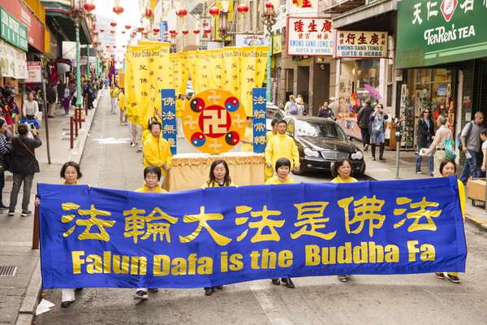

<h2 align="center"><a href="http://cn.ntdtv.com/xtr/gb/prog57.html?raw=true">法轮大法是性命双修的修炼大法</a></h2>

法轮大法是1992年5月由李洪志先生从长春传出的佛家上乘修炼大法，以宇宙最高特性“真善忍”为根本指导，按照宇宙演化原理修炼。

法轮大法是完整的一套性命双修的修炼方法。直指人心，明确指出修炼心性是长功的关键。心性多高功多高。除了修心，还有修命的部分(改变本体)，即炼动作(五套功法)。动作一方面是用强大的功力把功能加强；另一方面在身体里还要演化出许多东西。既修又炼，修在先，炼在后，动作是修炼圆满的辅助手段。不修心性只炼动作是不能长功的；只修心而不炼动作，功力将受阻，本体也无法改变。

法轮大法圆容明慧，动作简练，大道至简至易，是能使修炼者返本归真的高层次修炼法门。

<h2 align="center"><a href="http://cn.ntdtv.com/xtr/gb/prog57.html?raw=true">万古奇书- 《转法轮》
改变全球上亿人心灵与命运</a></h2>

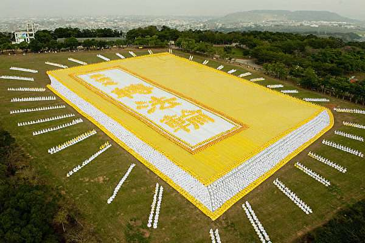

2010年，台湾部分法轮功学员6000人排出《转法轮》一书封面。（大纪元）

法轮大法的主要著作《转法轮》为法轮功创始人李洪志先生所著，用人类最浅白的语言讲出宇宙间最精深的道理。是一部指导人如何修炼、提高心性，做好人，返本归真的书。

《转法轮》自1995年1月北京首发迄今届满21周年，全书共分为九讲，包含从修炼入门到修炼圆满所需的一切法理。内容谈古论今，上至宇宙结构下至高能物理学，以最超常的科学探索宇宙及文明之起源与归路；让人每读完一遍都有不同的体悟与收获，读上千万次也不厌倦；能让人净化身心、返本归真，同化宇宙特性真善忍； 并且超越种族文化与宗教藩篱， 获得上亿人肯定与推崇；被喻为“一部登天的天梯”、“一部人类史上从来未有的万古奇书” 。

《转法轮》已被翻译成41种语言在世界各地发行。“未读《转法轮》做人有遗憾”，这是拜读者发出的敬佩浩叹。

修炼法轮大法只要反复静心通读《转法轮》，努力按照书中阐述的真善忍标准要求个人心性的提高并辅以炼功，短期内就能达到意想不到的高层次-返本归真。

法轮功学员不收礼、不收费，义务教功。法轮功相关书籍都可在网站免费下载。网址:http://www.falundafa.org/

<h2 align="center"><a href="https://git.io/wnn?raw=true">动作是修炼圆满的辅助手段 五套功法简单易学</a></h2>

法轮佛法通过佛家上乘大法的大圆满法炼动作修命。大法的动作很少，但炼的东西很多很全面。修炼是以法轮为中心。法轮是有灵性的高能量物质体，每天二十四小时在修炼者小腹部位旋转不停，打通修炼者能量淤塞的地方，不断的从宇宙中采集、演化能量，并将其转化为功，净化身体，提高层次，加持神通。修炼者虽没有时时在修炼，而法轮却在不停的炼人。是当今唯一能达到法炼人的功法。所以长功开功特别快。

法轮大法修炼主意识，自己得功。炼功不讲地点、时间、方位，也不讲收功。五套功法简单易学。为修炼者提供了最方便、最快、最好的、也是最难得的修炼法门。

<h2 align="center"><a href="http://cn.ntdtv.com/xtr/gb/prog57.html?raw=true">第一套功法：佛展千手法</a></h2>

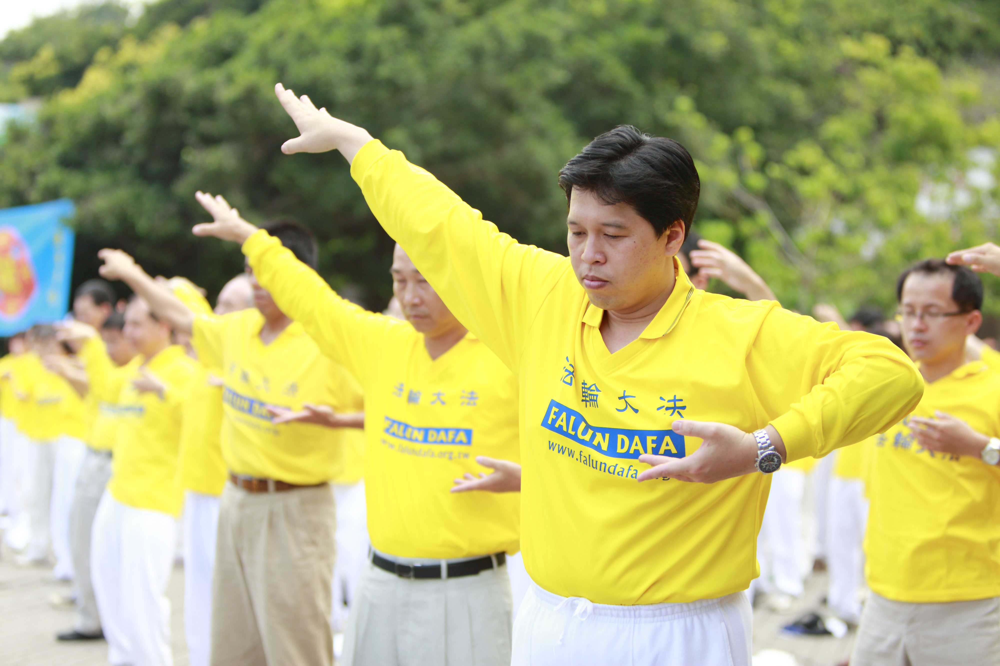

佛展千手法这套动作的核心就是疏展，打通能量淤塞的地方，调动体内和皮下之能量强烈运动，自动的大量吸收宇宙中的能量，使修炼者一上来就达到百脉皆通。

<h2 align="center"><a href="http://cn.ntdtv.com/xtr/gb/prog57.html?raw=true">第二套功法：法轮桩法</a></h2>

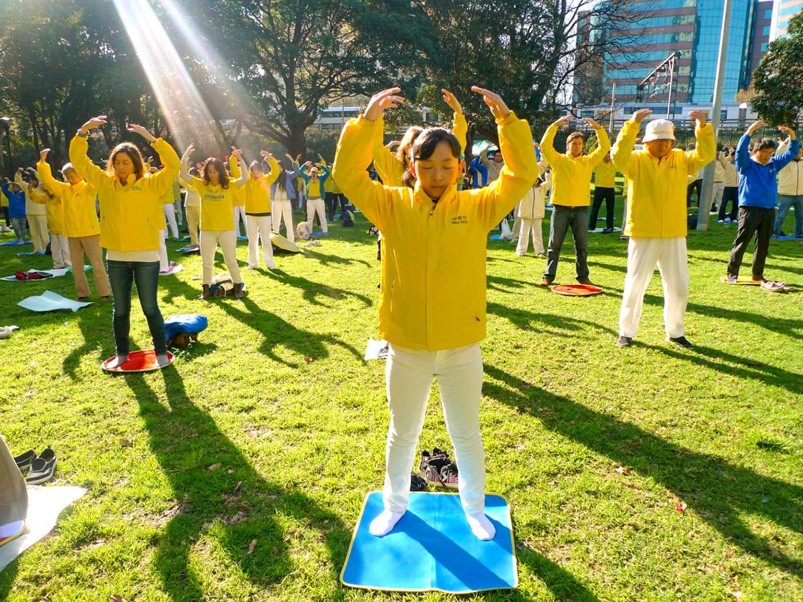

法轮桩法属于静桩法，由四个抱轮动作组成。常炼法轮桩法可使修炼者全身全部贯通，是生慧增力，提高层次，加持神通的全修方法。

<h2 align="center"><a href="http://cn.ntdtv.com/xtr/gb/prog57.html?raw=true">第三套功法：贯通两极法</a></h2>

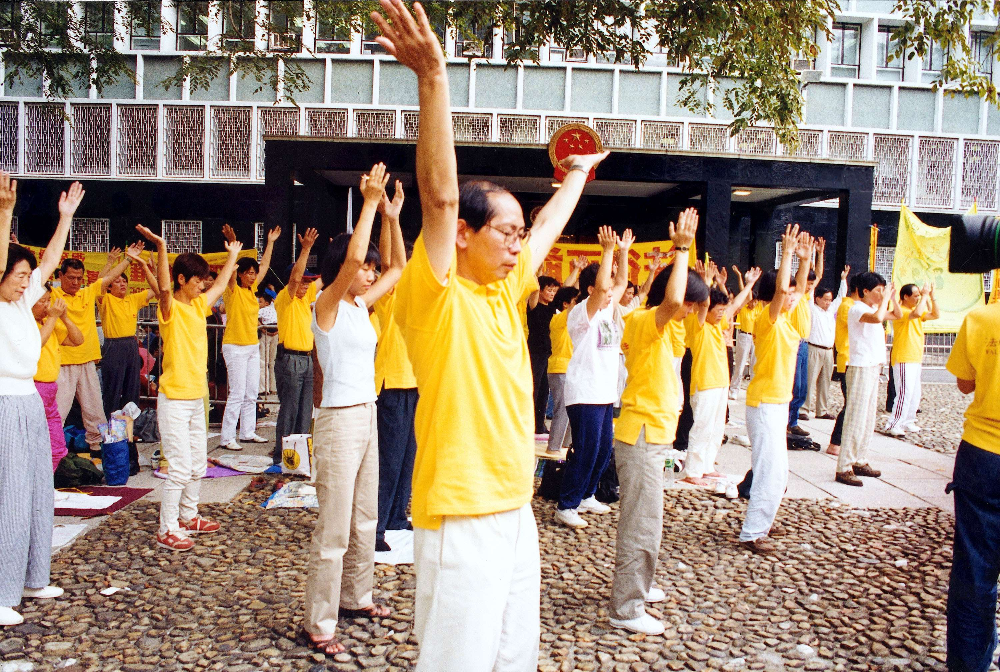

贯通两极法是将宇宙之能量和体内之能量混合贯通之法。炼这套功法时，吐纳量很大，可使修炼者在极短的时间内达到净化身体的目的；同时，还可在冲灌中开顶，也能在冲灌中打开脚下人体之通道。

<h2 align="center"><a href="http://cn.ntdtv.com/xtr/gb/prog57.html?raw=true">第四套功法：法轮周天法</a></h2>

法轮周天法是使人体能量大面积流动，不是一条脉或几条脉在走，而是从人体的阴面整面循环到阳面，往复不停，远远地超出了一般通脉法或大小周天。

<h2 align="center"><a href="http://cn.ntdtv.com/xtr/gb/prog57.html?raw=true">第五套功法：神通加持法</a></h2>

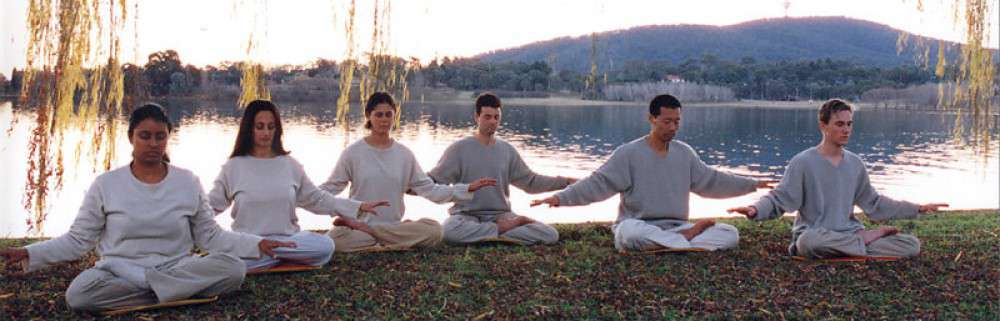

神通加持法属于静功修炼法，是用佛之手印转法轮，加持神通（包括功能）与功力的多项同修功法。

<table>

  <td>
  <h2 align=center><a href="https://git.io/ysys?raw=true">访问明慧网　了解真实讯息</a></h2>
  ▊ 明慧网（www.minghui.org）成立于1999 年6 月，是法轮功学员信息交流的平台。其中有法轮功学员的修炼经历；有明白法轮功真相而受益者的故事；有中共对法轮功学员迫害的案例报道……联合国人权报告多次引用明慧网案例，谴责中共对法轮功学员任意监禁和酷刑致死；并要求停止迫害。（网站中国大陆的朋友需“翻墙”访问 ） （推荐使用ie，火狐，chrome等非国产浏览器访问！）

  <h3 align="center"><a href="https://git.io/opopop?raw=true">◇ 翻墙软件下载: https://git.io/opopop </a></h3>
 <h3 align="center"> <a href="https://git.io/opopop?raw=true"> ◇ 访问明慧网:http://www.minghui.org   </a></h3>

 <h3 align="center"><a href="https://git.io/opopop?raw=true"> ◇ 阅读大法书,教功录像,请访问法轮大法网站: http://www.falundafa.org/  </a></h3>

    </td>
 
</table>

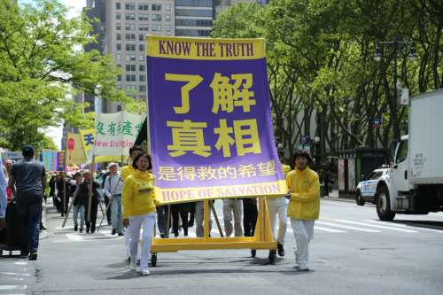

 <h2 align=center><a href="http://www.soundofhope.org/gb/category/?raw=true">关贵敏:了解生命的真谛才会拥有美好的未来</a></h2>

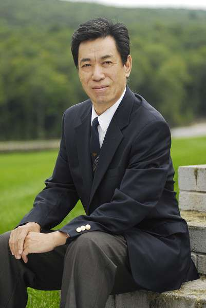

被誉为“中国歌王”的关贵敏先生是中国家喻户晓一级演员，39岁时歌唱事业正达高峰，却发现罹患乙型肝炎兼早期肝硬化，1996年他开始修炼法轮功，身体奇迹般不治自愈，感到精力前所未有的充沛。按照“真善忍”的标准去做一个好人，这种快乐的感觉是前所未有的。他说，任何名和利都不可能带走，他看淡了一切，身心健康。

七旬高龄的关贵敏用穿云裂石的歌声再登神韵国际舞台，在世界各地巡回演出，让新老歌迷喜出望外。声乐界认为，65岁是男高音的极限。关贵敏：“我今年已经72岁了，在国内跟我同龄的人，基本都退出舞台了，包括我的下一代，基本嗓子也都哑了。”

他说：“我是以一种平常的心态在唱，用心体悟歌词中的内涵寓意，用歌声传递、启悟、唤醒人们的真知善良。”他觉得自己是在做一件有意义的事情。他的歌声如同纯酿的酒一样越听越有味，演艺生涯达到了巅峰，被誉为艺术界的常青树。

关贵敏表示：“人生无常，谁也无法预知自己的未来，也许你今天还是健康的、富有的，可是睡觉醒来，却有可能一无所有，或者是失去了健康、甚至失去生命。只有真正了解了生命的意义和真谛，才会拥有美好的未来。”

<h2 align="center"><a href="http://www.soundofhope.org/gb/category/?raw=true">哈佛医师汪志远走出「渐冻」绝境的生命奇迹 </a></h2>

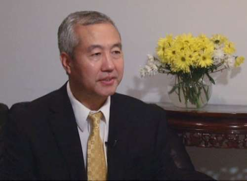

曾经的“渐冻人”患者汪志远主任医师，如今的追查国际发言人(网络图片)

汪志远先生曾在美国哈佛医学院工作过，但身患世界五大绝症之一的“渐冻人”病，无药可医，但是参加法轮大法学习班的第一天时就全身舒畅，发生了一系列神奇的现象，如体内滚滚热流涌动、莫名的持续流泪、在路上多次找厕所大量小便等；在他修炼三个月后，身体状况完全恢复正常，一度6克的血色素（不到正常男子的一半）也恢复到了13克（人的血细胞周期需要120天），体重也从110多斤恢复到了150多斤。

<h2 align="center"><a href="http://www.soundofhope.org/gb/category/?raw=true">李有甫从武术气功大师到法轮功徒弟的传奇</a></h2>

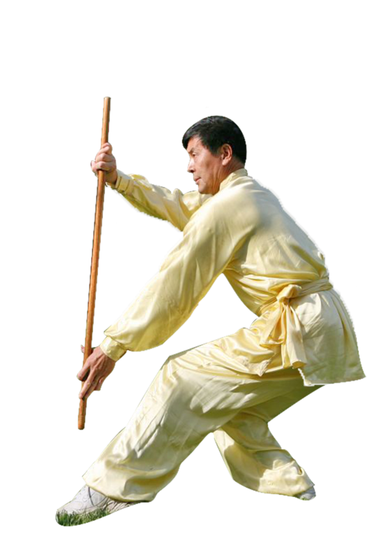

曾是中国人体科学研究中心副研究员的李有甫，也是中医和气功领域的知名人物。可是，他却断然放弃了用无数汗水换来的大师级的名利和成就，成为一名普通的法轮功弟子。

李有甫说：“自从我开始练气功以后，特别是特异功能的研究，让我明白人是有前生来世的，这世界是有另外空间存在的，而无神论否定另外空间的存在，把人的认识完全局限在我们看得见摸得着的物质空间里，这样的世界观是看不到宇宙真相的，我相信宗教中说的都是真的，于是我开始在宗教中寻找人生真谛。我尝试了许多修佛修道的法门，最后总感到其基本内涵都失传了，怎么练也提高不大。但当我第一次拿到《转法轮》时，我一口气读完了全书，一边读一边流泪。我寻觅了半辈子，结果终于找到了答案，这才是真法真道啊！”

修炼法轮功后，对人生的一切，有如居高临下，又如晨光破雾，洞穿后尽收眼底；无私无我，放下一切执着，心内异常清静。我知道了：原来人类还有这样美好的修炼目标和修炼机会，还有这样纯正，高深而且实实在在摆在眼前的修炼方法，能修炼法轮功是我一生最大的幸福，那种幸福美妙的感受难以言表。

<h2 align="center"><a href="http://www.soundofhope.org/gb/category/?raw=true">释证通 万里寻大道</a></h2>

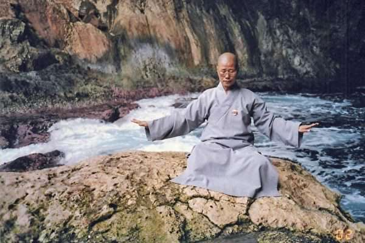

释证通：台湾南部的洪济精舍的住持，曾在佛教中修炼数十载，上下求索。为了探求宇宙人生真谛，在担任住持期间，释证通还曾多次探访名山圣地，追寻大觉者的足迹，她先后去过西藏、喜马拉雅山、长江、黄河源头、昆仑山、尼泊尔，还有印度。云游途中，走的都是荒郊野外、荒漠河滩，吃饭时只能在地上挖个坑烧点水，生活非常艰苦。了解她的人不但感叹她九死一生的传奇经历，也为她追寻佛法真理吃尽万般苦的精神所感动。1998年在法轮功中她终于找到了真正的修炼大道。她曾说过：“师父用全人类最浅白的语言，把最高深的道理讲出来了。”“比如修炼到底是什么，师父讲：‘整个人的修炼过程就是不断的去人的执着心的过程。（《转法轮》）’这些都是我们修佛几十年也没有明白的道理，师父一句话就点明了。”

<h2 align="center"><a href="http://www.soundofhope.org/gb/category/?raw=true">台湾风水师走入法轮功修炼的神奇故事</a></h2>

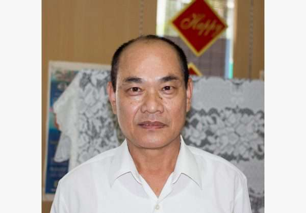

台湾的西南部有一个台南市，台南市的西南部有一个安南区，安南区里有一个响当当的风水师，名字叫邱世昱。此人在庙里帮人办法事25年，足迹遍及台南大大小小的庙宇，政经商界常常有人请他去处理风水问题。

邱世昱小时候就能看到别人看不到的东西。一次神奇难忘的经历，让邱世昱走入法轮大法修炼，从此，彻底改变了他人生的道路。

多年来，邱世昱一直有晨跑的习惯，每天清晨5点起床晨跑。2009年10月15日清晨约4点，闹钟莫名其妙的响起，他习惯性的起床，穿上短裤球鞋就出门了，跑跑走走一直走到台江大道一间木工厂。大老远，就看见工厂门口有金色的光芒，很亮、很高，有好几层楼高。邱世昱非常惊奇，自己当风水师这么多年，也曾看到过另外空间的光，但大都是绿色黯淡的光，从来没有见过这种金色的辉光。

这次邱世昱看到的金光，让他觉得有如天神下降，震惊不已，眼睛几乎睁不开，约500公尺远就看到了。这到底是什么东西？走近到50公尺时，才看清楚是一个人在打坐。心想：“他会不会叫我也去学这个东西？”当他走到这人身边时，打坐的人突然站起来说：“少年的，你要不要来炼我们这种功？”他吓一跳，这奇人竟然知道他心里想什么。这个人就简单给他介绍一下说：“我们每天清晨4点50分在这里开始炼功，有5套功法，简单易学，叫作法轮功。”邱世昱非常惊讶称羡，连忙答应说，明天就来学功。

邱世昱回家的路上一直在想：怎么会有这么神奇的事？第二天早上，准时去学功。从此，他就走入法轮大法修炼，至今已经7年多。

走入修炼前，邱世昱是个心高气傲，狂妄自大的人，常常想：办法事、看风水，没有人能跟我比。大有“老子天下第一”的味道。出门总有数十人左右阿谀奉承，忙前跑后，围着他打转。他也真把自己当个人物，整天端着个架子，高高在上，頣指气使，脾气大的吓人。看到不顺眼的人和事，就破口大骂，跟班只有忍气吞声的份儿。

参加法轮功9天学习班、听李洪志师父讲法录相后的一天晚上，他梦见自己到了阴森恐怖的地狱，到处一片荒凉，没有一点生机。后来，他从一个窗口爬出来，外面有好多人正在炼法轮功，这里又是另一个世界：宁静祥和，佛光普照，风景如画，生机盎然。梦醒之后，他很吃惊。这下地狱实在是太可怕了。只有赶紧修炼法轮功，生命才能得救！

学习班结束后，一位学员拿了两本李洪志师父的各地讲法经书给他看。邱世昱看完后，自己曾经经历过的许多百思不得其解的问题，全都有了答案，心态立即发生180度的大转弯，那种傲慢心全不见了。于是，迫不及待将大法全部经书请回家，很快将38本经书全部看完一遍，越看越觉得自己渺小，越看越觉得自己无知，越看越觉得师父太了不起，越看越觉得这法大的简直没有边了。邱世昱说：“这就是师父。法轮大法的法理博大精深，之前我所会的那些小能小术，都是小儿科，实在是微不足道。我内心完全折服，口服心更服！”邱世昱表示：“人身难得今已得，佛法难闻今已闻，此身不向今生度，更向何处度此身？”

看完法轮大法所有经书后，邱世昱认识到要修上去，必须彻底放弃争名夺利的心，并且要谦虚做人，谨慎做事：“我一定要放下这些，不然的话，肯定修不上去！”在低层次修炼的人都讲：“名、利、情、色四堵墙，人人都在墙里忙，若要跳出此墙外，不是神仙寿也长。”更何况，我是一个法轮大法修炼者？

修大法7年多，邱世昱彻底改掉了以往所有不好的坏习气。亲戚朋友们看到他变得谦虚、诚恳、善良，简直惊呆了，想：“太不可思议了，他是在修什么？”邱太太笑眯眯的回应说：“他现在修法轮功，按照真、善、忍的法理，自我要求做一位修炼人。”

走到今天，邱世昱感觉自己真是太幸运了。现在，他的心境轻松愉快，和以前完全不一样了，以前每天早上一睁开眼，就想怎样才能得到名和利，活得很苦很累。这7年多来，连他太太都很欣赏他，说他完全变成另一个人，“像从地狱里被捞起来之后，又被洗干净的人。”

<h2 align="center"><a href="https://a8.168dns.info/20?raw=true">国际知名模特：修炼让我在喧哗世界中沉静</a></h2>

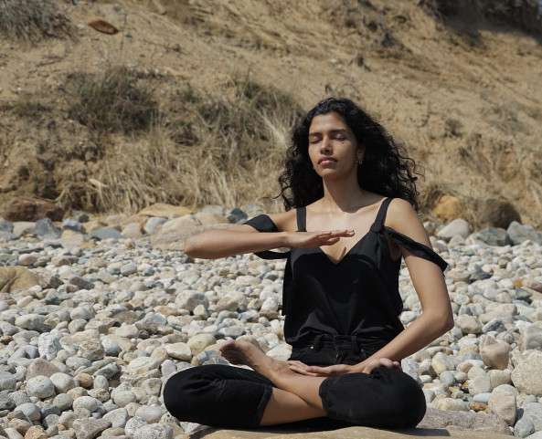

25岁的印度超模普贾•穆尔（Pooja Mor）近年来风靡国际时尚界，曾代言诸多知名品牌如《时尚精英》（Elite）等，最近还入选国际知名时尚杂志《Grazia》“时尚界百名最有影响力人物”。目前定居在纽约，虽然有令人羡慕的职业，穆尔透露，模特这一行也面临很多身心方面的挑战。

三年前这位超模新秀开始修炼法轮大法——以“真、善、忍”原则为根本指导的佛家修炼大法。穆尔每天早上都会安排时间炼五套功法，修炼后让她有种返本归真的感觉。

以前，面对困境，她总会挑他人的毛病，一出状况就会归咎他人。而现在，她首先会看到自己的不对，时时向内找，并反思如何改善与提升自己，让局面得到真正的改观。所以身处压力巨大的时尚业，穆尔能够处之泰然，保持积极正面的态度以及很强的自信心。

穆尔说，修炼法轮大法使她成为一个真正的好人。面对竞争激烈的模特界，她不仅有光鲜华丽的外表，而且能够踏实沉着、处变不惊，谦逊冷静，不执着于未来，在喧哗世界中沉静，保持一颗平静的心。莫尔说：“顺从命运的安排，沉下心来做自己。”

<h2 align="center"><a href="https://a8.168dns.info/20?raw=true">法轮功学员获瑞典国王亲自颁创业奖</a></h2>

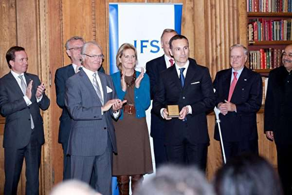

2011年10月17日，瓦西柳斯•祖朴尼第斯获得「国王卡尔十六世古斯塔夫奖」，瑞典国王亲自到场为他颁奖。(Vasilios Zoupounidis/Facebook)

瓦西柳斯‧邹朴尼第斯是个企业家专做销售Telecom的服务，曾于2011年荣获瑞典“国王卡尔十六世古斯塔夫年度创业奖”。这个创业奖是表彰在瑞典已创立公司一段時间、有移民背景的瑞典人，通过辛勤工作进而使公司收益不断增长的创业佼佼者。

出生希腊的瓦西柳斯‧邹朴尼第斯在获奖后表示：“我和我的团队非常高兴接受国王陛下授予的这个奖项。我的团队里有一半是移民，我们的辛勤工作获得了承认也值得高兴。运动员的目标是赢得比赛的胜利，而企业家每天在努力工作，去达成自己的目标。能获奖是一个惊喜。”瓦西柳斯从1998年起开始修炼法轮功，他一直按照法轮功“真善忍”的标准做事，他认为他事业的成功源于他修炼法轮功，是“做好事，得好报”。

他说：“修炼法轮大法后，使我感到内心的宁静和详和，我明白了生命真正的意义，如果我今天不修炼法轮功，我绝对不能胜任今天的工作，正因为我是一个修炼人，平时按真善忍的标准要求自己，才使得我的公司经营的这么成功，这一切都要归功于大法。”

<h2 align="center"><a href="https://?raw=true">百岁老人：法轮大法延长了我的寿命</a></h2>

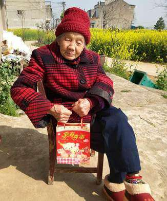

【明慧网二零一八年四月五日】我今年一百零六岁，从小没有上过学，也不识字。二零零四年，我是个要死的人，因为得了一种病，医院治不好，吃药不好使，已经到了晚期，家里人把我的后事都准备好了。
我的女儿是法轮大法弟子，看我很痛苦，也很着急，她教我念“法轮大法好，真善忍好”，还问我学不学法轮大法，我一口答应：“学！”

之后，女儿就带来了大法师父的讲法录音带，我一遍一遍的听师父讲法，当天下午就好转了，可以喝稀饭了，第二天就好了，人可以站起来了，可以干家务活了。

从二零零四年至今，十四年了，一直听法，炼功，身体也很健康，没有得过病，没有吃过药，身体好的很，谢谢师尊的救命之恩！谢谢大法给我带来的美好，谢谢法轮功学员给我的帮助！

<h2 align="center"><a href="https://?raw=true">百岁老人绝处逢生的故事</a></h2>
【明慧网二零一八年十月六日】目前，虽然科技、医术高度发达，疗养保健条件特别优越，各种体育锻炼运动方式多种多样，可是，在很多疾病面前，人们依然是无能为力，很多人仍然生活在病魔缠身的痛苦之中。尤其是还有很多人因为贫穷治不起病，只能等死。

一九九二年至一九九九年，法轮大法（也称法轮功）传遍神州大地，真、善、忍法理使一亿修炼者身心净化，道德升华。有无数事例证实，法轮大法祛病健身有奇效，而且出现许多在常人看来不可思议的奇迹。这里列举几位百岁老人的故事，他们曾罹患顽疾和绝症，因缘际遇修炼法轮大法或诚心敬念“法轮大法好，真善忍好”之后，都得以绝处逢生，获得了身心的健康。

法轮大法是真正性命双修的佛家修炼大法，以真、善、忍法理为指导，辅以简单优美的五套功法，可以使学炼者身心健康，道德回升，开智开慧，达到洞悉人生和宇宙奥秘的自在境界。早在一九九八年，大陆医学界就为此做过五次医学调查，其后，北美及台湾的医学工作者也做了相关的健康调查。结果显示，法轮功祛病健身总有效率高达98%。

<b>台湾百岁老军医马济宇先生延年益寿</b>

马济宇，一九一二年出生于广东梅县，自小在南京长大、求学，就读南京中央大学医学院。毕业后，他曾任职公、私立医院，后自行开业。

一九四七年，马济宇自愿从军，任职军医；一九四八年随国军到台湾，之后驻防金门，参加古宁头战役时，他担任陆军内科主任，后来就任司法医师，直至一九七七年退休。

退休后，因为整天清闲，又有不错的经济基础，生活非常安逸。当时他住在眷村，左邻右舍尽是从大陆到台湾的退伍老兵，他闲着没事，就和他们玩麻将打发时间。由于玩麻将时经常熬夜丶抽烟、喝高梁烈酒，不但没感到开心娱乐，却把自己身心搞得疲惫不堪。

后来孩子在美国完成学业，并在当地找到工作，定居下来，退休后的马济宇也想到美国享清福，于是携着老伴赴美北卡（罗莱纳）与儿子同住，享受晚年的快乐。

但是，世事难料，晚年的马先生却百病丛生，受尽病痛折磨。有一次他得了感冒，住院三天花费了美金八千多元，因为吃穿都得儿子帮忙，经济上压力也很大；加上妻子也是三、五天就得看一次医生，于是生活越来越不悠闲。

马济宇老人回忆说：“那时才惊觉，虽拥有绿卡，住在高级、進步、幽雅的环境，却没有健康的身体来享受人生的幸福美满。”那时的马济宇已经体会到，多病的老人并不适合定居在美国，否则昂贵的医疗费用，很快就会把儿女们拖垮，于是他们决定返回台湾。

一九九一年，老伴先他而去，马济宇一人度日，由于年纪大了，加上生活作息恣意随兴，致使百病丛生，心脏病、前列腺（摄护腺）肥大、尿失禁，什么病都上来了。马先生一年里有三分之二的时间在医院里度过。他深感生不如死，数度萌生自杀的念头，但子女的一片孝心让马先生保住一点活下去的勇气。即使如此，他感觉自己未来的人生也只剩下无奈地承受病苦了。

当时还有一件事让他感到恐惧与绝望，就是一直照顾他的看护，突然向他请辞。马济宇先生当时想，“我这个快九十岁的老病人，病到连看护都不想照顾我了，我活着还有什么意思？”

虽然那位新婚的看护一再解释，是因为怀有身孕才不便继续照顾他，然而对于自认已是风烛残年的马济宇而言，失去这份照顾，仿佛失去最后的依靠。

就在他生命到了最低潮时，却出现了转机，经由朋友辗转介绍，马济宇先生认识了专门照顾独居老人的社会义工林凤菊。

看到马伯伯年岁老迈又百病缠身，林凤菊毫不犹豫接下了看护他的工作。

林凤菊是法轮功修炼者，马济宇看她一大早出门炼功，炼功回来，总是带着愉悦和祥的心情照顾他，马济宇自然而然地也想尝试学炼。林凤菊说：“当时他身体非常虚弱，别说站，要坐地上都很难，所以一开始我都帮他准备一张椅子，我和同修炼功，他坐在旁边看，偶尔手就抬起来动一动。”

法轮功功法动作“缓、慢、圆”，所以马济宇觉得以他的情况很适合炼，而且连续炼了几天，他都感到全身舒畅，因此就这么炼下来了。

当时年近九十岁的马济宇开始盘腿打坐时，也是吃足了苦头。他回忆说：“我年纪那么大了，一辈子也没盘过腿，别说双盘，单盘我都没办法。但慢慢的，几个月后，可以单盘了，再经过几个月能够双盘了，然后从五分钟、十五分钟，到后来双盘打坐一个小时都不成问题。”

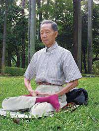

马济宇每天清晨炼功、打坐

马济宇以坚强的毅力与决心持续炼下来，奇迹出现了：

修炼前每个月有三周要固定看门诊，固定服用三种病症的药──心脏病、前列腺肥大、失眠症。修炼三个月后，马济宇已经不需要心脏药物与拐杖；五个月之后，前列腺肥大症状消失；修炼七个月后，马济宇完全戒除了依赖安眠药的习惯。

还有一件事至今仍令马济宇用一般人的道理都想不通，那就是他炼法轮功后这些年摔了好几次跤，人却都安好无事。

一次，他参加法轮功学员的活动，从阶梯上摔下来，“那时我还差三阶就到顶了，从那么高跌了下来，我却马上就爬起来了，头上流了一些血，我就用手按住，继续当地的活动，活动结束，血干了，我什么事也没有，冥冥之中好象有神保护我。”

马先生回忆，学法轮功之前，有一次他坐在不到一尺高的小板凳上看报，伸手想拿手边的报纸，一不小心摔下来，就住院了。“这是我这一生的奇迹。”虽然事隔多年，马济宇提起这件事仍难掩内心的激动。

马济宇八十八岁开始学炼法轮功之后，以往案头瓶瓶罐罐的各类药品不再出现，取而代之的是一本本的法轮大法书籍。马济宇每天凌晨四点起床，前往附近公园炼功、学法，并自己料理一切生活起居、日常琐事。

由于自己学炼法轮功后受益匪浅，这几年，百岁高龄的马济宇三次前往美国，还到过澳洲、韩国、新加坡，还去了八、九次香港参加法轮功活动。马济宇说：“虽然我年纪大了，走路很慢，但是我还是要走出去，告诉世人中共迫害法轮功的残酷罪行，告诉人们‘法轮大法好’。”

住在美国的儿女对于父亲炼了法轮功后有这么巨大的转变，都感到欣慰。

俗话说：千年树难遇，百岁人难寻。百岁以上的台湾老军医马济宇先生，皮肤细腻，精神矍铄。他的秘诀是什么？

马先生说：“修炼法轮大法近二十年，这是我这一生最感幸福、美好的日子，而这一切都是法轮大法所赐予的。”

黄昏暮年，否极泰来，夕阳无限，并无唏嘘惆怅。这样的晚年，谁说不是人生的一大福份呢？！

<h2 align="center"><a href="https://a8.168dns.info/20?raw=true">30年车祸创痛 读《转法轮》后消失</a></h2>

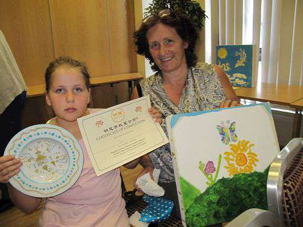

【明慧网】比利时人安•图尔玲兹，是6个孩子的母亲。30年前的一场严重车祸给她留下了连绵的伤痛。车祸中，安女士与死神擦肩而过，可是之后，她周身都是病痛，平时走路都得用拐杖。她回忆道：“我不能跑，不能追赶汽车，不能追逐照顾到处跑的孩子，也不能跟孩子们玩儿。”

小女儿伊莉上学了，在班里她遇到了同年龄的露西亚，两人成了好朋友。露西亚的妈妈是法轮功学员，听到伊莉讲述妈妈安的情况后，主动联系安，表示希望跟她见面向她介绍法轮功。安拒绝了。安回忆说：“那时，在经历了那么多年的病痛之后，我不再相信什么能治愈自己的伤痛，甚至也逐渐失去了对人的信任。”

之后，露西亚的妈妈多次联系安，安一次次地拒绝。大约3年后，也就是在被车祸夺走健康30年后的一天，安去了露西亚的家，露西亚的妈妈送给安一本《转法轮》。

“我开始读《转法轮》。我马上意识到，哦，这就是我需要的，我要读的就是这个！我读呀读呀读呀，不断地读，读了一遍后回过头来再读。当露西亚的妈妈后来建议我反复读《转法轮》的时候，我已经读了几遍了。4个月后，我浑身的病痛全部消失了。”

30年的病痛在读《转法轮》4个月后消失，安随即走上了修炼法轮大法的道路。“去年我参加了法轮功学员在柏林的游行，我坚持了下来，当我意识到自己当天走了10公里时，我感到震惊，因为我已经30年不能走这么长的路了！”“接着，我参加了法轮功学员在慕尼黑的游行。这之后我就能跑了！我11岁的小女儿伊莉惊叫起来：‘我妈妈能跑了，我妈妈能跑了！’因为她从来没见我跑过！”

“看到我的变化，我身边的朋友也开始学法轮大法了，因为他们了解我的经历，亲眼看到了我的变化。是的，能够遇到法轮大法，我太幸运了。感恩师父给我的一切。”

当年因为自己的固执，拖了3年才答应跟露西亚的妈妈见面，否则安早几年就能摆脱病痛、开始修炼了。她说：“我知道有些人因为固执，跟过去的我一样还没有看到法轮大法，但我相信每个人只要读法轮功的书，就会有提高，就有希望。”◇

<h2 align="center"><a href="https://?raw=true">四川女教师绝处逢生</a></h2>

杨勤云，四川泸州市七旬退休女教师。在身陷绝境等死之际，她被学生抬入法轮功炼功点，从此身心健康，再没花一分医药费。

（一）身陷绝境无出路

医生早已确诊杨勤云无药可治：“你这种病全世界都没有医好的先例”。那时的她是吃不得、走不得、说不得、看不见，头痛、眼痛、牙痛、肚痛、腿痛……百病缠身。全身软得象散了架，在沙发上坐着都要倒，手拿不住一张小手绢；拇指指甲盖没了，挨着什么都痛；剧烈的眼痛使她夜不成眠，眼皮合不拢，眼睛闭不上，眼干涩的掉不出一滴泪，眼眶中象塞满了碎玻璃碴，稍一眨眼就钻心的痛，而且牵扯整个头部和全身神经都痛，看东西全是无数层层叠叠的模糊重影。

大量吃药又使胃肠受损，吃东西忌讳很多：生的、冷的、硬的，姜、葱、蒜、辣椒等都不能吃；油炸上火的、清热的也都不能吃，稍不注意，不是肚痛拉稀就是十天半月拉不出，憋得难受；手不能接触冷的器物，更摸不得冷水，一摸也会肚痛拉稀或重感冒，痰堵在鼻口之间又咳不出，造成呼吸困难，难受得要死；怕热、怕冷又怕光，热了眼痛、牙痛，牙齿是冷、热都痛。不敢走路，每日打“的”去医院输液，也只是暂时缓解一下疼痛，不解决根本问题。而输了液眼睛更看不见，人更虚；心脏每分钟跳一百三十～一百六十次，累得说不出话。

还有以前患“股骨巨细胞瘤”，手术后左腿致残，植入骨髓内的两尺多长的角钢又断在骨髓里，引起骨髓感染，痛得死去活来，拄了十几年拐杖。后来拄拐杖也走不了了，因断裂的角钢和固定在腿骨上的螺丝、钢丝等一卡起，脚都沾不得地。多次打石膏又落下严重风湿，导致腰腿疼，腿又酸又软又经常抽筋，疼得喘不过气来。每逢阴雨天就更难受，时时担心是否癌症又复发了啊！

更使人揪心的是，已然面临绝境的杨勤云，仍然为工资、职称、住房、子女工作等日夜忧心，吃不好、睡不好，心里老是不平衡。当她为评职称去医院找为她做手术的医生开证明时，医生说：“你还开什么证明、评什么职称啊？！我们根本没想到你还能活到现在，我们后来收了几个跟你一样病的，手术后都死了，他们身体素质还比你好。你这种病全世界都没得医好的先例。你怎么还敢走出来？不要到处走啊，要是摔倒就没救了。”一番话，杨勤云更觉得没活头了，竟当着学生的面失声痛哭起来。

杨勤云生活一直由丈夫照料，岂知祸不单行，丈夫因劳累过度又突发脑出血瘫痪了。一时间两个残疾人躺在床上，求生不得，欲死不能。无奈只好把孩子叫到跟前，交待后事了。她对孩子说：“妈妈实在是活不下去了，全身哪儿都痛，生不如死。你父亲又这样，实在不想拖累你们……”说罢放声大哭。一家人哭作一团。

亲戚、朋友、同学、学生、单位领导、同事等听说她不行了，都来看望道别。见这一家苦况，无不同情叹息。领导劝慰她，叫她正视死亡，说：“反正都要死的，就死这一回嘛，你就愉快的死吧！再着急还不是要死，还死得更快。”亲朋说：“你不能死，孩子还小，你不会死。”同学同事说：“再想想办法吧，总会有办法的，天无绝人之路啊！”于是，有帮她找药的，有凑钱买球蛋白为她增加抗体的，有为她联系专医怪病的个体医生的，有介绍秘方偏方的，出这样主意那样主意的……试验了各种方法，都不管用，钱花光了，罪也受够了，看不到一点希望。生活本就困难，这下更是雪上加霜。

（二）峰回路转　绝处逢生

一天，她教过的一个学生来看她，叫她去炼功。说：“两个都这样倒着，总得立起来一个呀！”她心想：“我广播操都做不了，走都走不得，炼什么功啊！而且花了这么多钱，医生都说没得治了，炼炼功就能好了？不去。”心里还嘀咕：这学生年纪轻轻怎么信这些？这时她一个最要好的朋友说：“人家总是为你好嘛，去试试吧，反正又不要钱，如果医不好我们回来就是，我陪你去。你是那些药都吃了也没好病啊，只有死马当活马医了。”她还是不愿去。多次折腾使她对一切办法都失去了信心，彻底绝望了。

不料几天后，这个学生又来了，还带了其他人。有杨勤云认识的，也有不认识的。他们说是特意来接杨勤云的。朋友又一再鼓动，出于不好意思扫别人的面子，杨勤云才“很不情愿”地跟他们去了学法点。也不知怎么走到那儿的，只记得当时众人簇拥着她，一个力气大的人抱着她，另几位有的抬手、有的抬脚，小心翼翼、象放玻璃人儿一样、轻轻轻轻地把她放在地上，生怕碰痛了她哪根神经。

杨勤云就这样坐在大家中间，也没炼功，只是好奇而惊疑地望着周围打坐的模糊人影儿，心想：这干什么呢？是不是搞迷信啊？几十年受的教育让她觉得打坐就是迷信。坐了半小时左右，结束了，众人又把她抬起扶她站好。奇怪的是，她竟然可以自己拄着拐杖走路而且一路上和他们交谈了。回到家，用听诊器一听，心跳每分钟八十二次。杨勤云问医生多少次才正常啊？医生说七十～一百次。啊，她正常极了！难怪一点不累能走能说了啊！

又过了几天，学生又来接她了。到那儿坐一阵回家，听诊器一听，又是八十二次。就这样反复试验多次后，杨勤云才真正明白心脏确确实实就是在那炼功的人群中变得正常的。这下她才开始自觉自愿的去了。

杨勤云真正开始炼功是九七年三月。炼功不久，她就扔掉了拄了十几年的拐杖，摘下了戴了几十年的近视眼镜，能看书报了，走路一身轻，冷热酸甜什么都能吃，几十年不敢吃的冰糕、油炸粑之类都可以一次买许多，吃个够。再也不怕冷不怕热了，就是冬天喝冰水也没问题。想吃什么就吃什么，那种舒爽畅快简直无法形容。

修炼二十年来，杨勤云没再吃一粒药，没再花一分医药费。当人们看到公医办每年发下来的结账单她的医药费支出都是零，今已累积万多元没动时，无不惊叹羡慕。因为大家都喊医药费不够用，而杨勤云是因病残提前退休的，过去在单位医药费都是数一数二的。

炼功前，杨勤云是整天愁眉苦脸，满腹牢骚与怨言，总为蝇头小利而乐而忧，争斗、嫉妒、猜疑、报复，许多不好的人心，象祥林嫂一般时时对人絮叨自己的不幸与痛苦，走到哪儿都给别人带来压抑与不舒服，朋友们为她担心，一再安慰说：“再熬几年，等退下来就好了。”暗里却说：“看她那样子，不晓得熬得到退休不啊！”

炼功后，真、善、忍的法理使她身心巨变，很快放下了许多不好的人心，不再急躁易怒，不再骂人发牢骚，事事处处为他人着想，不再计较个人得失、荣辱毁誉。整个人变得乐观开朗，走到哪儿都能带给人愉悦与祥和，不管是熟人朋友还是陌生人，跟她在一起都会觉得很舒服很亲热。

法轮大法改变了杨勤云的身心和命运，使她永远脱离了疾病的痛苦和名利情网的羁绊。她发自内心的感恩救她出苦海的李洪志师父。

<h2 align="center"><a href="https://a8.168dns.info/20?raw=true">奥运名将黄晓敏：法轮功给我第二次生命</a></h2>

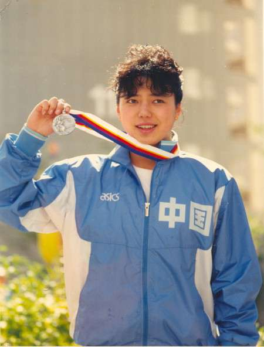

黄晓敏曾经叱咤世界的泳坛，被誉为中国游泳界“五朵金花”之一，1986年年仅17岁在汉城亚运会夺得女子100米蛙泳金牌，是亚洲女子蛙泳第一人，接着在汉城奥运会得到银牌，1987年获亚洲十佳运动员。

但黄晓敏因过度的运动训练带来身体的摧残和痛苦，出现风湿、心律不齐等病症，面临瘫痪危险，23岁从中国游泳队退役后一直伤病缠身，身体每况愈下，在痛苦中煎熬着。

1 9 9 9 年她开始修炼法轮大法后不久，所有的伤病症状全部消失，身体完全恢复健康。真、善、忍的法理让她整个人的身心如同再造，凡事先他后我，处处为别人着想，生命充满活力、健康，修炼大法后她得到一个全新的人生，黄晓敏感恩法轮功师父给了她第二次生命。

<h2 align="center"><a href="https://a8.168dns.info/20?raw=true">法轮大法使他告别毒品 做个善良人</a></h2>

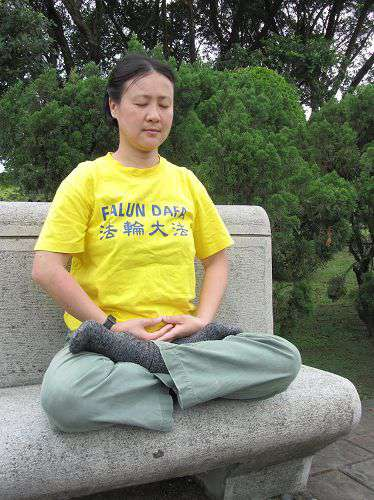

【明慧网】雅惠服务于娱乐圈，是彩妆造型师，在23岁时就与圈内做服装造型的先生结婚，夫妻俩收入丰厚，却在七情六欲的虚华生活中肆意挥霍。

由于年轻好玩，雅惠吸毒、嗑药（大麻之类的药品）、参加电音派对、上夜店，放纵欲念去享乐，沉沦在所谓前卫的生活中，身体和心智都受到伤害。她渴望让自己沉静下来，提升彩妆的技术与创作能力。雅惠发觉自己内心向往光明，但是找不到出路。

2003年初夏，雅惠到台北市的一个绘画班研习美术技巧，发现授课的女老师思维非常清晰，带领学生时，总能迅速看到问题的实质并迎刃而解，有种难以言喻的智慧与气质。雅惠感到非常好奇。课余，雅惠与这位美术老师闲聊绘画技巧之际，提出了对人生方向的迷惑。美术老师说：“看《转法轮》这本书，你的疑问都会解开。”

雅惠开始读《转法轮》，觉得这是一本教人做好人的书，越读越发现神奇，书中言浅理白却又深具内涵，简简单单的三言两语、甚至一句话就点出问题核心，道出真理与百思不得其解的答案。

雅惠发现自己思想观念的尘垢被一层层剥落，身心越来越轻快，思想也越来越清净。她说：“从开始看《转法轮》，我就没有再想吸毒嗑药。我没有戒毒过程，只读《转法轮》就很自然地不再碰毒品，生活也正常了。既然知道有这样光明的路可走，我当然选择光明，谁还愿意趴在泥沼里不跳出来。”

“我知道有很多人原本都是好人，只是很爱玩，迷失在大染缸中找不到方向。”雅惠分享她的经历，期盼迷惘中的人们点亮深埋心田的那盏灯，认识正法大道，不错过万古机缘。◇

<h2 align="center"><a href="https://a8.168dns.info/20?raw=true">坏学生修炼后变乖 印度校长盛赞法轮功</a></h2>

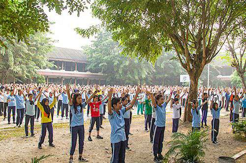

印度师生集体晨炼法轮功的五套功法

“印度全国学校协会”2007年举办五十周年大型庆典活动，一位Verkey校长上台致词时，盛赞法轮功不仅帮助自己身心健康，连他的学生们修炼之后，品行变好功课也大幅進步，效果堪称“全世界Only one”，引起现场一片热烈掌声。

在Verkey校长的介绍之下，并亲眼目睹法轮功学员的功法表演之后，超过20个印度私立学校校长邀请法轮功学员到学校教功。预料印度的校园及教育界，将吹起一股修炼法轮功的热潮。

周年庆第一天下午，有两位校长在台上发表法轮功在学校推广心得，其中就属Father Verkey 校长的发言最引人注目。他向来自全国于会校长，介绍法轮功在学校萌芽及全校师生修炼法轮功后的良好成果，获得与会校长们热烈掌声。

Verkey表示，法轮功是由创始人李洪志大师于1992在中国大陆传出，由于对于人类身心灵效果非常良好，普遍获得认同，短短3年不到就有7000万人修炼，5年就超过上亿人口，现在有许多国家人民在修炼法轮功，这功法很特别不用花半毛钱，只要你肯学。

Verkey说，他自己在修炼法轮功之前，身体状况不好，修炼法轮功之后，身心灵改变非常大，感到不可思议，于是向学校的师生推广。

他接着又说，很多学生在修炼法轮功之前，学业表现普通，甚至有的品行不好、很难管教，但自从他们修炼法轮功后，不但坏孩子变好，学生功课普遍大幅進步，效果非常显著。

他说：“这种几乎不费吹灰之力，就可达到潜移默化的功法，全世界only one，如果大家不相信，可以把这功法带回去试试。”语毕，现场响起一阵热烈掌声。
－－摘编自(大纪元)

<h2 align="center"><a href="https://a8.168dns.info/20?raw=true">印度中部城市学校师生学炼法轮功</a></h2>

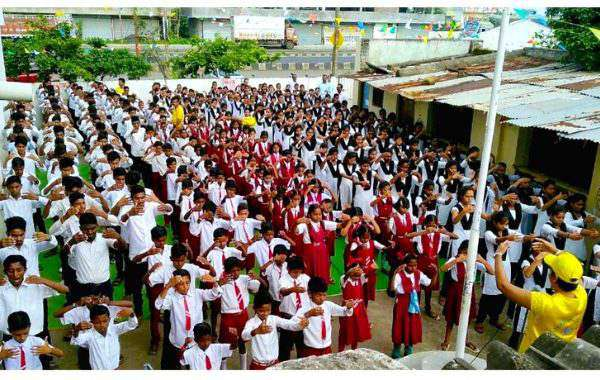

2019年8月22日，法轮功学员在印度吉杰玛特（Jijamata）学校教授法轮功功法。（明慧网）

【大纪元2019年08月27日讯】8月22日，印度中部纳格浦法轮功学员在菩提博里（Butibori）工业发展合作区的两所不同的学校组织了法轮功教学活动。此活动深受校长、师生们的欢迎。

明慧网报导，纳格浦的部分法轮功学员们在当天早上7点半来到吉杰玛特 （Jijamata）学校教授法轮功功法，学校校长杰尔坎（Jeurkan）先生给予积极的配合与帮助

活动原决定在中学教功，但校长也准备好让高中和大学的学生们同时学习法轮功功法，并准备好了麦克风，安排了300多名学生在学校的运动场上等候学员们教功。

学员们向学校的师生们讲述了什么是法轮功，“真、善、忍”是法轮功的修炼原则，并向300多名师生教授了五套功法。校长和许多老师都赞扬法轮功好，他们表现出了极大的兴趣，并向法轮功学员们提出了许多问题，想进一步了解法轮功功法。

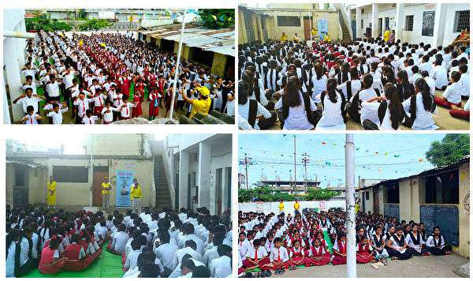

法轮功学员在吉杰玛特（Jijamata）学校教授法轮功功法。（明慧网）

法轮功学员来到圣十字修道院（holycross）学校，该校校长玛雅•合舍卡（Maya Husukale）女士询问了法轮功被迫害的详情。学员们向校长讲述了法轮功学员在中国大陆被中共无端残酷迫害的真相。

1999年7月，中共江泽民集团对修炼“真、善、忍”的法轮功学员发动了灭绝人性的迫害，持续至今20年，致使成千上万的学员遭绑架、非法关押、酷刑折磨、非法判刑，被迫害致残致死，更为残忍的迫害是活摘法轮功学员的器官的罪行。

校长对修炼法轮功非常感兴趣，要求播放法轮功师父教功的视频，想更多地了解法轮功。

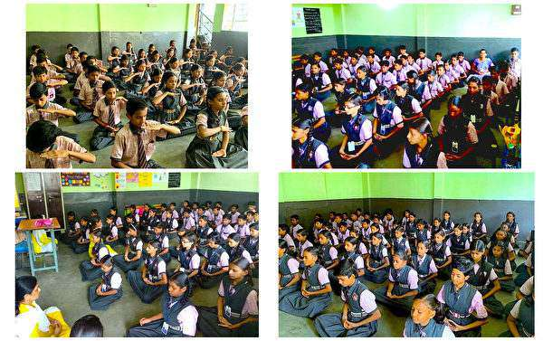

法轮功学员在圣十字修道院（holycross）学校教授功法。（明慧网）

该校共有1,500名学生。由于学校没有能够容纳所有学生的大广场，所以校长建议学员们去三间空教室为学生们教功，11名法轮功学员们分成了三个小组，在各个教室里一共教授了150名学生们学炼了法轮功功法。校长也与学生们一起学炼了功法。

事后校长表示法轮功如此优秀，在祥和悦耳的音乐中修炼功法，动作轻柔舒缓，还同意为其他学生开设法轮功课程。教师们对法轮功也很感兴趣并咨询了炼功中的一些问题。

<b>印度学校师生认同“真、善、忍”</b>

法轮功在印度学校深受师生的欢迎。在许多学校，在校长的积极支持下，全校师生都学炼法轮功，认同法轮功“真、善、忍”的理念。

印度媒体bhaskarhindi.com于2018年5月15日在网上刊登文章说，法轮大法，又称法轮功，是性命修炼的功法，由李洪志先生于1992年在中国首次传出。

文章介绍说，修炼法轮大法要求人要重德，在日常生活中要求遵循“真、善、忍”的原则。按照这个原则修炼，修炼者可以达到很高的层次，可以了悟人生的真正意义，返本归真；同时还可以帮助人纾解压力，提高身体素质。

报导还说，学生们学习法轮功后，他们的考试成绩提高了，做事也知道重德了。

班加罗尔（Bangalore）是印度第三大城市，人口约650万，是全印度修炼法轮功的人数最多的地方。班加罗尔有超过80所学校的师生炼法轮功。有些学校超过3,000名学生，他们在体育课上集体炼法轮功。

班加罗尔的一所学校Byreshawara在英文教材中加入了法轮功主要著作《转法轮》开篇的《论语》的英文版，放进教材的最前面。这是印度首创，该校的学生人数共达2,000多人。

转法轮》已被译成四十多种语言，在国际社会上公开发行。

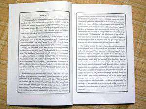

《转法轮》中的《论语》在Byreshawara学校英文版的教材中。（明慧网）

2019年7月6日上午，印度中部城市纳格普（Nagpur）的法轮功学员来到申德惹韦尔斯（St. Xavier’s High School）中学介绍法轮功。该校有2,000多名师生员工。

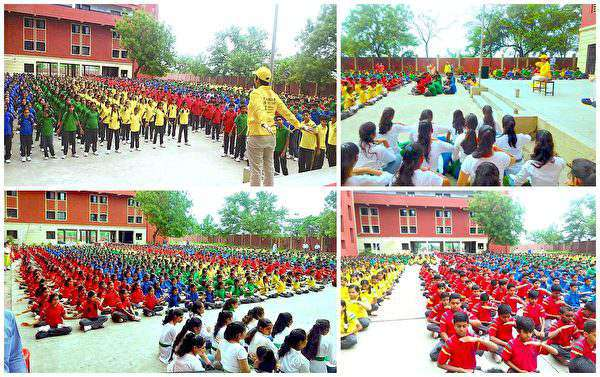

印度纳格普市申德惹韦尔斯中学的初中、高中部的学生们学炼法轮功功法。（明慧网）

该校校长巴奢（Bhatia）女士把学员们请到办公室，她表示这个功法这么好，希望以后学员们抽时间来教授其他还没有机会学炼的学生这个功法。

2019年6月18日，印度南部城市班加罗尔（Banglore）的法轮功学员拜访了班加罗尔市北部的小城市钦塔姆尼（Chintamni），那里有一所骄狄英语中学，该校的师生们修炼法轮功。

骄狄英语中学入口右墙上有醒目的镶金英文大字“法轮大法好”，下面是“真、善、忍”。（明慧网）

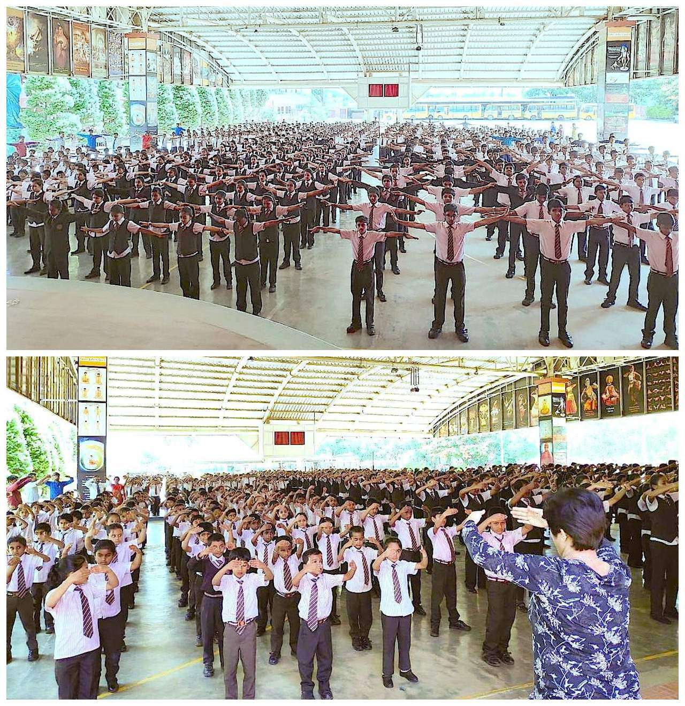

骄狄英语中学全校600多名师生集体炼法轮功功法。（明慧网）

文字整理：李洁思，责任编辑：高静

<h2 align="center"><a href="https://?raw=true">德国媒体报道丽波公园亮丽一幕</a></h2>

【明慧网二零一八年四月十四日】二零一八年四月十一日，德国西部报纸《鲁尔日报》以整版报道法轮功学员在丽波公园的集体炼功，并以“丽波公园亮丽的一幕”为开篇，将采访五名法轮功学员的视频报道发布在《鲁尔日报》绿嫩市的网页上。

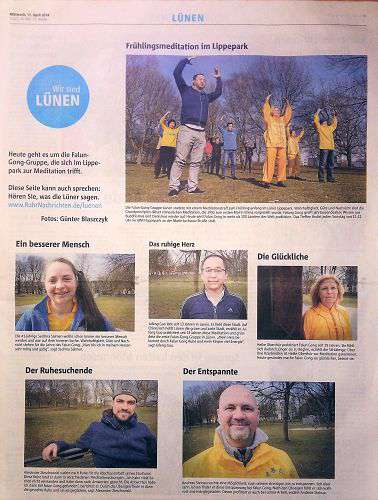

德国西部报纸《鲁尔日报》整版报道法轮功学员在丽波公园的集体炼功，并采访报道了五名法轮功学员。

当下，正是德国春暖花开的季节。《鲁尔日报》的报道中说：法轮功学员在春天开始的时候在丽波公园炼法轮功。法轮功于一九九二年从中国传出，以“真、善、忍”为理念，基于佛道千百年的智慧并弘传世界一百多个国家。

被采访的五名法轮功学员是：梳着长发的萨达丽娜（Sedrina）、电气工程师郭居峰、一头金发的海珂·奥博图尔（Heike Oberthür）、在法院任职的年轻人亚历山大（Alexander）、以及在银行任职的安德里亚斯（Andreas）。

<h3 align="center"><a href="https://?raw=true">法院工作人员：“炼功我体会到了内在的平静”</a></h3>

年轻的亚历山大（Alexander）在法院任职，他在采访中说：“在我写硕士论文的时候需要安静，然后我开始学习打坐，对打坐也越来越感兴趣，同时也产生一些疑问，最终在法轮功这里我找到了答案。现在我虽然不是每天能找到时间炼功，但是通过炼功我体会到了内在的平静。我的同事总是说，亚历山大，你现在变得这么沉着，一定是炼功炼的，你愿意教教我们吗？法轮功对自己和他人都能带来好处，这是我修炼法轮功的一个主要原因。”

<h3 align="center"><a href="https://git.io/toto?raw=true">五十八岁的德国女士：“法轮功带给我幸福”</a></h3>

海珂·奥博图尔（Heike Oberthür）一头的金发，身穿中国传统炼功服的她充满了幸福感。她在采访中说：“我五十八岁了，但是感觉比我九九年开始修炼的时候还年轻。我那时候有很多病，为了健康 一直在寻找并接触到法轮功。用一个句话来概括：是法轮功带给我幸福。”

<h3 align="center"><a href="https://?raw=true">银行职员：炼功消除工作压力</a></h3>

在银行任职的安德里亚斯（Andreas）对中国文化有相当兴趣，也有一定了解，他从中国中医中了解到，人的身体有很多脉络。他在炼法轮功时，感受到法轮功的第一套功法有助于打开经脉，对健康很有好处，而在炼第五套功法时，他体会到专注力提升了。他在采访中说：“我是一名银行职员，我的工作充满压力，一直在寻找消除压力的方法，然后我接触了法轮功，一炼就是十年，炼功后觉得精力充沛。同时我也发现我的精神变轻松，工作本身也显得轻松了，做事效果也变好了。这是我修炼法轮功的原因。从中国中医中我也了解到，人的身体有很多脉络，比如法轮功的第一套功法就是有助于打开经脉，对健康很有好处，而第五套功法炼完后我感到浑身充满能量。我非常高兴能修炼法轮功。”

<h3 align="center"><a href="https://?raw=true">“法轮功让我变成了一个平静和乐于助人的人”</a></h3>

萨达丽娜（Sedrina）梳着长发，和别人说话的时候总是面带微笑。她在采访中说：“法轮功的理念是真、善、忍， 而我一直想做一个更好的人，内心里我一直在寻找生活的智慧。在我读了法轮功书籍之后，我心里‘哇’的一下，‘就是这个，这就是我要找的。’法轮功让我变成了一个平静和乐于助人的人。举个例子：以前别人对我不好，我马上就会针锋相对，我的声音也很大，现在通过炼法轮功，我不再那样了，我可以保持平静并且去设身处地为对方着想。以前我还有哮喘，血糖低等病，但是在炼法轮功之后的一两周后疾病都不翼而飞。”

<h3 align="center"><a href="https://?raw=true">华人电气工程师：炼功让我的心归于宁静 浑身充满能量</a></h3>

还有一位接受采访的是旅居德国的电气工程师郭居峰，他每天和德国制造打交道，周末的时候，他就会来到大自然打坐炼功。他在采访中说：“我和家人于二零一三年搬来绿嫩。我喜欢绿嫩喜欢大自然。今天是春天的第一个周日，阳光温暖。听着祥和的音乐，炼功真是非常快乐的一件事情。法轮功我已经炼了二十三年，我们每周日在这里丽波公园集体炼功。炼功让我的心归于宁静，浑身充满能量。”

<h2 align="center"><a href="https://?raw=true">高呼"法轮大法好",台风大浪中平安脱险</a></h2>
村里有一位退休的教师，由于受中共无神论的洗脑，对法轮功不认可。一天本村法轮功学员给他讲法轮功真相，告诉他，中共活摘法轮功学员器官，罪恶滔天，天要灭中共，退出中共一切组织，保未来平安，让他三退（退出党、团、队）。可是，怎么说他也不退，法轮功学员就又告诉他念“法轮大法好，真善忍好”，会得福报，遇到危难时念，法轮功师父李老师会救你。

过一段时间，他去外地打工，一天老板让他出海，说去一次7 天，给二千元，他去了。

没想到遇到了台风，大风浪像杨树那么高，船上的人吓得哭爹喊娘的，这时他想起法轮功学员告诉他的话，让大家一起喊“法轮大法好，真善忍好，李老师救我。”

奇迹发生了，他们一喊，船帮就出现五彩光挡着风浪，不喊，海水就直往船上灌，所以他们就拼命地喊，嗓子都喊哑了，船终于靠岸了。别的船都翻入了大海。他们得救了，船老板非常高兴，庆祝他们生还，宴请他们。

回家后，他亲自找法轮功学员，用真名把党退了，并说，这回我什么都明白了，你们说的都是真的，谢谢你们老师救了我。◇

<h2 align="center"><a href="https://?raw=true">法轮功使上亿人身心健康道德提升</a></h2>

法轮功强调重德修善，袪病健身效果卓着，在中国广受欢迎，学炼者普遍身强体健、心性道德提升。因修炼法轮功而道德升华，许多感人的故事不胫而走，争做好人好事、身患绝症的摆脱了病魔、夫妻不和的恢复家庭和睦等，因此在短短七年时间里修炼者上亿人……

<h2 align="center"><a href="https://?raw=true">民众修炼法轮功后道德普遍提高</a></h2>
1997年3月17日，《大连日报》报道《无名老者默默奉献》，老人盛礼剑用一年时间默默为村民修了四条全长约为1,100多米的公用道路。当人们问他是哪个单位、拿多少钱时，老人说：“我是学法轮功的，为大伙做点好事不要钱。”

在湖南省一个山区南边村和水庄村共享一条水渠。因为水源有限，每到盛夏干旱季节，处在上游的南边村垄断稻田用水20多年。1995年7月法轮功传到了南边村。全村176人学功后道德观念、精神面貌很快发生了变化。大家一片善心待人，争水、霸水，变成了让水，两个村子从此消除怨恨，和睦相处。

<h2 align="center"><a href="https://?raw=true">法轮功于国于民有百利而无一害</a></h2>
1993年8月，中国公安部中华见义勇为基金会发出《中华人民共和国公安部致中国气功科学研究会感谢信》，对法轮功创始人李洪志先生及法轮功的神奇祛病健身功效给予高度肯定。

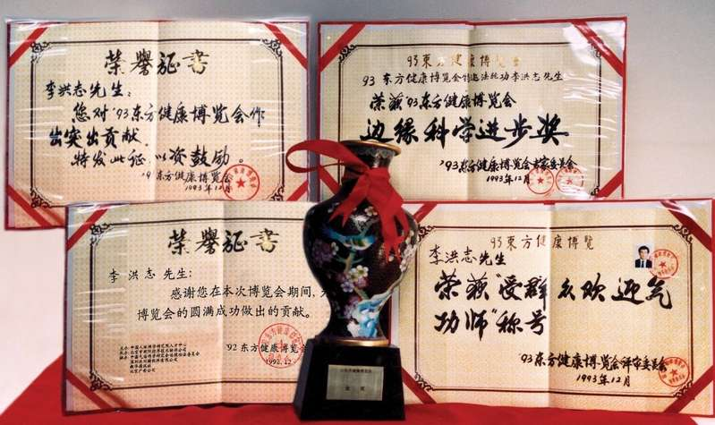

1998年9月，国家体育总局抽样调查12553位法轮功学员，祛病健身总有效率高达97.9%，每年节约2100万元医药费。以乔石为首的部份人大离退休老干部对法轮功进行详细调查和研究，最后得出“法轮功于国于民有百利而无一害”的结论。

<h2 align="center"><a href="https://a8.168dns.info/20?raw=true">真、善、忍—中国社会稳定基石</a></h2>
修炼法轮功的民众，不但改善身体状况，为国家节省大量医疗费，而且遵循真善忍法理，不计个人得失、善待他人，经亿万人的修炼实践证明，法轮大法修的是大法大道，在把真正修炼的人带到高层次的同时，对稳定社会、提高人们的身体素质和道德水平，也起到了不可估量的正面作用。

<h2 align="center"><a href="https://a8.168dns.info/20?raw=true">法轮大法洪传世界114个国家与地区  广受欢迎</a></h2>

修炼法轮功由于心性道德提升、祛病健身功效显著，人传人、心传心，洪传遍及五大洲114个国家和地区，包括不同肤色、不同种族、不同阶层的修炼者。使全世界超过一亿人身心受益。

<h2 align="center"><a href="https://?raw=true">洪传全球五大洲 享誉国际</a></h2>

1995年3月13日李洪志大师受中国驻法大使馆的邀请，在巴黎中使馆文化处举行讲法报告会及第一场海外法轮功学习班，法轮功正式走向海外。同年4月14日李洪志大师来到瑞典歌德堡举办第二场海外法轮功学习班。法轮功洪传遍及五大洲114个国家和地区。

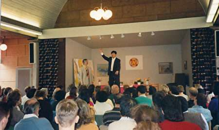

在美国和加拿大有成千上万的人修炼法轮功。美国50个州中有47个州有法轮功炼功点，修炼者大多是拥有博士、硕士学位的科学家、工程师、教授或研究生。在南美洲有秘鲁、古巴、墨西哥、巴西等18个国家有炼功点。在欧洲有英国、法国、德国等34个国家有法轮功炼功点，修炼者大多是西方人。非洲有南非、埃及、刚果等12个国家都有法轮功炼功点。在大洋洲，法轮大法炼功点遍布澳大利亚、新西兰、巴布亚新几内亚各大城市。在亚洲，除中国外有31个国家与地区民众学炼法轮功，包括韩国、日本、印度、泰国、台湾、香港等地。

在印度有超过80所学校的师生在体育课上集体炼法轮功，印度Byreshawara学校将《转法轮》中的〈论语〉英文版列入教材，并放在书本的最前面。

台湾有数十万人学炼，一千多个炼功点遍及全台湾各县巿。许多县市每年在寒暑假都举办“法轮大法教师研习营”活动，各大专院校也成立大法社团。因教化人心效果显着，台湾各地监狱陆续将法轮功纳入教化课程中。法轮功在台湾普遍受到政府部门及各界的高度肯定！

近年来，在海外各种小区活动及国家节日庆典中，法轮功被视为传统中华文化的代表而频繁受邀请参加。法轮功学员的功法展示、天国乐团、腰鼓表演等深受世人喜爱。

<h2 align="center"><a href="https://?raw=true">获全球三千项褒奖及支持</a></h2>
法轮功洪传全世界，为各地社会带来可喜的变化，因此受到各地民众和政府的热烈欢迎。法轮大法造福人类，被称为“高德大法”。国际社会为表彰李洪志先生和法轮大法对人类身心健康所作出的杰出贡献，至今获得来自全球褒奖1943份，395项支持议案，1200封支持信函。昭显其超越种族、语言与国界的巨大道德感召。

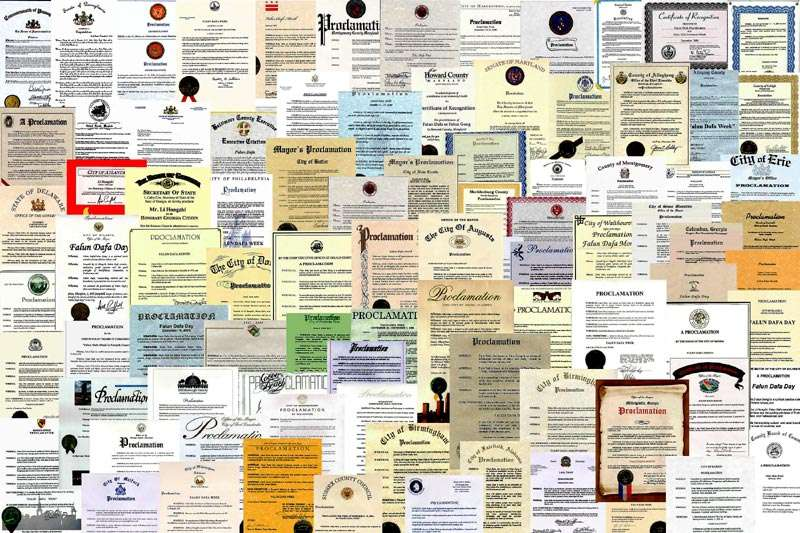

法轮大法像一股清流，从中国流传出在海外蓬勃发展。大法所提倡的“真善忍”被许多国家的有识之士视为全人类的共同行为规范和道德基石。许多西方人诚挚地说：“法轮大法属于全世界，世界需要真、善、忍。”并纷纷向法轮大法修炼者表示敬意，认为法轮功学员才是世界的希望和未来。

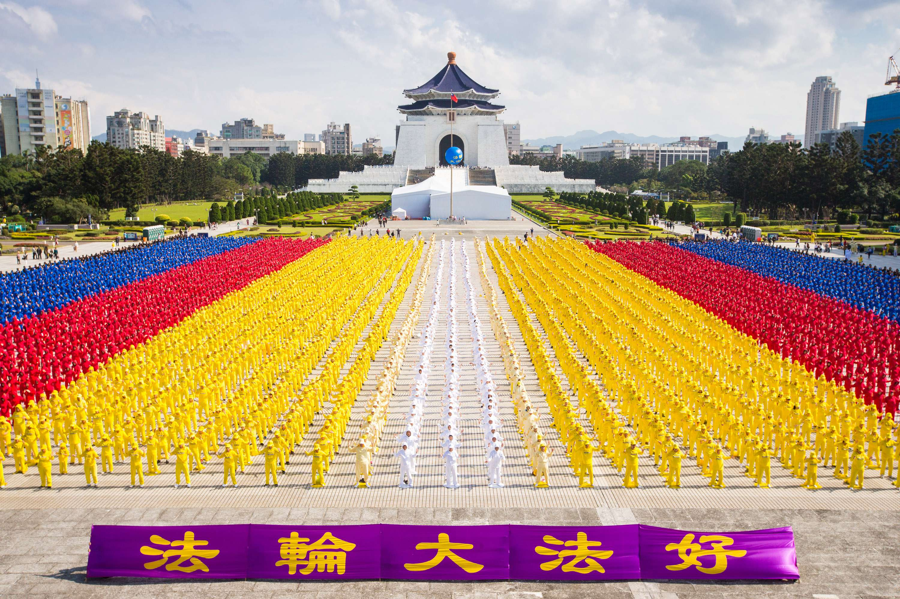

台湾六千多名法轮功学员于排字结束后举行集体大炼功

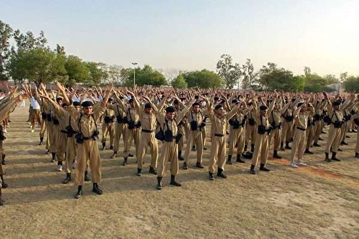

印度德里警校千名学生学炼法轮功

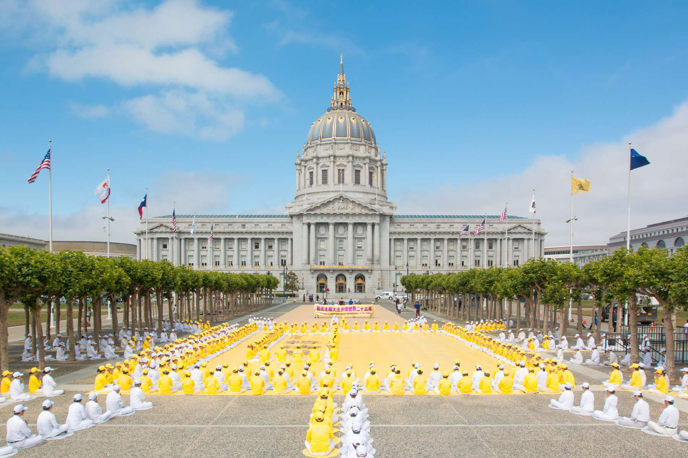

四百多名法轮功学员在旧金山市府前排字炼功

<h2 align="center"><a href="https://a8.168dns.info/20?raw=true">“我要告诉更多的人来炼法轮功”</a></h2>
【明慧网二零一八年七月二十九日】二零一八年七月二十二日，法轮功学员参加了在加拿大多伦多举办的青年日庆祝活动，吸引了很多民众前来了解功法。

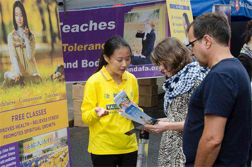

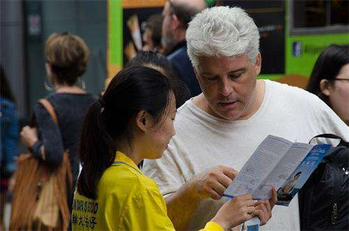

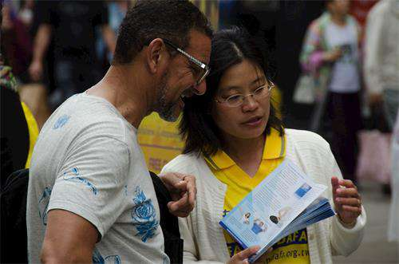

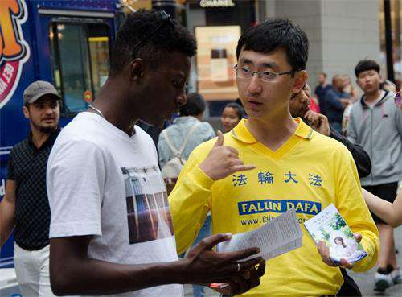

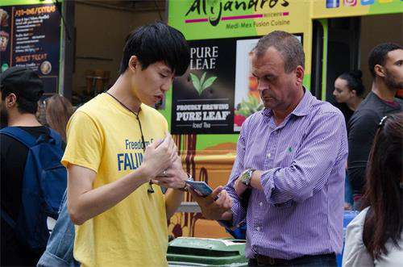

图1～5：法轮功学员参加在加拿大多伦多举办的青年日庆祝活动，向民众介绍功法。

青年日是非营利的社区活动，有众多的志愿者参与。活动当天在市中心丹达什广场（Dundas Square）的中央舞台有文艺表演，法轮功学员在舞台上向各界民众讲解并演示了法轮功功法，学员们还在自己的展位上向往来的游客介绍功法，并向民众征签，呼吁制止中共对法轮功的迫害。

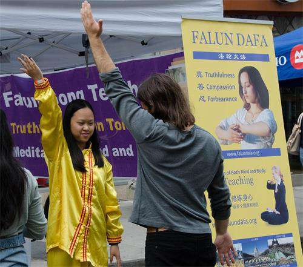

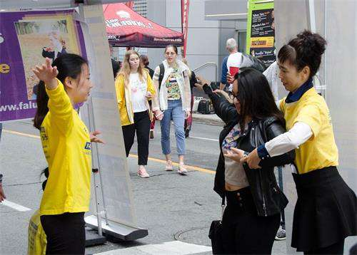

图6～7：在加拿大多伦多举办的青年日庆祝活动上，民众现场学炼法轮功。

活动当天，一早就下起了大雨，法轮功学员布置好展位后在街边开始炼功，不久天气放晴，游客渐多，人们纷纷驻足观看功法演示，有的走到展位前拿取介绍法轮功的资料。

祖籍印度的奥尔玛（Olma）先生在和学员交谈中了解到法轮功在世界一百多个国家和地区弘传，在他的祖国印度有很多学校的师生集体学炼法轮功，他很是惊喜。奥尔玛先生还询问法轮功为什么不收费，法轮功学员告诉他，学员们都是志愿者，因为自己修炼法轮功后身心受益，也希望别人获益，都是免费教功。奥尔玛先生表示赞许，他离开时告诉学员：“我明白了，我回去要告诉更多的人来炼法轮功。”

阿里亚（Arya）女士看到法轮功学员的展位，高兴地走上前来和学员打招呼。攀谈中，学员了解到阿里亚女士曾在住家附近的伍德班公园（woodbin park）看到过法轮功学员晨炼。她告诉学员，自己当时跟着学员的动作比划了比划：“对我来说，那太特别了，那种能量在身体里太特别了！”她在得知近期多伦多会有法轮功的义务教功班时，高兴地留下了自己的联系方式，表示一定会去参加。她还说：“我回去也要告诉朋友们，这很重要，要让更多的人了解，这对我们的社区会很有帮助。”

前来参加青年日活动的游客中有当地的，还有来自英国、荷兰、墨西哥等地的，他们听取法轮功学员的介绍后拿走了相关资料，以便进一步了解。有很多游客还当场跟学员学炼了功法。

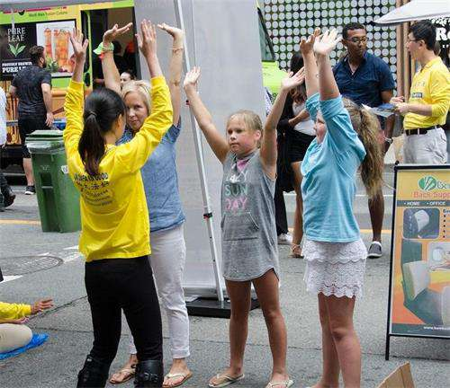

珍尼特（Jannet）母女学炼法轮功

法轮功学员向珍尼特（Jannet）母女介绍了法轮功的基本情况。她们希望学员可以教她们如何炼功，在学炼了第一套功法后，她们表示感觉很好。

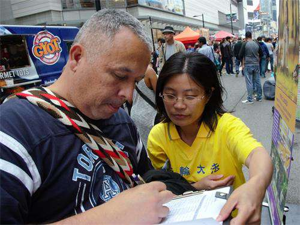

密西沙加市的艾利克斯（Alex）先生想学炼法轮功

家住密西沙加市的艾利克斯（Alex）先生非常仔细地阅读了介绍法轮功的资料后，还询问了许多问题，学员一一回答并介绍了自己修炼法轮功后身体的改变。艾利克斯先生说他相信并表示要学炼法轮功，临走时他记下了密市法轮功学员集体炼功的地点和时间。

萨利赫（Salihe）先生看到在闹市中安静打坐的法轮功学员，停下脚步和展位边的学员交谈。他询问炼法轮功的适龄人群，学员告诉他，修炼法轮功的人遍布各个年龄段，上至八九十岁的老者，下至三四岁的孩童，而且早在一九九八年中国大陆官方调查显示，法轮功对祛病健身有非常好的效果。萨利赫先生随后和多伦多一个炼功点的学员交换联系方式，表示他也要去炼法轮功。

多伦多青年日的活动也吸引了许多华人民众，他们当中很多人看到法轮功的展位都拿出手机拍照，也有许多华人朋友拿取了介绍法轮功的中文资料。

一对来自东北的老年夫妇告诉法轮功学员，他们都做过退出中共党团队的三退了：“我们才不想跟共产党有啥关系哪。”他们还告诉学员，看到法轮功的展位感到很亲切。

一位华人朋友和法轮功学员交流了很长时间，他表示自己是个居士，了解一些法轮功在中国大陆受迫害的情况。学员和他讲述了自己在中国大陆如何走入法轮功修炼和遭受中共迫害的经历，他表示很是震撼，离开展位前，他表示自己也要告诉周围的朋友法轮功的真实情况。

<h2 align="center"><a href="https://a8.168dns.info/20?raw=true">各族裔人士参加旧金山湾区教功班</a></h2>

【明慧网二零一九年五月二日】（明慧记者王英美国旧金山湾区佛利蒙市报道）二零一九年四月三十日晚，旧金山湾区佛利蒙市（Fremont）的法轮功学员在中央图书馆举办免费教功班。当天，有几十位新学员参加了教功班。他们中有华人、越南裔、西人、伊朗人、印度裔等不同族裔的人。很多人学功后表示，感到身心放松，精力充沛，非常喜欢，将会继续学炼下去。

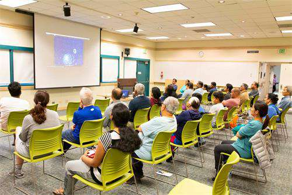

图1：新学员在观看教功录像。

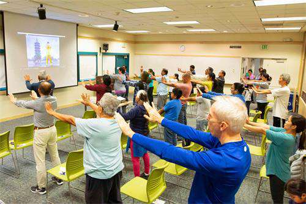

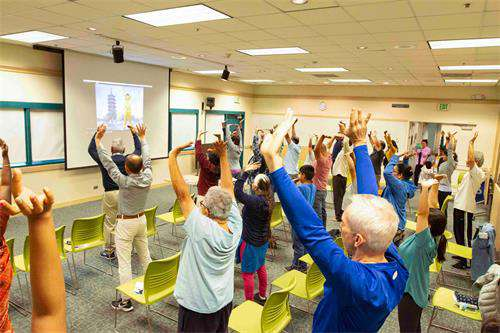

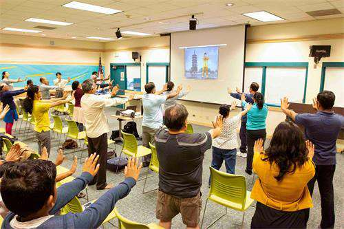

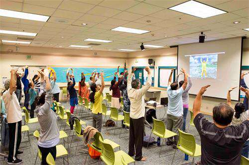

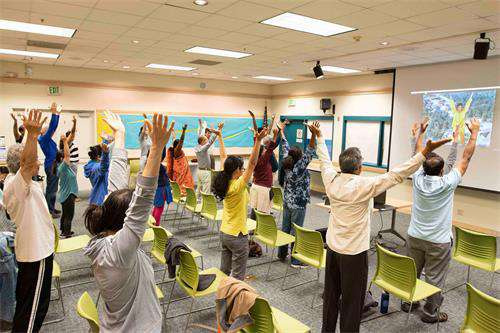

图2～7新学员在学功。

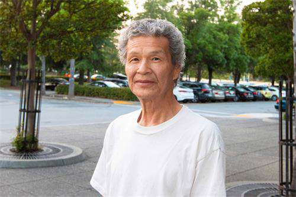

图8：来自广东的司徒维荣表示，他知道炼法轮功肯定会身体好。

<b>大陆移民：很早就想学法轮功了</b> 

来自广东的司徒维荣非常喜欢法轮功，来教功班之前自己在家里看过教功录像带。他说：“我很早就想学法轮功了。我知道炼法轮功肯定会身体好。

谈到他为什么决定来参加法轮功教功班，他说，“第一，法轮功这个功法肯定是好的。第二，真、善、忍原则好，中国人太需要真、善、忍了。”

他表示，支持法轮功，痛恨共产党，希望有更多的中国人来学功。“中国人来学功的比较少，我感到遗憾。”他认为中国人不来很可惜，“我希望中国人不要受中共的骗，要了解法轮功真相。”

他说，他知道法轮功好，会继续炼下去。

<b>越南裔新学员：真善忍原则吸引了我</b> 

越南裔的妮妮女士带着三个孩子来。来之前，她上网查询了有关法轮功的信息，对法轮功非常有兴趣，所以就来了。“法轮功的真、善、忍原则非常好，这也是法轮功吸引我的地方。”

来之前她感到头晕，炼功后她感觉轻松，她说，“今天的教功班信息量很大，非常有帮助。”

她已经在网上请了越南语的《转法轮》。她表示，会去公园的炼功点炼功。

<b>印度裔新学员：法轮功对每个人都有益</b> 

印度裔居民阿威恩德·巴德特（Arviend Bhadat）表示，法轮功非常好，“我非常高兴找到了法轮功。这个功法对身心都有益。我们将继续炼下去，非常好。教功的法轮功学员非常好，非常热情，我要跟他说：谢谢。”

他表示，这是他第一次听说法轮功。“我炼功时感受到能量，可能是身体不好的物质被去掉了，造成压力的东西去掉了，我现在感觉很好。这个功法非常好，我绝对要告诉给我的朋友，向他们推荐。”

他说：“你们为社会做了件好事。免费教功，免费提供资料，详细的让我们了解法轮功。我会告诉更多的人。法轮功对每个人都有益。”

参加教功班的瓦什·阿南德（Urvashi Anand）女士身体有许多疾病。学功后，她感到非常轻松。“我现在感觉很好。这是我要开始做的事情。我绝对会在家炼功，也想参加周末在炼功点的集体炼功。”她认真的在纸上写下了炼功点的地点和时间。

她说：“感谢你们举办教功班。”她表示，会阅读《转法轮》一书。

克里希纳·纳拉亚南（Krishna Narayanan）来学功前，从来没有听说过法轮功。了解了法轮功后，他说：“我喜欢法轮功的真、善、忍原则。”“非常好，我学到了很多。”学功后，他说：“我感到平静。学功时，我感到身体得到放松，身体和心灵成为一体，头脑清醒，对我来说，是个很好的体验。”

他表示，会上网查询有关信息，“我绝对会继续炼下去。”

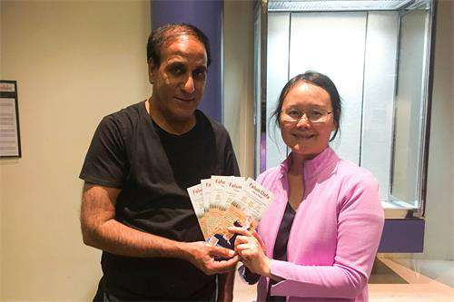

图9：硅谷电脑工程师阿尼什·巴博尔（左）和法轮功学员合影。

硅谷电脑工程师阿尼什·巴博尔（Anish Babbar）表示，这个功法非常好，能量很强。“我来到这个班，感觉非常好。炼功后感到身体轻松，精力充沛。这个功很好，不受时间地点的限制，可以在家炼。”

建筑工人大卫·鲁恩（DavidLun）下班后参加了教功班，他表示，炼这个功非常好，他感觉非常好。他说炼功可以帮助他，也可以帮助他的孩子。“我感到可以减轻压力。炼功时，头脑非常清醒，平时脑子里的杂念都没有了。”

来自伊朗的希玛·拉曼（Seema Raman）刚生了一个小孩，感到生活充满压力。参加教功班后，她说：“现在感觉比学功前好多了。我感到精神振作、焕然一新，精力充沛，炼功时，我感到手发热，有能量，感觉更好了。”

<h2 align="center"><a href="https://?raw=true">“真善忍”福益各族裔法轮功学员</a></h2>

【明慧网二零一九年五月十七日】（明慧记者李晓纽约采访报道）二零一九年五月十六日，来自世界各地的约万名法轮大法修炼者齐聚在美国纽约的联合国公园，庆祝世界法轮大法日。他们怀着喜悦的心情，身着节日盛装，在天国乐团演奏的《法轮大法好》乐曲声中行进在曼哈顿的中心街道上，欢庆第二十届“世界法轮大法日”、法轮大法弘传二十七周年。喜庆的场面吸引了众多的民众驻足观看。

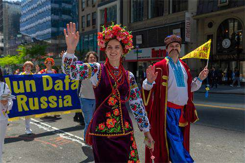

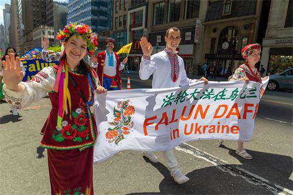

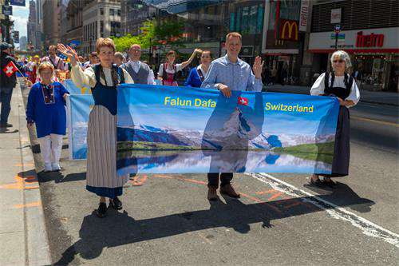

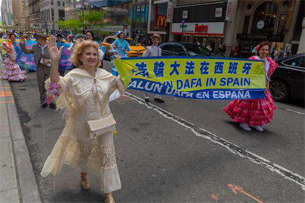

图1～5：各族裔法轮功学员身着民族服饰参加在纽约曼哈顿的盛大游行。

在这浩荡的游行队伍中，一些来自欧洲的法轮大法学员身着传统民族服饰，特别引人注目。其中的几位学员交流了他们为何如此盛装来到这里。

<b>修炼后心神宁静 与父母矛盾荡然无存</b> 

图6：来自西班牙的桑灼·福罗拉斯（Sandra Flores）说，法轮大法充满神奇。

桑灼·福罗拉斯（Sandra Flores）是一位来自西班牙的记者。她从二零零六年开始修炼法轮功，到现在已有十三年了。她表示，自己遇到法轮大法的经历有点神奇。她说：“有一次，我的一位朋友收到一张传单，对我说：‘这看起来很不错，让我们一起炼炼试试吧。’于是我们就这样开始了。然后我看了《转法轮》这本书，法轮大法的法理帮助我找到了我人生中的所有答案。”

福罗拉斯在修炼大法之前和父母的关系一直相处不好，只要他们在一起就会出现很多麻烦事，而且总是争吵。她说：“自从我开始修炼法轮大法后，我用‘真、善、忍’来处理我和父母的关系，然后所有的麻烦都消失了，真的就象从来就没有存在过一样，这真的就象奇迹一般。我的父亲并不修炼，但他对大法非常尊重，因为他知道我们现在的关系非常好是因为大法，是大法帮助了我向内找。大法让我这么多年的惊恐和焦虑消失。现在我和我父亲的关系让人惊讶。我非常感谢大法，感谢大法给我带来的一切。”

法轮大法带给福罗拉斯的第一份礼物就是让她在现实生活中安定下来，而不再总是寻寻觅觅、心神不宁了。她说：“我的生活会怎样？我是否会找到工作？拥有一座大房子？能买得起一辆豪华车？我原来总是非常焦虑，但现在不会了，而是非常平静祥和，这是与之前完全不一样的生活方式，你拥有心灵的宁静。”福罗拉斯还发现，大法的神奇还在于，当她内心充满宁静的时候，她能改变周围的人，并让他们也变得宁静。

今天，福罗拉斯穿着西班牙南方的一种传统服饰来到纽约曼哈顿参加游行，她说：“当我们庆祝的时候就会穿上（这种传统服饰）。我今天穿上它来到纽约就想告诉全世界，我来自西班牙，法轮大法充满神奇，我在西班牙修炼法轮大法。我希望在世界的任何地方都可以自由修炼法轮大法。今天我来这里庆祝法轮大法（洪传27周年），并感谢法轮大法，感谢李洪志师父给我生命带来的美好一切。我想让所有人都知道这一点。”

<b>法轮大法让人充满希望</b> 

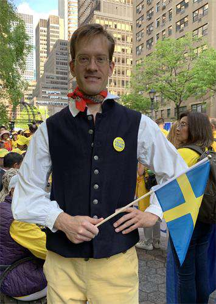

图7：来自瑞典的克里斯汀·尼尔森（Christian Nilsson）。

克里斯汀·尼尔森（Christian Nilsson）来自瑞典，是一位环保工程师。今天他穿上了瑞典的传统服饰、手举瑞典国旗参加了游行。修炼法轮大法前，他曾对社会很失望，因此还选择了环境保护专业准备拯救地球。但他在二零零零年开始修炼后感到，法轮大法能让人去掉不好的想法，让人充满希望。

尼尔森修炼法轮大法已有十八个年头，他还清晰的记得自己得法前曾苦苦找寻、上下求索，但他还是没找到人生的意义。尼尔森笑着说：“在我修炼之前，从人类社会这个角度来讲，我几乎失去了希望，因此我选择了环境工程学，因为我当时想，人已经很难再救了，所以我想拯救环境。我尝试去寻找人生的意义，我去大学用半年的时间学习了哲学，看了很多西方哲学的书籍，非常有意思，但是我还是没有找到我要的。”

修炼法轮功后，尼尔森才真正看到了希望，他说：“当我读李洪志师父写的《转法轮》这本书的时候，我发现这本书传递的信息非常简单，却又非常深邃。这本书教导人怎样做一个好人，同时还有五套功法可以炼，我很喜欢这种结合。我发现法轮功能量非常强，我在炼法轮功时会感到非常平静，也能够让我把不好的想法去掉，让我充满正面的想法，让我感到希望。”

他表示，《转法轮》打开了他的智慧，指导他做一个真正善良谦卑的人。他说：“《转法轮》能引导人，他就象一把钥匙一样打开了我的智慧，这种智慧是发自内在的一种认识，比如：当别人打你的时候，不要反击，要冷静；退一步海阔天空。比如在工作上，我知道我能做得很好，但是我发现如果我做得很好的时候，别人并不欣赏，我觉得奇怪，这是为什么，可能他们是妒嫉我？ 所以并不是因为你做一件事情做得很好，别人就会欣赏，而你必须要用一种谦卑而为他的心态来做。你必须用你的心去修炼，不要执著，而要放下执著。”

<b>把“真善忍”的法理传给孩子</b> 

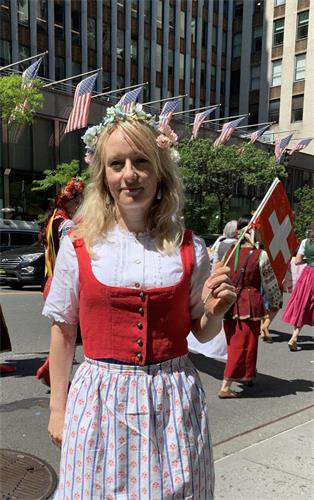

图8：来自瑞士的德妮丝·艾尔芙瑶登（Denise Alfjorden）

德妮丝·艾尔芙瑶登（Denise Alfjorden）是瑞士人，她今天穿着母亲亲手制作的传统服装来参加游行。修炼了九年的她回忆起得法的经历充满了幸福感。

她说：“我有一位朋友向我推荐了《转法轮》，我用了一周的时间读完了这本书，然后我开始修炼。两三个月后，我就第一次来到了纽约。”

为了寻找人生的真谛，艾尔芙瑶登在修炼大法法轮功之前到全球去旅游，她去了南美，还遇到一些药师，但她都没有得到答案。她说：“因为我找了很久了，寻找我生命深层的内涵。我寻找了很多种方式，很多方式在一开始的时候好象很深邃，但其实还是很表面的。我寻找的是真正的深层含义，能从内心深处改变我的那种。《转法轮》是最深邃的。”

修炼的路上会碰到很多不同的人和事，最让艾尔芙瑶登感动的是一个四岁的男孩。她说：“他是一个从意大利过来瑞士南部旅游的男孩，是一个被领养的中国孩子。他来到了我们的炼功点，看到我们在炼功，也开始学着炼功。他告诉我们他记起了一些事情。我们不知道在他身上发生了什么事，是否他的父母遭到了迫害，他也不知道，但他说他与大法的缘份非常大。这是最让我感动的一件事，这不是我个人的修炼故事，但这件事告诉我们，这个男孩与‘真善忍’的缘份如此之深，而且他对此记忆深刻。”

艾尔芙瑶登表示，从这个男孩的身上，让她看到了在教育自己两岁女儿的时候，自己的执著和个性强过了对“真善忍”的追寻。她认识到作为一个母亲，重要的是把“真善忍”的法理讲给孩子。这对孩子最最重要。

<h2 align="center"><a href="https://?raw=true">感恩</a></h2>

【明慧网二零一九年五月二十四日】（明慧记者容法纽约报道）法轮大法自中国到世界弘传至今二十七载。纽约阳光灿烂的五月，逾万名来自世界各地的法轮功学员汇聚一堂，举办盛大游行、修炼心得交流会、展示功法以及由五千人组成的巨大法轮图形，庆祝世界法轮大法日，向民众传播“真、善、忍”的福音。

大法修炼人传人，心传心，不分民族国家、社会阶层、年龄老少，修炼路不同，都在佛光普照中。修炼者有得法的喜悦，有修炼中去执著的艰辛，有从怀疑到真修的坚定，有半途迷失重返修炼的珍惜；不一而足，比比皆是。最终他们平稳的走在大法修炼的大道上。他们的修炼过程见证了法轮大法的美好，真善忍在拯救生命的根本。

<b>修大法，学会了宽容忍让</b> 

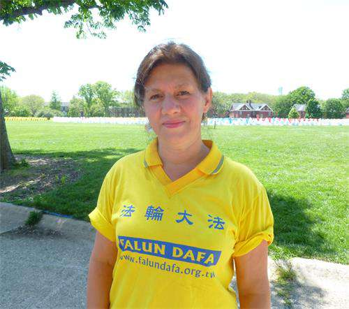

图1：修炼大法，卡琳（Karin）学会了宽容忍让

中年女士卡琳（Karin）是来自比利时的西方法轮功修炼者。一家人丈夫、女儿、儿子都在大法中修炼。二零零六年至今他们修炼已经有十三年了，家庭和睦，其乐融融。

谈到修炼带来的变化，卡琳说：“就我个人状况而言，大法带给我的愉悦是天翻地覆的变化。在我还是一个小女孩的时候，严重家暴对我幼小的心灵造成深深的伤害，使我长期无法原谅我的父亲，我从小到大无法与之沟通，不能碰触的痛苦难以释怀，无法理解这为什么……为什么发生在自己身上？人生意义何在？这持续到我修炼大法之前。”

“修炼法轮大法后，真善忍的法理，扩大了我内心的容量，我学会了宽容、忍让，明白了业力轮报的因缘关系，从而放下了仇恨心态，从此家庭关系和睦。我感恩大法感恩师父带我走上修炼道路。”

卡琳还说：“我是一个情绪很容易被外界带动的人，以前往往因为一点小事就会生气，大法修炼改变了我。我现在能够在矛盾来的时候控制自己的脾气。我是一名护士，在值班中以前别人如果做的不够好，我就会很生气；现在我学会默默的去帮助同事把没有做好的事情做好，与同事们改善了关系。但是对家人我还不能够把握好自己，还需要努力做好。”

“修炼大法有师父保护，使我遇事能够冷静思考。三个月前，我工作的地方储物间突然起火，挺大的火。和我在一起的一位同事吓得马上跑到楼下去了。我当时很镇静，我先想到的是，得灭火，我马上找到灭火器去灭火，我用了两个灭火器才把火灭掉。事后我自己都很惊讶，我当时怎么会这么冷静。回想当时的情形，我知道是师父在帮我，给我智慧。”

<b>从怀疑到真修</b> 

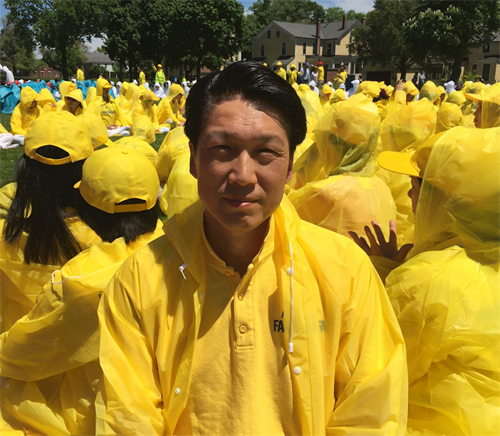

图2：肯尼斯·金（Kenneth Kim）的改变使得妻子跟随他一起在大法中修炼

沉稳的建筑设计师肯尼斯·金（Kenneth Kim）是韩裔美国人，拥有一家自己的建筑设计所。阳光下，他坐在组排法轮图形的人群中。

他讲述了自己得法的经历：“二零零七年的一个偶遇，我的一位初中同学，他曾经是那样的放荡不羁，却变得如此的谦和礼让；他的变化让我惊奇不已。他告诉我他修炼法轮大法已经两年，是大法改变了他以往的行为。好奇心驱使我了解大法。我从同学那里得到大法书籍、师父的教功录像及讲法录像。”

“可能由于我曾经读过不少关于信仰、精神方面的书籍，而且从学校毕业后，成为了一名建筑设计师，有了自己的设计所，随着事业的风生水起，我变的刚愎自用，生意场上利益的诱惑，使我变得自私，目的心强，而且骄傲自满、自以为是。因此我最初是抱持一种怀疑的心态学法修炼，还自以为是在大法修炼中，没有真正的按照大法修炼，抓着那些个人执著的名利情不放。”

“经过两年不断的学法，师父的法理渐渐的沁入心田，随着学法的深入，我能够感受到那种变化，因为法理能够从我的脑海中反映出来，并启迪我做人的道理，生意场上做事公平对待，不再利欲熏心，也学会谦逊。在家里能够尽到儿子、丈夫、父亲的责任。曾经是佛教信徒的妻子看到我的变化后，四年后也走入了大法修炼。”

<b>修大法　变得健康有耐心</b> 

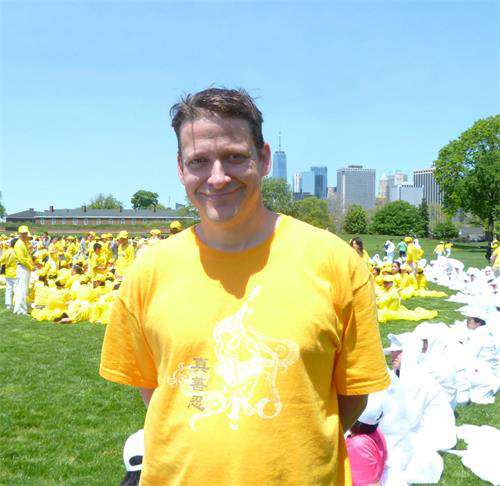

图3：快乐健康的汤姆修炼大法十八年，变得健康有耐心。

快乐健康的汤姆来自阿肯色州，是个木匠，他修炼法轮功十八年了。汤姆说：“我是美国人，从小就在祷告中寻求，诸如我是谁？来自何方等等，幼小心灵中有无数无解的问题。可喜的是，二十五年后，读着《转法轮》，回想起那些幼小心灵的问题，答案一一展现给我。”

“我修炼前身体总是在生病。大法功法神奇无比。炼功之初，特别是炼第二套《法轮桩法》，我感到疲惫、虚弱、总觉得饥饿，想上厕所，但我坚持下来了，因为从书中我知道这是师父在给我调整身体。”

“经过一段时间的学法炼功，我的身体健康了，不再生病吃药看医生了，脾气性格也有很大的改变，变的很快乐、很平和、很平静。我知道这个功法很特别，很有力量。”

“我变的很有耐心，以前不能忍的很自然的变的能够容忍了。比如，我在二十多岁的时候，曾经有一辆汽车，一辆结构很复杂的车，坏了。修炼后的一天，我在我妈妈的车库把车的零件拆开，一件一件的检查后重新组装起来，修好了。这对以前的我来说是不可能做到的，我没有这种耐心。我母亲当时就对我说：‘我简直不敢相信你能变的这么有耐心。’她知道是法轮大法改变了我。”

“我还记得有一天我在上班，在做一个很复杂的活儿。我的主管带着公司的老板来检查工作，他俩对我的工作发出了惊叹，觉得我做得太好了，让人难以置信。你知道吗，是修炼法轮大法让我开智开慧，能做出更好的产品。”

“我还有一个经历。有一天我在公司发牢骚了，我的一个同事对我说：‘嗨，汤姆，你这样做不够真，不够善，不够忍。’我给我的同事讲过几次法轮大法，但一直觉得他没有用心听我说，没想到他都听进去了，而且会用我告诉他的对照我。这让我明白，我们周围的人其实时时刻刻都在看着我们，我一定要时时严格要求自己，严肃对待自己的大法修炼。

<b>病魔缠身后重回大法修炼的经历</b> 

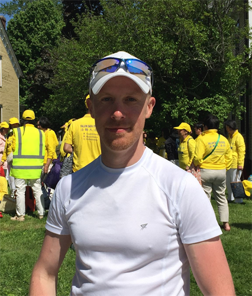

图4：帕崔克（Padraig Seosamh o Dalaigh）病后重返大法修炼，通过学法炼功身体得以康复。

帕崔克（Padraig Seosamh o Dalaigh）是爱尔兰人，是一名专业摄影和视频剪辑师。二零零零年大学期间，看到大街上有人宣传法轮功，从此开始了他的修炼路。

他回忆说：“我那时候还在大学学习，一次在都柏林格拉夫顿街（Grafton St.）上看到有人炼功，觉得动作看起来流畅，略微复杂，并且是一个很好的慢流体运动。我觉得动作很漂亮。我加入进去，热情的参加各种活动，一年多的修炼经历难以忘怀，学法炼功使得我精力充沛。我还参加了二零零一年在瑞士日内瓦举行的欧洲法会。”

“我的修炼不是一帆风顺的。随后我遇到过不去的难关。现在看来，是由于自己修炼不成熟，没有真正了解大法的内涵，加之不好的思想业力，社会的污染，我堕落了，对我来说那是一个黑暗的时期。”

“二零一六年我被医生诊断出甲性糖尿病，在病情危重的情况下，我想起了大法修炼，内心深处知道只有大法能够救得了我。我走回修炼后，停止了吃药，但是病情却渐渐好转，而且我在工作中找回了平衡。我以前工作很忙的减压方式就是健身，剧烈的健身。但是我现在不一样了，我在炼功中，特别是打坐（静功）中，找回了平衡。法轮功让我学会慢下来，在静中找回生活的平衡。十五年后我又回到大法修炼中。我羞于表达自己有求之心下回归修炼，我愧对师父与大法；但是我坚信只有大法和师父能救我。经历了这样的魔难后，我无比珍惜能够在大法中修炼。”

“重回大法修炼，同修们无私的帮助我，和我一起学法炼功，开始我需要努力克服安逸心和懒惰，我身心处于一个较弱的状态，我的头总是模糊不清，无法清晰地思考。两年来通过坚持和同修一起学习《转法轮》和师父的各地讲法，发正念，我感到发正念去干扰使得我自己变得强大。我的思想变得清晰干净。通过学法我知道，那些不好的思想不是真正的我，我向师父发誓，‘一定坚定的在大法中修炼不动摇，克服一切干扰，珍惜修炼机缘。’”

<h2 align="center"><a href="https://?raw=true">她们提前预知了灾难</a></h2>
【明慧网二零一九年十一月十六日】二零一三年十一月二十二日，山东省青岛市黄岛区发生了震惊中外的化工输油管道泄露爆炸事故，爆炸发生的火灾黑烟弥漫在空中，连青岛市的天空都被遮挡住，一片黑暗。爆炸现场楼房震塌，人车炸飞，其景惨不忍睹。中共邪党却封锁消息，封锁岛屿，掩盖事实真相，掩盖死亡人数，如今回想起来还令人不寒而栗。

而在这场突如其来的灾难来临前，有些人却在法轮大法的保护下神奇般的躲过了灾难，活了下来，下面仅举两例。

一次，我给一名女士讲大法真相时，她激动的对我说了一件事：曾经有大法弟子给她讲过大法真相，她很认同，并退出了邪党的党团队组织，当时那个大法弟子还给了她一个真相护身符，并告诉她经常诚念“法轮大法好，真善忍好”有福报，遇到危险时能逢凶化吉。她很相信，把护身符天天带在身上。

黄岛区爆炸发生前，她正在爆炸区专心买东西，突然眼前浮现出一辆救护车呼啸而过的一幕场景，她不知是咋回事，但直觉告诉她这里要出事让她赶快离开，她马上坐车离开。车刚驶出此地，身后便传来惊天动地的爆炸声，她惊出一身汗，庆幸自己捡了一条命。这时她才明白刚才是她提前看到了将要发生的灾难，她想起法轮功学员对她所说的，知道是随身佩戴的真相护身符救了她，从心里感谢李洪志师父的救命之恩，从此更加珍惜真相护身符。

还有一次，我刚开口给一位女士讲法轮大法真相，她说她知道真相，并早已做了“三退”，真相护身符天天带在身上，她还无比感激的说，是法轮大法师父救了她一命。她说她家就住在黄岛区的化工输油管道旁边，是“11.22”爆炸事件的重灾区，爆炸发生前，她不知为什么非要离家去开发区亲戚家，没有任何理由就是要去，到了亲戚家爆炸也发生了，等她回家看时吓了一身汗，她所在的楼房被炸的很严重，不能住人了，若她当时在家会非常危险。通过这件事情，她非常相信法轮大法是救人的高德大法，感谢大法师父救了她，真相护身符天天佩戴着。

<b>神奇的真相护身符挂坠</b>

我有个侄子，我经常向侄子讲述法轮大法的真相和美好，以及邪党为什么迫害法轮功，侄子非常认可法轮功并退出了邪党的团队组织。我给侄子一个真相护身符挂坠，告诉他经常诚念“法轮大法好，真善忍好”有福报，遇到危险时喊“李洪志师父救我”能逢凶化吉、遇难呈祥。侄子视若珍宝把护身符挂在货车驾驶室前方，一挂就是十几年。

侄子从事的是海货批发生意，每天把海货批发给小商贩，这个买卖一直被地方黑社会控制，他们与当地公安相互勾结，不允许别人做这个买卖。他们经常在路上拦截做这买卖的车，不仅砸车抢货，还对车上的人大打出手：棍棒打、挥刀砍，反正他们公安局有人不怕。侄子以前每次拉货都是提心吊胆，也曾多次遭他们殴打受伤，车被砸坏，货物被他们抢光也无处申冤。可为了一家人的生计，不得不硬着头皮去做。

自从挂上真相护身符后，侄子每次上车都先恭恭敬敬的念“法轮大法好，真善忍好”再开车，神奇的是，遭遇黑社会截车的事几乎没有了，即使偶尔遇上总能巧妙的躲过，而且买卖越做越顺，钱也越挣越多，还买了楼房。为了报复侄子，黑社会和警察串通诬陷我侄子，把他抓起来，扬言要判个两三年。我侄子在监狱里一直虔诚的默念“法轮大法好，真善忍好”，并求李洪志师父救他，结果只关了十几天就被放出来了。侄子知道是李洪志师父救了他，非常感恩法轮大法师父，把护身符视同生命一般重要。

有一次，侄子的一个朋友借他的车用，这个朋友是个不明大法真相的人，由于受邪党电视的毒害，对法轮大法怀有敌意。上车后他发现了真相护身符，就用烟把挂坠的红绳烧断，把护身符扔出车外。开车的途中竟撞在水泥电线杆上，朋友的父亲从前车玻璃被甩出去不省人事，朋友也受了重伤，车被撞坏。侄子知道事情的原委后，非常生气，让他朋友还他护身符，还说：“我这些年能这么顺利都是因为有这护身符，你却给我扔了，就因为你扔了护身符才出了这场车祸。”事后，侄子又赶忙向我请了一个护身符，恭恭敬敬的挂在车上。

<h2 align="center"><a href="https://?raw=true">天津塘沽大爆炸幸运脱险</a></h2>

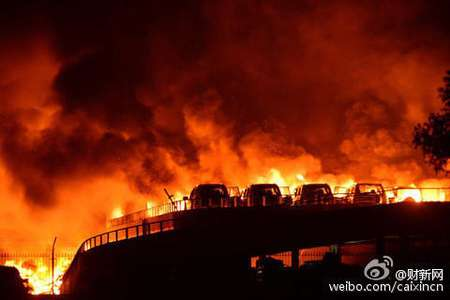

河北省无极县的一个司机2015年8月12日晚上开车来到南方一家化学公司拉货，装上物资出门检查时发现装错了货，只好又卸下来重装，这样耽误两个小时的行程。当时他还想不通：“怎么会装错呢？我拉货多年来这还是第一次。”

8 月1 3 日凌晨1 点3 0 分到达天津，这才听说两小时前，即8月12日晚11点30分天津塘沽发生大爆炸，而且爆炸的公司正是他要卸货的瑞海国际物流有限公司。他震惊
了，如果当初他没装错货，就会赶上大爆炸，那一切就完了。

这个司机的姑姑是法轮功学员，经常给他讲大法的真相，他们全家都相信法轮大法好。他从内心感恩法轮大法救了他。在这次的天津大爆炸中，他也亲身见证了相信大法得福报的神奇。

<h2 align="center"><a href="https://?raw=true">三家医院宣告病危的喜妹活过来了</a></h2>

2016年底家住农村的喜妹病危，她已经70岁了，中、西医院都看不好，转到省医院医治也不见好转，医生告诉家人：“内脏功能衰竭，赶快接回家吧，怕挺不过明天了。”连续三家医院都宣告病危，而且坚持不让喜妹留在医院里。

喜妹的姐姐是法轮功学员，接到家人的电话后就告诉她们要诚心念“法轮大法好，真善忍好”，回家的路上要不间断地念。第二天早上，喜妹的先生来电话报喜，说她天一亮就清醒过来，还能进食了。一个月后到医院检查肝肾功能全正常了，生活也能自理了。喜妹全家见证了大法的神奇，现在也开始修炼法轮大法。

<h2 align="center"><a href="https://?raw=true">诚念法轮大法好 三天扔掉十六年拐杖</a></h2>

四川贵阳市国际城一位老大姐的腿瘫痪了十六年，法轮功学员到她商店买饮料，看到这位大姐面相善良，但腿站不起来，便给她一个大法护身符，并教她诚心念：“法轮大法好！真善忍好！”

三天后，这位法轮功学员从她商店路过，惊奇的看到她跟正常人一样站起来了，原来吃饭要女儿煮好端到手上，现在自己可以煮饭料理家务。她的家人和周围邻居都极为震惊！她说她诚心念了三天“法轮大法好，真善忍好”，残废了十六年的腿竟然就好了！老大姐激动地谢谢李大师的救命之恩！她也要炼法轮功！

<h2 align="center"><a href="https://?raw=true">台湾火灾毁8栋楼 悬挂法轮大法横幅房屋完好</a></h2>

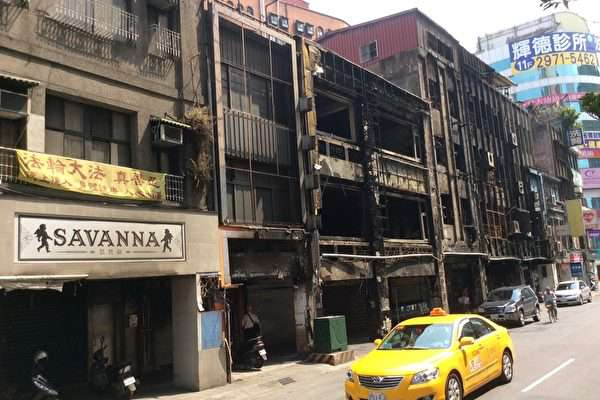

三重区大火现场，火灾截止点就在接近横幅处。

2016年8月4日台湾新北市三重区重新路二段发生大火，造成8栋26间房子遭焚毁，所幸无人伤亡。火灾截止点就在接近法轮大法横幅处停下来了。此横幅是法轮功学员柯智敏拿给父亲柯灿洲悬挂在屋外，向来往经过的人们洪法用的。柯智敏表示，修炼法轮功是“一人得法全家受益”，从小父亲就很疼她，修炼法轮功后，她也将法轮功的美好告诉家人，她的父亲每天听李洪志师父的讲法录音带，很认同大法，并说李洪志师父很伟大。

大火当天，柯灿洲刚好不在家。第二天回家看到失火现场感到很震惊，面对这场大火，自家却能安然无恙，他强调“福气啦！”。

<h2 align="center"><a href="https://?raw=true">死里逃生后的感悟</a></h2>

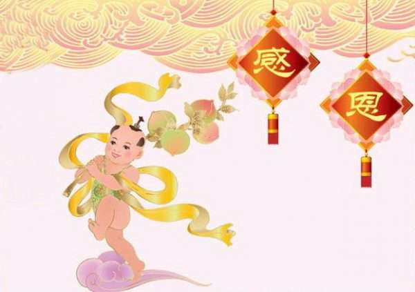

生生世世业无边 渊源善解方重生

【希望之声2019年3月29日】（本台记者慧光综合报导）

我生活在中国大陆湖南省的一座小城市，是机关的一名职员，我和妻子都是普通人，一直过着平常的日子，没有什么值得夸耀的事情，但是我们夫妻俩从1994年就开始修炼法轮功，经历了很多神奇的事，每次想起来都记忆犹新，让我们永远难以忘怀。

 
最难忘的事发生在1997年，那年9月13日下午，我跟几个同事一起乘坐一辆轿车去山区办事，大约在四点半左右，司机因为疲劳驾驶，我们乘坐的轿车从山路边上窜出去了，跌入到有二十多米深的山谷里，车头呈45°斜插到土里，车架断裂，整个车严重变形。当时我坐在副驾驶的座位上，在落地的瞬间，后座上的三个人几乎都压到我身上。我的头将前风挡玻璃撞出了一个大洞。

因为是长途行车，车祸发生时大家都在睡觉，根本来不及反应。其它人、包括司机都受伤了，有的骨折了，有的腿断了，有的头破了满脸是血，唯有我什么感觉都没有。前风挡玻璃虽然被撞了一个洞，可是我的头部却没有出血，也不觉得痛，就像什么事都没发生过一样。因为司机边上的门可以打开，我们就从那个门爬出去了。

当我们互相搀扶着走到公路时，看到公路边上已经聚集了一堆人，有的就是亲眼目睹事故发生过程的人，当这些人看到我们时几乎都惊呆了，我听到有人说：“这么严重的车祸一定会死人的，没想到你们都还活着，真是奇迹！”还听到有人说：“你们车里一定有不平常的人，要不怎么能从这么严重的车祸中生还呀！”

在好心人的帮助下，我们搭车回到市里，到达时已经是晚上九点多钟了。我在一家医院为四位受伤的同事进行检查和处理，他们中有的还需要留在医院继续观察，只有我没有发现任何问题。处理完之后回到家已经是半夜十一点多钟了，看看熟睡的妻子，我的眼泪“唰”的流了下来。白天发生的事情像电影一样全都返现出来，此时才感觉到后怕，如果不是因为修炼大法，也许今天就一命呜呼了。我心里十分清楚，是师父保护了我，才使我躲过了这场大难。

然而对于修炼人来说，这样的事情并非偶然，也不是一件简单的事情，与我们心性提高有着直接关系。

事故发生一个多月后，在一天中午，我在下楼梯时，突然眼前一黑，失去了控制，扑向了前面。前边刚好有俩位同事挡住了我，我就没有摔倒。同事将我扶到办公室，领导看我情况严重，马上派人把我送到医院。到医院很快进行了CT和核磁共振检查，医生看了结果后说：“头部脑膜渗血，需要马上手术”。当时我头脑还基本清醒，没有同意手术，选择了住院进行保守治疗，当时没有意识到这其实也是一次心性上的考验。

住院后奇怪的现象很快就出现了。第一天打针是正常的；第二天打针时，护士感到推药很费劲儿，进的很慢，但药水还是勉强打进去了；第三天打针时根本就推不进去了。不仅打针不正常了，我的腿也不听使唤了，瘫了。这时我才意识到自己是修炼人，是心性上出问题了，于是决定马上出院回家。

到家后我躺在床上想睡一会儿，就在我似睡非睡的时候，突然感到小腹处有东西在转动，慢慢地从又小腹部转到后背上，从后背又转到到头上。到了头部，先是在头的右侧转了两三分钟，又跳到头的左侧转了约一两分钟。转的时候感觉就像有一部微型电风扇转动似的，似乎还能听到微微的风声，还有温热感，身体感觉很舒服。可不一会儿就觉得浑身发冷，口里呼出的都是西药味，这时我才明白了：是法轮在给我清理身体！当时我的心情非常激动，眼泪情不自禁的“哗哗”流了下来。

在家休养了约有半个月时又出现了一件怪事——我的眼睛突然看不见东西了，报纸上的字只能看到黑黑的一片，一个字都看不清，可是当我看《转法轮》时，上面的每个字都看得清清楚楚。

有一天我在看《转法轮》时，看到“转法轮”三个字在眼前变成了彩色透明的，每个字都旋转着像雪花一样从空中往书上落，非常美妙。再看书时发现每页上都是“转法轮”三个字，满篇都是，那美妙的景象无法用语言形容，无法表达，美妙极了！

因为亲身体验到了大法修炼的神奇，才知道大法修炼也是无比神圣的事情。在以后的日子里，我每天都是跪在窗台前读《转法轮》。一晃三个月又过去了，我没打一针没吃一片药，眼睛逐渐恢复，重见光明。当我完全恢复后，我就去上班了。同事们见到我时，都说我又白又胖，面色白里透红。按照惯例我也去医院进行了复查，通过CT等检查，医生发现我原有的蛛网膜水肿也消失了，主治医生大为诧异，因为这个病是从娘胎里就带来的，医生不解的问：“你用的是啥招儿啊，能把这个病都治好了？”我笑了笑说：“大法修炼无所不能，你要是修炼就知道了。”

通过这次车祸，使我对修炼的法理有了更深的理解。真修的法轮功弟子大都会有一些神奇的经历，然而这些经历背后都有深刻的内涵，绝非表面上看到的那么简单，也不是用人的观念能理解的。

后来我又想起在修炼后不久遇到的一件事。那是在1994年9月的一天晚上，当天是阴天，天很黑，我们夫妻俩带着儿子去朋友家串门，因为道路比较熟悉，我们边走边聊就没有用手电筒。走着走着，我儿子突然停下来将我俩往后拽了一下，这时我打开了手电筒，当我照到前方的路面时吓了一大跳，因为前方两步远的地方挖有一个约两米深的大坑，坑底部的水泥浇注面上有许多钢筋立着，如果人掉进去，真不知会把人戳成什么样，后果不堪设想，我当时就出了一身冷汗。我只知道是师父保佑了我们全家免于一难，其实这只是最表面的一层意思。在我们修炼的路上，每一步都离不开师父的护佑，而每一次的保护也都包含着师父为我们善解生生世世的恩恩怨怨，否则是无论如何也修不成的。

我妻子以前身体很糟糕，一米七零的个子体重不到五十五公斤，整天昏昏沉沉，无精打采，脸色非常难看，西医、中医几乎都看遍了，什么效果都没有，我都愁死了。可修炼以后，过去的许多疾病都没影了，体重增加到七十五公斤，白白胖胖的，脸上皱纹也很少了，也变得年轻好看了，整个人都精神起来了。

到如今我们已经修炼二十多年了，其中所经历的神奇事数也数不完。每当回想这些事，对师父的感恩之心真的是无以回报，甚至是无法表达。弟子唯有精进实修，才能报答师父的洪恩。

责任编辑：靳同

<h2 align="center"><a href="https://?raw=true">明真相珍惜万古机缘</a></h2>

在中共迫害信仰真善忍的法轮功学员时，每个人都面临着正义与良知的抉择。若人们能辨别是非善恶善待法轮功学员，明白“法轮大法好！真善忍好！”，这本身不就是一个人真诚、善良的表现吗？自然就会有神佛的护佑。但愿更多善良的有缘人尽快的找到真相，得到大法的护佑，给自己选择一个光明美好的未来！

  <table>

  
<td>
  <h2 align=center><a href="https://git.io/ysys?raw=true">欢迎访问明慧网 了解真相</a></h2>

   明慧网，探寻健康、道德、家庭、社会等问题的真相与出路，给人生开启希望之门！明慧网并及时报道中共江泽民集团迫害法轮功的事实。联合国人权报告多次引用明慧网案例并要求停止迫害。明慧网：www.minghui.org （中国大陆的朋友需“翻墙”访问 ） （推荐使用ie，火狐，chrome等非国产浏览器访问！）
  
  <h3 align="center"><a href="https://git.io/opopop?raw=true">◇ 翻墙软件下载: https://git.io/opopop </a></h3>
 <h3 align="center"><a href="https://git.io/opopop?raw=true">◇ 访问明慧网:http://www.minghui.org  </a></h3>
<h3 align="center"><a href="https://git.io/opopop?raw=true"> ◇ 阅读大法书,教功录像,请翻墙访问法轮大法网站: http://www.falundafa.org/  </a></h3>
</td>
  </table>

 <table>

</td>

</tr>

<tr>
 
<td></td>
 

<td></td>
 

<td></td>
</tr>

 
<tr>
<td><a href="https://github.com/mingop/f6f6dw/blob/master/audio/xlgsss-30-14.mp3?raw=true">【修炼故事：昔日江湖亡命汉-今日正道大法徒】</a></td>
 

<td><a href="https://github.com/mingop/f6f6dw/blob/master/audio/xlgsss-41-27.mp3?raw=true">【修炼故事：修炼法轮功身心受益——高知篇】</a></td>
 

<td><a href="https://github.com/mingop/f6f6dw/blob/master/audio/xlgsss-31-28.mp3?raw=true">【修炼故事：法轮大法真的能使人变好】</a></td>
</tr>

<tr>
 
<td></td>
 

<td></td>
 

<td></td>
</tr>

 
<tr>
<td><a href="https://github.com/mingop/f6f6dw/blob/master/video/falun-274642.mp4?raw=true"> 点击下载视频:【什么是法轮大法】</a></td>
 

<td><a href="https://github.com/mingop/f6f6dw/blob/master/video/FaLun_P615660.mp4?raw=true">点击下载视频:【法轮大法洪传】</a></td>
 

<td><a href="https://github.com/mingop/f6f6dw/blob/master/video/falun-Lkmtt.mp4?raw=true">点击下载视频:【法轮功学员集体练功】</a></td>
</tr>

</table>

<a href="https://git.io/dadakk">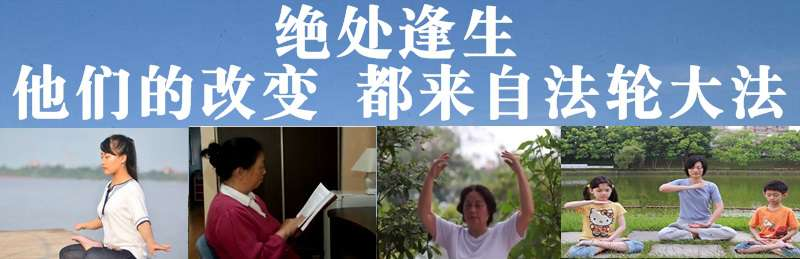</a>

<h3>他们的改变来自法轮大法  https://git.io/dadakk </h3>

<a href=#list><h4 align="right">回目錄</h4></a>
<a name=a1><h3 align="center"><b>黑窝里的明白人（1）</b></h3>

【明慧网二零一九年九月六日】江泽民勾结中共发动的对法轮大法的疯狂迫害，完全是建立在谎言基础上的，然而谎言无论被编造的怎样精致，对还有善念的世人，包括中共监狱、劳教所、看守所等邪恶黑窝里的那些在职和在押人员，他们通过接触遵循“真、善、忍”修心向善的大法弟子，终于被大法的美好和大法弟子的善良所感召，使中共炮制灌输给世人的洗脑谎言，在事实面前，就象残存的冬雪在春天的暖阳中渐渐消融，直至化为乌有。

<b>（一）看守所“C老狠”说：法轮功（学员）都是我的朋友</b>

一九九九年九月的一个晚上，我第二次被绑架到看守所。被称为“C所长”的包号警察次日上班时，听说一位处级干部被分到了他包管的监号，就迫不及待的把我提出去“谈话”：“听说你是处级干部？放着好日子不过，你怎么也‘整’这个，你是不是吃饱了撑的？……在我的号里必须服从管理，不能炼功，不准……你没来之前，已经有几个（法轮功学员）被我给‘收拾’的不敢炼了，你就老老实实的，别给我找麻烦。”

他的这番话，让我联想起刚来时一位同修告诉我的：一位同修被他打的臀部呈黑色，而且肿的很高；一个刑事犯罪嫌疑人被他吊在窗户铁栅栏上铐了整整一天，放下来后，胳膊和手几个月不能动。看来他就是那个被叫做“C老狠”的警察了。

仔细看着他，感觉他的面相不是很恶，我问他：“你了解法轮功吗？”他说：“这两个月电视上天天放，这些天总在传达上级文件，谁不知道啊？我就不理解，你怎么能相信这些迷信的东西？”

看来他是被中共谎言给毒害了，我就开始给他讲为啥要修炼法轮功：我出生在农村，父母是地地道道的农民，我上学时，家里人口多，家境艰难，只有父亲一人在生产队劳动，欠下三角债一千多元，那时一个农民干一天只能挣一两角钱，一千多元的债务，对我们一家而言简直是个天文数字。生产队年终不能分红，就连提供的口粮都吃不饱，一家人生活就靠父亲种自家开荒的自留地和母亲养猪维持生活。一天深夜，父亲去生产大队开会一直没回来，母亲的针线活也做不下去了，急得团团转，弟妹还都小，他们都早已入睡了，身为长子的我虽然躺在被窝里，但被母亲的焦虑不安牵动的也为还没回家的父亲担心起来。终于听到开门声了，我的心就象一块悬着的石头落了地。只听母亲问父亲：你咋才回来呀？！父亲呜咽着说：唉！我们今后的日子更难过了，大队里传达文件，说“小开荒是口粮，老母猪是银行”，要割资本主义的尾巴。在批斗会上，我被当作典型，还逼我承认走了资本主义道路了。可是，没有开荒、不养猪，这日子怎么过呀？再说养猪开荒的不只咱们一家，这是明着欺负人啊……听母亲一边劝着父亲，一边哭泣着。那一夜之间我仿佛成熟了许多。

这件事给我打下了深深的烙印，父母养活我们一家人太不容易了，我暗下决心，不能辜负父母的期望，我一定要出人头地，我就发奋读书，终于上了学，跳出了农家院，毕业后经过努力，从企业团委书记直接被选为党委副书记，又成为实权在握的中层领导，当熬到副处职时，还不到四十岁，成为被同行羡慕的佼佼者，也是被上级列为年轻有为、最有发展前途的后备干部。可谁能知道对一个没有权势背景和钱财的农村孩子而言，这些荣耀的背后，得需要付出多大的代价呀。为了给家里尽量多攒些钱，我节衣缩食，加之常年在官场上争争斗斗，我的身体每况愈下，患上被全国各大医院确诊为几近绝症的血液病。

父亲得知消息后，進城来看我时，在众人面前嚎啕大哭；母亲甚至为此将自己的后事都安排好了，还告诉我的几个弟弟妹妹：你哥哥要是好不了，你们谁也别想留住我，我就和他去了……在我病情最严重时，几天就得输一次血，那时看到别人的嘴唇是红的，我都羡慕不已。后来通过练气功、吃中药等，病情才稍有缓解，但各项指标都不稳定，等我当上副处职干部时，由血液病诱发的各种疾病都不期而至，在别人都羡慕我要继续提升为副局职时，我却在病痛中煎熬着，每天靠药物维持生命，不知哪天就将走到生命的尽头。

一九九四年九月，有同事向我介绍了法轮功，万万没想到，一个曾经五次被送到邪党党校進行所谓的培训、被灌输的满脑子都是无神论变异思想的我，却被法轮大法祛病健身的神奇功效和“真、善、忍”的法理所折服。炼功仅短短十几天，所有疾病都不翼而飞，那种无病一身轻、重获新生的喜悦，和按真、善、忍做好人，升华境界的感悟，只有亲身修炼大法的人才会懂得大法的神奇与珍贵。那时我常常为自己得法太晚而懊悔，可怜自己被中共无神论欺骗了这么多年。我常常下决心，将来无论遇到什么艰难险阻，我都要坚修大法到底。

接着，我首先将大法洪扬给我积劳成疾的妈妈，妈妈炼功后，风湿病，肺心病、顽固的头疼病等多种疾病都不翼而飞了；接着妹妹也得法了，肝硬化好了；父亲也修炼了，他动脉硬化也好了。很多亲朋好友看到我们全家人在大法中受益了，都相继走入大法修炼中来了。他们也都是无病一身轻，成为大法中的受益者。如果不修炼大法，我可能早都不在人世了。C所长，你说我修炼大法，是象被中共宣传的那样，是那种不理智的人吗？当我擦去眼角的泪花看他时，他刚才的愤怒表情消失了，眼里似乎也闪烁着泪花。

他沉思了一会看看窗外，回头说：“那本书（《转法轮》）我也看过，我觉的不可能是他（李洪志师父）写的吧，他也没上过大学，怎么天文、地理的什么都知道呢？”我解释道：C所长，你的想法我能理解，可是我曾亲自参加过李洪志师父在大连举办的一次报告会，亲历师父当场讲法三个多小时，却没有任何文稿。作为一名在首都北京闻名遐迩的气功大师，这可不是谁想当就能被认可的；在两次健康博览会上为众多患者治病，无论什么病可以说是手到病除，有的病人是抬着進来的，被大法师父当场就给治好了，可以自己走着回家了。中科院高能物理研究所曾对大法师父的功力進行过现场测试，我家现在还有相关测定的完整资料呢。再说，如果这本书真是别人写的，那就更不应该说大法师父如何如何了，怎么不把写书的人公示于众呢？他听了很吃惊，笑着说：还得是处级干部啊，你说的真有道理。我说：并不是我会说啊，道理就在这摆着呢。

自那儿以后，只要是他当班，或找我去办公室，或就在监舍的窗外找我交流。随着对真相了解的深入，他对大法的心态越来越正。当他听说我一连几天腹泻，他就把暖瓶拿到监号，叮嘱牢头：“看管好暖瓶啊，只能给老M（指我）一个人用。”他还每天给我送来几枚煮熟的鸡蛋和一罐大米粥。牢头羡慕的对我说：你们俩啥关系啊，老C可不象别人，他最讲原则了，按理说，这暖瓶是不准留在监号里的，因为怕犯人想不开，可能打碎后用作自杀的工具，我在这个号里都待好几个月了，他这样对待在押的人，你还是第一个。

回家后，我曾邀请单位领导作陪，请C所长吃了顿饭。当听到我和单位领导非常感谢他对我的关照时，他赶紧说：“不用感谢我，我还得感谢你，是你让我明白了那么多（真相）。人这一生就象在下棋，遇到关键的几步，棋错一招乱全盘，一旦走错了路，一生都无法再挽回。要不是你和我讲（真相），我就相信电视说的了，谁能想到国家（中共）还能撒谎啊？！”当时我单位领导虽然很了解我和法轮功，但迫于压力，原本还想说几句“党话”，可听他这么一说，也随之归正了。

C所长对法轮功的态度完全变了，他因此得了福报，原来他血压高，还曾患一种病，从此好起来了，至今身体都很健康。后来，他不再管理监号了，被安排到一个令人羡慕的岗位。据说，他这个新岗位得是所长最信任的人才能用。

每当他听说有法轮功学员被绑架到看守所，他就象关心他的好朋友一样告诉牢头：“给我照顾好他（她），这是我的朋友。”他还自己出钱，给黑窝里的同修订购生活用品和咸菜食品等。有位同修从看守所回家后，特意来告诉我，说受C所长之托要给我带好儿。同修说：“在我被绑架到看守所的第二天，C所长就進到号廊里对着窗口喊：昨晚進来的法轮（功学员）在这儿吗？因为我不认识他，还以为他是要来非法提我出去提审我呢。听到牢头的回应后，他就叮嘱牢头：‘你给我照顾好他啊，这是我的朋友。’牢头笑着说：‘C所长，你的朋友真是不少啊！’他说：‘对，凡是法轮（功学员），都是我的朋友。’”

每次找他想了解在看守所被非法关押同修的情况时，他从不回避，还主动帮助打听。

有一次，一位从看守所回来的同修和我说，咱们被非法关押在里面的同修经常找C所长帮忙，很多人都知道C所长关心法轮功学员。

有一次牢头就问我，C所长是不是也炼法轮功啊？我说，“他不炼，但是他就象你一样，知道我们都是好人。”我担心这样下去可能会给他带来麻烦。为此在一次和C所长见面时我说，我们修炼人应该为他人着想，这几年老找你为我们做这做那的，里面的同修也和你不见外了，有事就找你，时间长了能不能给你带来不好的影响？他说：这个我考虑过，我觉的你们与那些在押的犯罪嫌疑人不同，你们都是好人，没有伤害第三者，也不涉及串供的问题。而那些犯人嫌疑人不行，我帮他们就等于帮他们继续伤害别人。我在看守所是老人儿了，我们领导都了解我。其实，这么多年了，他们也都对法轮功有所了解了，就是一场运动，说不定国家一换领导了，运动也就结束了。我就是愿意和你们在一起，一见到你们就高兴，和你们在一起我就特别舒服。

C所长还特别关心法轮功学员的安全，几乎每次和他见面都说：可得和大家说呀，一定要保护好自己呀，一被他们弄那里（看守所）去，那些没有人性的东西，他才不管你是不是好人，一律往死祸祸你。我能帮的也是有期限的，一被走程序我就啥忙也帮不上了。

他还曾想方设法的帮同修往里面送物品（包括师父经文）。为了表达对他的感谢，同修想请他去饭店，可等吃完饭同修去付费时，才得知他已提前把钱压在服务台那了，还和服务小姐交代，必须由他买单。看到同修为此很是过意不去时，他却说：“我理解你们的心情，但是，你们现在还被（中共）打压（迫害）中，很多人都已失去了正当收入，等法轮功平反时，你们再来请我吧。”他对大法的正信，对魔难中同修的理解，真是令人感佩。

因为同修在看守所能看到大法经书，正念和救人的心越来越强，看守所的环境也越来越宽松，同修很少被强制参加奴工劳动。平时除了坚持学法、炼功、发正念外，同修大都会主动给犯罪嫌疑人和狱警讲真相。曾有被非法关押同修在请律师时，因没有直系亲属签授权委托协议，只好由同修以亲友身份来代签，看守所也没因此给律师会见同修设阻。

（待续）

<a href=#list><h4 align="right">回目錄</h4></a>
<a name=a2><h3 align="center"><b>黑窝里的明白人（2）</b></h3>

 【明慧网二零一九年九月七日】（接上文）

<b>（二）劳教所L队长说：“法轮功平反是早晚的事”</b>

二零零零年我進京证实法，被绑架回当地，后被非法劳教三年。

开始时，我被非法关押在集训队，又被单独关押在三大队。由L队长做所谓的帮教。为开创修炼环境，我每天坚持学法、炼功，L队长和W教导员当班时，我依然如故。他们就分头找我谈话，希望我不要炼功，最起码不能在他们俩当班时炼功，算是给他们所谓的“面子”。我就借此告诉他们，因患不治之症我才修炼了法轮功，终于能活到今天，如果不让炼功，等于逼我去死一样。我还把我见证到的法轮大法的超常神迹也一一讲给他们，向他们揭露江泽民为迫害法轮功编造的种种谎言等，告诉他们，我最初在当地给单位领导和公安局领导讲真相时，他们说，“我们也了解法轮功，但是我们决定不了这件事，我们得听中央的，如果中央让你们随便炼了，我们就不再管了。”就是在这种情况下，我才去北京上访，也是无奈之举。这次被非法劳教，就因为去行使了公民被赋予的拥有信仰、信访自由的权利。既然我能到天安门广场上打条幅，就是想告诉中央和国家领导人，我们就是要做好人，坚持修炼到底。劳教所还有比他们更大的官吗？我真的不明白你们为什么这么怕我炼功，我们炼几个缓、慢、圆的动作，就能把共产党给炼垮台了吗？一个强大的政党怎么还害怕好人多呢？我炼功真能把劳教所房子给炼塌了吗？而且那些劳教人员要因此而真能了解到法轮功真相，都相信法轮功，不用你们“改造”，他们会从本质上改邪归正的。当然我也理解你们的难处，并不想让你们为难，你们可以如实的将我说的这些情况和我的表现反映给你们的上级领导。

一天深夜，看我刚一炼功，两个“包夹”就上前按着我，央求道：求求你别再炼了，不然我们都会被加期的，就回不了家了。我说：好好，我今天就不炼了，但是明天请你们告诉布置此任务的那些人，劳教所的饭我就吃到今天为止了。那一刻，心里有种超越生死的释然。

第二天，我一直躺在床上。中午时分，教导员進前俯身在我耳边说：对不起，M大哥，我代表L队长来向你赔礼道歉，大家都说不应该这样对待你，自你分到我们队后，大家都挺尊重你的，通过你的教化，劳教学员闹事的都少了。这是一场误会，希望你能理解L队长，他也有很大的压力。最后大家都同意，今后你愿意咋炼就咋炼。他接着又说：今天队长特意吩咐食堂给你做的菜，烙的饼，你就给我们个“面子”吧。教导员称我为大哥，这还是第一次。此后，我利用劳教所要求写所谓的周纪实之际，每周写一篇真相送给他们，有一天牢头（称坐班的）告诉我，你写的周记实，队长看的可认真了，还夸你说，你看这老M不但字写的好，这道理说的也清楚，这法轮功里真有人才啊！我还是每天坚持炼功，那时我所在的三队还没有监控器，值班警察一看我要炼功，就主动把监控窗口的布帘给拉上。“包夹”告诉我：“这就是暗示你，我们（指狱警）没看见，你随便炼吧。”

一次，L队长找我，说他目前很为难，因为全劳教所都没人敢再炼功了，只有我一个人还在坚持炼，他的压力很大。看他想用人情来说服我。我向内找时，发觉是因为自己对他也有情了，他才以动情的话来动摇我。我告诉他：我很感谢你一直在支持我炼功，你知道我是好人，此时能为好人提供方便，你也是好人，将来一定会得福报的。此后我仍然是坚持每天炼功，他也没再来阻止我。

后来，因为劳教所一大队两个劳教人员在出外工时逃脱，就把一大队和三大队合并了，我与被非法关押在原一大队的三位同修相会在一起。L队长又找我谈话说：把几个法轮功学员和你放到一起，你帮我带好他们，但你不能带着他们老炼功。你一个人坚持炼功，我的压力就够大了。我说：我们修炼是修自己，炼与不炼都是每个人自己的事。不过，他们和我一样，都是好人，也都是因为坚持不放弃修炼才被非法劳教的，你最好还是和我一样来对待他们吧。不然，你让我炼不让他们炼也不是那么回事。

当晚半夜，我依旧按时炼第五套功法，三位同修一看，也起来和我一同打坐。值班犯人一看制止不了，马上报告给值班狱警，值班警察过来看看说：先别管了，明天再说。但此后一直没人来阻止我们炼功。

尽管当时劳教所对法轮功学员的整体迫害还很严重，但我们几位同修的这个小环境还是日渐趋于好转。原来洗澡时用冷水，后来就让劳教所食堂给我们烧热水洗澡。每当L队长带劳教犯人出外工回来，就给我们带回在外面买的饺子、包子、烧鸡或香肠等食品来改善伙食。那时劳教所有规定，对法轮功学员除了集训队，都是单独封闭关押，可我们四位同修却吃住都在一个监号。

一次管理科科长值班突然来查岗，看我们四位同修在一起吃饭呢，咆哮道：“这是怎么管理的？法轮功（学员）怎么聚会了，还在一起吃上饭？！”还扬言要去找L队长、W教导员“算账”。当时我很担心L队长会有麻烦，就和管理科科长说，你不要找这个那个的，你就对我来吧。他一看我没被吓唬住，就灰溜溜的走了。晚上，W教导员当班，过来跟我说：没事儿的，你不用担心，L队长的业绩在所里是被公认的，大所长很器重L队长。

一天，牢头告诉我：L队长表扬你们了。L队长说：你看李洪志（先生）能教导出像老M他们这样的大法弟子，法轮功平反是早晚的事。

教导员一天在点名时说：L队长有交代，和法轮功学员在一起的劳教学员，不是负责看管法轮功（学员）的，是负责照顾法轮功（学员）的。警察室的暖瓶里如果只有一杯水，警察可以不喝，也要给法轮功（学员）喝。

回到监号，一个牢头感慨道：看来在劳教所的法轮功（学员）是大爷了，看来我也该炼法轮功了。L队长还将队里出板报的事交给我办，说是我字写的好。对此我欣然接受，每一期板报中只要涉及布控迫害或诋毁法轮功的内容，我都将其删掉。神奇的是，没人为此提出过异议。

在被非法劳教一年半后，我闯出了劳教所。听说劳教所其它各队后来接连出事（恶报），唯有三大队一直很平稳，相信这是L队长的善行积下的福报。

（待续）
 

<a href=#list><h4 align="right">回目錄</h4></a>
<a name=a3><h3 align="center"><b>黑窝里的明白人（3）</b></h3>
 
 
 【明慧网二零一九年九月八日】（接上文）
 

<b> （三）牢头B说：法轮功（学员）都是我的同修</b> 
 

二零零二年，在我流离失所期间再次被绑架到看守所。曾三次绝食抵制迫害，都因基点不对而没能坚持到最后。第四次绝食，起因是对我的非法判决下来后，所长下令：凡是已被判刑的人，在没被送到监狱之前，都要穿上犯人的囚服。我当然不配合，那天副所长直接進号，跳到铺板上说：你怎么不穿囚服？我说：囚服是给犯人穿的，我没有犯罪，我当然不穿。他说：以前没下判决你说你没犯罪，不穿马甲，可以理解，现在判刑下来了，你就是犯人了，就得服从管理。接着他就一声比一声高的连续问了我三次：“你穿不穿？”我在没有修去的争斗心促使下，也一声比一声高的连续回答他三次：“不穿！”他当时气得脸都变形了。立即吩咐将我呈“大”字形铐在了铺板上。于是，我开始绝食反迫害。
 

第五天，警察、狱医领着犯护来强行给我灌食，因我不配合，他们就按住我用开口器已将我的嘴开到极限，他们还在继续开，当时就把我的两颗门牙给别掉了，灌完食后，鲜血不断从口中流出。我拿着被他们别掉的牙齿正告警察和狱医：你们这是在犯罪，我会一直保留这些受害证据的。第二天，他们看我还坚持绝食，就把我转到另一监号，告诉这个监号的人，把犯罪嫌疑人穿的马甲强行给我披上，知道我不会配合，就让四个犯罪嫌疑人强按着我。还对几个犯罪嫌疑人说，如果看到马甲不在他身上就收拾你们。

就这样犯人按了我一个多小时后，监号的门打开了，就听進来的人问怎么回事，按着我的人说：“某某所长安排進来一个法轮功（学员），他不穿马甲，所长让按着他。”他一个箭步跳上铺板，两拳就把在前边按着我的两个人给打倒了，那两个吓得赶紧躲一边去了。他说：“听谁的？你们不知道吗，法轮功（学员）都是我的同修！在这个号里，是我说了算。你们敢这样对待我的同修？！”接着，他蹲下身来握着我的手，问我怎么回事？我头也不抬没理他，心想：这都是看守所安排好的戏在给我表演，我不会上当的。可我一抬头看见的是一张熟悉的面孔，一位面容清秀的青年男子，他的眼里居然闪着泪光。他说：“听说给我的号转来一个人，我没想到是你呀！你一定吃了很多苦吧？”我问他：“你认识我吗？”他说：“你怎么忘了？过年时，我去给你送过师父的新经文，你还向我竖起大拇指，说我功德无量。”我一下想起来了：“哦，原来是你呀。”他接着说：“我在这里已经接触过好几位同修了，他们给我讲过很多真相，我虽然现在还没修炼，但将来我一定会修炼法轮功的。”

他说：“M哥，我不象你，我不是个好人，干了很多坏事，造下很多业力，也弄了很多钱，在公安局、看守所，我的朋友很多，这次倒楣，正赶上打黑，又和一个大案牵连上了，不然我不会進来的。你来了就好了，又有同修陪我了，别看我是犯人，可在这个监号我说了算，要说我给所长干掉，那是有点吹牛，说要给其他狱警换个地方，我还是能做到的。你来我这监号，你就放心吧，这个马甲你不能穿，监规你也不用背，因为你不是犯人，有那精力还得背经文呢。你要想绝食，你就继续，能出去更好。你要是想吃啥，我这都有，没有的可以去买，吃饭我吃啥你就和我吃一样的。原来在我号里待过几位同修，我也都是这样对待他们的。”

后来我又继续绝食了一天，就停止了绝食。

B几乎天天可以出监舍，有机会时，他就帮我们同修传经文。当清查监号时，他就帮我把经文收集在一起，存放到包号所长那里，等搜查监号结束，就又将经文帮我拿回来。

这个监号是看守所的所谓“文明监号”，可以看电视。每当号里有人判决下来，或有人要被送到监狱去了，大家的心情都很沉重时，他就宣布：“今天不看电视了，让M大哥给我们讲法轮功的故事。”我就抓紧时机给他们讲真相，也很愿意和他们互动。每次讲真相的效果都很好。

一次，因经济案入狱的W犯人二审判决下来了，被维持原判十五年，他心里很不平衡，据他讲，其中本来有领导的因素，最后罪责却都推给了他。想到家有年轻的妻子、不满十岁的孩子和上了年纪的父母，他的心情特别不好。当晚B牢头说：“W兄弟心情不好，今晚不看电视了，让法轮功M大哥讲法轮功（的修炼故事）。”于是，我结合其他同修和自身修炼的经历，给他们讲了业力轮报的关系，还讲了释迦牟尼宁愿舍弃王位也要進深山老林去修炼和密勒日巴的修炼故事。听我讲完，B牢头说道：“过去的历史，我们可能没看到。现今你看人家M大哥，这可是真的，因为坚持做好人就被判刑十多年，还那么乐观，我们毕竟干了那么多坏事，有罪业也得偿还啊。咱们都学法轮功，把监狱当作寺院，还是好事了。”那天，大家都很高兴，大多表示要学法轮功，到监狱去修炼。

一次，两个犯人因分吃东西闹起矛盾。B牢头将他们一顿暴打，那天B象疯了一样失控，劝他也不听。可打完人他又后悔了，问我：“M大哥同修，我叫你同修，是我真想修炼。可这个‘忍’太难做到了，就我这个×样的，能修炼吗？”我告诉他：大法无所不能，你目前的状态，因为你只是有个要修炼的愿望，但你不学法，就没有法的力量约束自己，如果你天天学法，就不是这样了。当晚，他又宣布不看电视了。B牢头提出话题，让我给大家讲讲：“为啥我和号里的人都没有矛盾？”我给他们讲了自己修炼“忍”的几个小故事。因为当过党官，共产党的斗争哲学没少学，我的争斗心很强，修“忍”真是下了一番功夫。人生在世，都有各自的观念、喜好、脾气、秉性和特性。明知不可能都符合自己的心愿，但又都有想维护自己利益的私心，这就导致不能忍让。我没修炼时，争斗甚至是我的一种乐趣，因为我能言善辩，多是得理不让人，无理也辩三分，所以伤害了很多人。修炼大法后，大法要求遇事要为别人着想，好事让给别人。吃喝尚且是小事，住房可是件大事，但我都可以让给别人。谁遇到我这样的人，他能不感谢我，还能和我有矛盾吗？在看守所这样的环境里，大家都觉的很苦，东西又贵，更能看出每个人的境界，我并非想夸自己做的如何好，只是举例说明：过中秋节时，C所长给我订了一顿百元餐（一百元）：一条大鲤鱼。看大家都很苦，我一口没吃，都分给了大家；一次，C所长给我买了十五个鸭蛋，我分给每人一个，是B牢头不让大家要，都给我送回来了（B出去后，我又给了大家），修炼大法后，人的世界观都转变了，心不是自私的，能设身处地去为别人着想，什么事只要别人高兴，就是我的快乐。我总怕自己做不好伤害到别人，而别人对我不好时，又是我找到不足提高的机会，所以自然就没矛盾了。大法师父告诉我们：“我们说在矛盾面前，退一步海阔天空，保证是另一种景象。”[1]按照大法做就会这样，假如张老三对我有想法了，我不怨他，还会找自己哪做的不对，是不是我哪里做的不好伤害他了，过后照样对他好，张老三就会成为我的朋友；李老四的行为我看不惯，我也会找自己，是不是我的观念问题，而不去伤害他，就是真的看到他哪里有不足，我也是本着对他好的心态，善意的告诉他，那李老四也会成为我的朋友，就这样我的心胸就会越来越宽广，于是我的朋友就会遍天下。如果反之，我就会成为万人烦……听过我这番话，我看到他们的眼神中升起了对法轮大法的敬意。B牢头说：这个大家都看到了，来这个号好几位大法弟子了，从来没因为什么事和别人干仗，人家修大法的和我们这些社会渣滓就是不一样。

那年七月的一天，我被劫持到某监狱，因为不让我炼功，我就开始绝食反迫害。绝食到第三天时，通知要给我体检，以我被查出肝病（其实啥病都没有）为由，要将我退回看守所。后来得知监狱是因为我不配合所谓的狱警，而坚决不想接收我。就这样，我又回到看守所，回到了原来那个监号。

B牢头和我说：你这种情况，就应该给保外就医了，但他们不会轻易放你回家的。除非你绝食，或有病看你不行了，才会给你办保外。我一听，感觉是师父在借此点悟我，于是我就找看守所领导要求放我回家。他们都说可以向有关部门反映情况。但多天过去之后，不但没有回应，就是每天例行公事参加“例检”的所长和大夫都在回避我，我就告诉他们，再不给说法我开始绝食抗议了。奇怪的是，没人在意我的话。于是我就真开始绝食了。每天B牢头都向参加例检的人反映我没吃饭，但谁也不在意。

一天B牢头从外面回来，闷闷不乐。晚上他凑到我跟前说：你的情况我和包号Z所长说了，让Z在所长例会上反映你的情况，今天Z和我说，他真的在会上说了，可大所长当时就说：“他的情况我们都知道，以后就不要再提他了。因为省里有几个象他这样的法轮功学员，给办了保外，出国后还召开记者招待会（揭露迫害真相），给国家造成很坏的影响。所以特别是他这样的，刑期长，影响大，要是送不進监狱去，就得死在这里了。”我告诉B牢头：他们说了不算。他追问我谁能说了算？我说：咱们师父说了算。他说：“好，师父说了算。”

一天，B牢头说：要是把你的身板给我，我早就出去了；可一看你的眼睛，溜光锃亮的特别有神，一看就是一点病没有。以后他们再来检查，你不要睁开眼睛，也不要说话了。我们替你说。

一天，看守所一副所长、狱医等几人来监号给我做体检，说要给我灌食。B牢头赶紧说：他都这样了，一会明白一会儿糊涂的还能灌食吗？这太危险了！H医生让犯护拿来冲好的奶粉，让一勺勺给我灌，当灌到第三、四勺时，我一张口，全都吐出去了。H医生说：你看他这不是明明白白的往出吐吗？B牢头说：不可能，这是说明他已经不能進食了，要是我这么长时间不進食，别说这几勺，你那一杯我都能给喝進去，也吐不出来呀？这几个人一听，互相对视一下，就都走了。

随后看守所开始给我打针，我知道我没有病，给我打的什么东西也没用，等扎完针后他们一出去，我就将针头给拔下来了。一瓶子药水一会都放到水瓶子里了，B牢头说：“我能理解你的想法，我也知道看守所不是好心要给你治病，打的什么东西也不知道。但是你不要这样做，这要是被狱警发现后，可能会把你铐到铺板上的。”他让小W（每天侍候他的一个犯人）帮我处理。就这样，每天扎完针等他们一走，让所有药物都按点滴的速度放入厕所。B牢头对号里的犯人下令说：“你们都知道M哥是好人，我们都想帮他早点出去，这个打针的事谁也不能说出去，你们知道我有关系，谁XX的一旦给说出去，我花钱也要把他弄死。”

点滴的药量从一瓶、两瓶，直至追加到三瓶，可每次大夫来给我检查完身体都是直摇头。B牢头还问医生：“你们怎么不给用点好药啊？我看越打针越严重了。”后来看守所害怕承担责任，所有干部都开始值班，每天晚上都要来问几遍我的情况，B牢头就教给犯人怎么应对。

一天，号门打开了，来了一个干部模样的人问：哪个人是姓M的法轮功？B牢头指着我说：这就是。来的人说：把他扶起来我看看。B牢头说：谁敢动他呀，一动就没气了。来人又说：那把他的被子掀开，我看看。犯人W顺手就把我盖的被子给掀开了，这个人一看，“哎呦”一声就跑了出去。B牢头贴在我耳边说：M哥，看来你快要自由了，他们都害怕了。

放我回家的那天，B牢头握着我的手说：“M哥同修，你终于自由了！别忘了我啊！等我回家时，一定找你修炼法轮功，你一定好好教我啊！”我睁开眼睛看着他，点了点头。此刻，我看到泛起的泪水又在他的眼眶里打着转。

B牢头也因为善待大法和大法弟子而得了福报。当时全国开展打黑，他被认定是黑社会头目，当地某公安头目为他的所谓保护伞，是准备拿他做典型重判的。然而当B牢头得知被判刑十三年时，把他都乐坏了。再后来，听说他在监狱被减刑数年，早早出狱了。

而和他同样背景、也是被认定是黑社会的头目的牢头C，就是那次B给我送经文的那个号的牢头，我刚被绑架進去时就在C牢头那个号，那时他已经下了一审的判决，被判无期徒刑。而且正在上诉中。我给他讲真相时，他不听，有一次我给号里的其他人讲真相，他不但不听，还威胁我说，你不要老和别人宣传法轮功，否则我就对你不客气，你要不是C所长的照（朋友），我早就收拾你了。没过了多久的一天，C牢头被包号的所长叫出去了，等他被送回来时就被砸上死刑犯的手铐和脚镣子了。

原来是他二审上诉时被省里一位领导知道了，下令由无期改判死刑了。听到他一次次的念叨“我不上诉就好了”，我心里真的也很难过，我知道是我没做好，没有让他明白真相，他是因为阻止我救人而遭恶报了。
 

<b> 后记</b> 
 

时光飞逝，仿佛只是转瞬之间，竟已经过去了十六、七年。由于一直处于被中共监控的状态，我与外界联系不很方便。常常会想起这些黑窝中的明白人，特别是L队长和B牢头，牵挂着他们后来是否又明白了更多真相，不知是否都已退出中共邪党及附属组织，B牢头曾经发愿，要在他出狱回家后，来找我一起修炼法轮大法，我一直期待着，缘归圣果。
 

如果大法弟子的心念和愿望可以不受制于这一时空所限，记录下这段历史，珍惜法中圣缘，也可了结与他们同是为法而来的那份心愿吧。我坚信他们在那种邪恶疯狂的年代，能发出善念，一定会有一个美好的未来。
 

注：
 
[1] 李洪志师父著作：《转法轮》
 
 
 

